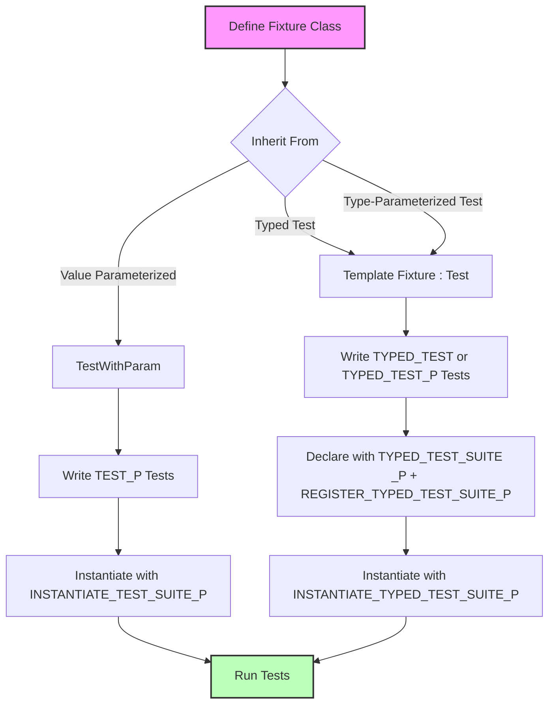

# Value- and Type-Parameterized Testing Patterns

Unlock advanced test coverage by running the same test logic over multiple data values and type variations. This guide demonstrates how to write value- and type-parameterized tests in GoogleTest, illustrating core macros, common use cases, and best practices to harness their full potential.

---

## 1. Introduction to Parameterized Testing

GoogleTest offers powerful abstractions to run the same test logic repeatedly with different parameters or types, reducing code duplication and enhancing coverage:

- **Value-Parameterized Tests:** Run tests multiple times with different input values.
- **Typed Tests:** Run the same set of tests over a fixed list of types.
- **Type-Parameterized Tests:** Define tests abstractly by type, then instantiate with different type lists later.

This page focuses on these patterns, guiding you from basic usage through complex scenarios.

---

## 2. Value-Parameterized Tests

### 2.1 Overview
Value-parameterized tests enable you to validate your code against varied input data sets without duplicating test code. They are particularly useful when behavior depends on diverse input values, such as options, configurations, or different small datasets.

### 2.2 Workflow

1. **Define a Test Fixture**
   - Create a fixture class inheriting from `::testing::TestWithParam<T>`, where `T` is the parameter type (any copyable type).

2. **Write Parameterized Tests**
   - Use the `TEST_P` macro, referencing the fixture, where inside the test you can access the current parameter with `GetParam()`.

3. **Instantiate the Test Suite**
   - Use `INSTANTIATE_TEST_SUITE_P` with a unique instantiation name, the test suite class name, and a parameter generator for the parameter values.
   - Available parameter generators include `Values()`, `ValuesIn()`, `Range()`, `Bool()`, `Combine()`, and `ConvertGenerator()` for more complex needs.

### 2.3 Example
```cpp
// Step 1: Define fixture
class FooTest : public ::testing::TestWithParam<const char*> {
  // Optional: shared resource setup
};

// Step 2: Define tests
TEST_P(FooTest, DoesBlah) {
  EXPECT_TRUE(foo.Blah(GetParam()));
}

TEST_P(FooTest, HasBlahBlah) {
  // Additional tests
}

// Step 3: Instantiate with parameters
INSTANTIATE_TEST_SUITE_P(InstantiationName,
                         FooTest,
                         ::testing::Values("meeny", "miny", "moe"));
```

### 2.4 Parameter Generators

| Generator        | Description                                                         |
|------------------|---------------------------------------------------------------------|
| `Range(begin, end, [step])` | Generates a sequence `{begin, begin+step, ...}` excluding `end`.       |
| `Values(v1, v2, ..., vN)`   | Yields specifically listed values.                                |
| `ValuesIn(container)`       | Uses elements from an STL container, C-array, or iterator range. |
| `Bool()`                   | Generates `{false, true}`.                                        |
| `Combine(g1, g2, ..., gN)` | Cartesian product of parameter sets yielding tuples of parameters.|
| `ConvertGenerator<T>(gen)` | Cast or convert generated parameter types.                        |

### 2.5 Customizing Test Names

You can define the last argument of `INSTANTIATE_TEST_SUITE_P` as a functor or lambda receiving `TestParamInfo<T>` to generate custom, unique test name suffixes. This is useful for complex types or better readability.

```cpp
INSTANTIATE_TEST_SUITE_P(
    MyGroup, FooTest, ::testing::Values(1, 2, 3),
    [](const testing::TestParamInfo<FooTest::ParamType>& info) {
      return "Value" + std::to_string(info.param);
    });
```

---

## 3. Typed Tests

### 3.1 Overview
Typed tests allow you to reuse a suite of tests over a fixed set of types. This is ideal when you want the same tests run on different containers, numeric types, or user-defined types.

### 3.2 Workflow

1. **Define a Fixture Class Template**
   - Create a template fixture class inheriting from `::testing::Test`.

2. **Assign a List of Types**
   - Use `TYPED_TEST_SUITE` macro to associate your fixture with a type list using `::testing::Types<T1, T2, ...>`.

3. **Write Typed Tests**
   - Use `TYPED_TEST` macro, referencing `TypeParam` inside the test to access the current type.

### 3.3 Example
```cpp
// 1. Define fixture template
template <typename T>
class FooTest : public ::testing::Test {
 public:
  T value_ = T();
};

// 2. Associate types
using MyTypes = ::testing::Types<int, double, std::string>;
TYPED_TEST_SUITE(FooTest, MyTypes);

// 3. Write tests
TYPED_TEST(FooTest, CanDefaultConstruct) {
  TypeParam val = this->value_;
  // Test something with val
  EXPECT_TRUE(true);
}
```

### 3.4 Custom Type Names
You can optionally provide a type name generator class with a static template `GetName(int)` method to customize the test suite name suffix for each type.

---

## 4. Type-Parameterized Tests

### 4.1 Overview
Type-parameterized tests differ from typed tests by allowing you to define abstract test patterns for a fixture template without specifying the type list upfront. You instantiate the tests later with particular type lists, enabling modularity and separate compilation.

### 4.2 Workflow

1. **Define a Test Fixture Template**
   - Like typed tests, define the fixture templated on type `T`.

2. **Declare Type-Parameterized Test Suite**
   - Use `TYPED_TEST_SUITE_P` macro for the fixture template to declare a type-parameterized test suite.

3. **Define Tests With `TYPED_TEST_P`**
   - Write your tests, referring to `TypeParam` for the parameter type.

4. **Register Tests**
   - Register all test names using `REGISTER_TYPED_TEST_SUITE_P`.

5. **Instantiate With Types**
   - Instantiate the suite with `INSTANTIATE_TYPED_TEST_SUITE_P`, supplying the fixture, type list, and optional name generator.

### 4.3 Example
```cpp
// 1. Define fixture template
template <typename T>
class FooTest : public ::testing::Test {
};

// 2. Declare type-parameterized suite
TYPED_TEST_SUITE_P(FooTest);

// 3. Define tests
TYPED_TEST_P(FooTest, DoesBlah) {
  TypeParam val{};
  EXPECT_TRUE(true);  // Your test here
}

TYPED_TEST_P(FooTest, HasProperty) {
  EXPECT_TRUE(true);  // Your test here
}

// 4. Register tests
REGISTER_TYPED_TEST_SUITE_P(FooTest, DoesBlah, HasProperty);

// 5. Instantiate
using MyTypes = ::testing::Types<int, double>;
INSTANTIATE_TYPED_TEST_SUITE_P(MyInstantiation, FooTest, MyTypes);
```

### 4.4 Use Cases
Type-parameterized tests enable defining interface-conformance tests or general contracts that implementations in different translation units can instantiate multiple times, facilitating reusability across libraries.

---

## 5. Best Practices & Common Pitfalls

- **Unique Instantiation Names:** Always use unique prefixes for `INSTANTIATE_TEST_SUITE_P` and `INSTANTIATE_TYPED_TEST_SUITE_P` to avoid name collisions.
- **Parameter Types:** Use copyable types for parameters. Manage lifetime carefully when using raw pointers.
- **Parameter Name Generators:** Provide custom name generators for string or complex types to ensure test names are readable and unique.
- **Order of Instantiation:** `INSTANTIATE_TEST_SUITE_P` macros must be placed at global or namespace scope, not inside functions.
- **Suppressing Instantiation Warnings:** Use `GTEST_ALLOW_UNINSTANTIATED_PARAMETERIZED_TEST` to suppress warnings if a test suite is defined but intentionally not instantiated yet.
- **Use `ConvertGenerator` for Type Conversions:** When parameters require conversion or construction from generator types, leverage `ConvertGenerator` with a lambda or functor.
- **Avoid Side Effects in Test Parameters:** Parameter generators are evaluated during GoogleTest initialization; avoid side effects or dependencies on program state.

---

## 6. Troubleshooting

- **Tests Not Running:** Verify that you have instantiated value-parameterized or type-parameterized tests; uninstantiated parameterized tests will not run.
- **Duplicate Test Names:** Ensure uniqueness of test instantiations and parameter names.
- **Dangling References:** When using `ConvertGenerator` with lambdas taking non-owning references (e.g., `string_view`), ensure backing objects outlive the test run to avoid dangling pointers.
- **Compilation Errors with Types:** Check that your test fixture parameter types satisfy copyability and constructibility requirements.

---

## 7. Additional Resources

See these related documentation pages for a deeper understanding and complementary features:

- [Value-Parameterized Tests (Advanced Topics)](../advanced.md#value-parameterized-tests)
- [Typed Tests & Type-Parameterized Tests (Advanced Topics)](../advanced.md#typed-tests)
- [INSTANTIATE_TEST_SUITE_P Macro (Testing Reference)](reference/testing.md#INSTANTIATE_TEST_SUITE_P)
- [TYPED_TEST_SUITE and TYPED_TEST Macros (Testing Reference)](reference/testing.md#TYPED_TEST_SUITE)
- [GoogleTest Primer (Getting Started)](primer.md)

---

For complete sample implementations, see the GoogleTest samples:
- [`sample7_unittest.cc`](https://github.com/google/googletest/blob/main/googletest/samples/sample7_unittest.cc) (Value-Parameterized Tests)
- [`sample8_unittest.cc`](https://github.com/google/googletest/blob/main/googletest/samples/sample8_unittest.cc) (Multiple Parameters Combined)
- [`sample6_unittest.cc`](https://github.com/google/googletest/blob/main/googletest/samples/sample6_unittest.cc) (Typed and Type-Parameterized Tests)

---

## 8. Visual Workflow


