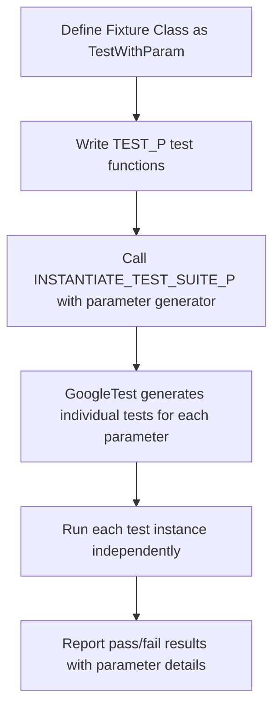
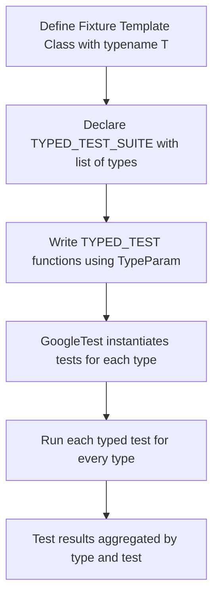

# Parameterized and Typed Tests

## Workflow Overview

### Task Description

This guide helps you write value-parameterized and type-parameterized tests in GoogleTest. It explains how to avoid test duplication and improve test coverage by running the same test logic over different parameters or types, using clear, step-by-step examples.

### Prerequisites

- GoogleTest must be installed and properly configured in your C++ project.
- Basic understanding of GoogleTest macros such as `TEST()`, `TEST_F()`, and working with test fixtures.
- Familiarity with C++ templates and type lists aids comprehension but is not mandatory.

### Expected Outcome

- Ability to define and write value-parameterized tests with multiple input values to cover diverse scenarios.
- Capability to create typed tests to run test suites on different types seamlessly.
- Understanding of type-parameterized tests for defining abstract test patterns instantiated with different type lists.

### Time Estimate

About 20-30 minutes to grasp the core concepts and try out the included examples.

### Difficulty Level

Intermediate, given interaction with templates and test fixtures.

---

## Value-Parameterized Tests

### What Are Value-Parameterized Tests?
Value-parameterized tests allow you to reuse the same test logic across a set of values without duplicating code.

They address scenarios such as:
- Testing code behavior that varies with input values.
- Checking multiple combinations of parameters.
- Testing different implementations or configurations dynamically.

### Key Components

| Component                         | Summary                                                    |
|----------------------------------|------------------------------------------------------------|
| Fixture Class                    | Derives from `testing::TestWithParam<T>`, where `T` is the parameter type. |
| TEST_P Macro                    | Defines each individual parameterized test.                |
| INSTANTIATE_TEST_SUITE_P Macro  | Instantiates the test suite with specific parameter generators. |

### How to Write Value-Parameterized Tests

<Steps>
<Step title="Define a Fixture Class">
Derive your fixture class from `testing::TestWithParam<T>`, where `T` is the parameter type. This can be a basic or complex type, but it must be copyable.

```cpp
class FooTest : public ::testing::TestWithParam<int> {
  // Fixture setup and other members.
};
```
</Step>
<Step title="Write TEST_P Tests">
Use `TEST_P` macro with your fixture to write test logic. Access the parameter using `GetParam()`:

```cpp
TEST_P(FooTest, DoesSomething) {
  int param = GetParam();
  EXPECT_TRUE(DoSomething(param));
}
```
</Step>
<Step title="Instantiate Tests with Parameters">
Use `INSTANTIATE_TEST_SUITE_P` to create instances of your tests with specific parameters.

```cpp
INSTANTIATE_TEST_SUITE_P(Examples, FooTest, testing::Values(1, 2, 3));
```
All tests in `FooTest` will be run three times with parameters 1, 2, and 3.

Other parameter generators include `Range()`, `ValuesIn()`, `Bool()`, and `Combine()` for Cartesian product of parameters.
</Step>
</Steps>

### Example: Using Value-Parameterized Tests

```cpp
class MathTest : public ::testing::TestWithParam<int> {};

TEST_P(MathTest, IsEven) {
  int n = GetParam();
  EXPECT_EQ(n % 2, 0) << n << " is not even";
}

INSTANTIATE_TEST_SUITE_P(EvenNumbers, MathTest, testing::Values(2, 4, 6, 8));
```
This runs the same test on each even number provided.

### Parameter Generators Summary

| Generator       | Description                               | Usage Example                                         |
|-----------------|-------------------------------------------|-----------------------------------------------------|
| `Values(...)`   | Explicitly list test values                | `Values(1, 2, 3)`                                     |
| `ValuesIn(...)` | Provide a container or array                | `ValuesIn(array)` or `ValuesIn(vec)`                  |
| `Range(begin,end[,step])` | Generates values in range [begin, end) | `Range(0, 5, 2) // 0,2,4`                             |
| `Bool()`        | Generates `false` and `true`               | `Bool()`                                             |
| `Combine(g1, g2, ...)` | Cartesian product of multiple generators | `Combine(Values(1, 2), Bool())`                       |

### Customizing Parameter Names

You can supply a custom parameter name generator for better test output names:

```cpp
INSTANTIATE_TEST_SUITE_P(
    MyTests, FooTest,
    testing::Values(1, 2, 3),
    [](const testing::TestParamInfo<int>& info) {
      return "Param" + std::to_string(info.param);
    });
```

### Best Practices & Tips
- Prefer `testing::ValuesIn` over manual `Values` for large or dynamic sets.
- Avoid underscores in test suite and test names to ensure smooth filtering.
- Use `GTEST_ALLOW_UNINSTANTIATED_PARAMETERIZED_TEST` if some test suites are defined but not instantiated.

---

## Typed Tests

### What Are Typed Tests?
Typed tests run the same test logic over a set of compile-time types, allowing verification against multiple implementations or types without repeating code.

### Core Components

| Component           | Description                                                |
|---------------------|------------------------------------------------------------|
| Fixture Class Template | Template class derived from `testing::Test`.              |
| `TYPED_TEST_SUITE`  | Associates the type list with the test fixture template.   |
| `TYPED_TEST`        | Defines individual typed tests using the template.

### How to Write Typed Tests

<Steps>
<Step title="Define the Fixture Class Template">

```cpp
template <typename T>
class MyTest : public testing::Test {
 public:
  T value_;
  static T shared_;
};
```
</Step>
<Step title="Provide the List of Types">

Use `testing::Types` to define the types to run tests with:

```cpp
using MyTypes = ::testing::Types<int, double, char>;
TYPED_TEST_SUITE(MyTest, MyTypes);
```
</Step>
<Step title="Define Tests With TYPED_TEST">

```cpp
TYPED_TEST(MyTest, TestBehavior) {
  TypeParam val = this->value_;  // TypeParam is the current test type
  EXPECT_TRUE(val + val >= val);
}
```
</Step>
</Steps>

### Example: Typed Test With Int and Double

```cpp
template <typename T>
class NumericTest : public ::testing::Test {
 protected:
  T value_ = T(5);
};

using NumericTypes = ::testing::Types<int, double>;
TYPED_TEST_SUITE(NumericTest, NumericTypes);

TYPED_TEST(NumericTest, IsPositive) {
  EXPECT_GT(this->value_, 0);
}
```

### Customizing Type Names

Supply an optional third argument to `TYPED_TEST_SUITE` to alter type name suffixes in test output:

```cpp
class MyNames {
 public:
  template <typename T>
  static std::string GetName(int) {
    if (std::is_same<T, int>::value) return "Int";
    if (std::is_same<T, double>::value) return "Double";
    return "Other";
  }
};

TYPED_TEST_SUITE(NumericTest, NumericTypes, MyNames);
```

---

## Type-Parameterized Tests

### What Are They?

Type-parameterized tests let you define a generic test pattern parameterized by a type, then instantiate it with different type lists elsewhere. They enable abstract tests reused across multiple type sets or modules.

### Key Macros and Flow

| Macro                             | Purpose                                                |
|----------------------------------|--------------------------------------------------------|
| `TYPED_TEST_SUITE_P`             | Declares a parameterized typed test suite.            |
| `TYPED_TEST_P`                   | Defines individual tests of the typed test suite.      |
| `REGISTER_TYPED_TEST_SUITE_P`    | Registers test names to the suite.                      |
| `INSTANTIATE_TYPED_TEST_SUITE_P`| Instantiates the suite with a specific type list.      |

### Writing a Type-Parameterized Test Suite

<Steps>
<Step title="Define Fixture Template and Declare Suite">

```cpp
template <typename T>
class MyPatternTest : public testing::Test {};

TYPED_TEST_SUITE_P(MyPatternTest);
```
</Step>
<Step title="Define Tests With `TYPED_TEST_P`">

```cpp
TYPED_TEST_P(MyPatternTest, DoesSomething) {
  TypeParam value{};
  EXPECT_TRUE(Check(value));
}
```
</Step>
<Step title="Register Test Names">

Use `REGISTER_TYPED_TEST_SUITE_P` to register all tests:

```cpp
REGISTER_TYPED_TEST_SUITE_P(MyPatternTest, DoesSomething);
```
</Step>
<Step title="Instantiate With Types">

Instantiate in a `.cc` file or later:

```cpp
using MyTypes = ::testing::Types<int, double>;
INSTANTIATE_TYPED_TEST_SUITE_P(MyInst, MyPatternTest, MyTypes);
```
</Step>
</Steps>

### Example: Abstract Numeric Tests

```cpp
template <typename T>
class NumericTest : public ::testing::Test {};

TYPED_TEST_SUITE_P(NumericTest);

TYPED_TEST_P(NumericTest, IsZeroInitially) {
  EXPECT_EQ(TypeParam{}, 0);
}

REGISTER_TYPED_TEST_SUITE_P(NumericTest, IsZeroInitially);

using MyTypes = ::testing::Types<int, long>;
INSTANTIATE_TYPED_TEST_SUITE_P(MyTests, NumericTest, MyTypes);
```

---

## Practical Tips and Common Pitfalls

- Use value-parameterized tests for varying data and typed tests for varying types.
- When test logic depends on complex types or needs to abstract over many types, prefer type-parameterized tests.
- Always instantiate all declared parameterized tests to avoid failures in the `GoogleTestVerification` suite.
- Avoid underscores in test and suite names to prevent filter complications.
- For non-void-returning helper functions, avoid fatal assertions or handle failures carefully.
- Use custom name generators to get meaningful test names, especially for complex parameters.

## Troubleshooting

<AccordionGroup title="Troubleshooting Parameterized and Typed Tests">
<Accordion title="Tests Not Running After Declaration">
If your value-parameterized tests are declared with `TEST_P` but not instantiated with `INSTANTIATE_TEST_SUITE_P`, GoogleTest will mark the suite as uninstantiated and may fail tests in `GoogleTestVerification`. Ensure instantiations exist or suppress warnings using `GTEST_ALLOW_UNINSTANTIATED_PARAMETERIZED_TEST`.
</Accordion>
<Accordion title="Compilation Errors with Templates and Macros">
Make sure type lists are correctly wrapped in `::testing::Types<>` and macro usages match the required syntax, including public access to `SetUpTestSuite()` and `TearDownTestSuite()` when using `TEST_P`.
</Accordion>
<Accordion title="Custom Parameter Types Can't Convert Automatically">
Use `testing::ConvertGenerator` when instantiating value-parameterized tests if the parameter type is not implicitly convertible from generated values. Provide explicit conversion functions if needed.
</Accordion>
<Accordion title="Test Parameter Names Are Not Meaningful">
Use the custom name generator argument to `INSTANTIATE_TEST_SUITE_P` to improve test names. Avoid default `PrintToStringParamName` with strings that contain spaces or special characters.
</Accordion>
</AccordionGroup>

---

## Next Steps & Related Content

- For foundational knowledge, see the [GoogleTest Primer](primer.md).
- Deepen assertion skills in the [Mastering Assertions Guide](/guides/core-testing-workflows/using-assertions).
- Explore how to control test execution with flags and filters in the [Test Control Guide](/guides/core-testing-workflows/test-control).
- Learn about creating mocks with GoogleMock in the mocking tutorials.
- For advanced scenarios, consult the [Advanced Guide](docs/advanced.md) sections on value-parameterized and typed tests.


---

## References

- [Testing Reference](docs/reference/testing.md#TEST_P) - Detailed macro definitions and usage.
- [Advanced Topics: Value-Parameterized Tests](docs/advanced.md#value-parameterized-tests)
- [Advanced Topics: Typed Tests](docs/advanced.md#typed-tests)

---

## Summary Diagram: Test Workflow for Value-Parameterized Tests



## Summary Diagram: Typed Tests Workflow




