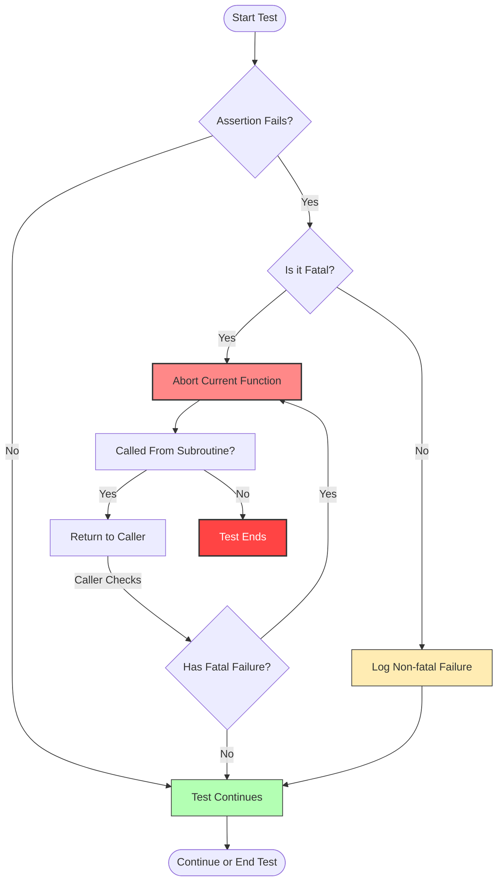

# Mastering Test Assertions

Explore the full spectrum of GoogleTest assertions, from basic conditions to advanced predicate and exception assertions. Learn best practices and practical examples for writing clear, expressive checks in your tests.

---

## 1. Overview of Test Assertions

### What This Guide Covers
This guide helps you understand and effectively use GoogleTest assertions to verify code behavior. It covers the range from simple Boolean checks to sophisticated predicate-format assertions and exception verifications.

### Prerequisites
- Basic familiarity with C++ and test writing.
- GoogleTest is installed and set up in your project.

### What You Will Achieve
- Mastery of GoogleTest macros for assertions.
- Ability to produce meaningful failure messages.
- Knowledge of advanced assertion types for complex conditions.

### Time to Complete
Approximately 15-30 minutes depending on hands-on practice.

### Difficulty Level
Intermediate

---

## 2. Test Assertion Types and Usage

GoogleTest offers multiple assertion macros to help you verify your code's correctness.

### Assertion Macros Pairing
Most assertions come in pairs:
- **EXPECT_***: Non-fatal failures, test continues after failure.
- **ASSERT_***: Fatal failures, aborts current function on failure.

Use `ASSERT_*` when continuing the test makes no sense after failure.

### Adding Failure Messages
You can append custom failure messages by streaming with `<<`:

```cpp
EXPECT_EQ(x, y) << "Vectors differ at index " << i;
ASSERT_TRUE(ptr != nullptr) << "Pointer must not be null";
```

### Basic Boolean Assertions
- `EXPECT_TRUE(condition)`, `ASSERT_TRUE(condition)`: Verify condition is true.
- `EXPECT_FALSE(condition)`, `ASSERT_FALSE(condition)`: Verify condition is false.

### Binary Comparison Assertions
- `EXPECT_EQ(val1, val2)`, `ASSERT_EQ(val1, val2)`: Checks equality (`==`).
- `EXPECT_NE(val1, val2)`, `ASSERT_NE(val1, val2)`: Checks inequality (`!=`).
- `EXPECT_LT(val1, val2)`, `ASSERT_LT(val1, val2)`: Checks less than (`<`).
- `EXPECT_LE(val1, val2)`, `ASSERT_LE(val1, val2)`: Checks less or equal (`<=`).
- `EXPECT_GT(val1, val2)`, `ASSERT_GT(val1, val2)`: Checks greater than (`>`).
- `EXPECT_GE(val1, val2)`, `ASSERT_GE(val1, val2)`: Checks greater or equal (`>=`).

Note: Use `EXPECT_EQ` or `ASSERT_EQ` instead of `EXPECT_TRUE(val1 == val2)` for better failure messages.

### String Assertions
Designed specifically for C strings (`const char*`) and wide strings (`wchar_t*`):
- `EXPECT_STREQ(str1, str2)`, `ASSERT_STREQ(str1, str2)`: Contents equal.
- `EXPECT_STRNE(str1, str2)`, `ASSERT_STRNE(str1, str2)`: Contents different.
- `EXPECT_STRCASEEQ(str1, str2)`, `ASSERT_STRCASEEQ(str1, str2)`: Case-insensitive compare equal.
- `EXPECT_STRCASENE(str1, str2)`, `ASSERT_STRCASENE(str1, str2)`: Case-insensitive compare not equal.

Use these macros to avoid pitfalls in pointer vs content comparison.

### Floating-Point Assertions
Due to rounding errors and representation variance, use specialized macros:
- `EXPECT_FLOAT_EQ(val1, val2)`, `ASSERT_FLOAT_EQ(val1, val2)`: Approximate equality for `float`.
- `EXPECT_DOUBLE_EQ(val1, val2)`, `ASSERT_DOUBLE_EQ(val1, val2)`: Approximate equality for `double`.
- `EXPECT_NEAR(val1, val2, abs_error)`, `ASSERT_NEAR(val1, val2, abs_error)`: Assert values are within `abs_error`.

These macros use Units in the Last Place (ULPs) to measure proximity.

---

## 3. Advanced Assertion Techniques

### Using Predicate Assertions for Informative Failures

Sometimes complex conditions require more than simple Boolean assertions. GoogleTest supports predicate assertions, which create more expressive failure messages.

#### Basic Predicate Assertions
Use `EXPECT_PREDn` and `ASSERT_PREDn` macros for predicates returning `bool`:

```cpp
bool IsEven(int n) { return n % 2 == 0; }
EXPECT_PRED1(IsEven, value);
ASSERT_PRED2(MyPredicate, val1, val2);
```

Failure messages print the predicate and arguments for clarity.

#### Predicate Assertions with AssertionResult
For richer messaging, define predicates returning `AssertionResult`:

```cpp
#include <gtest/gtest.h>

testing::AssertionResult IsEven(int n) {
  if (n % 2 == 0)
    return testing::AssertionSuccess();
  else
    return testing::AssertionFailure() << n << " is odd";
}

EXPECT_TRUE(IsEven(Fib(4)));
```

On failure, the output will include explanatory messages:

```
Value of: IsEven(Fib(4))
  Actual: false (3 is odd)
Expected: true
```

This makes debugging much easier.

#### Predicate-Formatter Assertions
Use `EXPECT_PRED_FORMATn` or `ASSERT_PRED_FORMATn` to fully customize failure messages when predicate arguments can't be streamed.

Example:

```cpp
testing::AssertionResult AssertIsEven(const char* expr, int n) {
  if (n % 2 == 0)
    return testing::AssertionSuccess();
  return testing::AssertionFailure() << expr << " evaluates to " << n << ", which is not even.";
}

EXPECT_PRED_FORMAT1(AssertIsEven, value);
```

### Exception Assertions

GoogleTest provides macros to test code that throws exceptions (requires exception support enabled):

- `EXPECT_THROW(statement, exception_type)`, `ASSERT_THROW(statement, exception_type)`: Asserts statement throws expected exception.
- `EXPECT_ANY_THROW(statement)`, `ASSERT_ANY_THROW(statement)`: Asserts statement throws any exception.
- `EXPECT_NO_THROW(statement)`, `ASSERT_NO_THROW(statement)`: Asserts statement does not throw.

Example:

```cpp
EXPECT_THROW(Foo(), std::runtime_error);
ASSERT_NO_THROW(Bar());
```

You can test compound statements:

```cpp
EXPECT_NO_THROW({
  Setup();
  Run();
});
```

### Death Assertions

For verifying that code terminates or aborts in a controlled manner, use death test assertions. See [Robust Error-Handling with Death Tests](guides/advanced-and-best-practices/death-tests) for full workflow.

### Windows HRESULT Assertions (Windows Only)

- `EXPECT_HRESULT_SUCCEEDED(expr)`, `ASSERT_HRESULT_SUCCEEDED(expr)`: Succeeds if `expr` returns successful HRESULT.
- `EXPECT_HRESULT_FAILED(expr)`, `ASSERT_HRESULT_FAILED(expr)`: Succeeds if `expr` returns failed HRESULT.

Failure messages include the hex HRESULT and a human-readable message if available.

---

## 4. Writing Effective Assertions

### Best Practices
- Use `EXPECT_*` when possible to allow continued test execution and capture multiple failures.
- Use `ASSERT_*` when continuing after failure leads to invalid states or dangerous operations.
- Avoid using `EXPECT_TRUE` with complex expressions; use predicate assertions instead for clarity.
- Provide custom failure messages to aid rapid diagnosis.
- Use string comparison assertions rather than pointer comparisons.
- For floating-point values, prefer `EXPECT_FLOAT_EQ`/`ASSERT_FLOAT_EQ` over `EXPECT_EQ`.
- Use `SCOPED_TRACE(message)` to add context to failures in subroutines or loops.

### Common Pitfalls
- Misusing `ASSERT_*` in non-void functions may cause confusing compilation errors.
- Using assertion macros that generate fatal failure inside constructors or destructors is disallowed.
- Fatal assertions abort the current function, not the entire test; use `HasFatalFailure()` or `ASSERT_NO_FATAL_FAILURE()` to propagate failures.
- Avoid placing multiple death assertions on the same line.

### Assertion Performance
Most assertions evaluate their arguments exactly once. Predicate-format assertions may be slightly slower but provide clearer messages.

---

## 5. Examples and Code Samples

### Basic Assertions

```cpp
TEST(FactorialTest, HandlesZeroInput) {
  EXPECT_EQ(Factorial(0), 1);
}

TEST(FactorialTest, HandlesPositiveInput) {
  EXPECT_EQ(Factorial(1), 1);
  EXPECT_EQ(Factorial(2), 2);
  EXPECT_EQ(Factorial(3), 6);
}
```

### Predicate Assertion Example

```cpp
testing::AssertionResult IsPositive(int n) {
  if (n > 0)
    return testing::AssertionSuccess();
  else
    return testing::AssertionFailure() << n << " is not positive";
}

TEST(MyTest, PredicateExample) {
  int value = -1;
  EXPECT_TRUE(IsPositive(value));
}
```
On failure, prints:
```
Value of: IsPositive(value)
  Actual: false (-1 is not positive)
Expected: true
```

### Exception Assertion Example

```cpp
TEST(MyExceptionTest, ThrowsOnBadInput) {
  EXPECT_THROW(FunctionUnderTest(-1), std::invalid_argument);
  EXPECT_NO_THROW(FunctionUnderTest(10));
}
```

### String Comparison Example

```cpp
const char* expected = "hello";
const char* actual = "hello";
EXPECT_STREQ(expected, actual);  // compares contents, not pointers
```

---

## 6. Troubleshooting Common Assertion Issues

### Assertion Fails with Unexpected Messages
- Verify use of correct assertion macro (`EXPECT_` vs `ASSERT_`).
- Check if streaming additional messages (`<<`) interferes with output.
- Ensure your predicate functions return `AssertionResult` when using predicate assertions.

### Fatal Failures in Helper Functions Don't Abort Test
Remember that `ASSERT_*` aborts only current *function*. To abort the full test, check with `HasFatalFailure()` after calling the helper.

Example:

```cpp
void Helper() {
  ASSERT_EQ(1, 2);  // Aborts only this function
}
TEST(MyTest, Foo) {
  Helper();
  if (HasFatalFailure()) return;  // Abort test early
  ...
}
```

### Using Assertions in Void-returning Functions
`ASSERT_*` macros generating fatal failures can only be used in void-returning functions.

If you need fatal assertions in non-void functions, consider restructuring or use non-fatal assertions plus check failure status explicitly.

### Comparing C Strings
Pointer equality on C strings checks addresses, not contents. Use `EXPECT_STREQ` or `ASSERT_STREQ` to compare content.

### Floating Point Comparisons
Avoid exact equality checks due to rounding errors. Use `EXPECT_FLOAT_EQ`, `EXPECT_DOUBLE_EQ`, or `EXPECT_NEAR` instead with an appropriate error bound.

---

## 7. Next Steps and Related Reading

- [Creating and Using Mocks with GoogleMock](/guides/core-testing-workflows/using-mocks)
- [Value- and Type-Parameterized Testing Patterns](/guides/core-testing-workflows/parameterized-and-typed-tests)
- [Robust Error-Handling with Death Tests](/guides/advanced-and-best-practices/death-tests)
- [Building Your First Test](/guides/getting-started/writing-first-test)
- [Assertions Reference](reference/assertions.md)

---

## Additional Tips

- **Use `SCOPED_TRACE` to improve failure context**: Wrap subroutine calls or loops with `SCOPED_TRACE` to get breadcrumbs in failure messages.

- **Avoid mixing `EXPECT_` and `ASSERT_` carelessly**: Choose based on whether the test can safely continue after failure.

- **Write readable predicate functions** returning `AssertionResult` for complex conditions.

- **Leverage streaming messages** to clarify assertion intent and errors.

- **Use proper string assertion macros** when dealing with C strings to avoid misleading pointer comparisons.

<Info>
Googletest’s rich assertions empower developers to write robust, maintainable tests. Proper usage ensures clear failure diagnostics and efficient debugging.
</Info>

---

## References

- [GoogleTest Primer](primer.md)
- [Assertions Reference](reference/assertions.md)
- [Advanced GoogleTest Topics](advanced.md)
- [Value-Parameterized Tests](advanced.md#value-parameterized-tests)
- [Typed Tests](advanced.md#typed-tests)

---

## Overview Diagram: Assertion Workflow



---
