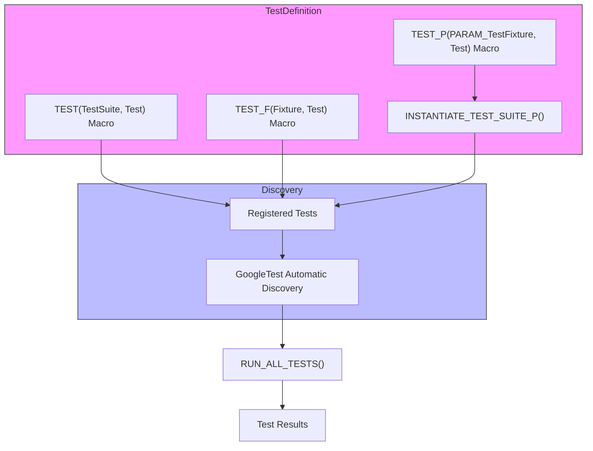

# Test Discovery and Organization

Master effective test structure and naming strategies to enable GoogleTest’s automatic discovery, including best practices for organizing suites for maintainability and scalability. This guide will help you unlock the full automation potential of GoogleTest by aligning with its discovery conventions and organizational frameworks.

---

## 1. Understanding GoogleTest's Automatic Discovery

GoogleTest automatically discovers and runs tests that follow specific naming patterns and structure conventions, relieving you from manually registering tests.

### What it Means for You:
- **Write tests using the prescribed macros** (`TEST`, `TEST_F`, `TEST_P`, etc.).
- **Use consistent naming conventions** for test suites and test names.
- **Organize tests logically** for clarity and maintainability.

<Check>
Ensure each test or test fixture you create uses GoogleTest macros correctly to participate in test discovery.
</Check>

---

## 2. Structuring Your Tests for Discovery

### 2.1 Using `TEST` Macros for Simple Tests

- Use `TEST(TestSuiteName, TestName)` to define a test.
- Both arguments **must be valid C++ identifiers without underscores**.
- Tests are grouped into test suites by the first argument.

Example:

```cpp
TEST(MathFunctions, HandlesZeroInput) {
  EXPECT_EQ(Factorial(0), 1);
}

TEST(MathFunctions, HandlesPositiveInput) {
  EXPECT_EQ(Factorial(4), 24);
}
```

*Outcome:* Both tests are automatically discovered as part of the `MathFunctions` suite.

### 2.2 Using Test Fixtures with `TEST_F` for Shared Setup

- When multiple tests require common setup, **define a fixture class** derived from `testing::Test`.
- Use `TEST_F(FixtureClass, TestName)` to write tests that access fixture members.

Example:

```cpp
class DatabaseTest : public testing::Test {
 protected:
  void SetUp() override {
    db_.Connect();
  }

  void TearDown() override {
    db_.Disconnect();
  }

  Database db_;
};

TEST_F(DatabaseTest, InsertData) {
  EXPECT_TRUE(db_.Insert("sample"));
}

TEST_F(DatabaseTest, DeleteData) {
  EXPECT_TRUE(db_.Delete("sample"));
}
```

*Outcome:* Both tests share the `DatabaseTest` fixture and are discovered under this suite.

### 2.3 Writing Parameterized Tests

- Use `TEST_P` to define value-parameterized tests for running the same test logic with different inputs.
- Instantiate them with `INSTANTIATE_TEST_SUITE_P`.

Example:

```cpp
class PrimeTest : public testing::TestWithParam<int> {};

TEST_P(PrimeTest, HandlesVariousInputs) {
  int n = GetParam();
  EXPECT_TRUE(IsPrime(n));
}

INSTANTIATE_TEST_SUITE_P(
    PrimeNumbers, PrimeTest,
    testing::Values(2, 3, 5, 7, 11));
```

*Outcome:* GoogleTest discovers each parameter set as a unique test.

---

## 3. Naming Best Practices

### 3.1 Test Suite Naming

- Use descriptive, PascalCase names (e.g., `MathFunctions`, `NetworkClient`).
- Avoid underscores to prevent conflicts.

### 3.2 Test Name Naming

- Use clear, concise names that describe the expected behavior.
- Avoid underscores; use camelCase or PascalCase.

### 3.3 Fixture Class Naming

- Name fixtures after the tested class or component with a `Test` suffix (e.g., `ParserTest`, `CacheTest`).

<Info>
Consistent naming improves discoverability, readability, and ease of filtering during test execution.
</Info>

---

## 4. Organizing Test Suites and Files

### 4.1 Group Related Tests Together

- Group tests that cover similar functionality into the same test suite.
- Use separate suites for distinct components to avoid large monolith test files.

### 4.2 File Structure Recommendations

- Name test source files to reflect what they test (e.g., `math_functions_test.cc`).
- Place related test suites in appropriate directories matching your project packages or modules.

### 4.3 Managing Large Projects

- Split large test suites into multiple files if they grow unwieldy.
- Use parameterized and typed tests to reduce repetition.
- Leverage advanced filtering options with suite/test names during test runs.

<Check>
Modularizing tests with meaningful suites and files reduces maintenance overhead and speeds up test execution cycles.
</Check>

---

## 5. Filtering and Running Test Subsets

GoogleTest uses test suite and test names to filter and select tests.

**Examples:**

- Run all tests in a suite:

```bash
test_binary --gtest_filter=MathFunctions.*
```

- Run a specific test:

```bash
test_binary --gtest_filter=MathFunctions.HandlesZeroInput
```

- Run multiple tests with a wildcard:

```bash
test_binary --gtest_filter=*PositiveInput
```

<Note>
This filtering relies on how you name and organize your tests. Adhering to naming conventions ensures effective test selection.
</Note>

---

## 6. Common Pitfalls and How to Avoid Them

| Problem                                    | Solution                                                  |
|--------------------------------------------|-----------------------------------------------------------|
| Using underscores or invalid characters    | Use valid C++ identifiers without underscores             |
| Manually registering tests unnecessarily   | Rely on GoogleTest macros to auto-register tests          |
| Mixing `TEST` and `TEST_F` usage incorrectly| Ensure `TEST_F` uses fixture class and `TEST` is for plain tests |
| Large monolithic test suites                | Refactor into smaller suites and use fixtures or parameterized tests |

---

## 7. Advanced Organizational Tips

- Use `TYPED_TEST_SUITE` and `TYPED_TEST` for type-parameterized tests, if applicable.
- Group tests under nested namespaces to reflect code structure.
- Consider test environment setup with `testing::Environment` for global setup/teardown.

---

## Summary Diagram



---

## 8. Next Steps

- Explore the [GoogleTest Primer](../primer.md) to build foundational skills.
- Review the [Writing Your First Test](../guides/core-testing-workflows/writing-your-first-test.md) guide for practical test authoring examples.
- Learn about [Test Fixtures](../primer.md#same-data-multiple-tests) for sharing setup across multiple tests.
- For advanced testing strategies, visit [Parameterized and Typed Tests](../guides/advanced-and-mocking-guides/parameterized-and-typed-tests.md).

---

## References

- [GoogleTest Primer](../primer.md)
- [Assertions Reference](../reference/testing.md#TEST)
- [Test Fixtures Detailed Guide](../primer.md#same-data-multiple-tests)
- [Filtering Tests at Runtime](../guides/integration-and-practical-patterns/building-and-running-tests.md#running-tests)
- [Official GitHub Repository](https://github.com/google/googletest)

---

<Tip>
Organize your test suites and tests meticulously—this is the foundation for efficient, scalable, and maintainable automated testing with GoogleTest. Proper naming and structuring empower both developers and CI systems to harness GoogleTest’s powerful features seamlessly.
</Tip>
