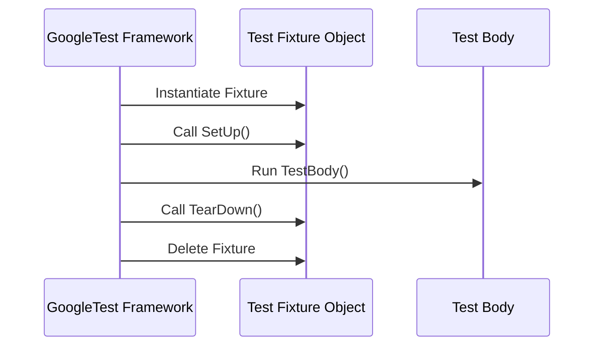

# Organizing Tests with Test Fixtures

## Overview

Test fixtures in GoogleTest provide a powerful, structured way to organize tests that share common objects, setup, and teardown logic. This page guides you step-by-step to master test fixtures to efficiently reuse test code, set up test environments, and clean up resources after tests run. Harnessing fixtures leads to cleaner, more maintainable test suites and faster debugging.

---

## Why Use Test Fixtures?

Imagine you're testing a class that requires multiple configurations or repeated setup of complex objects. Writing the same setup for each test is tedious, error-prone, and cumbersome. Test fixtures let you abstract this common setup and teardown in a reusable class, creating a fresh independent environment for each test. This achieves:

- Reuse: Share identical objects and utility functions across related tests.
- Isolation: Each test gets a clean fixture instance, ensuring independence.
- Clarity: Group logically related tests in a single suite with clearer intent.

---

## Prerequisites

- Familiarity with basic GoogleTest concepts such as `TEST()` and assertions.
- A C++17 development environment with GoogleTest properly installed.

---

## What You'll Achieve

By following this guide, you will:

- Define your own test fixture class by deriving from `testing::Test`.
- Implement setup (`SetUp()`) and teardown (`TearDown()`) methods.
- Write tests using `TEST_F()` that access fixture members.
- Organize complex test suites with shared resources correctly.

---

## Step-by-Step Guide to Using Test Fixtures

<Steps>
<Step title="Define Your Fixture Class">
Create a new class derived from `testing::Test`. Declare any shared objects or helper methods as protected members so tests can access them.

```cpp
class MyClassTest : public testing::Test {
 protected:
  // Declared objects shared across tests in this suite.
  MyClass obj_;
  HelperType helper_;

  // Optional: Constructor for initial setup.
  MyClassTest() {
    // Init members if needed
  }

  // SetUp() and TearDown() will be added in the next step.
};
```

Remember to include `<gtest/gtest.h>`.
</Step>

<Step title="Implement Setup and Teardown Methods">
Override the fixture's `SetUp()` and `TearDown()` methods for per-test initialization and cleanup. GoogleTest will call these automatically before and after each `TEST_F`.

```cpp
void SetUp() override {
  // Prepare objects for test
  obj_.Initialize();
}

void TearDown() override {
  // Clean resources if needed
  obj_.Reset();
}
```

**Tip:** Only use `SetUp()` if initialization can fail or requires assertions. Use the constructor for simple, exception-free initialization.

**Common Pitfall:** Don’t spell `SetUp()` as `Setup()` – it must be exact (uppercase U).
</Step>

<Step title="Write Tests Using the Fixture">
Use `TEST_F(MyClassTest, TestName)` to define tests that share the fixture. Inside tests, access shared objects and helpers directly.

```cpp
TEST_F(MyClassTest, HandlesEmptyInput) {
  EXPECT_TRUE(obj_.IsEmpty());
}

TEST_F(MyClassTest, ProcessesDataCorrectly) {
  obj_.AddData(5);
  EXPECT_EQ(obj_.DataCount(), 1);
}
```

Unlike `TEST()`, `TEST_F()` passes the fixture’s context, so each test gets its own fresh instance of `MyClassTest`.

**Important:** GoogleTest creates and destroys a new fixture object for every test. Tests cannot rely on shared mutable state between them.
</Step>

<Step title="Share Expensive Resources Across Tests">
For expensive setup not needing to be repeated for each test, use `static` variables and implement:

- `static void SetUpTestSuite()`
- `static void TearDownTestSuite()`

GoogleTest calls these once per test suite before the first and after the last test.

```cpp
class MyClassTest : public testing::Test {
 protected:
  static ExpensiveResource* resource_;

  static void SetUpTestSuite() {
    resource_ = new ExpensiveResource();
  }

  static void TearDownTestSuite() {
    delete resource_;
    resource_ = nullptr;
  }
};

ExpensiveResource* MyClassTest::resource_ = nullptr;
```

Access `resource_` inside tests. Manage carefully to prevent leaks.

**Best Practice:** Use `SetUpTestSuite()` for global initialization. Avoid dependencies on test execution order.
</Step>

<Step title="Run Your Tests">
After defining tests and fixture, compile and run the test program as usual. GoogleTest instantiates your fixture, runs `SetUp()`, executes your test body, calls `TearDown()`, and then destroys the fixture for each `TEST_F`.

Output will group results by test suite and individual test names for easy diagnosis.
</Step>
</Steps>

---

## Practical Example

Consider testing a `Queue<int>` class with different states:

```cpp
template <typename E>
class Queue {
 public:
  Queue();
  void Enqueue(const E& element);
  E* Dequeue();  // Returns nullptr if empty
  size_t size() const;
};
```

Define a fixture with pre-configured queues:

```cpp
class QueueTest : public testing::Test {
 protected:
  QueueTest() {
    // q0_ is empty
    q1_.Enqueue(1);
    q2_.Enqueue(2);
    q2_.Enqueue(3);
  }

  Queue<int> q0_;
  Queue<int> q1_;
  Queue<int> q2_;
};
```

Write tests using the fixture:

```cpp
TEST_F(QueueTest, IsEmptyInitially) {
  EXPECT_EQ(q0_.size(), 0);
}

TEST_F(QueueTest, DequeueWorks) {
  int* n = q0_.Dequeue();
  EXPECT_EQ(n, nullptr);

  n = q1_.Dequeue();
  ASSERT_NE(n, nullptr);
  EXPECT_EQ(*n, 1);
  EXPECT_EQ(q1_.size(), 0);
  delete n;

  n = q2_.Dequeue();
  ASSERT_NE(n, nullptr);
  EXPECT_EQ(*n, 2);
  EXPECT_EQ(q2_.size(), 1);
  delete n;
}
```

Each test runs independently with fresh fixture instances, making debugging straightforward.

---

## Best Practices and Tips

- Use `TEST_F()` only after defining a proper fixture class.
- Choose clear fixture class names, typically `<ClassUnderTest>Test`.
- Use `SetUp()` and `TearDown()` to prepare and clean each test’s environment.
- Avoid shared mutable state without explicit synchronization.
- Use `SetUpTestSuite()` and `TearDownTestSuite()` for costly shared resources.
- Prefer constructors/destructors for simple setup/cleanup.
- Ensure all resources allocated in `SetUp()` are properly freed in `TearDown()`.
- Use default constructors in fixtures; GoogleTest needs to instantiate.

---

## Troubleshooting Common Issues

- **Tests fail to compile with `TEST_F`**: Confirm your fixture class is defined and has a default constructor.
- **`SetUp()` not called**: Check correct capitalization; must be `SetUp()`.
- **Tests interfere with each other**: Verify no shared state between tests or add isolation.
- **Resource leaks appear**: Ensure you properly release all allocated resources in `TearDown()` or use smart pointers.
- **Setup code runs multiple times unexpectedly**: Remember `SetUpTestSuite()` can be called multiple times if you have derived fixtures.

<Tip>
Remember that GoogleTest creates a *new* fixture object for each test, calls `SetUp()` and `TearDown()` on it, and then deletes it. Never assume state persists across tests.
</Tip>

---

## Advanced Usage

### Using Value-Parameterized Tests with Fixtures

You can extend fixtures for parameterized tests by deriving from `testing::TestWithParam<T>`.

```cpp
class MyParamTest : public testing::TestWithParam<int> {
 protected:
  void SetUp() override {
    value_ = GetParam();
  }
  int value_;
};

TEST_P(MyParamTest, VerifyValue) {
  EXPECT_GT(value_, 0);
}

INSTANTIATE_TEST_SUITE_P(
    PositiveValues, MyParamTest, testing::Values(1, 2, 3));
```

Such a fixture gets instantiated for each parameter value, allowing easy data-driven testing without duplicated setup.

### Fixture Inheritance

Fixtures support subclassing, enabling layered setup and shared utilities.

```cpp
class BaseTest : public testing::Test {
 protected:
  void SetUp() override { /* Base setup */ }
};

class DerivedTest : public BaseTest {
 protected:
  void SetUp() override {
    BaseTest::SetUp();
    /* Derived setup */
  }
};
```

While powerful, keep setup predictable and avoid complex fixture inheritance hierarchies.

---

## Related Reading and Next Steps

- [GoogleTest Primer](primer.md) — Introduction to writing tests and basic fixtures.
- [Testing Reference](reference/testing.md) — Details on test macros and advanced usage.
- [Advanced GoogleTest Topics](advanced.md) — Deep dive into fixtures, parameterized tests, and more.
- [Mocking for Dummies](gmock_for_dummies.md) — Learn how to use mock objects in your tests.
- [Mocking Cookbook](gmock_cook_book.md) — Techniques and patterns for mocking with gMock.

For effective test organization, combine test fixtures with matchers and mocks referenced above.

---

## Summary

Test fixtures organize and simplify GoogleTest code by structuring common object setup, resource cleanup, and shared logic for multiple tests. Use `testing::Test` to derive fixtures, implement `SetUp()`/`TearDown()` for per-test prep and cleanup, and `TEST_F()` to write tests accessing shared context. Advanced patterns include sharing expensive resources via static setup and integrating parameterized or inherited fixtures. Mastering fixtures accelerates test development, improves maintainability, and ensures reliable, isolated tests.

---

## Further Help

If you encounter issues or want to extend fixture usage:

- Visit the [GoogleTest FAQ](faq.md) for common pitfalls.
- Explore [GoogleMock Mocking Reference](reference/mocking.md) to combine mocks with fixtures.
- Join community forums or check GitHub issues for community support and tips.


---

## Key Code Snippet Recap

```cpp
class FooTest : public testing::Test {
 protected:
  FooTest() { /* optional constructor setup */ }
  void SetUp() override { /* per-test setup */ }
  void TearDown() override { /* per-test cleanup */ }
  static void SetUpTestSuite() { /* setup shared resources */ }
  static void TearDownTestSuite() { /* cleanup shared resources */ }

  // Shared test members
  Foo foo_;
};

TEST_F(FooTest, DoesSomething) {
  EXPECT_TRUE(foo_.DoAction());
}
```

Remember: Each test runs with a fresh instance of FooTest; modifications in one test won’t affect others.

---

If you'd like a visual workflow, here is a simple Mermaid sequence describing fixture lifecycle per test:


