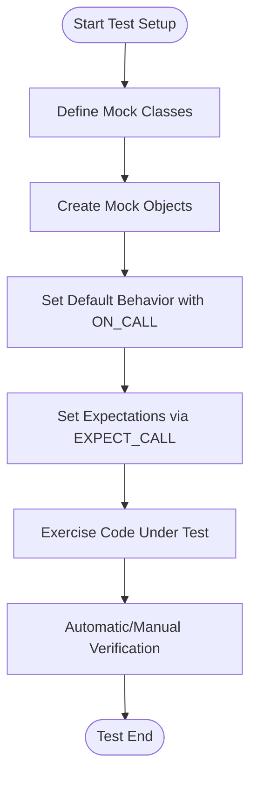

# Mocking Dependencies with GoogleMock

## Introduction

GoogleMock (gMock) is a powerful C++ framework designed to help you simulate and control the behavior of dependencies in your code, enabling isolation of units under test. This guide walks you through the essentials of setting up mock classes, configuring expectations, and validating interactions to write robust unit tests for complex systems.

---

## Why Mock Dependencies?

When testing a unit of code that interacts with external components (e.g., databases, network, hardware), relying on real objects can be slow, unreliable, or hard to configure for various test scenarios. Mocking these dependencies enables:

- Isolation of the code under test
- Control over the behavior and outputs of dependencies
- Verification of expected interactions (calls, arguments, order)
- Faster and more deterministic tests

## Prerequisites

- Familiarity with C++ and virtual functions
- GoogleTest and GoogleMock installed and configured (see [Getting Started with GoogleTest](../guides/getting-started-with-googletest))
- Mock classes corresponding to interfaces or abstract base classes

---

## 1. Defining Mock Classes

Your first step is to define a mock class that simulates the dependency's interface.

### Basic Mock Class

Given a class with virtual methods:

```cpp
class Foo {
 public:
  virtual ~Foo();
  virtual int GetSize() const = 0;
  virtual std::string Describe(const char* name) = 0;
  virtual bool Process(int elem, int count) = 0;
};
```

Define the mock by inheriting and using the `MOCK_METHOD` macro:

```cpp
#include <gmock/gmock.h>

class MockFoo : public Foo {
 public:
  MOCK_METHOD(int, GetSize, (), (const, override));
  MOCK_METHOD(std::string, Describe, (const char* name), (override));
  MOCK_METHOD(bool, Process, (int elem, int count), (override));
};
```

### Mocking Templates and Overloads

- Templates can be mocked similarly by inheriting from the template interface.
- Overloaded methods require you to mock each overload explicitly, adding `using` declarations when only some overloads are mocked.

### Mocking Non-Virtual Methods

Supported through high-performance dependency injection patterns involving unrelated classes sharing interface method signatures. See the [gMock Cookbook](../docs/gmock_cook_book.md#MockingNonVirtualMethods).

---

## 2. Setting Up Expectations on Mocks

Expectations specify *how* the mock should be called during the test.

### Basic Syntax

```cpp
EXPECT_CALL(mock_object, MethodName(matchers...))
    .Times(cardinality)
    .WillOnce(action)
    .WillRepeatedly(action);
```

- `matchers...` specify expected arguments (e.g., `_`, `Eq(value)`, or custom matchers).
- `Times()` controls how many times calls are expected.
- `WillOnce()` and `WillRepeatedly()` define behaviors on calls.

### Matchers

Use matchers to flexibly specify argument expectations:

```cpp
using ::testing::_;  // wildcard matcher
EXPECT_CALL(mockFoo, Process(_, 5));  // Any first arg, second arg = 5
```

Refer to the [Matchers Reference](../api-reference/matchers-and-actions/argument-matchers.md) for a complete list.

### Cardinalities

- `Exactly(n)`: Expect exactly *n* calls
- `AtLeast(n)`: At least *n* calls
- `AtMost(n)`: At most *n* calls
- `AnyNumber()`: Any number of calls allowed

### Call Order

- Calls match expectations in reverse order: newer overrides older.
- To enforce call order, use `InSequence` or `.After()` clauses.

Example:

```cpp
Sequence seq;
EXPECT_CALL(mock, Foo(1)).InSequence(seq);
EXPECT_CALL(mock, Bar(2)).InSequence(seq);
```

Methods must be called in this order.

### Actions

Control what the mock method does when called:

- `Return(value)` returns a fixed value.
- `ReturnRef(variable)` returns a reference.
- `Invoke(lambda/function)` runs a callable.
- `SetArgPointee<N>(value)` sets *N*-th pointer argument’s pointee.
- `DoAll(...)` combines multiple actions.

Example:

```cpp
EXPECT_CALL(mock, GetX())
    .WillOnce(Return(10))
    .WillOnce(Return(20))
    .WillRepeatedly(Return(30));
```

---

## 3. Using ON_CALL for Default Behavior

Unlike `EXPECT_CALL` which sets an expectation, `ON_CALL` defines **default actions** when no expectations match:

```cpp
ON_CALL(mock, Describe(_))
    .WillByDefault(Return("default description"));
```

The default action is used if no matching `EXPECT_CALL` is found.

**Best Practice:** Use `ON_CALL` in mock constructors or test fixture setups for common behavior.

---

## 4. Working with Mock Strictness

Mock objects can be:

- **Naggy** (default): Warn on unexpected/uninteresting calls.
- **NiceMock**: Suppress warnings on uninteresting calls.
- **StrictMock**: Treat uninteresting calls as failures.

Usage:

```cpp
using ::testing::NiceMock;
using ::testing::StrictMock;

NiceMock<MockFoo> nice_foo;
StrictMock<MockFoo> strict_foo;
```

---

## 5. Verifying and Resetting Mocks

- By default, gMock verifies expectations when a mock object is destructed.
- You can manually verify and clear expectations earlier:

```cpp
using ::testing::Mock;

Mock::VerifyAndClearExpectations(&mock_obj);
Mock::VerifyAndClear(&mock_obj);  // Also clears ON_CALL default actions
```

- Use `Mock::AllowLeak(&mock_obj);` if you want to ignore leaks in tests.

---

## 6. Practical Example

```cpp
#include <gmock/gmock.h>
#include <gtest/gtest.h>

class Foo {
 public:
  virtual ~Foo() {}
  virtual int GetSize() const = 0;
  virtual std::string Describe(int type) = 0;
};

class MockFoo : public Foo {
 public:
  MOCK_METHOD(int, GetSize, (), (const, override));
  MOCK_METHOD(std::string, Describe, (int type), (override));
};

using ::testing::Return;
using ::testing::AtLeast;

TEST(FooTest, UsesMock) {
  MockFoo foo;

  ON_CALL(foo, GetSize())
      .WillByDefault(Return(10));

  EXPECT_CALL(foo, Describe(5))
      .Times(AtLeast(1))
      .WillRepeatedly(Return("Category 5"));

  EXPECT_EQ(foo.GetSize(), 10);
  EXPECT_EQ(foo.Describe(5), "Category 5");
}
```

---

## Troubleshooting

### Unexpected Calls

- Verify that your `EXPECT_CALL`s are set **before** exercise of the mock.
- Use `--gmock_verbose=info` to track call matching and diagnose mismatches.

### Uninteresting Calls Warnings

- Occur when a mock method is called without any `EXPECT_CALL`.
- Suppress by using `NiceMock`, or add a catch-all `EXPECT_CALL(mock, Method(_)).Times(AnyNumber());`

### Mock Destructors

- Make sure base classes have **virtual destructors** to avoid undefined behavior.

---

## Next Steps

- Learn matchers in depth: [Matchers Reference](../api-reference/matchers-and-actions/argument-matchers.md)
- Explore advanced actions: [Actions Reference](../api-reference/matchers-and-actions/mock-actions.md)
- Study behavior control patterns in [gMock Cookbook](../docs/gmock_cook_book.md)
- Understand mock strictness: [The Nice, Strict, and the Naggy](../docs/gmock_cook_book.md#NiceStrictNaggy)


---

## Diagram: Mocking Workflow Overview



---

## References

- gMock Cheat Sheet: https://google.github.io/googletest/gmock_cheat_sheet.html
- gMock Cookbook: https://google.github.io/googletest/gmock_cook_book.html
- gMock for Dummies: https://google.github.io/googletest/gmock_for_dummies.html
- Mocking API Reference: /api-reference/mocking-api/mock-method-macro

---

**Tip:** Always set expectations **before** the mock methods are invoked to avoid undefined behavior.

---

For detailed examples and extended usage patterns, explore the linked references above or navigate to [Writing Your First Unit Test](../guides/core-testing-workflows/writing-basic-tests.md) to get started.