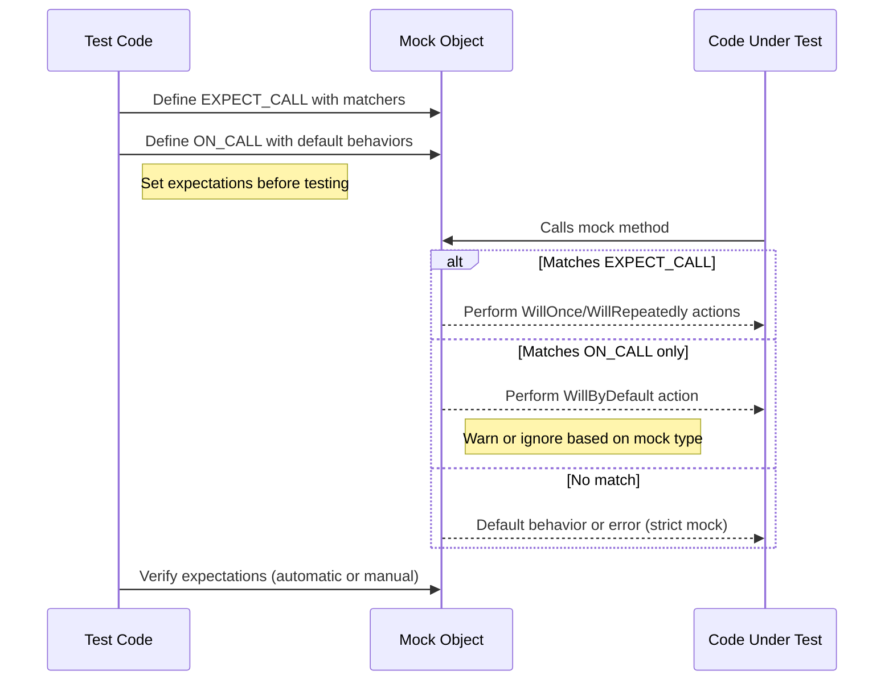

# Mocking Patterns and Verification

This guide provides actionable steps and practical advice on setting up complex mock scenarios and verifying interactions with GoogleMock. You'll learn how to use expectation APIs effectively, understand the nuances of mock object behaviors, verify call counts, and apply interaction patterns that ensure robust and isolated tests.

---

## 1. Understanding Mock Object Behaviors

Before defining expectations, decide how your mock should respond to uninteresting calls—calls for which you haven't set expectations.

- **Naggy Mocks (Default Behavior)**: Warn on any uninteresting call but allow it.
- **Nice Mocks**: Silently ignore any uninteresting call to reduce noise, suitable when you do not want warnings cluttering test outputs.
- **Strict Mocks**: Treat uninteresting calls as test failures, enforcing tighter controls and stricter validation.

### How to apply?
```cpp
using ::testing::NiceMock;
using ::testing::NaggyMock;
using ::testing::StrictMock;

NiceMock<MockFoo> nice_foo;      // Ignore uninteresting calls.
NaggyMock<MockFoo> naggy_foo;    // Warn on uninteresting calls (default).
StrictMock<MockFoo> strict_foo;  // Fail on uninteresting calls.
```

> <Tip>
> Choose the mock strictness level that balances your desire for strictness vs. test maintenance. Use strict mocks only when you want immediate feedback on unexpected interactions.
> </Tip>

---

## 2. Defining Expectations with `EXPECT_CALL`

Setting expectations precisely allows you to verify the interaction between your code and the mocks:

### Basic structure:
```cpp
EXPECT_CALL(mock_object, MethodName(matchers...))
    .Times(cardinality)         // Optional: how many times it's expected
    .WillOnce(action)           // Optional: behavior for one call
    .WillRepeatedly(action)     // Optional: behavior for repeated calls
    .InSequence(sequences...)   // Optional: enforce call order
    .After(other_expectations...) // Optional: enforce dependencies
    .RetiresOnSaturation();     // Optional: deactivate when saturated
```

- **Matchers** define what argument values you expect. Use `_` to ignore arguments.
- **Cardinalities** like `Times(Exactly(n))`, `AtLeast(n)`, or `AnyNumber()` control call counts.
- **Actions** specify return values or side effects.

### Example:
```cpp
using ::testing::Return;

EXPECT_CALL(foo, GetSize())
    .Times(3)
    .WillRepeatedly(Return(5));

EXPECT_CALL(foo, Process(_, _))
    .WillOnce(Return(true));
```

> <Note>
> Always set `EXPECT_CALL()` before invoking code that uses the mock to ensure predictable verification.
> </Note>

---

## 3. Ordering Expectations

By default, expectations are unordered. To enforce call sequences:

### Use `InSequence`
```cpp
using ::testing::InSequence;
{
  InSequence seq;

  EXPECT_CALL(mock, Step1());
  EXPECT_CALL(mock, Step2());
  EXPECT_CALL(mock, Step3());
}
```
This requires Step1, then Step2, then Step3 calls in order.

### Use `After`
Enforce partial ordering like "call B after call A":
```cpp
using ::testing::Expectation;

Expectation callA = EXPECT_CALL(mock, A());
EXPECT_CALL(mock, B()).After(callA);
```

---

## 4. Call Count Verification and `Times`

### Common cardinalities:
- `Times(0)`: Method must NEVER be called with the specified arguments.
- `Times(1)`: Called once.
- `Times(AnyNumber())`: Called zero or more times.
- `AtLeast(n)`: Called at least n times.
- `Between(m, n)`: Called between m and n times inclusive.

### Inferred call count:
If you omit `Times()`, gMock infers it based on `WillOnce` and `WillRepeatedly`:
- No `WillOnce` or `WillRepeatedly`: `Times(1)`.
- n `WillOnce`s but no `WillRepeatedly`: `Times(n)`.
- n `WillOnce`s and a single `WillRepeatedly`: `Times(AtLeast(n))`.

### Retiring expectations:
```cpp
EXPECT_CALL(mock, Func())
    .Times(2)
    .RetiresOnSaturation();
```
After 2 calls, the expectation becomes inactive, allowing other overlapping expectations to match subsequent calls.

---

## 5. Setting Default Behavior with `ON_CALL`

Use `ON_CALL` to specify behavior without enforcing that the call occurs.

Example:
```cpp
ON_CALL(mock, GetSize())
    .WillByDefault(Return(10));
```
This sets the default action if no `EXPECT_CALL` matches.

> <Tip>
> Use `ON_CALL` for common default behaviors shared across multiple tests. Use `EXPECT_CALL` only when call count or arguments must be validated.
> </Tip>

---

## 6. Practical Interaction Patterns

### Avoid Over-specification
Write expectations only on the interactions relevant to the test's intent. Overly strict expectations cause test brittleness.

### Combining Expectations
Multiple expectations on the same method are prioritized in reverse order: later expectations override earlier ones.

### Using Wildcards
Use `_` matcher for arguments you don't care about to keep tests focused:
```cpp
EXPECT_CALL(mock, Process(_,_))
    .Times(AnyNumber());
```

### Delegating Calls
If you have a fake implementation, you can delegate calls to it within your mock:
```cpp
ON_CALL(mock, Method(_)).WillByDefault([&fake](ArgType arg){ return fake.Method(arg); });
```

### Assert method is never called
```cpp
EXPECT_CALL(mock, UnwantedMethod(_)).Times(0);
```

---

## 7. Verifying and Resetting Mocks

Beyond automatic verification at destruction, you can force verification:
```cpp
using ::testing::Mock;

// Verify expectations and clear them.
bool success = Mock::VerifyAndClearExpectations(&mock_obj);
```
Use with care: do not set new expectations after verification.

You can also clear default actions:
```cpp
Mock::VerifyAndClear(&mock_obj);
```

If you want to ignore leaks for some objects:
```cpp
Mock::AllowLeak(&mock_obj);
```

> <Warning>
> Setting expectations after code has exercised the mock is undefined behavior.
> </Warning>

---

## 8. Troubleshooting Common Issues

### "Uninteresting function call" warning
Occurs when a mock method is called without any expectation set. If this is expected, either use `NiceMock` or add an `EXPECT_CALL` with `Times(AnyNumber())`.

### Why expectation not satisfied?
Run the test with `--gmock_verbose=info` to trace all mock calls and understand why expectations fail.

### Failing due to call order
Use `InSequence` or `After` clauses to explicitly specify required call orders.

### Compiler warnings on mocked methods
Ensure destructors are virtual and avoid const parameters in mock method signatures as MSVC may warn.

---

## 9. Best Practices and Tips

- **Set expectations before invoking tested code.**
- **Keep mocks focused:** Mock interfaces you own and avoid mocking heavy concrete classes.
- **Use `RetiresOnSaturation` to manage overlapping expectations.**
- **Use `NiceMock` for suppressing noisy warnings during development.**
- **Leverage sequences and partial order to express realistic call constraints.**
- **Use matchers to generalize argument matching, avoid rigid literals.**

---

## 10. Additional Resources

- [GoogleMock Cheat Sheet](https://google.github.io/googletest/gmock_cheat_sheet.html)
- [gMock for Dummies](https://google.github.io/googletest/gmock_for_dummies.html)
- [gMock Cookbook](https://google.github.io/googletest/gmock_cook_book.html)
- [Matchers Reference](https://google.github.io/googletest/reference/matchers.html)
- [Actions Reference](https://google.github.io/googletest/reference/actions.html)
- [Mock Behaviors: Nice, Naggy, Strict](https://google.github.io/googletest/gmock_cook_book.html#NiceStrictNaggy)

---

For easy navigation, remember this page fits within the Guides > Core Testing Workflows > Mocking Patterns and Verification section of the GoogleTest documentation.

---

## Mermaid Diagram: Typical Mock Interaction Flow

