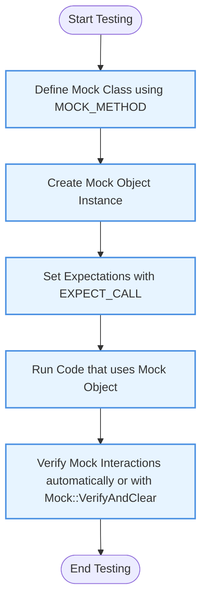

# Mocking with GoogleMock

A practical guide to creating and using mock objects with GoogleMock. Learn how to define mock classes, set expectations, and verify interactions. Includes hands-on mock examples for common use cases where dependencies need to be isolated.

---

## 1. Understanding the Mocking Workflow

### What This Guide Will Help You Accomplish
This guide empowers you to effectively write and use mock objects in your C++ tests using GoogleMock. You'll learn to:

- Define mock classes that imitate real interfaces
- Set precise expectations on mock methods
- Control mock method behaviors to simulate real-world scenarios
- Verify interactions between your code and its dependencies

### Prerequisites

- Familiarity with C++ and virtual functions
- GoogleMock properly installed and integrated in your project
- Basic understanding of GoogleTest for writing tests

### Expected Outcome

By following this guide, you will create robust mock classes and use them in tests to isolate dependencies, assert correct interactions, and enable reliable, fast testing.

### Time Estimate

30-60 minutes depending on familiarity

### Difficulty Level

Beginner to Intermediate

---

## 2. Defining Mock Classes: The Foundation

GoogleMock automates mock class creation through the `MOCK_METHOD` macro, allowing you to replace tedious manual mock implementations with clean, concise code.

### How to Define a Mock Class

Given an interface, say:

```cpp
class Turtle {
 public:
  virtual ~Turtle() {}
  virtual void PenUp() = 0;
  virtual void PenDown() = 0;
  virtual void Forward(int distance) = 0;
  virtual void Turn(int degrees) = 0;
  virtual void GoTo(int x, int y) = 0;
  virtual int GetX() const = 0;
  virtual int GetY() const = 0;
};
```

You define its mock class like:

```cpp
#include <gmock/gmock.h>

class MockTurtle : public Turtle {
 public:
  MOCK_METHOD(void, PenUp, (), (override));
  MOCK_METHOD(void, PenDown, (), (override));
  MOCK_METHOD(void, Forward, (int distance), (override));
  MOCK_METHOD(void, Turn, (int degrees), (override));
  MOCK_METHOD(void, GoTo, (int x, int y), (override));
  MOCK_METHOD(int, GetX, (), (const, override));
  MOCK_METHOD(int, GetY, (), (const, override));
};
```

#### Key Details

- Use `MOCK_METHOD(ReturnType, MethodName, (Args...), (Qualifiers))` inside the `public:` section
- For const methods, include `(const)` in qualifiers
- Include `(override)` to clearly specify overriding of virtual methods
- Wrap argument types containing commas with extra parentheses or use `using` aliases

### Handling Complex Return or Argument Types
If types contain commas (e.g., `std::pair<int, int>`), wrap them in parentheses or create type aliases:

```cpp
using BoolAndInt = std::pair<bool, int>;
MOCK_METHOD(BoolAndInt, GetPair, ());
```

### Mocking Overloaded Methods
Explicitly mock each overload, differentiating const from non-const methods.

### Tips on Placement
- Define mocks close to the tests or in shared test-specific headers
- Avoid mocking classes you don't own; prefer interface adaptors

---

## 3. Using Mock Objects in Tests

### Basic Workflow

1. **Import GoogleMock namespace**

    ```cpp
    using namespace ::testing;
    ```

2. **Create mock instances**

    ```cpp
    MockTurtle turtle;
    ```

3. **Set Expectations with `EXPECT_CALL`**

    Specify which mock methods you expect to be called, with what arguments, how often, and what they do:

    ```cpp
    EXPECT_CALL(turtle, PenDown()).Times(AtLeast(1));
    ```

4. **Exercise code under test**

    Example with a `Painter` object using the turtle:

    ```cpp
    Painter painter(&turtle);
    painter.DrawCircle(0, 0, 10);
    ```

5. **Run and verify**

    If expectations aren't met, your test fails immediately with detailed diagnostics.

### Important Notes

- Set `EXPECT_CALL` *before* the mock method is called
- The latest matching expectation takes precedence (later rules override earlier ones)
- Use `_` matcher for arguments you don’t care about

### Example Test

```cpp
#include <gtest/gtest.h>
#include <gmock/gmock.h>

using ::testing::AtLeast;

TEST(PainterTest, CallsPenDownAtLeastOnce) {
  MockTurtle turtle;
  EXPECT_CALL(turtle, PenDown()).Times(AtLeast(1));

  Painter painter(&turtle);
  EXPECT_TRUE(painter.DrawCircle(0, 0, 10));
}
```

---

## 4. Setting Expectations in Detail

### General Syntax

```cpp
EXPECT_CALL(mock_object, Method(matchers...))
    .Times(cardinality)
    .WillOnce(action)
    .WillRepeatedly(action);
```

- `mock_object`: your mock instance
- `Method`: mocked method name
- `matchers...`: matchers for method arguments, `_` matches any argument
- Clauses modify call count and behavior

### Matchers

- Use matchers to specify expected argument values
- Use built-in matchers like `_`, `Eq()`, `Ge()`, `NotNull()`

### Cardinalities

Specify how many times a method should be called:
- `Times(1)` – exactly once
- `Times(AnyNumber())` – any number of times
- `Times(AtLeast(n))`, `Times(AtMost(n))`, `Times(Between(m, n))`
- `Times(0)`: Expected never to be called

The cardinality is inferred if omitted, based on the presence of `.WillOnce()` and `.WillRepeatedly()`.

### Actions

Define what happens when the mock method is called:
- `WillOnce(Return(value))`
- `WillRepeatedly(Return(value))`
- Use lambdas or functors for custom action logic

Example:

```cpp
EXPECT_CALL(turtle, GetX())
    .WillOnce(Return(100))
    .WillOnce(Return(200))
    .WillRepeatedly(Return(300));
```

---

## 5. Advanced Expectations

### In Sequence

Use `InSequence` to enforce call order:

```cpp
{
  InSequence seq;
  EXPECT_CALL(turtle, PenDown());
  EXPECT_CALL(turtle, Forward(100));
  EXPECT_CALL(turtle, PenUp());
}
```

Calls must happen in declared order.

### Partial Order with `After` and `Sequence`

Use `After(expectation)` or `InSequence(sequence...)` to express partial ordering.

### Retiring Expectations

Use `.RetiresOnSaturation()` to deactivate an expectation after it's fully consumed, letting other expectations match new calls.

### Multiple Expectations and Shadowing

Later expectations override earlier ones for matching calls. Place more specific expectations later.

### Uninteresting Calls

Calls to mock methods with no matching `EXPECT_CALL` are "uninteresting".

- Default mock is "naggy" and warns on these
- `NiceMock` suppresses warnings
- `StrictMock` treats them as failures

---

## 6. Setting Default Behaviors with `ON_CALL`

### Purpose

`ON_CALL` specifies default behavior for mock methods without setting expectations.

### Syntax

```cpp
ON_CALL(mock_object, Method(matchers...))
    .With(multi_argument_matcher)  // optional
    .WillByDefault(action);
```

- Use `WillByDefault` exactly once
- `ON_CALL` behavior is overridden by matching `EXPECT_CALL` actions

### Example

```cpp
ON_CALL(turtle, GetX()).WillByDefault(Return(42));
```

### Best Practices

- Use in test setup or mock constructor to define common behavior
- Use `EXPECT_CALL` to add verification constraints
- Avoid overusing `EXPECT_CALL` for methods you don't intend to strictly verify

---

## 7. Helpful Mock Classes: NiceMock, NaggyMock, and StrictMock

GoogleMock provides wrapper templates to control mock object strictness.

| Mock Type   | Behavior on Uninteresting Calls           |
|-------------|-------------------------------------------|
| `NiceMock`  | Suppresses warnings                       |
| `NaggyMock` | Prints warnings (default behavior)         |
| `StrictMock`| Treats uninteresting calls as failures    |

### Usage Example

```cpp
using ::testing::NiceMock;
NiceMock<MockFoo> nice_mock;
EXPECT_CALL(nice_mock, SomeMethod());
```

---

## 8. Best Practices and Common Pitfalls

- Always set `EXPECT_CALL` before invoking the mock method
- Do not set expectations after exercising the mock; this causes undefined behavior
- Use `_` matcher when argument values are unimportant
- Delegate complex or real behavior to fakes or real objects to simplify mocks
- Prefer coding to interfaces for better mock management
- Use sequences or `.After()` to enforce call order where necessary
- Use `.RetiresOnSaturation()` to avoid sticky expectation issues
- Be careful with default values and specify `ON_CALL` default actions if needed
- Suppress uninteresting call warnings with `NiceMock` where appropriate

---

## 9. Troubleshooting

### Common Issue: Expectations Not Met

- Run tests with `--gmock_verbose=info` to get detailed call traces
- Verify that `EXPECT_CALL` precedes calls
- Check that argument matchers correctly match the function's input

### Common Issue: Unexpected Calls

- An unexpected call means a call that doesn't match any set `EXPECT_CALL`
- Fix by adding the correct `EXPECT_CALL` or adjusting argument matchers

### Common Issue: Uninteresting Call Warnings

- Suppress by switching to `NiceMock`
- Or add a catch-all `EXPECT_CALL(mock, Method(_)).Times(AnyNumber())`

### Common Issue: Slow Compilation

- Move mock class constructor and destructor definitions to `.cc` files

---

## 10. Summary Example

Here is a minimal example that demonstrates defining a mock, setting expectations, and using it in a test:

```cpp
#include <gmock/gmock.h>
#include <gtest/gtest.h>

class Widget {
 public:
  virtual ~Widget() {}
  virtual int Calculate(int x) const = 0;
  virtual void Reset() = 0;
};

class MockWidget : public Widget {
 public:
  MOCK_METHOD(int, Calculate, (int x), (const, override));
  MOCK_METHOD(void, Reset, (), (override));
};

TEST(WidgetTest, CalculateReturnsExpectedValue) {
  MockWidget mock;

  ON_CALL(mock, Calculate(_)).WillByDefault(::testing::Return(5));
  EXPECT_CALL(mock, Calculate(10))
      .Times(1)
      .WillOnce(::testing::Return(100));
  EXPECT_CALL(mock, Reset()).Times(0);  // Should never be called

  // Test code
  int result = mock.Calculate(10);   // returns 100 as expected
  int default_result = mock.Calculate(20);  // returns 5 by default

  EXPECT_EQ(result, 100);
  EXPECT_EQ(default_result, 5);
}
```

---

## 11. Additional Resources and Next Steps

- [GoogleMock for Dummies guide](https://google.github.io/googletest/gmock_for_dummies.html) — A friendly intro to basic mocking concepts
- [GoogleMock Cheat Sheet](https://google.github.io/googletest/gmock_cheat_sheet.html) — Quick syntax and reference
- [GoogleMock Cookbook](https://google.github.io/googletest/gmock_cook_book.html) — Practical recipes for common mock scenarios
- [Matchers Reference](reference/matchers.md) — Learn to write expressive matchers
- [Actions Reference](reference/actions.md) — Customize mock method behavior
- [Core Concepts & Terminology](overview/framework-architecture-concepts/core-concepts-and-terminology.mdx) — Foundations of mocking
- [Writing Your First Test](guides/core-workflow/getting-started-tests.mdx) — Start writing tests including mocks

---

### Callout: Final Tips

<Tip>
Mock objects are powerful tools to isolate your code under test and verify its interactions. Always start with the broadest, most flexible expectations and narrow down when necessary to avoid brittle tests.
</Tip>

<Warning>
Avoid mocking classes or methods you don't own unless absolutely necessary. Prefer coding to interfaces or adaptors.
</Warning>

<Info>
Run tests with `--gmock_verbose=info` to get detailed diagnostics when debugging mock failures.
</Info>

---

### Mermaid Diagram: Mocking Workflow Overview



---

## 12. Summary Example Snippet for Mocking with Move-Only Types

```cpp
class Buzzer {
 public:
  virtual ~Buzzer() {}
  virtual std::unique_ptr<Buzz> MakeBuzz(StringPiece text) = 0;
  virtual bool ShareBuzz(std::unique_ptr<Buzz> buzz, int64_t timestamp) = 0;
};

class MockBuzzer : public Buzzer {
 public:
  MOCK_METHOD(std::unique_ptr<Buzz>, MakeBuzz, (StringPiece text), (override));
  MOCK_METHOD(bool, ShareBuzz, (std::unique_ptr<Buzz> buzz, int64_t timestamp), (override));
};

// Setting expectation with WillOnce
EXPECT_CALL(mock_buzzer_, MakeBuzz("hello"))
  .WillOnce(Return(std::make_unique<Buzz>(AccessLevel::kInternal)));

// Using lambda for repeated calls
EXPECT_CALL(mock_buzzer_, MakeBuzz(_))
  .WillRepeatedly([](StringPiece) {
    return std::make_unique<Buzz>(AccessLevel::kInternal);
  });
```

---

This completes your practical guide to mocking with GoogleMock.

---
