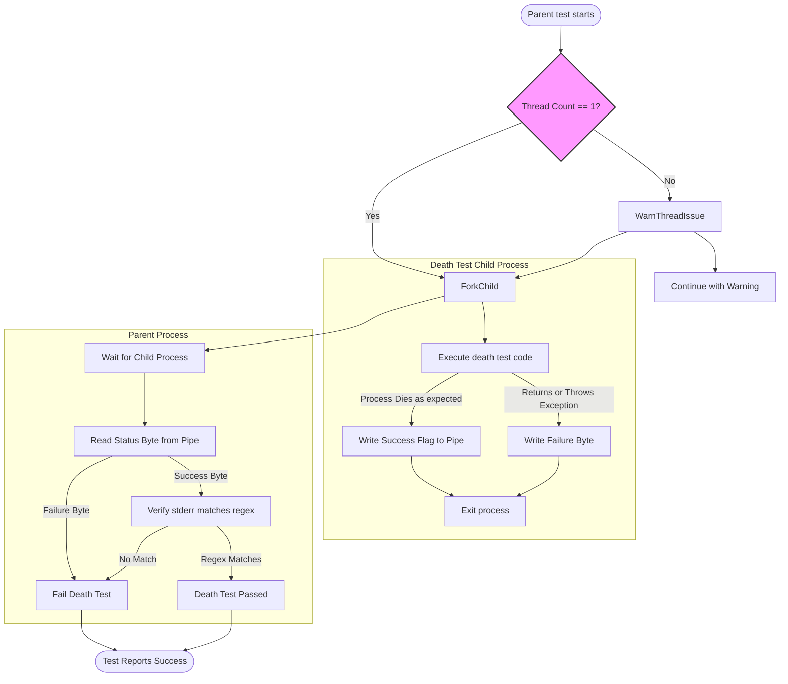

# Death Tests and Fatal Failures

A practical guide to writing and reasoning about death tests—assertions on abnormal process termination—and handling fatal versus non-fatal failures to improve robustness of critical code.

---

## Overview

Death tests enable you to verify that certain code paths terminate your program as expected, typically due to fatal failures such as assertion violations or calls to abort. They are essential when testing error handling, invariants, or security checks that cause a process to exit abnormally.

This guide focuses exclusively on the use and principles of death tests and fatal failures within GoogleTest, helping you understand how to write them correctly, handle edge cases, and avoid common pitfalls.

---

## Prerequisites

- Familiarity with writing basic tests in GoogleTest.
- A working GoogleTest environment (see [Writing Your First Test](https://github.com/google/googletest/blob/main/docs/guides/getting-started/first-test.md)).
- Basic understanding of assertions and test failure types.

---

## Expected Outcome

After reading and applying this guide, you will be able to:

- Write robust death tests with `ASSERT_DEATH`, `EXPECT_DEATH`, `ASSERT_EXIT`, and related macros.
- Understand and differentiate fatal failures from non-fatal failures.
- Handle death tests with multi-threaded code safely.
- Use matchers and predicates effectively to check death test outputs.
- Avoid common errors such as silent failures and illegal return or exceptions in death tests.

---

## Time Estimate

Approximately 20-30 minutes to grasp concepts and write basic death tests.

---

## Difficulty Level

Intermediate: Requires knowledge of testing fundamentals and process control.

---

## Writing Death Tests in GoogleTest

GoogleTest provides macros specifically designed to test if code causes abnormal termination (death). They execute the tested statement in a subprocess, monitor its exit status, and check output delivered to `stderr`.

### Key Macros

| Macro                      | Description                                                                                       |
|----------------------------|-------------------------------------------------------------------------------------------------|
| `ASSERT_DEATH(statement, matcher)` | Fatal assertion: aborts current function if death test fails.                                  |
| `EXPECT_DEATH(statement, matcher)` | Nonfatal assertion: allows continuing test execution if death test fails.                      |
| `ASSERT_EXIT(statement, predicate, matcher)` | Similar to death, but allows specifying precise exit conditions via a predicate.           |
| `EXPECT_EXIT(statement, predicate, matcher)` | Nonfatal variant of `ASSERT_EXIT`.                                                            |
| `ASSERT_DEBUG_DEATH(statement, matcher)` | Like `ASSERT_DEATH` but only asserts in debug builds (`NDEBUG` not defined).                  |
| `EXPECT_DEBUG_DEATH(statement, matcher)` | Like `EXPECT_DEATH` but only asserts in debug builds.                                         |


> **Note:** `matcher` can be a regular expression (regex), a gMock matcher, or a string treated as a regex.

### Simple Example

```cpp
TEST(MyDeathTest, DiesOnInvalidInput) {
  ASSERT_DEATH({
    // Code block that triggers abnormal termination.
    FooFunction(-1);
  }, "Invalid argument"); // Matches output containing "Invalid argument"
}

TEST(MyDeathTest, ExitsSuccessfully) {
  EXPECT_EXIT(NormalExit(), ::testing::ExitedWithCode(0), "Success");
  EXPECT_EXIT(KillProcess(), ::testing::KilledBySignal(SIGKILL), "unblockable signal");
}
```


---

## Understanding Fatal vs Non-fatal Failures

GoogleTest assertions are categorized by their effect upon failure:

- **Fatal failures** (e.g., `ASSERT_*`, `FAIL()`) stop the current test function immediately.
- **Non-fatal failures** (e.g., `EXPECT_*`, `ADD_FAILURE()`) allow the test to continue.

In death tests, you typically want fatal failures to stop the test upon unexpected survival of the test code or mismatched output. Use `ASSERT_*` variants inside death tests when subsequent code depends on the death.

---

## How Death Tests Work Internally

1. **Single Thread Enforcement:** Death tests fork or spawn a child process to safely execute code that should terminate without affecting the parent process.

2. **Two Styles:**
   - **Fast style:** Child runs test code after fork immediately.
   - **Threadsafe style:** Child re-executes the whole binary with flags to run only a single death test. Safer with multi-threaded parents but slower.

3. **Communication:** Parent monitors the child’s exit status and captures `stderr` output.

4. **Verification:** Parent verifies child exited non-zero (or with a defined predicate) and output matches expected regex/matcher.

5. **Abort Reasons:** Death tests fail if child returned normally, threw exceptions, or ran illegal return statements.

> See the [DeathTest API Layer (internal)](https://github.com/google/googletest/blob/main/googletest/include/gtest/gtest-death-test.h) and implementation parts if interested in advanced usage.

---

## Writing Effective Death Tests

### Step 1: Choose the Appropriate Macro

- Use `ASSERT_DEATH` or `EXPECT_DEATH` for testing that code dies with *any* nonzero exit.
- Use `ASSERT_EXIT` or `EXPECT_EXIT` to specify exact exit status conditions.
- Use `ASSERT_DEBUG_DEATH` or `EXPECT_DEBUG_DEATH` to check for death only in debug builds.

### Step 2: Write the Death-inducing Statement

- The statement can be a single function call or a compound block.
- Avoid return statements or exception throws inside the statement as these cause failure.

### Step 3: Specify Output Matcher

- Use a regex string or a gMock matcher to match `stderr` output from the child process.
- String literals are treated as regex with `ContainsRegex` semantics.

### Step 4: Use Predicates in ASSERT_EXIT/EXPECT_EXIT

- Use provided predicates such as `ExitedWithCode(code)` or `KilledBySignal(signal)` to assert the exit reason precisely.

### Example

```cpp
// Checks if dividing by zero triggers assert and outputs "Division by zero".
ASSERT_DEATH(Divide(1, 0), "Division by zero");

// Checks exit with code 42 and output containing "Terminated".
EXPECT_EXIT(ExitWithCode42(), ::testing::ExitedWithCode(42), "Terminated");

// Checks that a SIGSEGV signal kills the process.
EXPECT_EXIT(Crash(), ::testing::KilledBySignal(SIGSEGV), ".*");
```

### Step 5: Run and Debug

- Run tests normally.
- If a death test fails:
  - Make sure your regex matches the actual output.
  - Verify the death test style flag (`--gtest_death_test_style`) is not invalid.
  - Check for multithreading issues or illegal code within death test statements.

---

## Handling Multithreaded Death Tests

Forking a process with multiple running threads is unsafe and may lead to hanging tests.

### Mitigation Strategies

- Use the "threadsafe" death test style:
  ```cpp
  GTEST_FLAG_SET(death_test_style, "threadsafe");
  ```
  This causes the child process to re-execute the test binary with isolated death test execution.

- Name your death test suites with a `DeathTest` suffix to run them early and avoid interference.

- Consider restructuring tests to run death tests single-threaded.

- GoogleTest warns when multiple threads exist during a death test execution.

---

## Common Pitfalls and How to Avoid Them

| Problem                         | Cause                                                       | Solution                                             |
|--------------------------------|-------------------------------------------------------------|------------------------------------------------------|
| Death test failed: process did not die | Death test statement did not terminate; possible returns or exceptions | Avoid `return` and ensure code crashes or calls abort. |
| Wrong or no error output matched | Regex does not reflect actual `stderr` text from child      | Match whole expected output or adjust regex for multiline.|
| Multiple death tests on the same line | Macro expansion conflicts due to multiple ASSERT/EXPECT_DEATH on same line | Place each death test on a separate line.               |
| Leaks detected in death tests   | Objects, especially mocks, not allowed to be leaked but dying early can report leaks | Use `Mock::AllowLeak` to explicitly allow leaks in death tests. |
| Threading warnings or hangs      | Death test forked with multiple threads active               | Use "threadsafe" death test style or minimize threads. |

---

## Advanced Death Tests

### Using Custom Exit Predicates

`EXPECT_EXIT` and `ASSERT_EXIT` provide flexibility by accepting predicates to check exit statuses:

```cpp
EXPECT_EXIT(FunctionUnderTest(), ::testing::ExitedWithCode(0), "Success");
EXPECT_EXIT(FunctionUnderTest(), ::testing::KilledBySignal(SIGABRT), "assert");
```

### Catching Exceptions Escaping Death Tests

GoogleTest considers uncaught exceptions during death tests as failures. If exceptions escape, the macro aborts the test.

Example from test suite:

```cpp
EXPECT_NONFATAL_FAILURE(EXPECT_DEATH(throw 1, ""), "threw an exception");
```

### Debug-Mode Specific Death Tests

`EXPECT_DEBUG_DEATH` behaves differently in debug vs optimized builds:

- In debug (`NDEBUG` undefined), it asserts death.
- In release (`NDEBUG` defined), it just runs the statement without assert.

Useful for testing behaviors that differ in debug mode (e.g., `LOG(DFATAL)`).

### Compound Statements

You can provide multiple statements in braces:

```cpp
EXPECT_DEATH({ Init(); DangerousCall(); }, "error message");
```

---

## Troubleshooting

### Failure: Death test did not die

- Confirm appropriate death-inducing code in your statement.
- Ensure no early `return` or exceptions escape inside the test statement.
- Check that your program under test fails as expected outside test.

### Regex Mismatch

- Check your regular expression syntax (POSIX extended regex or GoogleTest simplified version).
- If multiline, ensure your regex handles newlines correctly.

### Multithreading Issues

- Use `GTEST_FLAG_SET(death_test_style, "threadsafe")`.
- Run tests with minimal threads or isolate death tests in dedicated suites.

### Error Messages Passed to Death Tests

If you see unexpected abort messages or failure reasons, refer to [`DeathTest::LastMessage()`](https://github.com/google/googletest/blob/main/googletest/include/gtest/gtest-death-test.h) to debug.

### Unexpected Exceptions

- If exceptions escape death tests, GoogleTest flags failure.
- Enable `GTEST_FLAG_SET(catch_exceptions, true)` to catch and fail properly.

### Leak Detection in Death Tests

- When Death tests create objects, some frameworks detect leaks due to process termination.
- Use `Mock::AllowLeak` for mock objects that must outlive the death test or are intentionally leaked.

---

## Best Practices and Tips

- **Name your death test suites with the suffix `DeathTest`** to ensure they run early and help detect threading issues.
- **Limit threads running at death test time** to avoid deadlocks.
- **Make regex specific but resilient** to avoid flaky death tests.
- **Avoid using assertions in the death test statement that might cause early returns.**
- **Do not use multiple death test assertions on the same line.**
- **Use `ASSERT_*` macros inside death tests to stop on failure immediately when necessary.**
- **Use `EXPECT_DEBUG_DEATH` to test debug-only failures.**

---

## Reference Links and Further Reading

- [GoogleTest Death Assertions Reference](https://github.com/google/googletest/blob/main/docs/reference/assertions.md#death)
- [GoogleTest Advanced Guide: Death Tests](https://github.com/google/googletest/blob/main/docs/advanced.md#death-tests)
- [Internal DeathTest API](https://github.com/google/googletest/blob/main/googletest/include/gtest/gtest-death-test.h)
- [GoogleTest Primer](https://github.com/google/googletest/blob/main/docs/primer.md)
- [Matchers Reference](https://github.com/google/googletest/blob/main/docs/reference/matchers.md)

---

## Summary

Death tests are a powerful feature in GoogleTest that allow you to verify that your code fails as expected under error conditions that terminate the program. They are implemented via spawning a subprocess, running the death-inducing code safely, capturing output, and checking termination conditions.

By following the best practices in this guide, including appropriate use of death macros, managing threading contexts, and carefully specifying output matchers, your tests will effectively improve the robustness of critical code paths.

---

## Additional Resources

For assistance with related testing concepts, explore the following:

- [Writing Effective Assertions](https://github.com/google/googletest/blob/main/docs/guides/core-workflows/rich-assertions.md)
- [Exception Assertions](https://github.com/google/googletest/blob/main/docs/reference/assertions.md#exceptions)
- [GoogleMock Cookbook](https://google.github.io/googletest/gmock_cook_book.html)
- [Frequently Asked Questions](https://github.com/google/googletest/blob/main/docs/faq.md)

---

## Please Note

The underlying death test implementation depends on platform-specific behaviors and flags such as `--gtest_death_test_style`. Always verify death tests convergence on your target systems, especially concerning threading and subprocess spawning.


<AccordionGroup title="Quick Reference - Death Test Macros">
<Accordion title="EXPECT_DEATH / ASSERT_DEATH">
Use to verify a statement causes abnormal termination with any nonzero exit code and expected stderr message matched by a regex or matcher.

```cpp
EXPECT_DEATH(FunctionThatCrashes(), "expected error message");
ASSERT_DEATH({ CodeBlock(); }, "error regex");
```
</Accordion>
<Accordion title="EXPECT_EXIT / ASSERT_EXIT">
Use when precise exit status verification is required via predicate.

```cpp
EXPECT_EXIT(ExitFunction(), ExitedWithCode(0), "Success");
ASSERT_EXIT(CrashFunction(), KilledBySignal(SIGSEGV), "segfault");
```
</Accordion>
<Accordion title="EXPECT_DEBUG_DEATH / ASSERT_DEBUG_DEATH">
Like death test macros but only enabled in debug builds. No effect in optimized builds.
</Accordion>
</AccordionGroup>

<Tip>
Always run death tests in single-threaded contexts or use the "threadsafe" death test style flag.
</Tip>

<Warning>
Avoid multiple death assertions on the same line; place each on separate lines to prevent compilation errors.
</Warning>

<Note>
Death tests run tested code in subprocesses; side effects (e.g., memory changes) are not reflected in the parent.
</Note>

---

## Code Example: Writing a Death Test

```cpp
// Test ensures FooFunction dies on invalid input with the expected error.
TEST(FooDeathTest, DiesOnInvalidInput) {
  ASSERT_DEATH(FooFunction(-1), "Invalid argument");
}

// Test ensures NormalExit emits "Success" and exits with status 0.
TEST(FooDeathTest, SuccessExit) {
  EXPECT_EXIT(NormalExit(), ::testing::ExitedWithCode(0), "Success");
}

// Test ensures that KillProcess is terminated by SIGKILL and outputs specific info.
TEST(FooDeathTest, KilledBySignal) {
  EXPECT_EXIT(KillProcess(), ::testing::KilledBySignal(SIGKILL), "unblockable signal");
}
```

---

## Diagram: Death Test Execution Flow



---