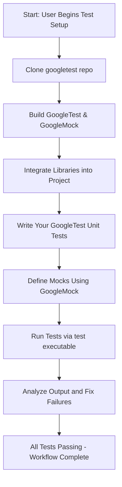

# Getting Started with GoogleTest and GoogleMock

## Workflow Overview

**Task Description:**
This guide provides a clear, step-by-step onboarding process for users to create their first test and mock suite using GoogleTest and GoogleMock. It covers installation essentials, integrating the frameworks into your C++ project, and writing a basic test and mock example to get you up and running quickly.

**Prerequisites:**
- A C++17-compliant compiler and development environment
- Familiarity with basic C++ programming
- CMake installed for build management (recommended)
- Your project source code ready for integration

**Expected Outcome:**
By following this guide, you will have:
- Installed and configured GoogleTest and GoogleMock libraries
- Integrated the testing frameworks into your project build
- Written and successfully executed your first unit test and mock test

**Time Estimate:** Approximately 30-45 minutes

**Difficulty Level:** Beginner to Intermediate

---

## Step-by-Step Instructions

### 1. Install GoogleTest and GoogleMock

GoogleMock is included with GoogleTest and provides mocking capabilities on top of the core testing framework.

1. Clone the repository:

```bash
git clone https://github.com/google/googletest.git -b main
cd googletest
```

2. Create and enter a build directory:

```bash
mkdir build && cd build
```

3. Configure the build with CMake (building both GoogleTest and GoogleMock):

```bash
cmake ..
```

> If you want only GoogleTest without mocks, add `-DBUILD_GMOCK=OFF`.

4. Build the libraries:

```bash
make
```

5. Optionally, install to your system (requires admin privileges):

```bash
sudo make install
```

### 2. Configure Your Project to Use GoogleTest and GoogleMock

Add the necessary include directories and link your test executable against GoogleTest and GoogleMock.

**If using CMake:**

- Add GoogleTest as a subdirectory or use `find_package` if installed.
- Link your test executable with `gtest_main` and `gmock` or `gmock_main`.

Example snippet for CMakeLists.txt:

```cmake
find_package(GTest REQUIRED)

target_link_libraries(your_test_executable PRIVATE GTest::gmock_main GTest::gtest)
```

This way, your tests link to GoogleMock with a pre-defined `main()` (from `gmock_main`) handling test initialization and execution.

### 3. Write Your First Simple GoogleTest Test

Create a C++ source file (e.g., `first_test.cc`) and add a simple test:

```cpp
#include <gtest/gtest.h>

// Basic test to check simple assertions
TEST(FactorialTest, HandlesZeroInput) {
  EXPECT_EQ(1, 1);
}
```

### 4. Write Your First Mock Class and Use GoogleMock

To introduce mocks, you define mock classes that simulate dependencies with `MOCK_METHOD`.

Example:

```cpp
#include <gmock/gmock.h>

class MockDatabase {
public:
  MOCK_METHOD(bool, Connect, (), ());
  MOCK_METHOD(int, GetRecordCount, (), ());
};

TEST(DatabaseTest, ConnectTest) {
  MockDatabase mock_db;

  EXPECT_CALL(mock_db, Connect())
      .Times(1)
      .WillOnce(::testing::Return(true));

  bool connected = mock_db.Connect();
  EXPECT_TRUE(connected);
}
```

### 5. Run Your Tests

If you linked your test executable against `gmock_main` or `gtest_main` library, simply executing the test binary runs all tests.

```bash
./your_test_executable
```

Expected output includes a summary with information on tests run and passed.

---

## Practical Tips & Best Practices

- **Use `gmock_main` for simplicity:** it provides a ready-made `main()` function initializing GoogleMock and GoogleTest.
- **Isolate dependencies:** design your mocks to replace external or complex systems, allowing fast and predictable tests.
- **Control mock strictness:** explore `NiceMock`, `NaggyMock`, and `StrictMock` to regulate uninteresting call behaviors.
- **Use matchers and expectations deliberately:** this sharpens your test's intention and makes test failures informative.
- **Integrate mocks gradually:** first write simple tests, then introduce mocks as dependencies become apparent.

---

## Troubleshooting & Common Issues

<AccordionGroup title="Troubleshooting Common Issues">
<Accordion title="Build Errors Linking gmock or gtest">
Verify your project links correctly against GoogleMock and GoogleTest libraries. Ensure your linker paths and library names (`-lgmock_main` or `-lgtest_main`) are correctly included. Use verbose build logs to diagnose.
</Accordion>
<Accordion title="Unexpected or Unmatched Mock Calls">
Check whether your `EXPECT_CALL` expectations cover all mock method calls. Unmatched calls usually indicate missing expectations or incorrect matchers.
</Accordion>
<Accordion title="Verbose Logging to Debug Tests">
Set the environment variable or flag `--gmock_verbose=info` to get detailed logs during test execution.

```bash
./your_test_executable --gmock_verbose=info
```
</Accordion>
<Accordion title="Failing to Initialize GoogleMock">
Ensure you call `testing::InitGoogleMock(&argc, argv);` or link with `gmock_main` to initialize the testing framework properly.
</Accordion>
</AccordionGroup>

---

## Next Steps & Related Content

- Explore [Writing and Running Unit Tests](/guides/core-workflows/writing-tests) to deepen your testing skills.
- Learn about advanced [Using Mocks for Dependency Isolation](/guides/core-workflows/using-mocks) patterns.
- Review the [Mocking Reference](../docs/reference/mocking.md) for detailed syntax and examples of mocking macros.
- Investigate [Troubleshooting Common Setup Issues](/getting-started/troubleshooting-validation/common-setup-issues) to resolve integration challenges.
- Advance to [Assertions and Matchers in Practice](/guides/core-workflows/assertions-matchers) to write expressive tests.

---

## Diagram: GoogleTest and GoogleMock Integration Workflow



---

For detailed examples and expanded tutorials, visit the [GoogleTest Primer](../getting-started/first-test-workflow/writing-your-first-test.md) and the [gMock for Dummies](https://google.github.io/googletest/gmock_for_dummies.html).

---

## Useful Code Snippet: main() with GoogleMock

If you need a main entry point yourself instead of linking `gmock_main`, use the following boilerplate:

```cpp
#include "gmock/gmock.h"
#include "gtest/gtest.h"

int main(int argc, char** argv) {
  // Initializes Google Mock and Google Test.
  testing::InitGoogleMock(&argc, argv);
  return RUN_ALL_TESTS();
}
```

This ensures correct initialization and execution of all your tests and mocks.

---

## References

- [GoogleTest Primer](../getting-started/first-test-workflow/writing-your-first-test.md)
- [Mocking Reference](../docs/reference/mocking.md)
- [gMock for Dummies](https://google.github.io/googletest/gmock_for_dummies.html)
- [Installation and Setup](../getting-started/installation-prerequisites/installation-methods.md)
- [Troubleshooting Common Setup Issues](../getting-started/troubleshooting-validation/common-setup-issues.md)


