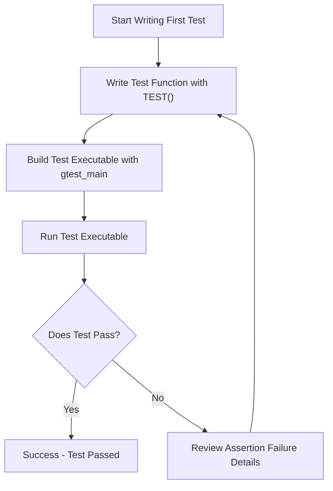

# Getting Started: Writing and Running Your First Test

Welcome to your practical introduction to writing your first test in C++ using GoogleTest. This quick-start guide is designed specifically for users new to GoogleTest or those seeking a fast, effective way to write, run, and verify a simple test. You will learn how to set up the framework, write basic assertions, and execute your test using the provided test runners.

---

## 1. Workflow Overview

### What This Guide Will Help You Accomplish
This guide walks you through the essential steps to create a basic C++ test case with GoogleTest, run it, and observe the results. You will learn to:

- Set up your test environment with the minimum includes and setup
- Write a simple test function using the GoogleTest macro
- Run the test with the default test runner
- Understand test outcomes and interpret test output

### Prerequisites

Before you begin, ensure the following:

- GoogleTest and GoogleMock are installed and properly set up in your build environment.
- You are familiar with compiling and running C++ programs.
- Your codebase supports C++17 or later, as required by GoogleTest.
- Your build system links against the `gtest_main` or equivalent test runner.

### Expected Outcome

By following this guide, you will have:

- A minimal test file that compiles and runs successfully.
- An understanding of how to write a test using `TEST()`.
- Knowledge on how to interpret the test runner output.
- Confidence to create more complex tests or add mocks later.

### Estimated Time & Difficulty

- **Time**: Approximately 10–15 minutes.
- **Difficulty**: Beginner.

---

## 2. Step-by-Step Instructions

These instructions are self-contained and sequential—each step builds on the one before it.

### Step 1: Create a New Test File

- Create a new `.cc` file, for example `my_first_test.cc`.
- Include the necessary GoogleTest headers.

```cpp
#include <gtest/gtest.h>
```

### Step 2: Write Your First Test Case

- Use the `TEST` macro to declare a test function.
- The `TEST` macro takes two arguments: a test suite name and a test name.
- Inside the test body, write at least one assertion.

```cpp
TEST(SimpleTest, AdditionWorks) {
  int sum = 2 + 3;
  EXPECT_EQ(sum, 5);  // Checks that sum == 5
}
```

<Info>
The `EXPECT_EQ` macro asserts equality but continues execution if it fails. Use `ASSERT_EQ` for critical failures that should abort the test immediately.
</Info>

### Step 3: Build Your Test Executable

- Make sure to compile and link your test file with GoogleTest libraries.
- Commonly, link with `gtest_main` to include a main function automatically.

Example using `g++`:

```bash
g++ -std=c++17 my_first_test.cc -lgtest -lgtest_main -pthread -o my_first_test
```

### Step 4: Run Your Test Binary

- Execute your test binary from the command line:

```bash
./my_first_test
```

- Observe the output indicating which tests passed or failed.

Sample output:

```
Running main() from gmock_main.cc
[==========] Running 1 test from 1 test suite.
[----------] Global test environment set-up.
[----------] 1 test from SimpleTest
[ RUN      ] SimpleTest.AdditionWorks
[       OK ] SimpleTest.AdditionWorks (0 ms)
[----------] 1 test from SimpleTest (0 ms total)
[----------] Global test environment tear-down
[==========] 1 test from 1 test suite ran. (0 ms total)
[  PASSED  ] 1 test.
```

### Step 5: Verify and Interpret Results

- If all tests pass, your setup and test writing are correct.
- If any test fails, the output will detail which assertion failed, file and line number, and expected vs actual values.
- Use this feedback to debug your test or production code.

<Note>
You can enhance the test with more assertions or test suites. For real-world scenarios, tests will be organized into suites reflecting your code modules.
</Note>

---

## 3. Examples & Real Scenarios

### Example 1: A Simple Passing Test

```cpp
#include <gtest/gtest.h>

TEST(MathTest, SimpleMultiplication) {
  int result = 6 * 7;
  EXPECT_EQ(result, 42);
}
```

When run, this test confirms the correctness of a simple multiplication operation.

### Example 2: A Failing Test

```cpp
TEST(StringTest, Concatenation) {
  std::string s = "Hello" + std::string(" World");
  EXPECT_EQ(s, "Hello World!");  // Intentional mistake to show failure
}
```

Failing output will point to the exact assertion failure with clear explanation.

---

## 4. Troubleshooting & Tips

### Common Issues

- **Tests not discovered or run**: Verify your main function initialization. Linking with `gtest_main` provides `main()` automatically; if not, ensure that you call `::testing::InitGoogleTest(&argc, argv);` in your main.
- **Linker errors**: Confirm your project links to GoogleTest (`-lgtest`) and pthread (`-pthread`) libraries.
- **Assertion failures**: Check correctness of your assertions and logic.
- **Unrecognized macros**: Make sure your include path contains the GoogleTest headers.

### Best Practices

- Always name your test suites and tests descriptively.
- Keep tests small and focused on one behavior.
- Use `EXPECT_*` assertions for non-fatal failures allowing multiple checks per test.
- Use `ASSERT_*` for fatal checks where proceeding would be meaningless.

### Performance Considerations

- For large projects, compile tests with optimizations and split test files logically.
- Use the test runner flags to filter and run subsets of relevant tests.

### Alternative Approaches

- Use test fixtures (`TEST_F`) to share setup across multiple tests.
- Extend tests with mocks using GoogleMock for interaction-based testing.

---

## 5. Next Steps & Related Content

### What's Next

- Explore [Writing Your First Test Case](../getting-started/first-test-experience/writing-your-first-test.md) for more detailed examples and idioms.
- Learn how to [Build and Run Your Test Suite](../getting-started/first-test-experience/building-and-running-tests.md) with custom runners and multiple files.
- Integrate mocks and explore advanced mocking patterns in [Mocking for Dummies](../gmock_for_dummies.md) and the [gMock Cookbook](../gmock_cook_book.md).

### Related Guides

- [Troubleshooting and Common Setup Issues](../getting-started/first-test-experience/troubleshooting-and-validation.md)
- [Using Assertions Effectively](../guides/core-workflows/using-assertions.md)
- [Structuring Test Cases and Test Suites](../guides/core-workflows/structuring-tests.md)

### Resources

- Official GoogleTest documentation: [https://github.com/google/googletest](https://github.com/google/googletest)
- Online tutorials and examples linked from the GoogleTest README.

---

### Summary Diagram of the First-Test Workflow



This flow summarizes the iterative nature of writing and running your first tests.

---