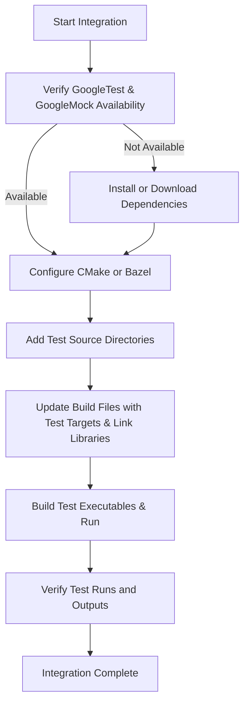

# Integrating Tests into Your Build System

Integrating GoogleTest and GoogleMock into your existing C++ project enables automated test execution, continuous integration, and efficient dependency management. This guide walks you through practical steps for adding these testing frameworks to your build system, focusing on CMake and Bazel configurations, structuring test directories, and best practices for CI pipeline integration.

---

## 1. Integration Workflow Overview

### What You Will Achieve
This guide helps you seamlessly add GoogleTest and GoogleMock to your project’s build process, enabling you to compile, run, and verify unit tests alongside your application code.

### Prerequisites
- GoogleTest and GoogleMock sources are available or installed.
- Familiarity with your project's build system (CMake or Bazel).
- Your project compiles successfully before integration.

### Expected Outcome
- GoogleTest and GoogleMock are linked properly in your test binaries.
- Test discovery and execution are enabled.
- Test code is organized for maintainability and ease of use.

### Time Estimate
Approximately 30 to 60 minutes depending on project complexity.

### Difficulty Level
Intermediate – requires understanding of C++ build tools and linking.

---

## 2. Step-by-Step Integration Instructions

### 2.1 Integrating with CMake

#### 2.1.1 Prepare Your Environment
1. **Add GoogleTest and GoogleMock as dependencies**
   - Either include them as external projects or install and find them on your system.
   - For installing, follow [Installation Instructions](/getting-started/prerequisites-installation/installation-instructions).

#### 2.1.2 Structuring Test Files and Directories
- Place your test sources in a dedicated directory, e.g., `tests/`.
- Separate test code from application source code to avoid mixing.

#### 2.1.3 Modify Your `CMakeLists.txt`
- Example minimal additions for GoogleTest and GoogleMock:

```cmake
# Add test directory
enable_testing()

# Find or add GoogleTest
find_package(GTest REQUIRED)

# Add test executable
add_executable(my_tests
    tests/my_test.cc
    # Add other test sources
)

# Link against GoogleTest and GoogleMock libraries
# If GoogleMock is bundled with GoogleTest, linking GTest::gmock is sufficient
target_link_libraries(my_tests PRIVATE GTest::gmock_main)

# Automatic test discovery
include(GoogleTest)
gtest_discover_tests(my_tests)
```

- Alternatively, if building GoogleTest/GMock from source, use `add_subdirectory()` and link to the targets you create.

#### 2.1.4 Verify Setup
- Run CMake configure and build your tests.
- Execute tests with `ctest` or directly run the test executable.


### 2.2 Integrating with Bazel

#### 2.2.1 Add GoogleTest and GoogleMock as Dependencies
- Include them in your `WORKSPACE` using `http_archive` or as local repositories.
- See [Supported Platforms & Integration](/overview/architecture-features-integration/platforms-and-integration) for detailed examples.

#### 2.2.2 Define Test Targets in BUILD Files
- Example for a test target:

```python
cc_test(
    name = "my_tests",
    srcs = ["my_test.cc"],
    deps = ["@com_google_googletest//:gmock_main"],
)
```

- Link against `:gmock_main` to get both GoogleTest and GoogleMock.

#### 2.2.3 Run Tests
- Use `bazel test //path/to:my_tests`.

---

## 3. Best Practices for Build System Integration

### Organizing Your Tests
- Use descriptive directory names like `tests`, `unittests`, or `mocks`.
- Reflect your source tree structure to simplify locating tests.

### Managing Third-Party Dependencies
- Use dependency fetching mechanisms (`ExternalProject_Add` for CMake, `http_archive` for Bazel) to ensure reproducible builds.
- Avoid embedding GoogleTest and GoogleMock sources in your repo unless necessary.

### CI Pipeline Integration
- Configure your CI to build tests and run `ctest` or `bazel test` commands.
- Capture test results in formats your CI supports (e.g., JUnit XML).

### Versioning
- Synchronize GoogleTest and GoogleMock versions to avoid compatibility issues.

### Incremental Adoption
- Integrate tests incrementally by starting with critical modules.
- Gradually expand coverage to the entire codebase.

---

## 4. Troubleshooting and Tips

### Common Issues

- **Linker errors or missing symbols**
  - Verify that you are linking with both GoogleTest and GoogleMock libraries.
  - Double-check CMake `target_link_libraries` or Bazel `deps`.

- **Tests not discovered or running**
  - Ensure test executables are registered with test runners.
  - For CMake, use `gtest_discover_tests()` properly.

- **Conflicts with existing build configurations**
  - Keep your test code isolated in dedicated targets and directories.
  - Avoid mixing test and production code in the same target.

### Expert Tips

- Use **`GTest::gmock_main`** target in CMake, which automatically sets up main() for test executables.
- In Bazel, `@com_google_googletest//:gmock_main` does the same.
- Avoid over-specifying expectations in tests; focus on relevant workflows.
- Encapsulate mocking configurations in reusable CMake modules or Bazel macros.

---

## 5. Next Steps and Related Documentation

- **Writing Your First Unit Tests** to start authoring tests after integration:  [/guides/core-workflows/authoring-unit-tests](https://google.github.io/googletest/guides/core-workflows/authoring-unit-tests.html)
- **Using Mocks** to understand mocking dependencies with GoogleMock: [/guides/core-workflows/using-mocks](https://google.github.io/googletest/guides/core-workflows/using-mocks.html)
- **Project Configuration** if you need help configuring complex projects: [/getting-started/configuration-initial-run/project-setup](https://google.github.io/googletest/getting-started/configuration-initial-run/project-setup.html)
- **Troubleshooting Installation & Configuration** for common integration problems: [/getting-started/troubleshooting-common-issues/common-setup-issues](https://google.github.io/googletest/getting-started/troubleshooting-common-issues/common-setup-issues.html)

For advanced patterns like parameterized tests and custom matchers, consult the [Advanced Usage & Patterns](https://google.github.io/googletest/guides/advanced-usage-patterns/parameterized-and-type-tests.html).

---

## Summary Diagram



---

<Tip>
Integrate GoogleTest and GoogleMock early in your project cycle for smoother development and continuous testing. Keep your test code organized and isolated, and rely on build system native capabilities like CMake's `gtest_discover_tests` or Bazel's test rules.
</Tip>

<Note>
For complex projects, consider modularizing GoogleTest/GMock integration steps into reusable CMake scripts or Bazel macros to maintain clean and maintainable build configurations.
</Note>

---

### Code Snippet for Minimal CMakeLists.txt Addition

```cmake
cmake_minimum_required(VERSION 3.10)
project(MyProject)

# Enable testing
enable_testing()

# Find GoogleTest package
find_package(GTest REQUIRED)

# Add test executable
add_executable(my_tests tests/my_tests.cpp)

# Link with GoogleTest and GoogleMock
target_link_libraries(my_tests PRIVATE GTest::gmock_main)

# Enable test discovery
include(GoogleTest)
gtest_discover_tests(my_tests)
```

### Bazel BUILD file example snippet

```python
cc_test(
    name = "my_tests",
    srcs = ["my_tests.cc"],
    deps = ["@com_google_googletest//:gmock_main"],
)
```

---

## Summary

Integrating GoogleTest and GoogleMock into your build system is essential for creating automated, maintainable, and reliable C++ test suites. This guide delivers practical instructions on setting up tests with CMake and Bazel, organizing test sources, and linking dependencies effectively. Troubleshooting tips and best practices ensure smooth operation and optimal developer experience.

---