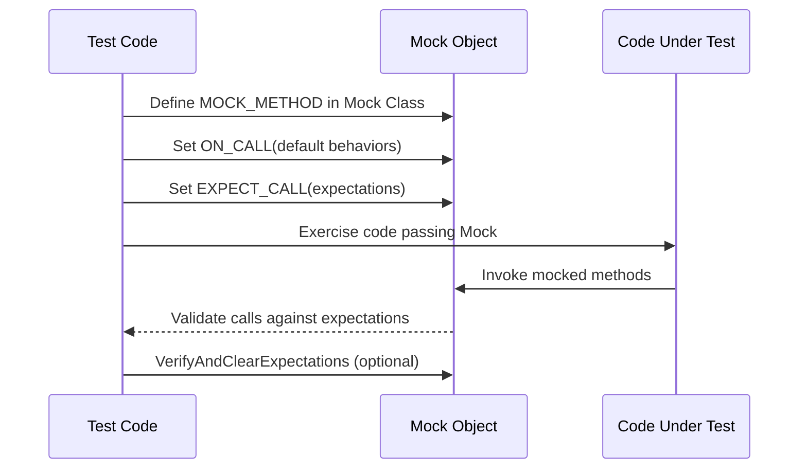

# Mocking Dependencies with GoogleMock

This guide walks you through defining mock classes, setting expectations on mock methods, and verifying interactions using GoogleMock. You will learn key macros such as `MOCK_METHOD`, how to express common usage patterns, and effectively isolate units for testing by using mocks.

---

## 1. Introduction

GoogleMock (gMock) enables you to create mock classes easily in C++ to simulate and verify dependencies of the units under test. This page focuses specifically on how to:

- Define mock classes using `MOCK_METHOD` macros
- Set expectations with `EXPECT_CALL`
- Control mock behaviors with default actions (`ON_CALL`)
- Verify interaction order, frequency, and argument matching

By mastering these, you can isolate your tests from external dependencies and focus precisely on the interactions that matter.

---

## 2. Prerequisites

Before starting:

- Have a C++ project set up with GoogleTest and GoogleMock included
- Include the GoogleMock header in your test files via `#include <gmock/gmock.h>`
- Understand basic C++ class inheritance and virtual functions
- Read the [gMock for Dummies](https://google.github.io/googletest/gmock_for_dummies.html) for a beginner-friendly foundation


---

## 3. Defining Mock Classes

Mock classes simulate interfaces or abstract classes your code interacts with. Use `MOCK_METHOD` macros inside a class deriving from the interface.

### 3.1 Basic Syntax for MOCK_METHOD

```cpp
class MockFoo : public Foo {
 public:
  // MOCK_METHOD(return_type, method_name, (argument_types), (optional_specs));
  MOCK_METHOD(int, GetSize, (), (const, override));
  MOCK_METHOD(void, DoSomething, (int value), (override));
};
```

- Place `MOCK_METHOD` macros in the `public:` section, regardless of original method visibility
- If the method is `const`, add `(const)` to the spec list
- Add `(override)` for virtual overrides, recommended for clarity


### 3.2 Handling Commas in Types

If your return or argument types contain commas (e.g. template types), surround the entire type with parentheses or use a type alias:

```cpp
// Using parentheses
MOCK_METHOD((std::pair<bool, int>), GetPair, ());

// Using type alias
using BoolInt = std::pair<bool, int>;
MOCK_METHOD(BoolInt, GetPair, ());
```


### 3.3 Mocking Overloaded Methods

Define all overloaded variants explicitly with correct signatures:

```cpp
MOCK_METHOD(int, Add, (int x), (override));
MOCK_METHOD(int, Add, (int times, int x), (override));
```

If not mocking some overloads, bring others into scope with `using` to avoid hiding base class methods.


### 3.4 Mocking Class Templates

Mock templates like any other classes:

```cpp
template <typename T>
class MockStack : public StackInterface<T> {
 public:
  MOCK_METHOD(int, GetSize, (), (const, override));
  MOCK_METHOD(void, Push, (const T& x), (override));
};
```


### 3.5 Mocking Non-Virtual Methods

More advanced use case where non-virtual methods are mocked without inheritance by providing matching methods in the mock class.


---

## 4. Setting Expectations on Mock Methods

Expectations define which mock method calls you expect, with which arguments, how many times, and what behavior to exhibit.

### 4.1 `EXPECT_CALL` Syntax

```cpp
EXPECT_CALL(mock_object, Method(matchers...))
    .Times(cardinality)
    .WillOnce(action)
    .WillRepeatedly(action);
```

- `mock_object`: instance of the mock
- `Method`: mocked method name
- `matchers`: argument matchers, or omit for any arguments (only if method is not overloaded)
- Modifiers like `Times()`, `WillOnce()`, and `WillRepeatedly()` define invocation counts and behaviors


### 4.2 Argument Matching

- Use exact values: `EXPECT_CALL(foo, Bar(5))`
- Use matchers when partial matching needed, e.g. `_` (anything), `Ge(5)` (>= 5), `NotNull()`, custom predicates


### 4.3 Cardinalities With `Times()`

Control expected number of calls:

| Cardinality           | Meaning                                   |
|----------------------|-------------------------------------------|
| `Times(1)` (default) | Expect exactly 1 call                     |
| `AnyNumber()`         | Any number of calls allowed               |
| `AtLeast(n)`          | At least `n` calls                        |
| `AtMost(n)`           | At most `n` calls                         |
| `Between(m, n)`       | Between `m` and `n` calls inclusive      |
| `Times(0)`            | The method must not be called             |


### 4.4 Controlling Behavior: `WillOnce` and `WillRepeatedly`

- `WillOnce(action)`: specifies action for a single call, can chain multiple in order
- `WillRepeatedly(action)`: action for all calls after `WillOnce` actions

Example:

```cpp
EXPECT_CALL(mock, GetValue())
    .WillOnce(Return(1))
    .WillOnce(Return(2))
    .WillRepeatedly(Return(3));
```


### 4.5 Default Actions with `ON_CALL`

Differentiate default behavior (`ON_CALL`) from expected calls (`EXPECT_CALL`):

- `ON_CALL(mock_object, Method(matchers...)).WillByDefault(action);` sets default behavior if no matching `EXPECT_CALL`
- Use `ON_CALL` to provide default return values/behaviors without enforcing call expectations


### 4.6 Chaining Clauses for Complex Expectations

Following modifiers can be chained after `EXPECT_CALL` in order:

- `.With(multi_arg_matcher)`: entire set of arguments matched as a tuple
- `.Times(cardinality)`: number of expected calls
- `.InSequence(sequences...)`: impose call order
- `.After(expectations...)`: call must occur after preceding expectations
- `.WillOnce(action)`: action for first matching call
- `.WillRepeatedly(action)`: action for all subsequent calls
- `.RetiresOnSaturation()`: retire expectation after sufficient calls


### 4.7 Ordering Calls

Use `InSequence` or `Sequence` to specify expected call order.

```cpp
{
  InSequence s;
  EXPECT_CALL(mock, Start());
  EXPECT_CALL(mock, Stop());
}
```


---

## 5. Verifying Mocks

- gMock verifies that all expected calls were made when the mock object is destructed
- You can explicitly verify and clear expectations early via:

```cpp
Mock::VerifyAndClearExpectations(&mock_object);
Mock::VerifyAndClear(&mock_object);  // also clears default actions
```

- Avoid setting new expectations on a mock after verification to prevent undefined behavior

---

## 6. Examples

### 6.1 Defining and Using a Mock Class

```cpp
#include <gmock/gmock.h>

class Turtle {
 public:
  virtual ~Turtle() {}
  virtual void PenUp() = 0;
  virtual void PenDown() = 0;
  virtual void Forward(int distance) = 0;
  virtual int GetX() const = 0;
};

class MockTurtle : public Turtle {
 public:
  MOCK_METHOD(void, PenUp, (), (override));
  MOCK_METHOD(void, PenDown, (), (override));
  MOCK_METHOD(void, Forward, (int distance), (override));
  MOCK_METHOD(int, GetX, (), (const, override));
};

TEST(PainterTest, CanDrawLine) {
  MockTurtle turtle;

  EXPECT_CALL(turtle, PenDown()).Times(1);
  EXPECT_CALL(turtle, Forward(100)).Times(1);

  // Exercise code that uses turtle
  // e.g. painter.DrawLine(&turtle);
}
```


### 6.2 Setting Default Behavior with ON_CALL

```cpp
ON_CALL(turtle, GetX()).WillByDefault(Return(0));
```


### 6.3 Expecting Calls with Argument Matchers and Return Values

```cpp
EXPECT_CALL(mockService, ProcessData(Ge(10)))
    .Times(AtLeast(1))
    .WillRepeatedly(Return(true));
```


### 6.4 Sequence and Ordering

```cpp
Sequence s1, s2;
EXPECT_CALL(mockA, Init()).InSequence(s1);
EXPECT_CALL(mockB, Start()).InSequence(s1, s2);
EXPECT_CALL(mockB, Stop()).InSequence(s2);
```


---

## 7. Troubleshooting & Tips

### 7.1 Common Issues

- **Uninteresting calls warnings**: Use `NiceMock` to suppress or add fallback `EXPECT_CALL(...).Times(AnyNumber())`
- **Unexpected calls errors**: Verify if your test missed an expected call or arguments don't match
- **Order mismatch**: If tests fail due to call order, use sequences or `.After()` to relax or force order
- **Mock class doesn't intercept method calls**: Ensure mocked methods are virtual

### 7.2 Best Practices

- Always place `EXPECT_CALL` before exercising the code that exercises the mock
- Limit `EXPECT_CALL`s to the interactions important for the test's intent
- Use `ON_CALL` to set reasonable default behaviors and reduce brittle tests
- Prefer `NiceMock` when uninteresting calls are not errors to reduce maintenance overhead

### 7.3 Performance Considerations

- Move mock class constructor and destructor definitions to `.cc` files to speed compilation when mocking many methods

### 7.4 Advanced Usage

- Delegate to a fake or real object for mix of behavior and verification
- Use `RetiresOnSaturation` to retire saturated expectations, especially in ordered call sequences

---

## 8. Next Steps & Related Content

- Explore [gMock for Dummies](https://google.github.io/googletest/gmock_for_dummies.html) for beginner tutorials
- Use the [Matchers Reference](../matchers-actions/matchers-reference) to learn about argument matching
- Learn advanced [Expectations and Cardinalities](../mocking/expectations) for flexible verification
- Consult [Nice, Naggy and Strict mocks](../mocking/nice-strict-mocks) for controlling strictness and warnings
- Progress to writing your first test with mocks using [Writing and Running Your First Test](../core-workflows/getting-started-tests)

---

## References

- Official source and detailed API: [GoogleTest GitHub](https://github.com/google/googletest)
- gMock Cookbook for advanced recipes: [gmock_cook_book.md](https://google.github.io/googletest/gmock_cook_book.html)
- [Mock Method Macros Reference](../mocking/mock-methods)
- [Setting Expectations & Cardinalities](../mocking/expectations)

---

## Summary Diagram: Mocking Workflow



