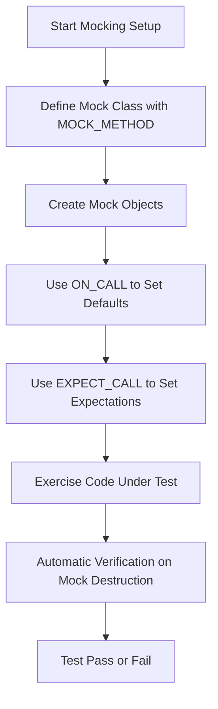

# Mocking with GoogleMock

This guide provides a practical walkthrough on effectively using GoogleMock (gMock) to simulate dependencies in your C++ code. It covers creating mock classes, specifying expectations and default behaviors, managing call strictness, and verifying interactions. Additionally, it offers tips on transitioning from legacy mock macros.

---

## Introduction

GoogleMock is a powerful C++ framework designed to simplify the creation and utilization of mock classes for unit testing. It helps you specify how your mocks should behave, verify interactions, and manage the complexity of mocking various class and method types.

By learning to use gMock to its full potential, you gain fine-grained control over your test doubles and can write tests that are resilient, readable, and maintainable.

---

## 1. Creating Mock Classes

### Defining Mock Methods

To mock virtual methods in your class, declare your mock class deriving from the interface or base class. Use the `MOCK_METHOD` macro in the **public** section of your mock class to generate mockable methods:

```cpp
class MockClass : public RealClass {
 public:
  MOCK_METHOD(ReturnType, MethodName, (ArgTypes...), (Specs));
};
```

- `ReturnType`: The type your method returns
- `MethodName`: The exact method name
- `(ArgTypes...)`: Arguments as a comma-separated list inside parentheses
- `(Specs)`: Optional qualifiers such as `const`, `override`, `noexcept`, or call type specifiers

**Example:**

```cpp
class MockTurtle : public Turtle {
 public:
  MOCK_METHOD(void, PenUp, (), (override));
  MOCK_METHOD(void, Forward, (int distance), (override));
  MOCK_METHOD(int, GetX, (), (const, override));
};
```

### Handling Commas in Template Arguments

If return types or argument types include commas (e.g., template specializations), wrap them in extra parentheses or create type aliases to prevent macro parsing errors:

```cpp
using BoolAndInt = std::pair<bool, int>;
MOCK_METHOD(BoolAndInt, GetPair, ());

MOCK_METHOD(bool, CheckMap, ((std::map<int, double>), bool));
```

### Mocking Non-public Methods

Always declare mock methods in the **public** section, even if the base method is protected or private. This allows the mocking framework to intercept calls properly.

### Mocking Overloaded Methods

Mock each overload separately using `MOCK_METHOD`. If you omit some overloads, use `using BaseClass::MethodName;` in your mock to avoid hiding base methods:

```cpp
class MockFoo : public Foo {
 public:
  using Foo::Add;  // bring in unmocked overload
  MOCK_METHOD(int, Add, (Element x), (override));
  MOCK_METHOD(int, Add, (int times, Element x), (override));
};
```

### Mocking Templates

You can mock class templates similarly, specializing the mock class template:

```cpp
template <typename Elem>
class MockStack : public StackInterface<Elem> {
 public:
  MOCK_METHOD(int, GetSize, (), (const, override));
  MOCK_METHOD(void, Push, (const Elem& x), (override));
};
```

---

## 2. Setting Expectations and Default Actions

### EXPECT_CALL

The primary means to specify what calls you expect on your mocks is via `EXPECT_CALL()`. It sets both an expectation and a behavior (action) optionally.

```cpp
EXPECT_CALL(mock_object, Method(Matchers...))
    .Times(cardinality)
    .WillOnce(action)
    .WillRepeatedly(action);
```

- **Matchers** specify argument constraints (e.g., `_` for anything, `Eq(value)` for exact match).
- **Times** controls how many times the call is expected.
- **WillOnce** defines the behavior for a single invocation.
- **WillRepeatedly** defines the behavior for all subsequent invocations after `WillOnce`-s are used.

### ON_CALL

Use `ON_CALL()` to specify default behavior without setting call count expectations:

```cpp
ON_CALL(mock_object, Method(Matchers...))
    .WillByDefault(action);
```

This controls behavior for calls without expectations or for subsequent calls once `WillOnce` actions are exhausted.

### Best Practices for Expectations

- Use **ON_CALL** to set defaults shared by tests.
- Use **EXPECT_CALL** for expectations you want to verify were met.
- Avoid overly strict expectations; verify only what matters to your test’s intent.
- Ordering of expectations matters—more specific expectations should come after generic ones.

### Using Sequences and Ordering

To impose strict order on calls, group expectations with `InSequence`:

```cpp
{
  InSequence s;
  EXPECT_CALL(mock, FirstCall());
  EXPECT_CALL(mock, SecondCall());
}
```

You may also specify more complex partial orders with `After()` clause or multiple sequences.

### Handling Uninteresting Calls

- If your test does not set expectations on a method but calls it, gMock reports a *warning* by default (naggy mock behavior).
- Use `NiceMock<MockType>` to suppress such warnings for uninteresting calls.
- Use `StrictMock<MockType>` to treat uninteresting calls as errors.

**Note:** These wrappers only affect directly defined mock methods.

---

## 3. Mock Behavior and Actions

### Returning Values

- Use `Return(value)` to specify return results.
- Use `ReturnRef(variable)` for reference-returning methods.
- Use `ReturnPointee(pointer)` to return the live value pointed to.

### Defining Multiple Actions

Specify a sequence of behaviors with multiple `WillOnce()` clauses followed optionally by a `WillRepeatedly()` clause.

### Mocking Side Effects

Use helpers like `SetArgPointee<N>(value)` to set output arguments, optionally combined with return values via `DoAll()`.

Example:

```cpp
EXPECT_CALL(mock, Mutate(_, _))
    .WillOnce(DoAll(SetArgPointee<1>(5), Return(true)));
```

### Invoking Callbacks

You can invoke function or functor arguments passed into mocks using `Invoke()`, `InvokeWithoutArgs()`, or `InvokeArgument<N>(args...)`.

### Ignoring the Return Value

Use `IgnoreResult()` to apply an action but discard its return value when needed.

---

## 4. Advanced Mock Management

### Delegating Calls

- To a **fake** implementation: delegate calls to a real fake implementation inside your mock methods using `ON_CALL` with a lambda.
- To a **real** object: use similar delegation pattern to ensure production behavior is used while verifying calls.
- To a **parent class** method: call the parent class method explicitly within a lambda to keep original behavior.

### Mocking Non-virtual and Free Functions

- Non-virtual functions can be mocked with unrelated mock classes and template injection for compile-time selection.
- Free functions require wrapping in interfaces or using function objects with `MockFunction`.

### Legacy and Migration

- Old `MOCK_METHODn` macros are still supported but `MOCK_METHOD` is recommended.
- Use `StrictMock`, `NiceMock` wrappers for controlling call strictness.

### Performance Tips

- Move mock class constructor/destructor definitions to `.cc` files to improve compilation speed for large mocks.

### Verifying and Resetting Mocks

- Mocks automatically verify expectations on destruction.
- Explicitly verify earlier with:

```cpp
Mock::VerifyAndClearExpectations(&mock_obj);
Mock::VerifyAndClear(&mock_obj);  // Also clears default actions
```

- Do not set further expectations after verification.

---

## 5. Troubleshooting & Tips

### Common Issues

- **Uninteresting call warnings:** Use `NiceMock` or add a catch-all `EXPECT_CALL(...).Times(AnyNumber())`.
- **Unexpected calls:** Ensure `EXPECT_CALL`s are set properly with matchers covering expected arguments.
- **Ordering failures:** Use `InSequence` or `After` clauses to manage call order.
- **Mock objects not deleted:** Use heap checker or `Mock::AllowLeak()`.
- **Build time too long:** Refactor constructor/destructor of mock classes.

### Best Practices

- Limit expectations to what matters;
- Use `ON_CALL` for default behaviors,
- Group related expectations with sequences,
- Favor `NiceMock` unless debugging warnings.

### Useful Flags

- Verbosity: `--gmock_verbose=info|warning|error` controls message verbosity
- Leak detection: `--gmock_catch_leaked_mocks=1` to detect leaked mocks

---

## 6. Next Steps & Related Content

- Review the [gMock Cookbook](gmock_cook_book.md) for recipes and deeper examples.
- Explore [Using Advanced Matchers](guides/core-workflows/using-matchers.md) for flexible argument matching.
- Refer to [Creating Custom Actions and Matchers](guides/advanced-practices/writing-custom-actions.md) to extend gMock.
- For integration, see [Integration with Development Pipelines](overview/integration-and-ecosystem/integration-overview.md).

---

## References

- [gMock for Dummies](gmock_for_dummies.md): Beginner's introduction
- [gMock Cookbook](gmock_cook_book.md): Advanced usage and recipes
- [Mocking Reference](reference/mocking.md): API details
- [gMock Cheat Sheet](gmock_cheat_sheet.md): Quick syntax overview
- [Legacy gMock FAQ](gmock_faq.md): Troubleshooting common problems

---

## Summary Diagram of Typical Usage Flow



---

<Tip>
Make sure to write your `EXPECT_CALL`s before the code exercising the mocks is run. Unmatched calls or wrong argument usage will cause immediate test failures, helping you catch issues early.
</Tip>

<Note>
`NiceMock`, `NaggyMock`, and `StrictMock` help you control how gMock reacts to uninteresting calls (calls to mocked methods without expectations). Choose based on how strict or verbose you want your tests to be.
</Note>

<Warning>
Setting expectations after code has used the mock leads to undefined behavior. Always define your mocks and expectations upfront.
</Warning>
