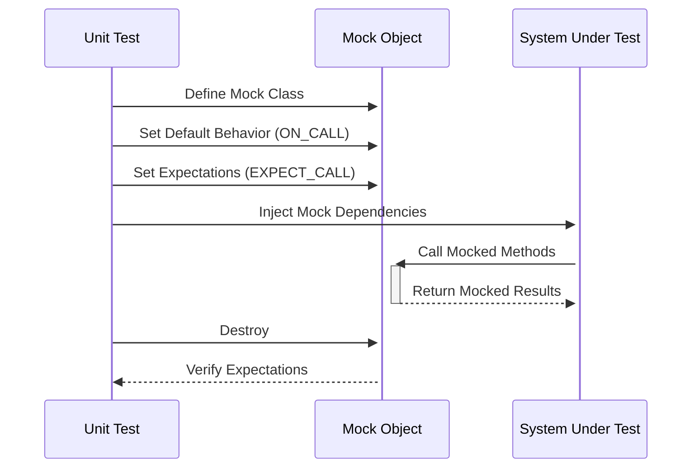

# Mocking Dependencies with GoogleMock

Harness the power of GoogleMock to effortlessly simulate dependencies in your C++ projects. This guide walks you through defining mock classes, setting behavior expectations, and verifying interactions, all illustrated by scenarios you'll encounter in real-world projects.

---

## 1. Understanding the Purpose of Mocking Dependencies

When writing unit tests, you often need to isolate the component under test from its dependencies. Mocking lets you replace these dependencies with controllable, testable mock objects — mimicking their interface while allowing you to define how they behave and what to expect.

GoogleMock enables this by automating the generation of mock classes and providing an expressive syntax to:

- Define mock methods
- Specify expected calls and their order
- Customize returned values and side effects
- Verify that mocks behave as you expect

By mastering this page, you'll be able to create mocks that precisely simulate dependencies, making your tests more robust, maintainable, and easy to debug.

---

## 2. Prerequisites

Before continuing, ensure you have:

- A C++ project set up with GoogleMock integrated. (Refer to the [Installation Guides](https://github.com/google/googletest/tree/main#installation) if needed.)
- A clear interface or abstract base class representing the dependency you want to mock (pure virtual methods, virtual destructor).
- Basic familiarity with GoogleTest and C++ testing concepts.

---

## 3. Expected Outcome

By following this guide, you will:

- Create a mock class that represents your dependency using the `MOCK_METHOD` macro.
- Write tests that set expectations on mock behavior using `EXPECT_CALL`.
- Use `ON_CALL` to set default behavior for calls your test doesn't explicitly expect.
- Verify interactions to ensure your component correctly uses its dependencies.

---

## 4. Time Estimate

About 20-30 minutes to gain confidence with the basic mocking workflow laid out here.

---

## 5. Step-by-Step Instructions

### Step 1: Define the mock class

Start by creating a mock subclass of the interface you want to fake. Use the `MOCK_METHOD` macro to mock each virtual method.

```cpp
#include <gmock/gmock.h>

// Suppose you have an interface:
class Foo {
 public:
  virtual ~Foo() = default;
  virtual int GetSize() const = 0;
  virtual std::string Describe(const char* name) = 0;
  virtual bool Process(int count) = 0;
};

// Define a mock class inheriting from Foo:
class MockFoo : public Foo {
 public:
  MOCK_METHOD(int, GetSize, (), (const, override));
  MOCK_METHOD(std::string, Describe, (const char* name), (override));
  MOCK_METHOD(bool, Process, (int count), (override));
};
```

**Tips:**

- Always mock methods in `public` scope for accessibility by GoogleMock.
- For overloaded methods or those with commas in arguments, use type aliases or wrap in parentheses per [gmock cheat sheet](https://google.github.io/googletest/gmock_cheat_sheet.html#MockClass).

### Step 2: Create a mock object in your test

Instantiate `MockFoo` (or its nice/strict variations) in your test case.

```cpp
TEST(FooTest, ProcessesAsExpected) {
  MockFoo mock_foo;
  // ... set expectations ...
}
```

### Step 3: Set default behavior with `ON_CALL`

Define how the mock should behave when a method is called, without requiring it to be called.

```cpp
using ::testing::Return;

ON_CALL(mock_foo, GetSize())
    .WillByDefault(Return(42));  // Returns 42 when GetSize() called
```

This is especially useful for calls your test doesn't explicitly verify but that must return reasonable values for the system to work.

### Step 4: Set expectations with `EXPECT_CALL`

Specify which method calls you expect, with what arguments, how many times, and what they should do.

```cpp
EXPECT_CALL(mock_foo, Describe("item"))
    .Times(1)
    .WillOnce(Return("Item description"));

EXPECT_CALL(mock_foo, Process(::testing::_))  // underscore means any argument
    .Times(::testing::AtLeast(1))
    .WillRepeatedly(Return(true));
```

The mock will monitor that the code under test calls these methods accordingly.

### Step 5: Use the mock in your test code

Pass the mock to your component under test just like you would a real dependency.

```cpp
FooUser user(&mock_foo);  // FooUser depends on Foo interface
user.DoWork();            // This should trigger calls on mock_foo
```

### Step 6: Run the test and verify

GoogleMock automatically verifies expectations when the mock is destroyed. If any expectation fails, you'll receive detailed error messages.

---

## 6. Examples & Real Scenarios

### Example: Mocking a Drawing API

Assume you have an interface:

```cpp
class Turtle {
 public:
  virtual ~Turtle() = default;
  virtual void PenDown() = 0;
  virtual void Forward(int distance) = 0;
};
```

Create the mock:

```cpp
class MockTurtle : public Turtle {
 public:
  MOCK_METHOD(void, PenDown, (), (override));
  MOCK_METHOD(void, Forward, (int distance), (override));
};
```

Your test:

```cpp
TEST(PainterTest, DrawsLine) {
  MockTurtle turtle;

  EXPECT_CALL(turtle, PenDown())
      .Times(1);
  EXPECT_CALL(turtle, Forward(100))
      .Times(1);

  Painter painter(&turtle);
  painter.DrawLine(100);
}
```

This ensures `DrawLine()` calls the expected turtle methods exactly once.

### Example: Setting default return values

```cpp
using ::testing::Return;

ON_CALL(mock_foo, GetSize())
    .WillByDefault(Return(10));

EXPECT_CALL(mock_foo, GetSize())
    .Times(::testing::AnyNumber());  // This allows any number of calls

// Now calls to mock_foo.GetSize() return 10 unless overridden.
```

---

## 7. Best Practices & Tips

- **Order of expectations matters:** Expectations declared later override earlier ones.
- **Use `ON_CALL` for defaults:** Only use `EXPECT_CALL` when you want to verify calls explicitly.
- **Suppress uninteresting call warnings:** Wrap your mock with `NiceMock` if you don't care about all calls.
- **Fail on unexpected calls:** Use `StrictMock` to catch any calls you didn't specify.
- **Set `.Times(0)` to disallow a call:** Explicitly forbidding calls avoids surprises.
- **Use matchers liberally:** Wildcards `_`, range matchers like `Ge()`, or custom matchers make tests flexible.
- **Sequence expectations:** Use `InSequence` or `Sequence` to enforce call order.
- **Clean up mocks:** If creating mocks on the heap, ensure proper destruction to trigger verification.

---

## 8. Troubleshooting

<AccordionGroup title="Common Issues When Mocking Dependencies">
<Accordion title="Unrecognized or missing mock method">
Check that the interface method is virtual and that you mocked the exact signature, including const and reference qualifiers. Ensure the method is mocked in the `public` section.
</Accordion>
<Accordion title="Warnings about uninteresting calls">
By default, calling a mock method without an explicit expectation results in warnings. Suppress them by using `NiceMock` or adding `EXPECT_CALL(...).Times(AnyNumber())` for those methods.
</Accordion>
<Accordion title="Unexpected call failures">
Make sure your expectations match the calls exactly, including argument matchers. Use `EXPECT_CALL` statements to explicitly allow unexpected calls or relax matchers with `_`.
</Accordion>
<Accordion title="Test fails due to unsatisfied expectations">
Verify that your code under test actually invokes the expected mock methods with matching arguments. Use `--gmock_verbose=info` to get detailed call traces.
</Accordion>
<Accordion title="Mock object destructor not called - no verification">
When mocks are allocated on the heap and not deleted, GoogleMock cannot verify expectations. Use `Mock::AllowLeak()` carefully or ensure proper deletion.
</Accordion>
</AccordionGroup>

---

## 9. Advanced Topics

- Delegating calls to real or fake objects
- Mocking move-only types such as `std::unique_ptr<T>`
- Partial mocking and hybrid mocks
- Matching multiple arguments with `With()`
- Setting complex call sequences with `InSequence` and `After`

Refer to the [gMock Cookbook](https://google.github.io/googletest/gmock_cook_book.html) and [Mocking Reference](https://google.github.io/googletest/reference/mocking.html) for these advanced uses.

---

## 10. Next Steps & Related Guides

- **[Writing Your First Test Case](/guides/core-workflows/writing-tests)** - How to create and run your first GoogleTest unit tests.
- **[Mastering Common and Custom Assertions](/guides/core-workflows/test-assertions-patterns)** - Strengthen your testing assertions beyond mocking.
- **[Mocking Framework API Reference](/api-reference/mocking-framework/mock-object-api)** - Detailed API specs.
- **[Continuous Integration and Test Automation](/guides/integration-and-scenarios/ci-cd-practices)** - Integrate mocking into your build pipelines.

---

## 11. Resources

- GoogleTest GitHub repository: [https://github.com/google/googletest](https://github.com/google/googletest)
- gMock for Dummies: [https://google.github.io/googletest/gmock_for_dummies.html](https://google.github.io/googletest/gmock_for_dummies.html)
- gMock Cheat Sheet: [https://google.github.io/googletest/gmock_cheat_sheet.html](https://google.github.io/googletest/gmock_cheat_sheet.html)
- gMock Cookbook: [https://google.github.io/googletest/gmock_cook_book.html](https://google.github.io/googletest/gmock_cook_book.html)

---

## 12. Summary Diagram of Mocking Workflow


