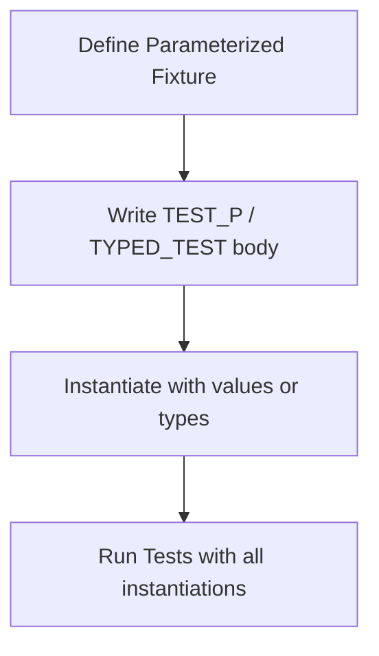

# Parameterized and Typed Tests

## Overview

This guide helps you write systematic and scalable tests in GoogleTest by leveraging **value-parameterized** and **type-parameterized** test features. These testing patterns enable you to run the same test logic over multiple input values or types, greatly reducing boilerplate and increasing coverage.

By following this guide, you will learn how to create reusable test fixtures, instantiate parameterized test suites correctly, and manage complex testing scenarios across several data and type dimensions.

---

## Prerequisites

- Basic familiarity with GoogleTest syntax including `TEST`, `TEST_F`, and test fixtures.
- A working GoogleTest environment and build setup.
- Understanding of C++ templates and types is helpful for typed and type-parameterized tests.

---

## What You Will Achieve

- Create tests that run multiple times with different input values using value-parameterized tests.
- Define typed tests to test the same logic against multiple C++ types.
- Use type-parameterized tests for flexible, reusable test patterns without binding type lists until instantiation.
- Learn how to register and instantiate these tests properly.

---

## Time Estimate

Expect to spend 15-30 minutes walking through this guide and experimenting with your tests.

## Difficulty Level

Intermediate. Some familiarity with C++ templates and GoogleTest fixtures is assumed.

---

# 1. Value-Parameterized Tests

Value-parameterized tests execute the same test logic for a range of input values. This is useful when you want to ensure your code behaves correctly for multiple inputs without duplicating test code.

### Workflow

1. **Define a value-parameterized test fixture:**

```cpp
class FooTest : public ::testing::TestWithParam<int> {
  // Fixture setup code...
};
```

Here, `int` is the type of the parameter your test will receive.

2. **Write parameterized tests using `TEST_P`:**

```cpp
TEST_P(FooTest, HandlesValues) {
  int param = GetParam(); // Access parameter
  EXPECT_TRUE(IsValid(param));
}
```

3. **Instantiate test suite with parameters:**

```cpp
INSTANTIATE_TEST_SUITE_P(
    ValueInstances, FooTest, ::testing::Values(33, 42));
```

This runs `HandlesValues` twice, once for `33`, once for `42`.

### Key Points

- `TestWithParam<T>` combines the test fixture and parameter interface.
- Use `GetParam()` inside `TEST_P` to access current parameter.
- Use `INSTANTIATE_TEST_SUITE_P` to define the parameter values that generate test instances.

### Parameter Generators Examples

| Generator          | Description                                   | Example                                    |
| ------------------ | --------------------------------------------- | ------------------------------------------ |
| `Values(...)`       | Explicit values                               | `Values(1, 2, 3)`                          |
| `ValuesIn(container)` | Values from container or array                 | `ValuesIn(myArray)`                        |
| `Range(start, end)` | Sequence from start up to but excluding end  | `Range(0, 5)`  (0,1,2,3,4)                 |
| `Bool()`            | Boolean true and false                        | `Bool()`                                  |
| `Combine(g1, g2)`   | Cartesian product tuples from multiple gens  | `Combine(Values(1,2), Bool())`


### Customizing Test Names

You can provide a function or functor as the 4th argument to `INSTANTIATE_TEST_SUITE_P` to generate descriptive, unique test names based on parameter values.

```cpp
INSTANTIATE_TEST_SUITE_P(
    CustomNames, FooTest, testing::Values(1, 2, 3),
    [](const testing::TestParamInfo<int>& info) {
      return "Value_" + std::to_string(info.param);
    });
```

### Example
```cpp
#include <gtest/gtest.h>

class CalculatorTest : public ::testing::TestWithParam<int> {};

TEST_P(CalculatorTest, IsEven) {
  int n = GetParam();
  EXPECT_EQ(n % 2, 0);
}

INSTANTIATE_TEST_SUITE_P(EvenNumbers, CalculatorTest, testing::Values(2, 4, 6));
```

---

# 2. Typed Tests

Typed tests enable you to run the same test logic for a fixed set of C++ types.

### Workflow

1. **Define a fixture template class:**

```cpp
template <typename T>
class NumericTest : public ::testing::Test {
 protected:
  T value_ = 0;
};
```

2. **Define a type list:**

```cpp
typedef ::testing::Types<int, double, float> NumericTypes;
```

3. **Associate the fixture with the type list:**

```cpp
TYPED_TEST_SUITE(NumericTest, NumericTypes);
```

4. **Write typed tests using `TYPED_TEST`:**

```cpp
TYPED_TEST(NumericTest, DefaultValueIsZero) {
  TypeParam x = this->value_;
  EXPECT_EQ(x, 0);
}
```

### Key Points

- `TYPED_TEST_SUITE` defines which types the fixture will run tests for.
- Use `TypeParam` inside `TYPED_TEST` to refer to the current type under test.
- Typed tests generate test instances named like `NumericTest/0`, `NumericTest/1` for each type.

### Custom Type Names

You can specify a custom naming policy by passing a class to `TYPED_TEST_SUITE` which implements:

```cpp
class CustomNames {
 public:
  template <typename T>
  static std::string GetName(int /*index*/) {
    if (std::is_same<T, int>::value) return "IntType";
    if (std::is_same<T, double>::value) return "DoubleType";
    return "Unknown";
  }
};

TYPED_TEST_SUITE(NumericTest, NumericTypes, CustomNames);
```

---

# 3. Type-Parameterized Tests (Pattern-Based)

Type-parameterized tests let you define test patterns without specifying the list of types upfront. These tests are registered with special macros and instantiated later with different type lists.

This pattern is useful when writing libraries where users may instantiate tests for their own types.

### Workflow

1. **Define a fixture template class:**

```cpp
template <typename T>
class MyInterfaceTest : public ::testing::Test { ... };
```

2. **Declare a type-parameterized test suite:**

```cpp
TYPED_TEST_SUITE_P(MyInterfaceTest);
```

3. **Write type-parameterized tests using `TYPED_TEST_P`:**

```cpp
TYPED_TEST_P(MyInterfaceTest, DoesSomething) {
  TypeParam instance;
  EXPECT_TRUE(instance.IsValid());
}
```

4. **Register the tests:**

```cpp
REGISTER_TYPED_TEST_SUITE_P(MyInterfaceTest, DoesSomething, AnotherTest);
```

5. **Instantiate the pattern with specific types:**

```cpp
using ImplTypes = ::testing::Types<MyImpl1, MyImpl2>;
INSTANTIATE_TYPED_TEST_SUITE_P(Implementations, MyInterfaceTest, ImplTypes);
```

### Key Points

- `TYPED_TEST_SUITE_P`, `TYPED_TEST_P`, and `REGISTER_TYPED_TEST_SUITE_P` define reusable test patterns.
- `INSTANTIATE_TYPED_TEST_SUITE_P` binds the type list to the pattern.
- Allows multiple distinct instantiations of the same pattern in the same program.

---

# 4. Best Practices

- Prefer `TEST_P` value-parameterized tests when your fixture differs by data values.
- Use typed tests if you only need to test multiple types with the same construction interface.
- Use type-parameterized tests when you want reusable test suites with flexible type lists.
- Avoid underscores (`_`) in test suite and test names to prevent clashes.
- When using value-parameterized tests with complex types, provide `PrintTo()` or `AbslStringify()` so test reports are informative.
- Leverage custom name generators for meaningful test names.
- Remember each parameterized test instantiation runs independently with fresh fixture objects.

---

# 5. Troubleshooting

### Common Issues

- **Tests not running:** Ensure `INSTANTIATE_TEST_SUITE_P` or `INSTANTIATE_TYPED_TEST_SUITE_P` is called for every parameterized test suite.
- **Name collision errors:** Remove underscores from test suite and test names.
- **Compilation failures:** Verify your fixture inherits from the right GoogleTest base (`TestWithParam` for `TEST_P`, `Test` for typed tests).
- **Output unclear for custom types:** Implement `PrintTo()` or `AbslStringify()` for your parameter types.

### Tips

- Use `GetParam()` only inside `TEST_P` tests.
- `TypeParam` is only valid inside `TYPED_TEST` and `TYPED_TEST_P`.
- `INSTANTIATE_TEST_SUITE_P` can be called multiple times; each call adds more parameters.

---

# 6. Examples

### Value-Parameterized Test with Integers

```cpp
class ValueParamTest : public ::testing::TestWithParam<int> {};

TEST_P(ValueParamTest, IsPositive) {
  EXPECT_GT(GetParam(), 0);
}

INSTANTIATE_TEST_SUITE_P(PositiveValues, ValueParamTest, testing::Values(1, 10, 100));
```

### Typed Test with `int` and `bool`

```cpp
template <typename T>
class TypedTestFixture : public ::testing::Test {};

using MyTypes = ::testing::Types<int, bool>;
TYPED_TEST_SUITE(TypedTestFixture, MyTypes);

TYPED_TEST(TypedTestFixture, IsDefaultConstructible) {
  TypeParam val{};
  (void)val;
  SUCCEED();  // Just test compilation
}
```

### Type-Parameterized Test Suite

```cpp
template <typename T>
class MyTypeParamTest : public ::testing::Test {};

TYPED_TEST_SUITE_P(MyTypeParamTest);

TYPED_TEST_P(MyTypeParamTest, TestA) {
  TypeParam value = TypeParam();
  EXPECT_TRUE(true);  // Replace with real checks
}

TYPED_TEST_P(MyTypeParamTest, TestB) {
  SUCCEED();
}

REGISTER_TYPED_TEST_SUITE_P(MyTypeParamTest, TestA, TestB);

using MyTypes = ::testing::Types<int, bool>;
INSTANTIATE_TYPED_TEST_SUITE_P(MyGroup, MyTypeParamTest, MyTypes);
```

---

# 7. Additional Resources

- [GoogleTest Advanced Topics](docs/advanced.md#value-parameterized-tests) for deeper coverage.
- [Testing Reference - Parameterized and Typed Tests](docs/reference/testing.md#parameterized-tests)
- [FAQ on Test Naming and Parameterized Tests](docs/faq.md#why-should-test-suite-names-and-test-names-not-contain-underscore)
- Official [GoogleTest GitHub Repository](https://github.com/google/googletest)


---

# Summary

This guide empowers you to write scalable and reusable tests in GoogleTest using value-parameterized and typed test patterns. You will learn how to define fixtures, write test bodies accessing parameters or types, and instantiate these tests with particular values or type lists. Following best practices ensures clear test names and manageable test code. Troubleshooting tips help avoid common setup pitfalls.

---

# Visual Workflow Diagram



---

For any questions or further examples, consult the linked advanced topics and reference pages.