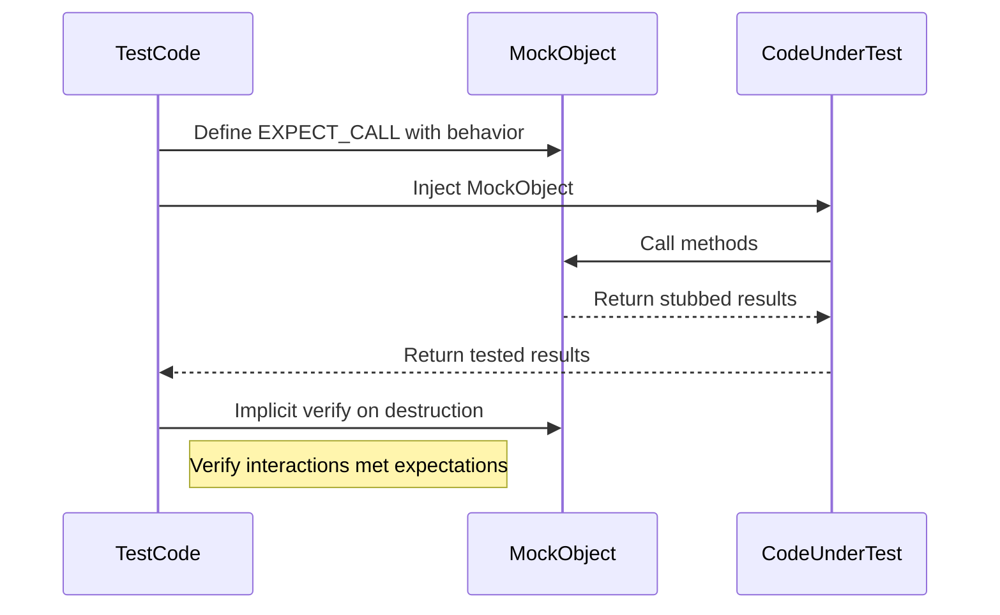

# Mocking Dependencies with GoogleMock

Discover how to use GoogleMock to replace dependencies with mock objects for unit testing. This guide covers defining mock classes, setting expectations, and verifying mock interactions to ensure isolated and robust tests.

---

## 1. Introduction to GoogleMock for Dependency Mocking

When writing unit tests, isolating the code under test from its dependencies is critical. GoogleMock allows you to create mock objects that simulate these dependencies, enabling precise control and observation of interactions.

This guide walks you through how to create mock classes, define expected method calls, specify desired behaviors, and verify interactions, unlocking the full power of dependency mocking in your C++ tests.

---

## 2. Prerequisites

- A working GoogleTest and GoogleMock installation integrated into your C++ project.
- Basic understanding of virtual functions and interface-based design in C++.
- Familiarity with writing unit tests using GoogleTest.

---

## 3. Expected Outcome

By following this guide, you will:

- Create mock classes representing dependencies.
- Configure method behaviors and expectations using `EXPECT_CALL`.
- Control mock responses and side effects.
- Validate that the code under test interacts correctly with its dependencies.

---

## 4. Time Estimate

Approximately 20-30 minutes to complete and practice the workflow.

---

## 5. Step-by-Step Guide

### Step 1: Define a Mock Class

To mock a dependency interface or an abstract class, create a mock class that inherits from the original interface or base class. Use the `MOCK_METHOD` macro to generate mock implementations for virtual methods.

```cpp
#include <gmock/gmock.h>

class MockDependency : public DependencyInterface {
 public:
  MOCK_METHOD(ReturnType, MethodName, (Args...), (optional qualifiers));
  // Add MOCK_METHOD lines for each virtual method you want to mock.
};
```

**Key Notes:**
- Place `MOCK_METHOD` calls **in the public section** even if the base method is protected or private.
- For methods with commas in template arguments, either wrap the type in parentheses or use a type alias.
- Use `(const, override)` qualifiers for const virtual methods.
- When overriding `noexcept` virtual methods, include `(noexcept, override)`.

_Example:_

```cpp
class MockTurtle : public Turtle {
 public:
  MOCK_METHOD(void, PenUp, (), (override));
  MOCK_METHOD(void, Forward, (int distance), (override));
  MOCK_METHOD(int, GetX, (), (const, override));
};
```

---

### Step 2: Create and Configure Your Mock Object

Inside your test, instantiate your mock object. Then define expected interactions using `EXPECT_CALL`.

```cpp
using ::testing::Return;
using ::testing::_;  // _ is a wildcard matcher

TEST(MyTestSuite, MyTestCase) {
  MockDependency mock_dep;

  EXPECT_CALL(mock_dep, SomeMethod(42))  // Expect method call with specific argument
      .Times(1)                         // Expected exactly once
      .WillOnce(Return(true));          // Returns true when called

  EXPECT_CALL(mock_dep, OtherMethod(_))  // Expect any argument
      .WillRepeatedly(Return(0));        // Default behavior

  // Inject 'mock_dep' into your code under test and execute
}
```

**Tips:**
- Use `_` to match any argument when the exact value doesn't matter.
- Chain `WillOnce()` for sequential behaviors and `WillRepeatedly()` for subsequent calls.
- Use `Times()` to specify call count constraints. If omitted, GoogleMock infers it from `WillOnce` and `WillRepeatedly` clauses.

---

### Step 3: Setting Default Behavior with ON_CALL

If you want to specify default mock behavior without strictly expecting calls, use `ON_CALL`.

```cpp
ON_CALL(mock_dep, SomeMethod(_))
    .WillByDefault(Return(false));
```

This is useful in test fixtures to define common behavior, while still allowing specific `EXPECT_CALL` overrides per test.

---

### Step 4: Using Mock Behaviors — Nice, Strict, and Naggy

By default, mocks print warnings for unexpected calls (naggy behavior). Depending on your needs, you can use:

- `NiceMock<T>`: suppress warnings for uninteresting calls.
- `StrictMock<T>`: treat uninteresting calls as errors.
- `NaggyMock<T>`: the default behavior, warns on uninteresting calls.

_Example:_

```cpp
using ::testing::NiceMock;
NiceMock<MockDependency> nice_mock;
EXPECT_CALL(nice_mock, SomeMethod(_));
```

This reduces noise in logs for methods you don't care about in specific tests.

---

### Step 5: Verify Mock Interactions

Expectations are automatically verified when a mock object is destroyed. However, you can force verification earlier:

```cpp
using ::testing::Mock;

Mock::VerifyAndClearExpectations(&mock_dep);
```

This is useful when mocks are heap allocated or passed to code that manages their lifetime.

---

### Step 6: Advanced Techniques and Best Practices

- **Mocking overloaded methods:** Declare a mock method for each overload. Use `using BaseType::MethodName;` in the mock to avoid hiding overloads.
- **Mocking class templates:** You can mock template classes similarly by templating your mock classes.
- **Setting call order:** Use `InSequence` or `After()` to enforce call order:
  ```cpp
  {
    ::testing::InSequence seq;
    EXPECT_CALL(mock, FirstCall());
    EXPECT_CALL(mock, SecondCall());
  }
  ```
- **Dealing with side effects:** Use actions like `SetArgPointee` or `DoAll` to mock methods with side effects.
- **Using matchers:** Learn and use built-in matchers like `_, Eq(), Ge(), NotNull()` for flexible argument matching.

---

## 6. Common Pitfalls and Troubleshooting

- **Uninteresting call warnings:** If you see warnings about uninteresting calls but expect no calls, check your expectations or switch to `NiceMock`.
- **Overusing `EXPECT_CALL`:** Use `ON_CALL` for default behaviors and only use `EXPECT_CALL` for calls you need to verify.
- **Order of expectations matters:** More specific expectations should be declared after general catch-alls.
- **Mock methods must be virtual:** Non-virtual functions cannot be mocked directly without templates and advanced patterns.
- **Destructor must be virtual:** If your base class doesn't have a virtual destructor, mocking may cause lifetime issues.

---

## 7. Example: Mocking a Turtle Interface

```cpp
class Turtle {
 public:
  virtual ~Turtle() {}
  virtual void PenUp() = 0;
  virtual void PenDown() = 0;
  virtual void Forward(int distance) = 0;
  virtual int GetX() const = 0;
  virtual int GetY() const = 0;
};

class MockTurtle : public Turtle {
 public:
  MOCK_METHOD(void, PenUp, (), (override));
  MOCK_METHOD(void, PenDown, (), (override));
  MOCK_METHOD(void, Forward, (int distance), (override));
  MOCK_METHOD(int, GetX, (), (const, override));
  MOCK_METHOD(int, GetY, (), (const, override));
};

TEST(PaintTest, DrawsCircle) {
  MockTurtle turtle;

  EXPECT_CALL(turtle, PenDown()).Times(1);
  EXPECT_CALL(turtle, Forward(10)).Times(::testing::AtLeast(1));

  // Code under test that uses 'turtle'...
}
```

---

## 8. Resources & References

- [gMock Cookbook](https://google.github.io/googletest/gmock_cook_book.html): Recipes and detailed examples.
- [gMock for Dummies](https://google.github.io/googletest/gmock_for_dummies.html): Beginner-friendly introduction.
- [Mock Object & Method Definitions](https://google.github.io/googletest/api/gmock_mock_object_basics.html): API reference for mocks.
- [Setting Expectations and Actions](https://google.github.io/googletest/api/gmock_expectations.html): Detailed `EXPECT_CALL` syntax and usage.
- [Matchers Reference](https://google.github.io/googletest/api/gmock_matchers.html): Built-in argument matchers.
- [Mock Behaviors: Nice, Strict, and Custom](https://google.github.io/googletest/gmock_cook_book.html#NiceStrictNaggy): Behavior modes discussion.

---

**Source Repository:** [https://github.com/google/googletest](https://github.com/google/googletest)

---

## 9. Summary Diagram - Mocking Flow



---

This structured workflow ensures robust and maintainable testing of code that depends on complex or external systems by leveraging GoogleMock to mock those dependencies effectively.
