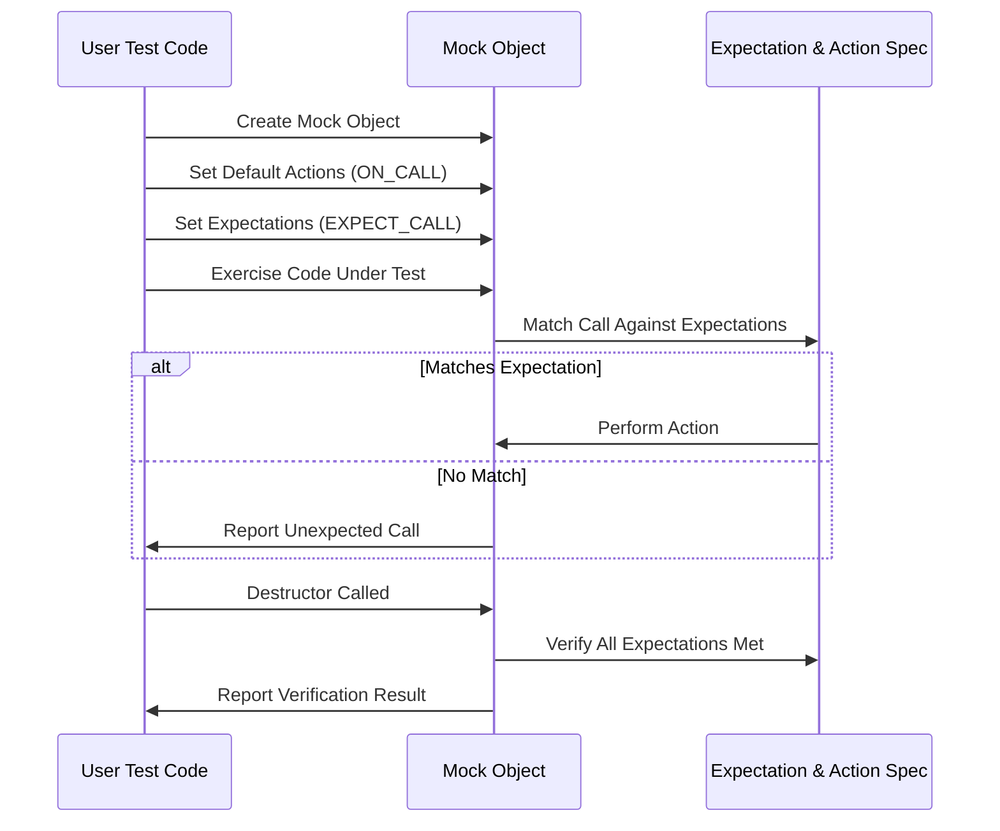

# Using Mocks for Dependency Isolation

## Workflow Overview

When writing unit tests, isolating the code under test from its dependencies is key to achieving fast, reliable, and maintainable tests. This guide focuses specifically on using GoogleMock to mock interfaces and classes, enabling you to simulate and control interactions with dependencies.

By following a clear sequence of defining mock classes, setting expectations, and verifying behavior, you will learn how to effectively isolate dependencies and precisely verify interactions.

### Prerequisites

- A working environment with GoogleTest and GoogleMock installed and configured.
- Familiarity with basic C++ syntax and virtual functions.
- Some experience with writing GoogleTest unit tests.

### Expected Outcome

After completing this guide, you will be able to:

- Define mock classes for interfaces and abstract classes.
- Use the `MOCK_METHOD` macro to mock virtual methods.
- Set default behaviors with `ON_CALL`.
- Express detailed expectations with `EXPECT_CALL`, including argument matching and call counts.
- Use actions to specify return values or simulate side effects.
- Control call ordering and reinforce interaction correctness.

### Time Estimate

30 to 60 minutes, depending on familiarity with GoogleMock concepts.

### Difficulty Level

Intermediate - assumes understanding of mocks and unit testing basics.

---

## Step-by-Step Instructions

### 1. Define Your Mock Class

The foundation of mocking dependencies is to create mock classes matching the interface (or abstract base class) your code depends on.

- Derive a mock class from the base interface.
- Use the `MOCK_METHOD` macro in the public section to declare mock methods.

Example:

```cpp
#include <gmock/gmock.h>

class Foo {
 public:
  virtual ~Foo() = default;
  virtual int GetSize() const = 0;
  virtual std::string Describe(const char* name) = 0;
};

class MockFoo : public Foo {
 public:
  MOCK_METHOD(int, GetSize, (), (const, override));
  MOCK_METHOD(std::string, Describe, (const char* name), (override));
};
```

**Best Practices:**
- Ensure base methods are `virtual` and destructors are `virtual`.
- Place `MOCK_METHOD` declarations in public access, even if base methods aren't.
- Use `override` for clarity and compiler checking.

---

### 2. Create Mock Objects in Your Tests

Instantiate your mock classes inside your unit tests where required:

```cpp
MockFoo mock_foo;
```

Optionally, for different mock strictness behaviors—such as ignoring uninteresting calls or treating them as errors—wrap with helper types:

```cpp
using ::testing::NiceMock;
using ::testing::StrictMock;

NiceMock<MockFoo> nice_mock;    // Ignores unexpected calls
StrictMock<MockFoo> strict_mock; // Fails on unexpected calls
```

---

### 3. Set Default Behaviors with `ON_CALL`

Use `ON_CALL` to specify what your mock's methods should do by default when called. This does not establish an expectation that the call must occur, but defines fallback behavior.

Example:

```cpp
using ::testing::Return;

ON_CALL(mock_foo, GetSize())
    .WillByDefault(Return(42));
```

If you want the method to always return the specified value unless overridden, set it in the mock's constructor or test setup.

---

### 4. Define Expectations with `EXPECT_CALL`

Use `EXPECT_CALL` to declare that a mock method is expected to be called, how many times, with which arguments, and what it should do.

General form:

```cpp
EXPECT_CALL(mock_object, MethodName(matchers...))
    .Times(cardinality)
    .WillOnce(action)
    .WillRepeatedly(action)
    .InSequence(sequence)
    .After(expectations)
    .RetiresOnSaturation();
```

Example:

```cpp
EXPECT_CALL(mock_foo, Describe("test"))
    .Times(3)
    .WillRepeatedly(Return("Category 5"));
```

**Common Clauses:**
- `.With(multi_arg_matcher)`: match arguments as a tuple.
- `.Times(n)`, `.Times(AtLeast(n))`, `.Times(AnyNumber())`: control call counts.
- `.InSequence(...)`: enforce order among multiple expectations.
- `.After(...)`: specify relative ordering dependencies.
- `.WillOnce(action)` / `.WillRepeatedly(action)`: specify return values or side effects.
- `.RetiresOnSaturation()`: retire an expectation after it's fully used.

---

### 5. Exercise Your Code Under Test

Call into the code that uses your mock, triggering the interactions.

Example:

```cpp
EXPECT_EQ(ProcessItem(&mock_foo), "success");
```

If the code calls mock methods not meeting the expectations, GoogleMock reports errors immediately.

---

### 6. Automatic Verification

When the mock objects go out of scope and are destroyed, GoogleMock automatically verifies whether all `EXPECT_CALL` expectations were met. If not, it reports test failures.

You can also manually verify and clear expectations earlier using:

```cpp
using ::testing::Mock;

Mock::VerifyAndClearExpectations(&mock_foo);
```

Avoid setting new expectations after verification or mock use to prevent undefined behavior.

---

## Practical Examples

### Basic Mock and Expectation

```cpp
#include <gmock/gmock.h>
#include <gtest/gtest.h>

class MyInterface {
 public:
  virtual ~MyInterface() = default;
  virtual int GetValue() const = 0;
  virtual void SetValue(int val) = 0;
};

class MockMyInterface : public MyInterface {
 public:
  MOCK_METHOD(int, GetValue, (), (const, override));
  MOCK_METHOD(void, SetValue, (int val), (override));
};

TEST(MyTest, Example) {
  MockMyInterface mock;

  // Default behavior
  ON_CALL(mock, GetValue()).WillByDefault(::testing::Return(10));

  // Expect SetValue called once with 5
  EXPECT_CALL(mock, SetValue(5)).Times(1);

  // Expect GetValue called at least twice
  EXPECT_CALL(mock, GetValue()).Times(::testing::AtLeast(2));

  mock.SetValue(5);
  EXPECT_EQ(mock.GetValue(), 10);
  EXPECT_EQ(mock.GetValue(), 10);
}
```

### Delegating to a Fake for Default Behavior

```cpp
class RealFoo : public Foo {
 public:
  int GetSize() const override { return 7; }
  std::string Describe(const char* name) override { return "real description"; }
};

class MockFoo : public Foo {
 public:
  MOCK_METHOD(int, GetSize, (), (const, override));
  MOCK_METHOD(std::string, Describe, (const char* name), (override));

  void DelegateToReal() {
    ON_CALL(*this, GetSize()).WillByDefault([this]() { return real_.GetSize(); });
    ON_CALL(*this, Describe).WillByDefault([this](const char* n) { return real_.Describe(n); });
  }

 private:
  RealFoo real_;
};
```

Calling `DelegateToReal()` will route default behaviors to a real object for delegation.

---

## Troubleshooting & Tips

### Common Issues

- **Mocked method not virtual**: GoogleMock requires the mocked methods to be virtual. Ensure your interfaces have virtual methods and virtual destructors.
- **Overlapping expectations**: Newer expectations override older ones for matching. Place more specific `EXPECT_CALL`s *after* more general ones.
- **Uninteresting call warnings**: Use `NiceMock` to suppress warnings or add a catch-all `EXPECT_CALL(mock, Method(_)).Times(AnyNumber());`.
- **Setting expectations too late**: Define all `EXPECT_CALL`s before making calls on the mocks.
- **Multiple `WillRepeatedly()` or `Times()`**: Use each clause once per expectation; misuse leads to runtime errors or warnings.

### Best Practices

- Use `ON_CALL` for default behaviors shared by many tests.
- Use `EXPECT_CALL` sparingly and only when you want to assert that a call happens.
- Use `InSequence` or `After` to specify ordering when necessary.
- Use argument matchers (`_`, `Eq()`, `Pointee()`, etc.) to keep tests resilient.
- Avoid mocking classes you do not own; prefer interfaces.

### Performance Considerations

- Move mock class constructors and destructors out of header files into source files to speed compilation.

### Alternative Approaches

- Delegate to a fake or real object when you want to reuse complex real behaviors.
- Use `MockFunction` to mock callbacks or function objects.
- For asynchronous or stateful mocks, use sequences and actions that update state.

---

## Next Steps & Related Content

- Read the [gMock Cheat Sheet](https://google.github.io/googletest/gmock_cheat_sheet.html) for quick reference.
- Explore the [gMock Cookbook](https://google.github.io/googletest/gmock_cook_book.html) for advanced usage.
- Learn about controlling mock strictness with `NiceMock` and `StrictMock`.
- Use the [Matchers Reference](../reference/matchers.md) to improve argument matching.
- See [Writing Your First Test](../getting-started/first-test-workflow/writing-your-first-test.mdx) for test creation basics.

---

## Visual Overview: Mock Interaction Flow



This flow emphasizes that expectations must be set before exercising code, with verification happening automatically on destruction.

---

## References

- [gMock Cheat Sheet](https://google.github.io/googletest/gmock_cheat_sheet.html)
- [gMock for Dummies](https://google.github.io/googletest/gmock_for_dummies.html)
- [Mocking Reference](https://google.github.io/googletest/reference/mocking.html)
- [Actions Reference](https://google.github.io/googletest/reference/actions.html)
- [Matchers Reference](https://google.github.io/googletest/reference/matchers.html)


---

<Check>
Ensure all expectations are defined before exercising the mock.
Use `NiceMock<>` to suppress warnings on uninteresting calls.
Always override virtual destructors in base classes.
</Check>

<Note>
For complex behaviors, consider delegating to a fake or real object.
Use sequences and ordering clauses to specify call order requirements clearly.
</Note>
