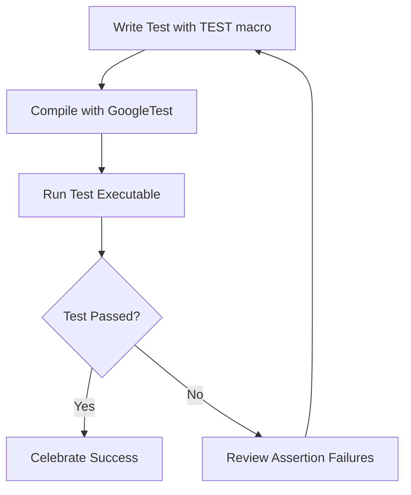

# Writing and Running Your First Unit Test

Welcome to your first practical step with GoogleTest! This guide walks you through writing a simple C++ unit test, running it, and interpreting the results. You'll quickly learn how GoogleTest simplifies the test creation, discovery, and execution workflow while providing immediate feedback on your test's success or failure.

---

## What You'll Accomplish

- Write a basic test case using GoogleTest's `TEST` macro.
- Compile your test into an executable.
- Run the test suite and observe output feedback.
- Understand how GoogleTest discovers and runs tests automatically.

## Prerequisites

- A working C++17-compatible compiler installed.
- GoogleTest library installed and properly linked in your build environment.
- Basic familiarity with C++ syntax.
- Recommended: Review the [System Requirements](https://github.com/google/googletest/blob/main/docs/getting-started/prerequisites-installation/system-requirements.md) and installation guides if not already done.

---

## Getting Started: Write Your First Test

1. **Include GoogleTest Header**

    Begin your test file by including the core GoogleTest header:

    ```cpp
    #include <gtest/gtest.h>
    ```

2. **Define a Test Case Using `TEST` Macro**

    Use the `TEST` macro to define a test. The macro takes two parameters: the test suite name and the test name. Both must be valid C++ identifiers and avoid underscores.

    ```cpp
    TEST(FactorialTest, HandlesZeroInput) {
      EXPECT_EQ(Factorial(0), 1);
    }

    TEST(FactorialTest, HandlesPositiveInput) {
      EXPECT_EQ(Factorial(1), 1);
      EXPECT_EQ(Factorial(2), 2);
      EXPECT_EQ(Factorial(3), 6);
    }
    ```

    - Each test is an independent function.
    - `EXPECT_EQ` is an assertion that tests whether the two values are equal.
    - If an assertion fails, that test fails; if all assertions pass, the test passes.

3. **Compile Your Test Program**

    Compile your test with the GoogleTest library. Example `g++` command:

    ```bash
    g++ -std=c++17 -isystem /path/to/gtest/include -pthread your_test.cpp \
        /path/to/libgtest.a /path/to/libgtest_main.a -o your_test
    ```

    Adapt paths and build commands according to your environment and build system.

4. **Write `main()` to Run Tests**

    If not linking against `gtest_main`, add the following to your test program:

    ```cpp
    int main(int argc, char** argv) {
      ::testing::InitGoogleTest(&argc, argv);
      return RUN_ALL_TESTS();
    }
    ```

    - `InitGoogleTest` initializes the test framework and processes command-line flags.
    - `RUN_ALL_TESTS` runs all tests registered via the `TEST` macro and returns `0` on success.

---

## Running and Verifying Your Test Suite

Execute your compiled test binary:

```bash
./your_test
```

### Expected Output on Success

```
[==========] Running 2 tests from 1 test suite.
[----------] Global test environment set-up.
[----------] 2 tests from FactorialTest
[ RUN      ] FactorialTest.HandlesZeroInput
[       OK ] FactorialTest.HandlesZeroInput (0 ms)
[ RUN      ] FactorialTest.HandlesPositiveInput
[       OK ] FactorialTest.HandlesPositiveInput (0 ms)
[----------] 2 tests from FactorialTest (0 ms total)

[----------] Global test environment tear-down
[==========] 2 tests from 1 test suite ran. (0 ms total)
[  PASSED  ] 2 tests.
```

### What This Means

- Tests were executed and reported with verbose output.
- `OK` indicates test success; failures will be reported explicitly with details.
- Total execution time is shown.

### On Failure

If a test fails, GoogleTest prints the failing assertion location, the expected and actual values, and a failure summary. For example:

```
path/to/your_test.cpp:10: Failure
Expected equality of these values:
  Factorial(0)
    Which is: 0
  1
```

---

## How GoogleTest Discovers Tests

GoogleTest automatically discovers tests defined with the `TEST` and `TEST_F` macros at runtime:

- Each `TEST` macro registers a test case in the global test registry.
- `RUN_ALL_TESTS()` sequentially invokes each test via this registry.
- No explicit test registration or enumeration is needed.

To control which tests run, use command-line flags (e.g., `--gtest_filter`).

---

## Practical Tips for Your First Test

- Name test suites and tests clearly, reflecting the code behavior under test.
- Use `EXPECT_*` assertions to verify expected outcomes; prefer `ASSERT_*` if the test cannot proceed on failure.
- Test one logical condition per test to keep failures clear and isolated.
- Keep tests independent from each other.
- Use `RUN_ALL_TESTS()` only once in your `main()`.

---

## Troubleshooting Common Issues

<AccordionGroup title="Common Problems Running Your First Test">
<Accordion title="Linker Errors Related to GoogleTest">
Ensure you link both `gtest` and `gtest_main` libraries or provide your own `main()`. Confirm library paths.
</Accordion>
<Accordion title="Tests Not Being Discovered or Executed">
Verify all test files are compiled and linked. Confirm `TEST` macros are used correctly. Use `--gtest_list_tests` to see recognized tests.
</Accordion>
<Accordion title="Failing to Initialize GoogleTest">
Always call `testing::InitGoogleTest` before `RUN_ALL_TESTS()`. On Windows, choose the appropriate `InitGoogleTest` overload.
</Accordion>
</AccordionGroup>

<Tip>
You can run `./your_test --help` to see GoogleTest-specific command line options, such as filtering tests, repeating tests, and output formats.
</Tip>

---

## Next Steps

- Explore [Test Discovery and Execution](../getting-started/first-test-setup/test-discovery-execution.md) to learn more about tests filtering and controlling execution.
- Learn how to organize multiple related tests using [Test Fixtures (`TEST_F`)](../docs/primer.md#same-data-multiple-tests).
- Deep dive into [Assertions](https://github.com/google/googletest/blob/main/docs/api-reference/googletest-core-apis/assertions-reference.md) for verifying complex behaviors.
- When ready, explore GoogleMock features for mocking dependencies with [Getting Started with Mocking](../guides/core-workflows/introduction-to-mocking.md).

---

## Useful Resources

- [Writing and Running Your First Test Guide](https://github.com/google/googletest/blob/main/docs/getting-started/first-test-setup/writing-running-first-test.md)
- [GoogleTest Primer](https://github.com/google/googletest/blob/main/docs/primer.md)
- [GoogleTest System Requirements](https://github.com/google/googletest/blob/main/docs/getting-started/prerequisites-installation/system-requirements.md)
- GoogleTest Git repository: [https://github.com/google/googletest](https://github.com/google/googletest)

---

## Summary Chart: Test Development Flow



---

Embark on your journey to robust and maintainable C++ testing with GoogleTest—your foundational skill for confident software development.