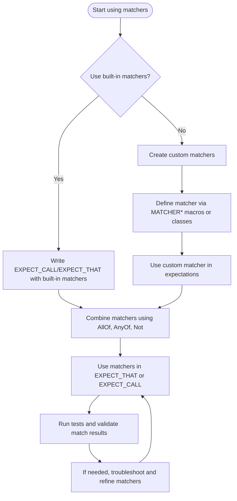

# Mastering Matchers for Flexible Assertions

GoogleTest's GoogleMock framework offers a powerful system of **matchers** that help you write highly expressive, readable, and robust tests. This guide takes you step-by-step through mastering matchers: using built-in matchers, combining them for complex conditions, applying matchers with regular expressions, creating your own custom matchers, and leveraging strategies that make your assertions clear and maintainable.

---

## Workflow Overview

### Task Description
Learn to use, combine, and extend **matchers** for writing flexible and expressive assertions and expectations in GoogleMock. Use matchers to precisely specify how mock methods should be called and how values should be verified in your unit tests.

### Prerequisites
- Familiarity with GoogleTest and GoogleMock basics
- Ability to write simple tests using `EXPECT_CALL` and `EXPECT_THAT`
- `#include <gmock/gmock.h>` in your source

### Expected Outcome
By following this guide, you will
- Understand the syntax and usage of standard built-in matchers
- Compose complex assertions by combining matchers logically
- Use regular expression and string-based matchers for text validation
- Create custom, parameterized matchers for domain-specific needs
- Apply best practices to write clear, maintainable test conditions

### Time Estimate
Approximately 30–60 minutes for intermediate users; longer if exploring custom matchers deeply.

### Difficulty Level
Intermediate

---

## Using Built-in Matchers

GoogleMock includes a comprehensive built-in matcher library to cover common needs.

### Wildcard Matchers
- `_`  matches any value (of appropriate type)
- `A<type>()` or `An<type>()` matches any value of the specified `type`

**Example:**
```cpp
EXPECT_CALL(mock_obj, Foo(_));  // Foo called with any argument
EXPECT_CALL(mock_obj, Foo(A<int>()));  // Foo called with any int
```

### Generic Comparison Matchers
Matchers to perform common comparisons:
- `Eq(value)`: equals
- `Ne(value)`: not equals
- `Lt(value)`, `Le(value)`: less than, less or equal
- `Gt(value)`, `Ge(value)`: greater than, greater or equal
- `IsTrue()`, `IsFalse()`: boolean truth checks
- `IsNull()`, `NotNull()`: pointer is null or not null

Example:
```cpp
EXPECT_CALL(mock_obj, SetAge(Ge(18)));  // Age must be >= 18
EXPECT_THAT(value, Ne(0));               // value != 0
```

### Container Matchers
- `Contains(element_or_matcher)`: container includes an element matching
- `Each(matcher)`: every element matches
- `ElementsAre(m0, m1, ...)`: container has exact elements matching each matcher in order
- `UnorderedElementsAre(...)`: container elements match specified matchers, but order ignored
- `SizeIs(matcher)`: container size matches matcher

Example:
```cpp
EXPECT_THAT(vec, ElementsAre(1, Gt(5), _));
EXPECT_THAT(set, Contains(7));
```

### String Matchers
To work with strings or string-like values:
- `StrEq(string)`: exact string match
- `StrCaseEq(string)`: case-insensitive string match
- `HasSubstr(string)`: substring containment
- `StartsWith(prefix)`, `EndsWith(suffix)`: string starts or ends with given text
- `IsEmpty()`: string is empty
- `MatchesRegex(regex)`, `ContainsRegex(regex)`: full or partial regex matching

Example:
```cpp
EXPECT_THAT(name, StartsWith("Dr."));
EXPECT_THAT(sentence, MatchesRegex("Hello.*world"));
```

### Member Matchers
Matchers to validate object members or properties:
- `Field(&Class::member, matcher)`: member variable matches
- `Property(&Class::getter, matcher)`: const getter method result matches
- `Key(matcher)`: matches std::pair's first element (useful for maps)
- `Pair(m0, m1)`: matches std::pair with first and second element matcher
- `FieldsAre(m...)`: matches tuple-like objects piecewise

Example:
```cpp
EXPECT_THAT(obj, Field(&Obj::count, Ge(5)));
EXPECT_THAT(map, Contains(Key(Eq(7))));
EXPECT_THAT(pair, Pair(Ge(1), _));
```

---

## Combining Matchers

You can combine matchers logically to express complex conditions.

- `AllOf(m1, m2, ...)`: true if all matchers succeed (logical AND)
- `AnyOf(m1, m2, ...)`: true if any matcher succeeds (logical OR)
- `Not(m)`: negates matcher
- `Conditional(cond, m_true, m_false)`: chooses matcher based on boolean condition

Example:
```cpp
EXPECT_THAT(value, AllOf(Ge(10), Le(20), Not(Eq(15))));
EXPECT_THAT(ptr, AnyOf(IsNull(), Pointee(Ge(0))));
```

---

## Using Regular Expression Matchers

GoogleMock supports regex-based string matching:

- `MatchesRegex(pattern)`: match entire string against regex
- `ContainsRegex(pattern)`: match substring against regex

These accept `std::string`, C strings, or regex objects.

Example:
```cpp
EXPECT_THAT(log_line, MatchesRegex("ERROR: .* timeout"));
EXPECT_THAT(output, ContainsRegex("\d+ items processed"));
```

---

## Creating Custom Matchers

When built-in matchers can't express your domain logic, create your own.

### Simple Custom Matchers Using `MATCHER` Macro

Define a parameterless matcher:
```cpp
MATCHER(IsEven, "") {
  return (arg % 2) == 0;
}
```
Use like:
```cpp
EXPECT_CALL(mock, Foo(IsEven()));
EXPECT_THAT(value, IsEven());
```

### Parameterized Matchers Using `MATCHER_P` and Variants

Define a matcher with parameters:
```cpp
MATCHER_P(HasAbsValue, value, "") {
  return std::abs(arg) == value;
}
```
Use like:
```cpp
EXPECT_THAT(x, HasAbsValue(5));
EXPECT_CALL(mock, Bar(HasAbsValue(n)));
```

You can define multi-parameter matchers with `MATCHER_P2`, ..., up to `MATCHER_P10`.

### Adding Descriptions and Explanation

You can provide human-readable descriptions for the matcher (including negation) by using the `negation` variable in your description string:

```cpp
MATCHER_P(IsInRange, lower, "") {
  return arg >= lower && arg <= 10;
}
```
or with dynamic description:

```cpp
MATCHER_P(IsInRange, lower, negation ? "not in range" : "in range") {
  return arg >= lower && arg <= 10;
}
```
You may also stream details to `result_listener` to explain match failures:

```cpp
MATCHER_P(IsDivisibleBy, divisor, "") {
  if ((arg % divisor) == 0) return true;
  *result_listener << "with remainder " << (arg % divisor);
  return false;
}
```

### Implementing Monomorphic and Polymorphic Matchers

For more control, you can implement the matcher interface directly.
- A monomorphic matcher matches only a single type.
- A polymorphic matcher uses templates to match multiple types.

See [Matchers Reference](https://github.com/google/googletest/blob/main/docs/reference/matchers.md#defining-matchers) and [gMock Cookbook](https://google.github.io/googletest/gmock_cook_book.html#NewMatchers) for detailed recipes.

---

## Best Practices & Tips

- Use `EXPECT_THAT(value, matcher)` and `ASSERT_THAT(value, matcher)` to leverage matchers in assertions.
- Prefer built-in matchers whenever possible to keep tests readable.
- Combine basic matchers with `AllOf`, `AnyOf`, and `Not` to express complex logic.
- Use string-related matchers for textual validation, and regex matchers for patterns.
- Create domain-specific matchers to encapsulate complicated assertions—this improves test clarity.
- When defining custom matchers, make sure they are **pure** functions without side effects.
- Use `SafeMatcherCast<T>(m)` when you need to relax strict static typing safely.
- In mock method calls, specify argument matchers in `EXPECT_CALL` to verify call behavior precisely.
- Use member matchers like `Field()` and `Property()` to validate parts of complex objects.
- Prefer sequences and conditional matchers to structure expected call order and dynamic conditions.

---

## Troubleshooting & Common Pitfalls

<AccordionGroup title="Common Issues and Solutions">
<Accordion title="Unexpected Match Failures">
If your matcher unexpectedly fails, check:
- Are your matcher's descriptions meaningful?
- Are you passing the correct argument types?
- For polymorphic matchers, is `arg_type` compatible?
- Try streaming detailed context to `result_listener` in your matcher.
</Accordion>
<Accordion title="Matcher Type Safety Errors">
If compilation errors arise about matcher types:
- Use `SafeMatcherCast<T>(m)` to cast safely between compatible matcher types.
- Check if your matcher or value needs explicit typing or `TypedEq<T>()`.
</Accordion>
<Accordion title="Overloaded Function Mismatch in EXPECT_CALL">
When mocking overloaded methods:
- Specify argument types explicitly using wrappers like `TypedEq<T>()` or `Matcher<T>()`.
- Use `Const()` wrapper for const-overloaded methods.
</Accordion>
<Accordion title="Default Actions Not Working as Expected">
Remember that:
- If no action is set on a mock method, default return values are used.
- Use `ON_CALL()` to set default behavior, or `.WillOnce()`/`.WillRepeatedly()` in `EXPECT_CALL` for overrides.
</Accordion>
</AccordionGroup>

---

## Next Steps & Related Content

- Dive deeper into **[Matchers Reference](reference/matchers.md)** for exhaustive matcher options.
- Explore **[Writing New Matchers Quickly](gmock_cook_book.md#NewMatchers)** to master custom matcher development.
- Learn about effective usage of mocks in **[Mocking Reference](reference/mocking.md)**.
- See practical usage in **[gMock for Dummies](gmock_for_dummies.md)** and the associated automatic mock classes.
- Understand how matchers fit into test assertions through **[Assertions Reference](reference/assertions.md#EXPECT_THAT)**.

---

## Summary Diagram of Matcher Usage Flow

