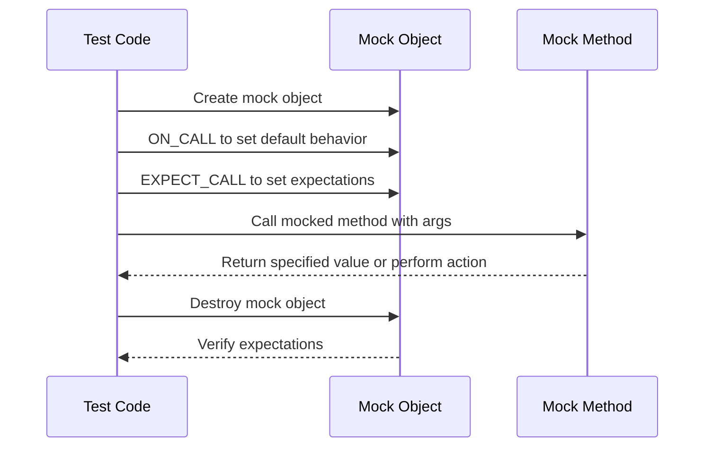

# Introducing Mocks: Using GoogleMock

GoogleMock (gMock) is a powerful framework for writing and using C++ mock classes, empowering you to create mocks that help you verify interactions and control behavior in your unit tests. This guide walks you through how to create mock classes, specify expectations, and verify the behavior of mocked methods.

---

## Workflow Overview

### What This Guide Helps You Accomplish
- Learn how to write mock classes using the `MOCK_METHOD` macro.
- Understand how to set default behaviors with `ON_CALL`.
- Define expectations on mock methods using `EXPECT_CALL` including argument matchers, call sequences, and cardinalities.
- Verify that mocked methods are called as expected within your tests.

### Prerequisites
- Basic knowledge of C++ programming.
- Familiarity with virtual functions and interfaces.
- GoogleMock and GoogleTest installed and configured in your development environment.

### Expected Outcome
By following this guide, you will be able to write effective mock classes, set up default behaviors and expectations, and confidently verify interactions of your code with those mocks.

### Time Estimate
Approximately 20-30 minutes to read through and practice with code examples.

### Difficulty Level
Beginner to Intermediate. This guide starts with straightforward concepts and builds up to more complex scenarios.

---

## Step-by-Step Instructions

### Step 1: Define Your Mock Class

You create a mock class by deriving from the interface or base class you want to mock, then use the `MOCK_METHOD` macro to declare mocked methods.

- Place `MOCK_METHOD` declarations in the **public** section of your mock class, even if the methods you override are otherwise protected or private.
- The syntax is:

```cpp
MOCK_METHOD(ReturnType, MethodName, (Args...), (Specs...));
```

**Example:** Mocking a `Turtle` interface

```cpp
class Turtle {
 public:
  virtual ~Turtle() {}
  virtual void PenUp() = 0;
  virtual void Forward(int distance) = 0;
  virtual int GetX() const = 0;
};

class MockTurtle : public Turtle {
 public:
  MOCK_METHOD(void, PenUp, (), (override));
  MOCK_METHOD(void, Forward, (int distance), (override));
  MOCK_METHOD(int, GetX, (), (const, override));
};
```

### Tips:
- If your method's arguments contain commas (e.g., templated types), wrap the argument or return type in an extra set of parentheses or define type aliases to avoid syntax errors.
- Use the fourth parameter `(const, override)` to correctly mock const methods.

---

### Step 2: Specify Default Behavior with `ON_CALL`

`ON_CALL` lets you define the default action when a mock method is called, without enforcing that it must be called.

Usage:

```cpp
ON_CALL(mock_object, Method(matchers))
  .WillByDefault(action);
```

- The `.With(...)` clause is optional and restricts `.WillByDefault` to calls matching additional criteria.
- Use `WillByDefault(Return(value))` or lambdas to specify return values or side effects.

**Example:**

```cpp
MockTurtle turtle;
ON_CALL(turtle, GetX()).WillByDefault(Return(0));
ON_CALL(turtle, PenUp());  // defaults to do nothing
```

---

### Step 3: Set Expectations with `EXPECT_CALL`

The `EXPECT_CALL` macro allows you to declare how your mock should be called during testing, verifying argument values, call counts, and call order.

Basic syntax:

```cpp
EXPECT_CALL(mock_object, Method(arg_matchers))
    .Times(cardinality)        // optional
    .With(multi_arg_matcher)   // optional
    .InSequence(seq...)         // optional
    .After(expectations...)     // optional
    .WillOnce(action)           // optional
    .WillRepeatedly(action)     // optional
    .RetiresOnSaturation();     // optional
```

#### Key Points:
- `Times(...)` specifies how many times the call is expected.
- If omitted, gMock infers the call count from `WillOnce` and `WillRepeatedly` clauses.
- `InSequence` and `After` allow controlling call order.
- You can chain multiple `.WillOnce()` calls to return different values in successive calls.

**Example:**

```cpp
EXPECT_CALL(turtle, Forward(100))
    .Times(2)
    .WillOnce(Return())
    .WillOnce(Return());
```

Or to specify different return values:

```cpp
EXPECT_CALL(turtle, GetX())
    .WillOnce(Return(10))
    .WillOnce(Return(20))
    .WillRepeatedly(Return(30));
```

---

### Step 4: Use Matchers for Argument Validation

Rather than specifying exact argument values, use built-in or custom matchers to express flexible argument constraints:

- `_` matches any value.
- `Eq(value)`, `Ge(value)`, `Lt(value)` etc. match specific conditions.

**Example:**

```cpp
EXPECT_CALL(turtle, Forward(Ge(0)));  // Moves forward at least 0 units.
EXPECT_CALL(turtle, GoTo(_, 50));     // Y coordinate fixed to 50, X anything.
```

---

### Step 5: Verify and Clear Expectations

- Expectations are verified automatically when the mock is destroyed.
- You can force verification and clearing earlier using:

```cpp
Mock::VerifyAndClearExpectations(&mock_object);
Mock::VerifyAndClear(&mock_object);  // also clears ON_CALL defaults
```

- Setting expectations after verification or after the mock has been used results in undefined behavior.

---

## Examples & Code Samples

### Creating Mock Classes

```cpp
class MockFoo : public Foo {
 public:
  MOCK_METHOD(int, Add, (int x), (override));
  MOCK_METHOD(void, Reset, (), (override));
};
```

### Using `ON_CALL` and `EXPECT_CALL`

```cpp
MockFoo mock;

// Default behavior: Add returns 0.
ON_CALL(mock, Add(_)).WillByDefault(Return(0));

// Expect Add to be called once with 5.
EXPECT_CALL(mock, Add(5)).WillOnce(Return(10));

EXPECT_EQ(mock.Add(5), 10);  // Matches EXPECT_CALL action
EXPECT_EQ(mock.Add(3), 0);   // Matches ON_CALL action
```

### Ordering Calls with `InSequence`

```cpp
{
  InSequence s;
  EXPECT_CALL(mock, Reset());
  EXPECT_CALL(mock, Add(10));
}

mock.Reset();
mock.Add(10);
```

If calls happen out of order, gMock fails the test.

### Ignoring Calls with NiceMock

To suppress warnings about uninteresting calls:

```cpp
NiceMock<MockFoo> nice_mock;
// Uncovered calls won't emit warnings
```

### Setting Expectation for Method with No Arguments

```cpp
EXPECT_CALL(mock, Reset()).Times(1);
```

### Using Wildcard Matchers

```cpp
EXPECT_CALL(mock, Add(_)).Times(AtLeast(1));
```

---

## Troubleshooting & Tips

### Common Issues

- **Uninteresting calls warning**: Occurs when a mock method is called without an `EXPECT_CALL`. Fix by adding `EXPECT_CALL(...).Times(AnyNumber())` or use `NiceMock`.
- **Order violations**: If calls are made out of sequence, consider using `InSequence` or relax ordering requirements.
- **Argument mismatch failures**: Use proper matchers or verify argument values carefully.
- **Failed expectations on mock destruction**: Ensure the mock object is properly destroyed or call `VerifyAndClearExpectations()` before destruction.
- **Mock methods not called as expected**: Double-check your `EXPECT_CALL` setup and confirm the code under test is invoking the mock method correctly.

### Best Practices

- Use `ON_CALL` to set default behavior when you don't need to verify calls.
- Use `EXPECT_CALL` when you want to verify a call and/or specify behavior.
- Define your mock classes in appropriate locations to match your project structure.
- Favor `NiceMock` to suppress unwanted warnings unless strictness is necessary.
- Use sequences (`InSequence`) and `After()` clauses to model order constraints clearly.
■
### Performance Consideration

Compiling mock classes can be slow, especially with many mock methods. You can:
- Move constructor and destructor definitions out of the header to `.cc` files.
- Limit the number of different mock method signatures in one class.

---

## Next Steps & Related Content

- **What’s Next**: After mastering mock creation and expectations, explore advanced topics like custom matchers, actions, and asynchronous testing support.
- **Related Guides**:
  - [gMock Cookbook](https://google.github.io/googletest/gmock_cook_book.html) — detailed recipes and advanced usage.
  - [Mocking API Reference](https://google.github.io/googletest/reference/mocking.html) — in-depth API documentation.
  - [Writing Your First Test](../core_testing_workflows/writing_first_test) — foundation in test writing.
- **Advanced Topics**: Delegating calls, handling move-only types, partial ordering, and combining mocks with fakes.
- **Resources**:
  - [GoogleTest Primer](../product-intro-core-concepts/core-concepts-terminology) — for overall GoogleTest concepts.
  - [GoogleMock Official GitHub Repository](https://github.com/google/googletest) — source and examples.

---

## Summary Diagram: Mocking Workflow Overview


```


<Tip>
Remember that `EXPECT_CALL` sets expectations on calls that must occur, while `ON_CALL` sets default behavior without requiring calls.
</Tip>

<Note>
All `MOCK_METHOD` macros must appear in the public section of your mock class, even if the real methods are protected or private.
</Note>