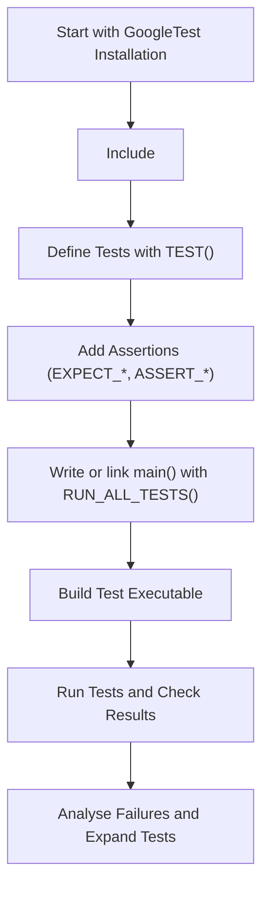

# Writing Your First Test with GoogleTest

Welcome to your first step in mastering GoogleTest — Google's powerful C++ testing framework. This guide will take you on a beginner-friendly journey to create your first test case, showcasing basic assertions and the structure needed to write meaningful tests that bring immediate feedback on your code quality.

---

## Overview

### What You Will Accomplish
This guide helps you create and run your first GoogleTest test suite. You will learn to define simple test cases using the `TEST()` macro, use basic assertions to verify your code's behavior, and understand the flow of test execution.

### Prerequisites
- A C++ development environment with GoogleTest installed and configured.
- Basic familiarity with C++ syntax and compiling C++ code.
- Your project must be set up to include the GoogleTest headers and link with GoogleTest libraries, as detailed in the [Building and Configuring Your Project](https://github.com/google/googletest/blob/main/docs/building-configuring-project.md) guide.

### Expected Outcome
By following this guide, you will have a working test suite with at least two tests, running and reporting results on your console. You will be able to interpret the test outcomes and know how to extend your suite with additional tests.

### Time Estimate
Approximately 10–15 minutes.

### Difficulty Level
Beginner

---

## Step-by-Step Instructions

### 1. Include GoogleTest Headers
Your test source files must include the GoogleTest header to access its testing macros and features.

```cpp
#include <gtest/gtest.h>
```

### 2. Define a Simple Test Case
Use the `TEST()` macro to define individual test cases. Each test belongs to a test suite (first argument) and has a unique test name (second argument). Avoid underscores in names to follow naming conventions.

Example for testing a simple `Factorial` function:

```cpp
// Tests factorial of 0.
TEST(FactorialTest, HandlesZeroInput) {
  EXPECT_EQ(Factorial(0), 1);
}

// Tests factorial of positive numbers.
TEST(FactorialTest, HandlesPositiveInput) {
  EXPECT_EQ(Factorial(1), 1);
  EXPECT_EQ(Factorial(2), 2);
  EXPECT_EQ(Factorial(3), 6);
  EXPECT_EQ(Factorial(8), 40320);
}
```

Here, `FactorialTest` is the test suite name grouping these related tests.

### 3. Use Assertions to Verify Expected Behavior
GoogleTest provides assertions like `EXPECT_EQ()` and `ASSERT_EQ()` to check conditions. Use `EXPECT_*` for non-fatal failures allowing tests to continue and `ASSERT_*` for fatal failures that abort the current test function.

Example:

```cpp
EXPECT_EQ(result, expected_value) << "Failure details if the assertion fails.";
```

### 4. Write a `main()` Function to Run Tests
If your build setup does not link against `gtest_main` (which provides a ready-made `main`), include and implement the standard `main` function:

```cpp
int main(int argc, char **argv) {
  ::testing::InitGoogleTest(&argc, argv);
  return RUN_ALL_TESTS();
}
```

This initializes GoogleTest with command-line arguments and runs all registered tests.

### 5. Build and Run Your Tests
- Compile your test program ensuring you link with GoogleTest libraries.
- Run the binary to see your tests execute, with console output showing success or failure per test.

Sample output for successful tests:

```
[==========] Running 2 tests from 1 test suite.
[----------] Global test environment set-up.
[----------] 2 tests from FactorialTest
[ RUN      ] FactorialTest.HandlesZeroInput
[       OK ] FactorialTest.HandlesZeroInput (0 ms)
[ RUN      ] FactorialTest.HandlesPositiveInput
[       OK ] FactorialTest.HandlesPositiveInput (0 ms)
[----------] 2 tests from FactorialTest (0 ms total)
[----------] Global test environment tear-down
[==========] 2 tests from 1 test suite ran. (0 ms total)
[  PASSED  ] 2 tests.
```

### 6. Interpret Test Results
- `PASSED` indicates the test succeeded.
- If assertions fail, you will see failure messages with file name and line number.

---

## Practical Tips & Best Practices

- **Name your test suites and tests meaningfully** to reflect what they verify.
- **Group related tests in the same test suite** to keep your tests organized.
- Prefer `EXPECT_*` assertions to continue multiple checks within a single test.
- Use `ASSERT_*` assertions when an error should abort the test immediately to prevent undefined states.
- Keep tests independent and repeatable; each test should set up its own necessary state.
- Take advantage of GoogleTest’s rich assertions suite to check for various conditions.

---

## Common Pitfalls & Troubleshooting

<AccordionGroup title="Common Issues When Writing Your First Test">
<Accordion title="Test Not Running or Registered">
Make sure your test file:
- Includes `<gtest/gtest.h>`.
- Is compiled and linked properly into your test executable.

Verify you call `RUN_ALL_TESTS()` in `main()` or link with `gtest_main`.
</Accordion>

<Accordion title="Test Fails to Compile Due to Macros">
Ensure you do not have conflicting macros or define `GTEST_DONT_DEFINE_TEST` without adjusting code.
Use the recommended `TEST()` and `TEST_F()` macros unless you have a specific need.
</Accordion>

<Accordion title="Assertion Failures Unexpectedly Abort Entire Test Suite">
Differentiate between `ASSERT_*` and `EXPECT_*` macros. `ASSERT_*` aborts test on failure.
Use `EXPECT_*` to run multiple checks in a test and collect multiple failures.
</Accordion>

<Accordion title="Tests Compile but Crash or Segfault">
Check that pointers used in your tests are valid before dereferencing.
Use `ASSERT_NE(ptr, nullptr)` as a guard before accessing pointer members.
</Accordion>
</AccordionGroup>

---

## Next Steps & Related Content

- Explore [Using Test Fixtures](https://github.com/google/googletest/blob/main/docs/primer.md#same-data-multiple-tests) to reuse test data setup.
- Learn to run and interpret tests with [Running and Validating Tests](https://github.com/google/googletest/blob/main/docs/running-tests.md).
- Deep dive into [Assertions Reference](https://github.com/google/googletest/blob/main/docs/reference/assertions.md) for more powerful test verification techniques.
- Extend your tests with mocking using [GoogleMock](https://github.com/google/googletest/blob/main/googlemock/README.md).

---

For additional samples and real-world test examples, visit the [Googletest Samples repository](https://github.com/google/googletest/tree/main/googletest/samples).

---

## Summary Diagram: Test Writing Flow



This visualizes your test writing journey from setup to evaluation.

---

For detailed API references, dive into the [GoogleTest Core Testing API](https://github.com/google/googletest/tree/main/docs/reference/testing.md).

Happy Testing!

---

## References
- [GoogleTest Primer](https://github.com/google/googletest/blob/main/docs/primer.md)
- [Assertions Reference](https://github.com/google/googletest/blob/main/docs/reference/assertions.md)
- [Build and Configure Your Project](https://github.com/google/googletest/blob/main/docs/building-configuring-project.md)
- [Running and Validating Tests](https://github.com/google/googletest/blob/main/docs/running-tests.md)
- [GoogleMock Introduction](https://github.com/google/googletest/blob/main/googlemock/README.md)

---