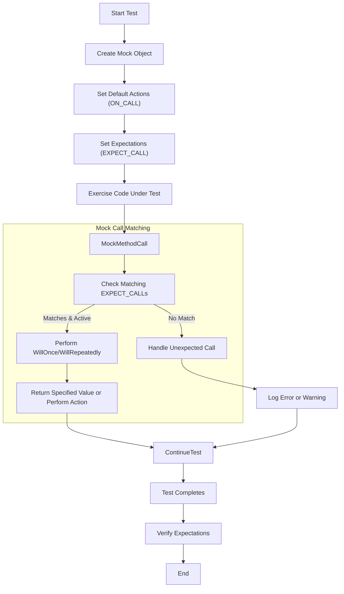

# Mocking Dependencies with GoogleMock

Efficient isolation and precise control over dependencies is key to robust and maintainable C++ unit tests. This guide walks you through the essential steps of creating and using mocks with GoogleMock (gMock) — a powerful framework to define mock classes, set expectations, specify behaviors, and verify interactions.

Whether you want to simulate collaborators, verify call sequences, or inject customizable responses, mastering mocks is the backbone to interaction-based testing.

---

## 1. Understanding the Role of Mocks

Mocks are stand-in objects that emulate the interfaces your code depends on. Unlike real implementations, mocks provide explicit controls:

- **Expectations:** Define which methods will be called.
- **Match Arguments:** Specify how calls with particular argument values or properties are handled.
- **Actions:** Define return values or side effects when mocked methods are invoked.

By isolating dependencies with mocks, you gain tight control over your tests’ environment and can validate intricate behaviors.

---

## 2. Defining Mock Classes

Start by deriving your mock class from the interface or base class you want to fake. Then, use the `MOCK_METHOD` macro to declare mock methods. Each `MOCK_METHOD` matches one virtual method from the interface.

### Step-by-Step:

1. **Derive from the Interface:**
   ```cpp
   class Foo {
    public:
     virtual ~Foo();
     virtual int GetSize() const = 0;
     virtual std::string Describe(const char* name) = 0;
     virtual bool Process(int elem, int count) = 0;
   };

   class MockFoo : public Foo {
    public:
     MOCK_METHOD(int, GetSize, (), (const, override));
     MOCK_METHOD(std::string, Describe, (const char* name), (override));
     MOCK_METHOD(bool, Process, (int elem, int count), (override));
   };
   ```
   
2. **Mock Methods Must be Public:** Even if the real methods are protected/private, mock declarations should always be in the `public:` section.

3. **Handling Overloads:** Each overload requires a separate `MOCK_METHOD` declaration, specifying argument types precisely.

4. **Using Type Aliases for Complex Types:** If argument or return types have commas (e.g., template types), alias them to avoid macro parsing issues:
   ```cpp
   using Pair = std::pair<int, double>;
   MOCK_METHOD(bool, CheckPair, (Pair), (override));
   ```

### Tips:
- Always ensure overridden methods are marked with `(override)` for better compiler checks.
- For `const` methods, add `(const, override)` qualifiers.

---

## 3. Creating and Using Mock Objects in Tests

Once your mock class is ready, create an instance in tests and set expectations on its methods.

### Typical Workflow:

1. **Create the mock object:**
   ```cpp
   MockFoo foo;
   ```

2. **Optionally configure default behaviors with `ON_CALL()`:**
   These define what happens when methods are called but are *not* expected explicitly.

3. **Set expectations with `EXPECT_CALL()`:**
   Specify which calls should occur, how often, with what arguments, and what to do:
   ```cpp
   EXPECT_CALL(foo, GetSize())
       .Times(1)
       .WillOnce(Return(42));
   ```

4. **Exercise the code under test that uses your mock:**

5. **Let GoogleMock verify expectations automatically when the mock goes out of scope.**

### Example:
```cpp
using ::testing::Return;

TEST(MyTest, Example) {
  MockFoo foo;

  // Set default response if GetSize() is called without explicit expectation
  ON_CALL(foo, GetSize())
      .WillByDefault(Return(1));

  // Expect Describe("item") to be called exactly once and return value
  EXPECT_CALL(foo, Describe("item"))
      .Times(1)
      .WillOnce(Return(std::string("description")));

  // Call the mock object methods
  EXPECT_EQ(foo.GetSize(), 1);           // Default action fires
  EXPECT_EQ(foo.Describe("item"), "description");  // Expected call
}
```

---

## 4. Setting Expectations with `EXPECT_CALL`

`EXPECT_CALL` is where you define your interest in specific calls to mock methods.

The syntax:
```cpp
EXPECT_CALL(mock_object, MethodName(matchers...))
    .With(tuple_matcher)        // Optional: match all args as a whole
    .Times(cardinality)         // Optional: how many times
    .InSequence(sequences...)   // Optional: impose call order
    .After(expectations...)     // Optional: advanced call order
    .WillOnce(action)           // Optional: action on specific call
    .WillRepeatedly(action)     // Optional: action on all subsequent calls
    .RetiresOnSaturation();     // Optional: deactivate expectation after saturated
```

### Key Clauses Explained

- **Matchers:** Match function arguments individually. Use `_` for “anything”.
- **With:** Combine all arguments into a tuple and match them simultaneously.
- **Times:** Specify expected number of calls (`Exactly(n)`, `AnyNumber()`, `AtLeast(n)`, etc).
- **InSequence:** Expect calls to occur in a specified sequence.
- **After:** Specify that calls must happen after one or more other expectations.
- **WillOnce:** Specify action for a single matching call.
- **WillRepeatedly:** Action for all matching calls after `WillOnce`s are exhausted.
- **RetiresOnSaturation:** Automatic retirement of expectation after meeting upper call limit.

### Example:
```cpp
EXPECT_CALL(foo, Process(Ge(10), _))  // First arg must be >= 10, second arg anything
    .Times(AtLeast(1))               // Must be called at least once
    .WillOnce(Return(true))          // Returns 'true' on first call
    .WillRepeatedly(Return(false));  // Returns 'false' afterwards
```

---

## 5. Defining Default Actions with `ON_CALL`

`ON_CALL` specifies what happens when a mock method is called but without explicit expectations. This enables you to define general mock behavior without enforcing calls.

### Syntax:
```cpp
ON_CALL(mock_object, MethodName(matchers...))
    .With(tuple_matcher)      // Optional
    .WillByDefault(action);  // Required
```

### Key Points:
- Defines default behavior, but *does not* set expectations.
- Matching order in the presence of multiple `ON_CALL`s follows the reverse order rule as `EXPECT_CALL`.
- Even if unexpected calls happen, default actions will execute (unless strict mocks are used).

### Example:
```cpp
ON_CALL(foo, GetSize())
    .WillByDefault(Return(5));

// With this, calls to GetSize() that are not expected explicitly will return 5.
```

---

## 6. Controlling Mock Strictness: NiceMock, NaggyMock, and StrictMock

GoogleMock provides wrappers around your mocks to control how uninteresting calls are treated.

| Mock Type      | Description                                         | Example Usage                      |
| -------------- | --------------------------------------------------- | --------------------------------- |
| `NiceMock<T>`  | Suppresses warnings about uninteresting calls.     | `NiceMock<MockFoo> nice_foo;`     |
| `NaggyMock<T>` | (Default) Logs warnings when uninteresting calls occur.| `NaggyMock<MockFoo> naggy_foo;` |
| `StrictMock<T>`| Fails test on any uninteresting call (treats as error).| `StrictMock<MockFoo> strict_foo;`|

They all inherit constructors of the underlying mock so you can construct them with arguments.

### Example:
```cpp
using ::testing::NiceMock;
NiceMock<MockFoo> mock;
EXPECT_CALL(mock, DoSomething());
// Other uninteresting calls are ignored silently.
```

---

## 7. Matching Arguments

To specify which arguments a mock method expects, use matchers:

- `_` matches anything.
- `Eq(val)`, `Ge(val)`, `Le(val)`, `NotNull()`, and many others match specific properties.

Examples:
```cpp
EXPECT_CALL(foo, Process(Eq(5), _));
EXPECT_CALL(foo, Get(Ge(10)));
```

You can combine matchers:
```cpp
using ::testing::AllOf;
EXPECT_CALL(foo, Value(AllOf(Ge(0), Le(100))));
```

Use `.With()` to match the entire argument tuple:
```cpp
EXPECT_CALL(foo, Function(_, _))
    .With(Lt());  // First argument less than second.
```

---

## 8. Specifying Actions

Determine the behavior your mock methods perform on call.

### Common Built-in Actions

- `Return(x)` - Returns a copy of `x`.
- `ReturnRef(x)` - Returns a reference to `x`.
- `ReturnPointee(ptr)` - Returns the value pointed by `ptr` at the time of call.
- `SetArgPointee<N>(value)` - Sets the value pointed to by the N-th argument.
- `DoAll(action1, action2, ...)` - Performs multiple actions in sequence.
- `Invoke()` - Calls a function, method, or lambda.

### Example:
```cpp
EXPECT_CALL(foo, GetValue())
    .WillOnce(Return(42));

EXPECT_CALL(foo, SetValue(_, _))
    .WillOnce(DoAll(SetArgPointee<1>(5), Return(true)));
```

### Custom actions
nYou can use lambdas or function pointers to define custom behavior:
```cpp
EXPECT_CALL(foo, Process(_))
    .WillOnce([](int x) { return x * 2; });
```

---

## 9. Ordering Calls

By default, expectations can be matched in any order. Use these to enforce sequences:

### Using `InSequence`
```cpp
{
  InSequence s;
  EXPECT_CALL(foo, FirstCall());
  EXPECT_CALL(foo, SecondCall());
}
```
This specifies that `FirstCall()` must happen before `SecondCall()`.

### Using multiple sequences (`Sequence` objects)
Use multiple sequences to define partial orderings.

### Using `.After()`
Specify that an expectation must occur after one or more other expectations.

### Example:
```cpp
Sequence s1, s2;
EXPECT_CALL(foo, A()).InSequence(s1);
EXPECT_CALL(bar, B()).InSequence(s2);
EXPECT_CALL(foo, C()).InSequence(s1, s2);
```

This enforces that `foo.A()` happens before `foo.C()`, and `bar.B()` happens before `foo.C()`, but order between `foo.A()` and `bar.B()` is unspecified.

---

## 10. Retiring Expectations

By default, expectations stay active even after being saturated (called max times).

Use `.RetiresOnSaturation()` to deactivate an expectation after it has been satisfied to allow other overlapping expectations to be applied.

Example:
```cpp
EXPECT_CALL(foo, SetValue(7))
  .Times(2)
  .RetiresOnSaturation();
```
After two calls of `SetValue(7)`, this expectation becomes inactive.

---

## 11. Clearing and Verifying Mocks Explicitly

Sometimes you want to explicitly verify or clear expectations on mocks before destruction.

- `Mock::VerifyAndClearExpectations(&mock_obj)` verifies expectations and removes them.
- `Mock::VerifyAndClear(&mock_obj)` additionally clears default actions.

### Usage:
```cpp
if (!Mock::VerifyAndClearExpectations(&mock)) {
  FAIL() << "Mock verification failed.";
}
```

⚠️ Do not set expectations after clearing; doing so causes undefined behavior.

---

## 12. Practical Tips and Best Practices

- Set expectations *before* exercising your code.
- Use `ON_CALL` for default behaviors and `EXPECT_CALL` only when verifying calls.
- Use `NiceMock` to suppress warnings about uninteresting calls during routine tests.
- Name your `InSequence` variables meaningfully when used extensively.
- Use matchers thoughtfully; overly strict matchers increase test brittleness.
- For overloaded methods, disambiguate using `Const()` or casting matchers.

---

## 13. Troubleshooting Common Issues

| Issue                              | Cause                                              | Solution                                                |
|----------------------------------|---------------------------------------------------|---------------------------------------------------------|
| Unexpected mock function calls    | Call arguments don’t match expectations           | Review matchers; check call order; use verbose flag for tracing |
| Too many calls to a mock function | Expectation saturated, but call happens again      | Use `.RetiresOnSaturation()` or adjust `Times()`        |
| Uninteresting call warnings       | Method called without `EXPECT_CALL`                | Use `NiceMock`, add catch-all `EXPECT_CALL` with `Times(AnyNumber())`, or adjust verbose flags |
| Failing on uncopyable argument matcher | Matcher copies argument in expectation setup       | Use reference-based matchers, or `Truly()` predicates   |

Use `--gmock_verbose=info` flag to get detailed call trace for debugging.

---

## 14. Summary

Mocking with GoogleMock empowers you to precisely describe, control, and verify interactions with dependencies in your tests. Creating mock classes with `MOCK_METHOD`, setting up default behaviors with `ON_CALL`, specifying call expectations with `EXPECT_CALL`, and using sequences to order calls provide a rich and expressive framework to write maintainable and robust tests.

Use the strictness wrappers `NiceMock`, `NaggyMock`, or `StrictMock` to tune feedback from uninteresting calls.

Mastering matchers, actions, call ordering, and lifecycle management will turn your test suite into a trustworthy armor against regressions.

---

## 15. Additional Resources

- [Mocking Reference](docs/reference/mocking.md) — Definitive API documentation for mock-related macros and classes.
- [gMock Cheat Sheet](docs/gmock_cheat_sheet.md) — Accelerated overview of mock usage and syntax.
- [gMock Cookbook](docs/gmock_cook_book.md) — Recipes and best practices for complex scenarios.
- [gMock for Dummies](docs/gmock_for_dummies.md) — Beginner-friendly introductory walkthrough.
- [NiceMock, NaggyMock, and StrictMock](api-reference/mock-behavior-extensions/nice-naggy-strict-mocks.md) — Thorough explanation of mock strictness levels.
- [Understanding Matchers and Actions](reference/matchers.md), [Actions Reference](reference/actions.md) — In-depth exploration of argument and action customization.

---

## 16. Mermaid Diagram: Mock Call Workflow Overview


---

## 17. Source Code Reference

See the official [GoogleMock GitHub repository](https://github.com/google/googletest) for extensive test cases illustrating real usage patterns:

- Core expectation building and call handling: `googlemock/test/gmock-spec-builders_test.cc`
- Mock strictness behaviors: `googlemock/test/gmock-nice-strict_test.cc`
- Core usage examples and advanced patterns: [gMock Cheat Sheet](docs/gmock_cheat_sheet.md), [gMock Cookbook](docs/gmock_cook_book.md)

# End of Guide
