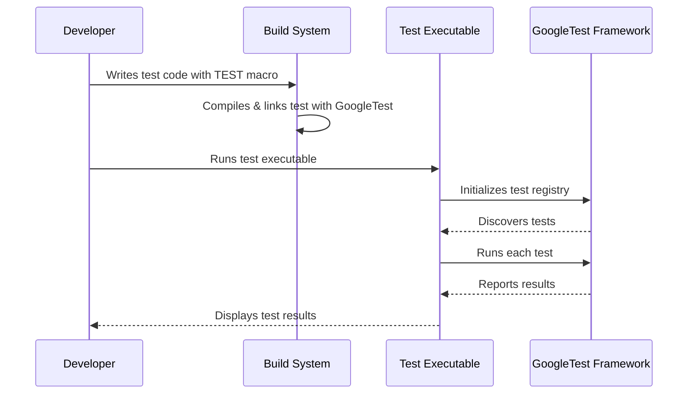

# Writing Your First Test

Welcome to your first step into unit testing C++ code with GoogleTest. This guide shows you how to set up GoogleTest in your project, write a simple test case, run it, and understand the basics of test discovery. Designed for newcomers, it guides you through a smooth and practical introduction to automated testing.

---

## 1. What You Will Achieve

- **Task Description**: Learn how to write and run your first GoogleTest test case, including basic test discovery mechanisms.
- **Prerequisites**: 
  - A C++17-capable compiler and a supported platform.
  - GoogleTest installed and configured in your project.
  - Basic familiarity with C++ coding.
- **Expected Outcome**: Successfully compile and run a simple test verifying your setup and understanding test output.
- **Estimated Time**: 10 to 20 minutes.
- **Difficulty Level**: Beginner.

---

## 2. Preparing Your Environment

Before writing tests, ensure that:

- GoogleTest is installed following the recommended installation methods such as via CMake or Bazel. For CMake, see the [Installation with CMake](../../getting-started/prerequisites-installation/installation-cmake) guide.
- Your build system is set up to include GoogleTest headers and link against its libraries.
- You can compile a simple program with GoogleTest linked.

If you haven't set this up yet, consult the [System Requirements](../../getting-started/prerequisites-installation/system-requirements) and installation guides.

---

## 3. Writing Your First Test Case

### Step 1: Include GoogleTest Header

Create a new C++ source file (e.g., `my_first_test.cc`) and include the GoogleTest header:

```cpp
#include <gtest/gtest.h>
```

### Step 2: Define a Simple Test

Use the `TEST()` macro to define a test. The syntax is:

```cpp
TEST(TestSuiteName, TestName) {
  // Your test logic and assertions go here
}
```

Both `TestSuiteName` and `TestName` must be valid C++ identifiers without underscores.

Here's an example testing simple integer equality:

```cpp
TEST(FactorialTest, HandlesZeroInput) {
  EXPECT_EQ(1, 1);  // A trivial test passing.
}
```

### Step 3: Add More Tests

You can define multiple tests in the same test suite:

```cpp
TEST(FactorialTest, HandlesPositiveInput) {
  EXPECT_EQ(2, 2);
}
```

### What Happens Here?

- `FactorialTest` is your test suite grouping related test cases.
- `HandlesZeroInput` and `HandlesPositiveInput` are two different tests within that suite.
- `EXPECT_EQ()` checks if two values are equal.


---

## 4. Building and Running Your Tests

### Step 1: Compile Your Tests

Compile your test source file with the GoogleTest library:

If you use CMake, ensure your `CMakeLists.txt` links against `gtest` or `gtest_main`.

Example using `g++` directly:

```bash
c++ -std=c++17 -isystem /usr/local/include -pthread my_first_test.cc /usr/local/lib/libgtest.a /usr/local/lib/libgtest_main.a -o my_first_test
```

Replace `/usr/local/include` and `/usr/local/lib` with your GoogleTest install locations.

### Step 2: Run the Tests

Execute the test binary:

```bash
./my_first_test
```

### Expected Output

You will see output indicating which tests ran and their status:

```none
[==========] Running 2 tests from 1 test suite.
[----------] Global test environment set-up.
[----------] 2 tests from FactorialTest
[ RUN      ] FactorialTest.HandlesZeroInput
[       OK ] FactorialTest.HandlesZeroInput (0 ms)
[ RUN      ] FactorialTest.HandlesPositiveInput
[       OK ] FactorialTest.HandlesPositiveInput (0 ms)
[----------] 2 tests from FactorialTest (0 ms total)
[----------] Global test environment tear-down
[==========] 2 tests from 1 test suite ran. (0 ms total)
[  PASSED  ] 2 tests.
```

This confirms your tests ran successfully.

---

## 5. Understanding Test Discovery

- GoogleTest automatically discovers tests defined by `TEST`, `TEST_F`, and `TEST_P` macros during initialization.
- You do not need to list tests manually.
- Tests are grouped into test suites which correspond to the first parameter of the macro.

You can list all test names without running them using:

```bash
./my_first_test --gtest_list_tests
```

Example output:

```none
FactorialTest.
  HandlesZeroInput
  HandlesPositiveInput
```

---

## 6. Writing Tests with Fixtures (Optional Next Step)

While this guide covers basic tests, your next step may involve using test fixtures to share setup/teardown and data, using `TEST_F()`. See the [Test Fixtures guide](../core_workflows/organizing_test_suites.md) for details.

---

## 7. Troubleshooting Common Issues

### Compilation Errors
- Ensure GoogleTest headers and libraries are in your compiler's search paths.
- Remember to compile with C++17 support.

### Tests Not Running
- Confirm your test binary is built with GoogleTest correctly linked.
- Use `--gtest_list_tests` to verify that tests are discovered.

### Test Output Is Confusing
- Use verbose test output flags.
- Review assertion syntax; prefer `EXPECT_` macros for non-fatal checks.

### Ignored Return Value of RUN_ALL_TESTS
Do not ignore the return value of `RUN_ALL_TESTS()` in `main()`. Return it explicitly:

```cpp
int main(int argc, char** argv) {
  testing::InitGoogleTest(&argc, argv);
  return RUN_ALL_TESTS();
}
```

---

## 8. Best Practices and Tips

- Avoid underscores in your test suite and test names to prevent unexpected errors.
- Use `EXPECT_*` assertions when you want tests to continue after failure, and `ASSERT_*` when failure should abort the current test.
- Write tests that focus on *one logical check* to make debugging easier.
- Organize tests logically by feature or class using test suites.
- Use `GTEST_SKIP()` macro to skip tests conditionally.

---

## 9. Next Steps

- Explore [Value-Parameterized and Typed Tests](../integration_and_best_practices/parameterized_and_typed_tests.md) to write more flexible tests.
- Learn about [Assertions](../core_workflows/using_assertions_effectively.md) for comprehensive test verification.
- Use [GoogleMock](../../getting-started/configuration-first-run/quick-start-mocking.md) for mocking dependencies.
- Review the [Troubleshooting Validation guide](../../getting-started/troubleshooting-validation/validate-setup.md) if you encounter setup issues.

---

## 10. Additional Resources

- [GoogleTest Primer](../../overview/product-intro/what-is-googletest.md)
- [Writing and Running Tests Reference](../../reference/testing.md)
- [GoogleTest Samples Repository](../../docs/samples.md)

---

## Minimal Complete Example

```cpp
#include <gtest/gtest.h>

// Simple test suite called `FactorialTest` with two tests
TEST(FactorialTest, HandlesZeroInput) {
  EXPECT_EQ(1, 1);
}

TEST(FactorialTest, HandlesPositiveInput) {
  EXPECT_EQ(2, 2);
}

int main(int argc, char** argv) {
  testing::InitGoogleTest(&argc, argv);
  return RUN_ALL_TESTS();
}
```

Save this as `my_first_test.cc`, build it against GoogleTest, and run to see tests execute.

---

# Summary Diagram: First Test Workflow



---

<View source="https://github.com/google/googletest" branch="main" paths={[{"path": "getting-started/configuration-first-run/write-first-test.mdx", "range": "all"}]} />

<Note>
Ensure you return the result of `RUN_ALL_TESTS()` from your `main()` to properly report test success/failure.
</Note>

<Check>
Use `--gtest_list_tests` to confirm your tests are discovered before running.
</Check>

<Warning>
Avoid underscores in test suite and test names to prevent unexpected failures.
</Warning>