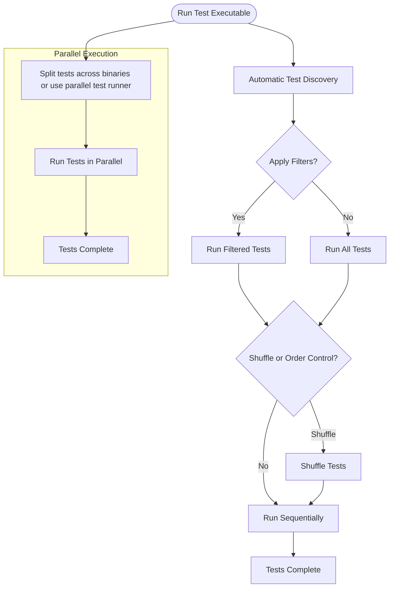

# Test Discovery & Execution Workflows

## Overview

This guide explains how GoogleTest automatically discovers tests in your code and provides you with flexible options to execute them. You will learn how to run subsets of tests through filtering, control the order in which tests run, and execute tests in parallel to speed up large test suites. This knowledge will empower you to efficiently manage and execute your tests, yielding faster, more focused feedback.

---

## Prerequisites

- GoogleTest and GoogleMock are installed and integrated into your C++ project.
- You have built at least one test executable using GoogleTest.
- Basic familiarity with test definitions using `TEST()` or `TEST_F()` macros.

---

## Expected Outcome

By following this guide, you will understand how GoogleTest:

- Automatically discovers and registers your tests.
- Supports running selected tests via command-line filters.
- Allows controlling test execution order.
- Enables parallel test execution to reduce total test runtime.

---

## Time Estimate

Approximately 15-25 minutes to read through and apply command-line options to your test runs.

---

## Difficulty Level

Beginner to Intermediate. No programming changes required, mostly command-line usage and configuration.

---

## 1. How GoogleTest Automatically Discovers Tests

GoogleTest uses macros like `TEST()` and `TEST_F()` to define test cases and test suites. When you compile and link your test executable, GoogleTest internally registers all these tests during static initialization.

When the test executable runs, GoogleTest knows about every test and can list or run them automatically.

### What Users Want to Know

- Tests run without manual listing.
- New tests automatically become part of the test run once compiled in.

### What You See

- Running the test binary triggers all tests to run by default.

---

## 2. Running Selected Tests via Filters

Sometimes you want to run only a subset of tests, for example, only tests related to a given module or feature.

### Step-by-Step

1. Open a terminal and navigate to the directory containing your test executable.
2. To list all tests, run:

```bash
./your_test_executable --gtest_list_tests
```

   This displays the available test suites and test names.

3. To run a specific test suite:

```bash
./your_test_executable --gtest_filter=TestSuiteName.*
```

4. To run a specific test within a suite:

```bash
./your_test_executable --gtest_filter=TestSuiteName.TestName
```

5. To run multiple tests or suites separated by `:` (colon), e.g.: 

```bash
./your_test_executable --gtest_filter=Suite1.*:Suite2.TestA
```

6. To exclude tests, prefix the pattern with a minus (`-`), for example:

```bash
./your_test_executable --gtest_filter=-Suite1.TestB
```

7. Filters can combine inclusion and exclusion separated by `-`:

```bash
./your_test_executable --gtest_filter=Suite1.*-Suite1.TestB
```

### Expected Results

- Only tests matching the filter pattern are executed.
- Others are skipped, making test runs faster and more targeted.

### Tips

- Use `*` as a wildcard for any substring.
- Combine multiple patterns with `:` to include multiple tests.

---

## 3. Controlling Test Execution Order

By default, tests run in the order of their registration, which is usually the order of compilation.

Sometimes, order matters (e.g., integration tests) or you want to run high-priority tests first.

### Options

- Use the flag `--gtest_shuffle` to run tests in a random order each time:

```bash
./your_test_executable --gtest_shuffle
```

- To reproduce a shuffled order, use the `--gtest_random_seed` option with the provided seed.

- You can control test execution sequence within your test code by using `InSequence` objects (see the Mocking best practices guide), but this is not part of the command line.

### Expected Results

- Running with shuffle helps uncover inter-test dependencies or hidden assumptions.

### Best Practices

- Avoid relying on test order for clean, independent tests.
- Use shuffling regularly to improve test robustness.

---

## 4. Running Tests in Parallel

For large test suites, running tests sequentially can be slow. GoogleTest supports parallel execution to speed things up.

### Method 1: Run Multiple Test Binaries in Parallel

- If your tests are split across multiple binaries, run them concurrently via your build system or shell scripts.

### Method 2: Use Third-Party Test Runners Supporting Parallel Execution

- GoogleTest itself does not natively implement test parallelism inside one binary.
- Use tools like `CTest` (in CMake) or Bazel's test runner, which run multiple test binaries concurrently.

### Notes

- Parallel execution requires tests to be independent and thread-safe.

- Ensure your tests do not modify shared global or static state without synchronization.

### Troubleshooting

- If tests fail only when run in parallel, investigate shared state or resource conflicts.

- Consider mocking or isolating dependencies to avoid conflicts.

---

## 5. Typical User Workflow



This workflow shows automatic discovery, optional filtering, order control, and parallelism via external tools.

---

## 6. Troubleshooting & Tips

### Common Issues

- **No tests run**: Ensure that test binaries include tests compiled with `TEST()` or `TEST_F()`.
- **Filters exclude all tests**: Verify your filter syntax and test names.
- **Order dependency errors**: Tests should be independent; use `InSequence` cautiously.
- **Parallel tests failing intermittently**: Check for shared mutable state or race conditions.

### Best Practices

- Use `--gtest_list_tests` frequently to verify test names.
- Prefer small, independent tests that can safely run in any order and parallel.
- Combine filtering with shuffling during development to catch hidden test dependencies.
- Use the `--gtest_repeat=N` flag to run tests multiple times in a row, catching flaky tests.

### Performance Considerations

- Parallelize by splitting tests into separate binaries when possible.
- Use build system integration (e.g., CMake, Bazel) to manage concurrency.

---

## 7. Next Steps & Related Content

- Learn about [Test Structure & Main Function](https://github.com/google/googletest/blob/main/api-reference/core-testing-apis/test-structure-and-main.md) to understand test lifecycle.
- Explore [Writing Your First Unit Test](https://github.com/google/googletest/blob/main/guides/getting-started/first-unit-test.md) for hands-on test creation.
- Check [Mocking Techniques & Best Practices](https://github.com/google/googletest/blob/main/guides/essential-testing-patterns/mocking-best-practices.md) to control behavior in complex tests.
- For build integration and execution workflows, see [Integration with Build & CI Systems](https://github.com/google/googletest/blob/main/guides/advanced-usage/integration-workflows.md).

---

## Useful Command-Line Flags Summary

| Flag                      | Description                                               |
|---------------------------|-----------------------------------------------------------|
| `--gtest_list_tests`      | List all discovered tests without running                |
| `--gtest_filter=PATTERN`  | Run tests matching the PATTERN (supports wildcards)      |
| `--gtest_shuffle`         | Run tests in a random order                               |
| `--gtest_random_seed=N`   | Run shuffled tests with a fixed seed                      |
| `--gtest_repeat=N`        | Repeat tests N times                                      |

---

## Example: Running Specific Tests

```bash
# List all tests
./my_tests --gtest_list_tests

# Run only tests under 'WidgetTest' suite
./my_tests --gtest_filter=WidgetTest.*

# Run a specific test only
./my_tests --gtest_filter=WidgetTest.CreatesWidgetCorrectly

# Run all tests except one
./my_tests --gtest_filter=-WidgetTest.FailsOnBadInput

# Shuffle tests with a specified seed
./my_tests --gtest_shuffle --gtest_random_seed=12345
```

---

## Summary

Managing your GoogleTest tests from discovery to execution can be customized via simple command-line options. Use filtering to run targeted test sets, shuffle to detect inter-test dependencies, and leverage parallel execution at the build system level to reduce runtime. This makes GoogleTest an efficient and flexible tool for even large, complex C++ projects.


<Info>
For detailed guidance, consult the [Feature Overview](../concepts-features-usecases/feature-overview.md) and the [Test Discovery & Execution Workflows](../guides/essential-testing-patterns/test-discovery-execution.md).
</Info>

<Check>
Remember to always set expectations before a mock method is called to avoid undefined behavior.
</Check>
