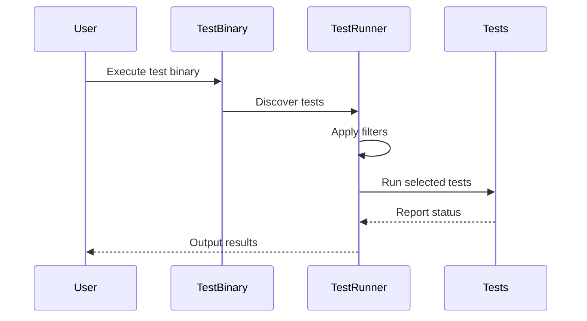

# Organizing and Running Tests

## Overview

This guide presents best practices for structuring multi-file test suites in GoogleTest, managing test discovery and selection, and integrating your tests with build systems and toolchains. It helps you write organized, maintainable, and efficient test programs by controlling what tests run, their order, and how they are executed in parallel environments.


## 1. Test Suite Organization

### Why Organize Tests Across Multiple Files?

As your project grows, tests grow with it. Spreading tests across multiple source files:

- Keeps your codebase manageable.
- Allows parallel compilation.
- Enables running subsets of tests relevant to different components or features.

### Structuring Test Files

- **Group related tests** into test suites via the first parameter of the `TEST()` or `TEST_F()` macros.
- Name test files by the component or feature under test (e.g., `foo_test.cc`, `bar_test.cc`).
- Place test files in dedicated `test` or `tests` directories aligned with your source code layout.

### Test Fixtures and Shared Set-Up

If multiple tests across files share setup or teardown code:

- Define common fixtures in a shared header included by test files.
- Avoid duplicating test fixture code unnecessarily.

<Tip>
Define test fixtures to encapsulate common setup/teardown, but avoid bloating fixtures with unrelated tests to keep tests focused and maintainable.
</Tip>


## 2. Controlling Test Discovery and Selection

### Test Discovery Mechanism

GoogleTest automatically discovers tests by scanning for `TEST` and `TEST_F` macros compiled into the binary.

### Running All Tests

The default behavior of `RUN_ALL_TESTS()` is to execute every test discovered.

### Filtering Tests to Run

Use the `--gtest_filter` flag to select specific tests or groups of tests by their suite and test names.

Example:

```bash
./my_test_binary --gtest_filter=FooTest.*
```

Runs all tests in the `FooTest` suite.

Other examples:

```bash
# Run exactly one test
./my_test_binary --gtest_filter=FooTest.Bar

# Run all tests except one
./my_test_binary --gtest_filter=-FooTest.Bar

# Run tests matching a pattern
./my_test_binary --gtest_filter=*Slow*
```

### Combining Filters

Filters accept comma-separated lists to run multiple tests:

```bash
./my_test_binary --gtest_filter=FooTest.Bar,BarTest.*
```

### Best Practices for Filtering

- Use filtering to speed-up test runs during development.
- Combine filtering with test sharding for distributed runs.


## 3. Test Execution Order

### Default Order

By default, GoogleTest runs tests in the order they are registered in the program.

### Controlling Order

You cannot directly specify execution order of tests in GoogleTest.

If your tests have dependencies, this is a code smell and should be refactored to make each test independent.

### Workarounds

- Use test fixtures to share state if needed.
- Use separate test binaries if ordering is critical.


## 4. Running Tests in Parallel

### Advantages

- Reduces overall test execution time on multi-core systems.
- Allows better utilization of CI resources.

### Techniques

- Run multiple instances of your test binaries with filters splitting the test load.
- Use tools like `ctest` or CI orchestration features for parallel execution.


## 5. Integrating with Build Systems

### Build Configuration

- Add test source files to your build system (Bazel, CMake, Makefiles, etc).
- Define separate targets for tests with `testonly` flags to avoid linking test code into production.

### Dependencies

- Link tests against `gtest` and `gmock` libraries.
- Include headers and ensure correct compiler flags for visibility and macro expansions.

### Running Tests in CI

- Invoke tests via your build system with appropriate command line flags.
- Capture test results and reports in machine-readable formats (e.g., XML).


## 6. Sample Workflow

### Step 1: Organize Your Tests

- Place your tests for a component `foo` into `foo_test.cc`.
- Define test suites and test cases logically:

```cpp
#include <gtest/gtest.h>

TEST(FooTest, DoesThis) {
  EXPECT_TRUE(DoThis());
}

TEST(FooTest, DoesThat) {
  EXPECT_FALSE(DoesThat());
}
```

### Step 2: Build Your Tests

- Add `foo_test.cc` as a source in your test target in Bazel or CMake.

### Step 3: Run Tests

- Run all tests: `./my_test_binary`
- Run filtered tests: `./my_test_binary --gtest_filter=FooTest.DoesThis`

### Step 4: Integrate with CI

- Add your test target to the CI build pipeline.
- Use parallel test execution by splitting test runs by filters.


## 7. Troubleshooting and Tips

<AccordionGroup title="Common Issues and Tips">
<Accordion title="My tests are not discovered or run">
Verify tests are registered and linked correctly. Ensure tests are compiled into the binary and `RUN_ALL_TESTS()` is called in `main()`.
</Accordion>
<Accordion title="Test filtering does not work as expected">
Check your filter patterns and use `--gtest_list_tests` to preview available tests.
</Accordion>
<Accordion title="Tests run in unexpected order">
Tests within a suite can run in any order. Design tests to be independent.
</Accordion>
<Accordion title="Parallel test execution causes race conditions">
Ensure tests are thread-safe or run isolated; avoid shared mutable state.
</Accordion>
</AccordionGroup>

<Tip>
Use `--gtest_list_tests` to see all tests discovered by your test binary.
</Tip>


## 8. Next Steps & Related Content

- [Writing Your First Test](../guides/getting-started/writing-your-first-test.md)
- [Organizing Test Structure](../guides/everyday-workflows/organizing-test-structure.md)
- [Running Tests: Command Line & Output](../getting-started/first-steps-usage/running-tests.md)
- [Installing GoogleTest](../getting-started/preparation-installation/installation-methods.md)
- [Mocking Basics](../guides/mocking-and-advanced-techniques/mocking-basics.md)


---

# Example: Running Specific Tests

```bash
# List all discovered tests
./my_test_binary --gtest_list_tests

# Run only the FooTest suite
./my_test_binary --gtest_filter=FooTest.*

# Run all tests except one
./my_test_binary --gtest_filter=-FooTest.UnwantedTest
```

# Example: CMake Test Target Snippet

```cmake
add_executable(my_tests foo_test.cc bar_test.cc)
target_link_libraries(my_tests gtest gmock pthread)
add_test(NAME MyTests COMMAND my_tests)
```

---

# Summary Diagram: Test Execution Overview




---

# Best Practices

- Write small, independent, focused tests.
- Name test suites and tests clearly.
- Structure tests to mirror code structure.
- Use test fixtures for shared setup/teardown.
- Use filtering to speed up test runs during development.
- Make tests thread-safe for parallel execution.


---

# Troubleshooting Checklist

- Ensure tests are compiled and linked.
- Confirm `RUN_ALL_TESTS()` is called.
- Use `--gtest_list_tests` to confirm test discovery.
- Double-check filter syntax.
- Avoid test dependencies and side-effects.


---

# References

- [GoogleTest Primer](../docs/primer.md)
- [gMock Cookbook](../docs/gmock_cook_book.md)
- [Running Tests](../getting-started/first-steps-usage/running-tests.md)
- [Configuring Build with CMake](../getting-started/preparation-installation/build-configuration.md)

