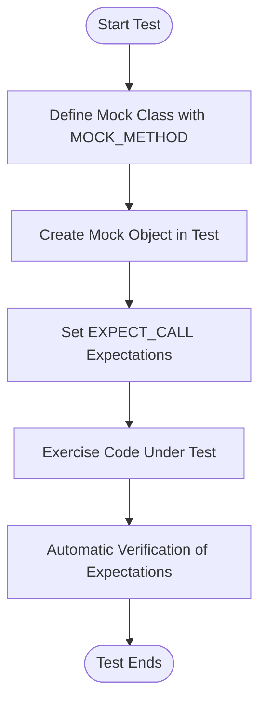

# Introducing GoogleMock: Mocking in Practice

## Overview

This guide will help you understand how to add mocks to your C++ tests using GoogleMock. You will learn how to define and use mock objects, set expectations for function calls, and specify custom behaviors for dependencies in your tests. The focus is practical: enabling you to isolate your test subject by mocking collaborators swiftly and correctly.

---

## 1. What is GoogleMock?

GoogleMock (gMock) is a C++ library for creating mock classes and mock objects. It lets you simulate and test interactions between your code and its dependencies by defining expectations on function calls, including how often they occur, the arguments passed, order of calls, and return values or actions.

Mock objects allow you to verify the behavior of the code under test, instead of its results alone, improving test clarity and robustness.

---

## 2. Prerequisites

- Basic familiarity with C++ and object-oriented programming.
- An interface or abstract class whose behavior you want to mock.
- GoogleMock installed and configured in your development environment (bundled with GoogleTest).

---

## 3. Expected Outcome

By following this guide, you will be able to:

- Define mock classes from interfaces using `MOCK_METHOD` macros.
- Create mock objects and specify expected calls with `EXPECT_CALL`.
- Control the behavior and return values of mocked methods.
- Verify that your code under test invokes dependencies as expected.

---

## 4. Time Estimate

Completing this workflow and writing your first mock-based test will typically take 30 to 60 minutes for developers familiar with C++.

---

## 5. Difficulty Level

Beginner to Intermediate.

---

# Step-by-Step Instructions

<Steps>
<Step title="Define Your Mock Class">
Use `MOCK_METHOD` macros inside the `public:` section of a class to create mock versions of the interface's virtual methods.

**Example:**

```cpp
#include <gmock/gmock.h>

class Turtle {
 public:
  virtual ~Turtle() {}
  virtual void PenUp() = 0;
  virtual void PenDown() = 0;
  virtual void Forward(int distance) = 0;
  virtual void Turn(int degrees) = 0;
  virtual void GoTo(int x, int y) = 0;
  virtual int GetX() const = 0;
  virtual int GetY() const = 0;
};

// Mock class implementing Turtle interface
class MockTurtle : public Turtle {
 public:
  MOCK_METHOD(void, PenUp, (), (override));
  MOCK_METHOD(void, PenDown, (), (override));
  MOCK_METHOD(void, Forward, (int distance), (override));
  MOCK_METHOD(void, Turn, (int degrees), (override));
  MOCK_METHOD(void, GoTo, (int x, int y), (override));
  MOCK_METHOD(int, GetX, (), (const, override));
  MOCK_METHOD(int, GetY, (), (const, override));
};
```

In this example, `MOCK_METHOD` avoids manual implementation of mock methods.

**Note:**

- Always mock virtual methods.
- Put mock method definitions in `public:` even if the base method is `protected` or `private`.
</Step>

<Step title="Create Mock Objects in Tests">
Inside your test code, create instances of your mock class.

```cpp
MockTurtle turtle;
```

This mock can then be injected into the code under test.
</Step>

<Step title="Set Expectations Using EXPECT_CALL">
Specify expectations on mock methods, including how many times they're called and with which arguments.

**Example:**

```cpp
using ::testing::AtLeast;
using ::testing::_;  // _ is a wildcard matcher

EXPECT_CALL(turtle, PenDown())
    .Times(AtLeast(1));
EXPECT_CALL(turtle, Forward(100));
```

If the calls don't happen as expected, your test will fail immediately.

**Tips:**

- Use `_` as a wildcard to match any argument.
- Use specific matchers for arguments when necessary to avoid fragile tests.
- Always set expectations *before* exercising the code that calls the mock.
</Step>

<Step title="Control Mocked Method Behavior">
Specify the behavior of mocked methods using `WillOnce()`, `WillRepeatedly()`, and other action clauses.

**Example:**

```cpp
using ::testing::Return;

EXPECT_CALL(turtle, GetX())
    .WillOnce(Return(10))
    .WillOnce(Return(20))
    .WillRepeatedly(Return(30));
```

This lets you simulate different return values over multiple calls.

You can also use lambdas or `Invoke()` to execute custom behavior.
</Step>

<Step title="Exercise Code Under Test">
Pass the mock object into your code under test and perform operations.

```cpp
Painter painter(&turtle);
EXPECT_TRUE(painter.DrawCircle(0, 0, 10));
```

Mocking isolates your unit test from real dependencies, making tests faster and more reliable.
</Step>

<Step title="Verify Expectations">
GoogleMock automatically verifies that all expectations are met when mocks are destructed.

If needed, you can force early verification using:

```cpp
::testing::Mock::VerifyAndClearExpectations(&mock_object);
```

Failing expectations will cause test failures with detailed diagnostic messages.
</Step>
</Steps>

---

# Examples

## Full Simple Test Example

```cpp
#include <gmock/gmock.h>
#include <gtest/gtest.h>

using ::testing::AtLeast;

class Painter {
 public:
  explicit Painter(Turtle* turtle) : turtle_(turtle) {}

  bool DrawCircle(int x, int y, int radius) {
    turtle_->PenDown();
    // fake drawing circle logic
    turtle_->Forward(radius * 2);
    turtle_->PenUp();
    return true;
  }

 private:
  Turtle* turtle_;
};

TEST(PainterTest, CanDrawSomething) {
  MockTurtle turtle;  // #1 create mock

  EXPECT_CALL(turtle, PenDown())    // #2 expect call
      .Times(AtLeast(1));
  EXPECT_CALL(turtle, Forward(_));  // expect Forward called with any int

  Painter painter(&turtle);         // #3 pass mock

  EXPECT_TRUE(painter.DrawCircle(0, 0, 10));  // #4 exercise
}
```

This test checks that `PenDown()` is called at least once during `DrawCircle`, and `Forward()` is called with any distance.

---

# Troubleshooting & Tips

<AccordionGroup title="Common Issues and How to Resolve">
<Accordion title="Mock Method Not Called as Expected">
Check that your `EXPECT_CALL` statements are set *before* the test code exercises the mock.
Also, ensure your matchers match the actual call arguments.

Run tests with `--gmock_verbose=info` to see detailed call traces that help diagnose why expectations fail.
</Accordion>

<Accordion title="Uninteresting Calls Warning">
If you see warnings like "Uninteresting mock function call", it means a mock method was called without an explicit expectation.

To suppress these warnings:

- Use `NiceMock<YourMockClass>` for mocks where calls don't need to be verified.
- Explicitly allow calls using `EXPECT_CALL(mock, Method(...)).Times(AnyNumber())`.

Avoid suppressing warnings by blindly adding `EXPECT_CALL`s without intent as this may mask real issues.
</Accordion>

<Accordion title="Method Not Mocked but Real Is Called">
Ensure the method you are trying to mock is declared `virtual` in the base class.
Mocking non-virtual methods requires advanced techniques which are beyond this guide.
</Accordion>

<Accordion title="Mismatch in Overloaded Methods">
If mocking an overloaded method, specify either the full parameter types in `MOCK_METHOD` or use disambiguation techniques in `EXPECT_CALL`.
Omitting parameter list for overloaded functions is ambiguous.
</Accordion>

<Accordion title="Mock Object Not Destroyed Verification Does Not Trigger">
If mocks live on the heap and aren’t deleted by tested code, finalize verification manually with:

```cpp
::testing::Mock::VerifyAndClearExpectations(&mock_object);
```

Or use heap checking tools to detect leaks.
</Accordion>
</AccordionGroup>

---

# Best Practices

- Mock only interfaces or abstract classes you own. For third-party interfaces, consider writing adaptor interfaces.
- Keep your expectations clear and minimal: only specify argument matchers and call counts needed to verify behavior.
- Avoid over-specifying call order and arguments unless necessary; use `InSequence` and strict argument matchers only when relevant.
- Use `ON_CALL` to specify default mock behavior without setting an expectation.
- Prefer to test behavior that matters, not implementation details, but use mocks to verify interaction contracts.

---

# Next Steps

- Explore the [gMock Cookbook](https://google.github.io/googletest/gmock_cook_book.html) for advanced mocking patterns.
- Learn about matchers and actions to write precise and expressive expectations.
- Consult the [Mocking Reference](https://google.github.io/googletest/reference/mocking.html) for detailed API information.
- Combine GoogleMock tests with GoogleTest assertions to build robust test suites.

---

# Resources

- [gMock for Dummies](https://google.github.io/googletest/gmock_for_dummies.html) - Beginner friendly introduction
- [gMock FAQ](https://google.github.io/googletest/gmock_faq.html) - Common questions and troubleshooting
- [gMock Cheat Sheet](https://google.github.io/googletest/gmock_cheat_sheet.html) - Quick reference
- [GoogleMock GitHub Repository](https://github.com/google/googletest)

---

# Diagram: Typical Mock Usage Workflow



---

<Check>
You have successfully completed the workflow for creating and using mock classes with GoogleMock. Ensure your tests reflect the intended interactions on the mocks.
</Check>
