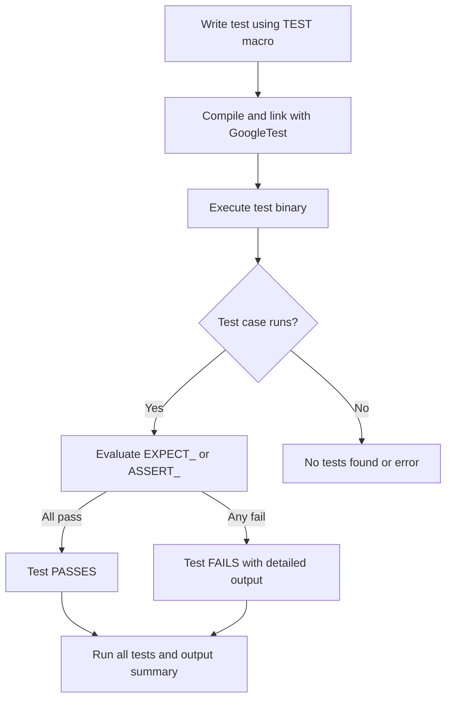

# Writing Your First Test with GoogleTest

Welcome to the first step in mastering GoogleTest: writing, running, and interpreting your first unit test. This guide walks you through creating a simple test, understanding basic assertions, and seeing what test results mean, setting a foundation for reliable, maintainable tests.

---

## 1. Introduction to Your First Test

This guide helps you write your first GoogleTest test, a crucial milestone for validating your C++ code with confidence. You will:

- Write a minimal test case
- Run it using GoogleTest's test runner
- Understand the testing output including success and failure scenarios

**Prerequisites:**

- GoogleTest and GoogleMock installed and configured in your project (see [Supported Platforms & Requirements](https://github.com/google/googletest/blob/main/docs/getting-started/prerequisites-installation/supported-platforms-requirements.md))
- Your build system set up to compile and link tests with GoogleTest (refer to [Installing with CMake and Bazel](https://github.com/google/googletest/blob/main/docs/getting-started/prerequisites-installation/installing-with-cmake-bazel.md))

**Expected Outcome:**

After completing this guide, you'll have a working GoogleTest test executable that runs your first unit test, shows test results meaningfully, and prepares you to write more sophisticated tests.

**Time Estimate:** 10–20 minutes

**Difficulty Level:** Beginner

---

## 2. Creating Your First Test

Let's start simple. A GoogleTest test consists of one or more `TEST` macros, each defining a test case and test name.

### Step 1: Include the GoogleTest headers

At the top of your test file, include the necessary headers:

```cpp
#include <gtest/gtest.h>  // The GoogleTest framework
```

### Step 2: Write a simple test case

Use the `TEST` macro to define your first test. It takes two arguments: a test suite name and a test name.

```cpp
TEST(HelloTest, BasicAssertions) {
  // Check if 1 + 1 is equal to 2
  EXPECT_EQ(1 + 1, 2);
}
```

### Explanation:

- `HelloTest` is your test suite grouping (like a class or module). You can have multiple test cases under one suite.
- `BasicAssertions` is the name of the individual test.
- `EXPECT_EQ` is an assertion that verifies both values are equal.

### Step 3: Build your test executable

Ensure your build system compiles this source file and links against GoogleTest libraries (`gtest` and `gtest_main` if you're using the default test runner main).

For example, with CMake:

```cmake
add_executable(example_test example_test.cc)
target_link_libraries(example_test gtest_main)
add_test(NAME example_test COMMAND example_test)
```

### Step 4: Run the test

Execute the compiled binary:

```shell
./example_test
```

Expected output on success:

```text
[==========] Running 1 test from 1 test suite.
[----------] Global test environment set-up.
[----------] 1 test from HelloTest
[ RUN      ] HelloTest.BasicAssertions
[       OK ] HelloTest.BasicAssertions (0 ms)
[----------] 1 test from HelloTest (0 ms total)

[----------] Global test environment tear-down
[==========] 1 test from 1 test suite ran. (0 ms total)
[  PASSED  ] 1 test.
```

If the assertion fails, GoogleTest will print detailed information showing:

- The file and line where assertion failed
- Values involved
- The test summary

### Step 5: Understand assertion macros

- `EXPECT_EQ(val1, val2)` — Tests that `val1 == val2`. Non-fatal failure if false, test continues.
- `ASSERT_EQ(val1, val2)` — Same check but fails the current test immediately.
- Other assertions include `EXPECT_NE`, `EXPECT_TRUE`, `EXPECT_FALSE`, and many more (see [Assertions Guide](https://github.com/google/googletest/blob/main/docs/api-reference/matchers-and-actions/assertions-guide.md)).

---

## 3. Writing More Robust Tests

### Using Setup and TearDown

If you run multiple tests with shared resources, consider using test fixtures. Start by deriving from `::testing::Test`:

```cpp
class MyTestFixture : public ::testing::Test {
 protected:
  void SetUp() override {
    // Code here will execute before each test
  }

  void TearDown() override {
    // Code here will execute after each test
  }

  int shared_value_;  // Shared data for tests
};

TEST_F(MyTestFixture, Test1) {
  shared_value_ = 5;
  EXPECT_EQ(shared_value_, 5);
}

TEST_F(MyTestFixture, Test2) {
  shared_value_ = 10;
  EXPECT_EQ(shared_value_, 10);
}
```

This simplifies test setup and ensures proper cleanup.

### Handling Multiple Assertions

Unlike `ASSERT_*` macros, `EXPECT_*` macros allow the test to proceed after failure. Use `EXPECT_*` for multiple checks in the same test.

### Running All Tests

If you have multiple tests, the GoogleTest runner runs all by default and reports the overall pass/fail status.

```shell
./example_test --gtest_filter=*
```

---

## 4. Troubleshooting Common Issues

### Test Not Running or No Tests Found

- Verify your test function is correctly defined with `TEST()` or `TEST_F()` macros.
- Confirm that your test binary is linked against `gtest_main` or provides a `main()` function that calls `RUN_ALL_TESTS()`.

### Build or Linker Errors

- Make sure you include the correct headers: `#include <gtest/gtest.h>`.
- Check compiler and linker flags.
- Consult [Installing with CMake and Bazel](https://github.com/google/googletest/blob/main/docs/getting-started/prerequisites-installation/installing-with-cmake-bazel.md) for proper build setup.

### Unexpected Test Output

- If tests unexpectedly fail, check assertions carefully.
- Use `--gtest_verbose=info` to get detailed output.

### Using GoogleMock and Mock Objects in Tests

Though not covered in detail here, when your code depends on interfaces, you can use GoogleMock to create mock classes and set expectations on methods. To get started, see [gMock for Dummies](https://google.github.io/googletest/gmock_for_dummies.html) and the [Writing Your First Test](https://github.com/google/googletest/blob/main/docs/guides/get-started/writing-tests.md) guide.

---

## 5. Best Practices for Getting Started

- Use `EXPECT_*` assertions when you want tests to continue after failure; use `ASSERT_*` when the failure should stop the test immediately.
- Name your test suites and cases descriptively to clearly convey intent.
- Prefer writing small, single-purpose tests focusing on one behavior.
- Leverage test fixtures (`TEST_F`) when tests share setup and teardown.
- Familiarize yourself with assertion macros and test runner flags to gain full control.

---

## 6. Next Steps

- Dive into [Running Tests](https://github.com/google/googletest/blob/main/docs/getting-started/first-test-validation/running-tests.md) to learn about test filters, output formats, and automation.
- Advance to writing sophisticated tests with [Effective Assertions & Custom Matchers](https://github.com/google/googletest/blob/main/docs/guides/real-world-use-cases/advanced-assertions.md).
- Explore [GoogleMock Basics](https://github.com/google/googletest/blob/main/docs/gmock_for_dummies.md) to create mock objects and set expectations.
- Review [Troubleshooting Setup Issues](https://github.com/google/googletest/blob/main/docs/getting-started/first-test-validation/troubleshooting-setup.md) if you encounter build or runtime hurdles.


---

## 7. Example: Complete Minimal Test

```cpp
#include <gtest/gtest.h>

// Sample function under test
int Add(int a, int b) {
  return a + b;
}

// Unit test for Add()
TEST(AdditionTest, SimpleAdd) {
  EXPECT_EQ(Add(1, 2), 3);       // Passes
  EXPECT_EQ(Add(-1, 1), 0);      // Passes
  EXPECT_EQ(Add(10, -5), 5);     // Passes
}

int main(int argc, char **argv) {
  ::testing::InitGoogleTest(&argc, argv);
  return RUN_ALL_TESTS();
}
```

Build and run this test executable. All tests will pass successfully.

---

## Callouts

<Tip>
Use `EXPECT_CALL` from GoogleMock and `ON_CALL` to specify mock method behavior once you have your first test running.
</Tip>

<Note>
This page focuses on GoogleTest's usage to write your first test. To mock dependencies, refer to the gMock documentation.
</Note>

<Warning>
Always set expectations before running the code under test. Setting them afterwards leads to undefined behavior.
</Warning>

---

## Summary Diagram of Test Flow



---