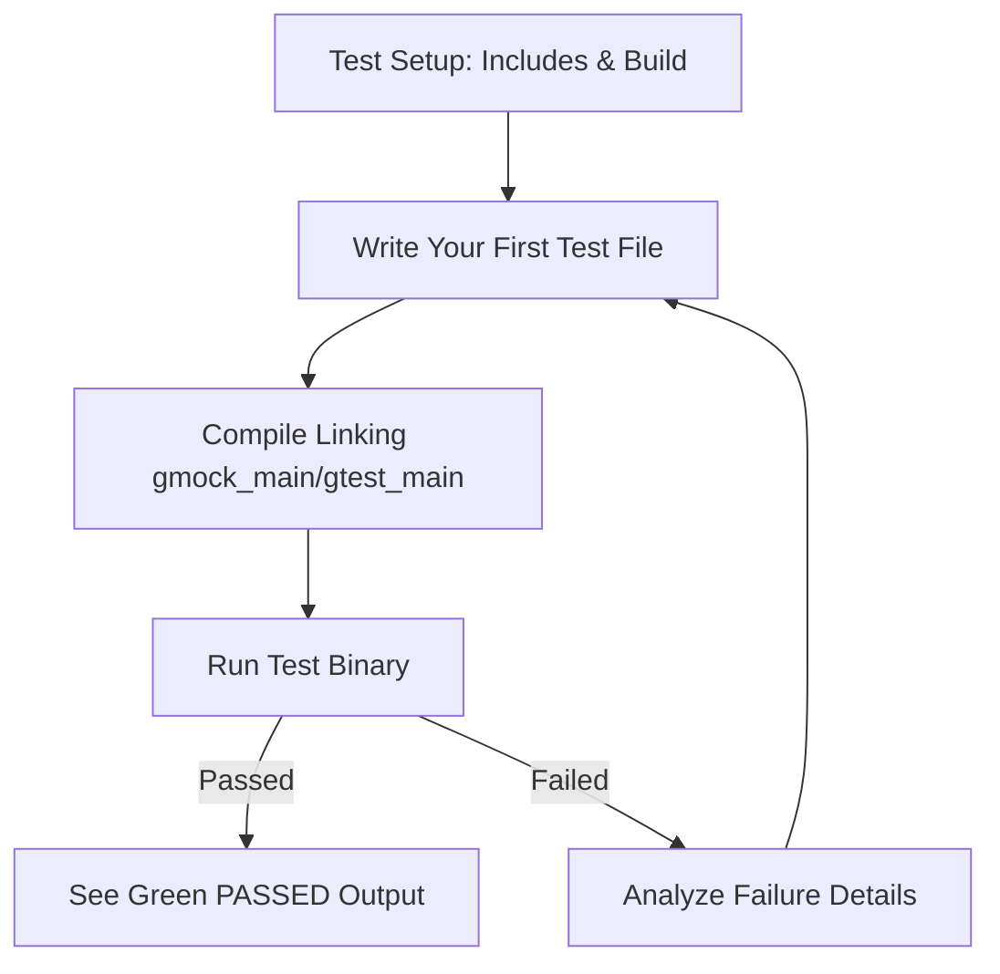

# Quick Setup & First Test

Welcome to your rapid introduction guide for adding GoogleTest and GoogleMock to your C++ project. This page walks you through the essential steps to set up the test framework, integrate it into your build, write a simple test, and execute it to see immediate results.

---

## 1. What You Will Achieve

This guide enables you to:
- Prepare your project environment to use GoogleTest and GoogleMock.
- Write your first C++ test using GoogleTest's macros.
- Compile and run your test binary.
- Understand basic test feedback and success criteria.

You’ll have a working test executable that demonstrates GoogleTest’s functionality and how mocks can be defined and used.


## 2. Prerequisites

Before you begin, ensure you have:
- A C++17-compliant compiler and build system (CMake, Bazel, or other).
- GoogleTest and GoogleMock source downloaded and accessible (see Installation guides).
- Basic familiarity with C++ compilation and linking.

> For environment setup details, see the [Prerequisites & System Requirements](/getting-started/setup-overview/prerequisites-system-requirements) and [Installing with CMake](/getting-started/installation-and-configuration/install-cmake) or [Installing with Bazel](/getting-started/installation-and-configuration/install-bazel).

---

## 3. Integrating GoogleTest & GoogleMock into Your Project

### Using CMake

Add GoogleTest and GoogleMock to your CMake build as a subdirectory or external package:

```cmake
include(FetchContent)
FetchContent_Declare(
  googletest
  URL https://github.com/google/googletest/archive/refs/tags/release-1.17.0.zip
)
FetchContent_MakeAvailable(googletest)

add_executable(my_test test/my_test.cpp)
target_link_libraries(my_test gtest_main gmock_main)
add_test(NAME my_test COMMAND my_test)
```

This setup pulls GoogleTest and GoogleMock into your project and links the test executable to the appropriate libraries.

### Using Bazel

Set up your workspace with the necessary `MODULE.bazel` or `WORKSPACE` files and write `BUILD` files for your test targets. Refer to the Bazel installation guide for details.

---

## 4. Writing Your First Test

To experience GoogleTest immediately, create a minimal test file that includes GoogleTest and GoogleMock headers and defines a simple test.

Create `my_test.cpp` with the following content:

```c++
#include <gtest/gtest.h>
#include <gmock/gmock.h>

using ::testing::AtLeast;
using ::testing::Return;
using ::testing::_;

// A simple mock class example
class MockFoo {
 public:
  MOCK_METHOD(int, Bar, (int n), ());
  MOCK_METHOD(char, Baz, (const char* s1, const std::string& s2), ());
};

// A straightforward test case
TEST(SimpleTest, TestMockBehavior) {
  MockFoo mock;

  // Set default behavior
  ON_CALL(mock, Bar(_)).WillByDefault(Return(5));

  // Set expectation
  EXPECT_CALL(mock, Bar(10)).Times(AtLeast(1));

  // Exercise the mock
  int result = mock.Bar(10);

  EXPECT_EQ(result, 5);  // Check return value
}
```

### Explanation:
- `MOCK_METHOD` defines mock methods inside your mock class.
- `ON_CALL` sets default behavior when no expectation matches.
- `EXPECT_CALL` sets an expectation that `Bar(10)` will be called at least once.
- The test calls `mock.Bar(10)` and verifies the returned value.

For deeper exploration, see the [Writing Your First Test Guide](/getting-started/first-test-experience/writing-your-first-test).

---

## 5. Compiling the Test

Compile your test source by linking with `gtest_main` and `gmock_main` libraries, which provide the entry point with `main()` and initialize GoogleTest/GoogleMock.

For example, with g++ and CMake generated binaries:

```bash
# Assuming build system generates 'my_test'
./my_test
```

If using manual compilation:

```bash
g++ -std=c++17 -isystem path_to_googletest/include -pthread my_test.cpp \
    path_to_googletest/libgtest.a path_to_gmock/libgmock.a -o my_test
./my_test
```

---

## 6. Running and Understanding Test Output

When you run your test binary:

- You will see test discovery messages followed by test execution results.
- Individual tests print `PASSED` or `FAILED` with location and details on failures.
  
Example console output snippet:

```
[==========] Running 1 test from 1 test suite.
[----------] Global test environment set-up.
[----------] 1 test from SimpleTest
[ RUN      ] SimpleTest.TestMockBehavior
[       OK ] SimpleTest.TestMockBehavior (0 ms)
[----------] 1 test from SimpleTest (0 ms total)

[==========] 1 test from 1 test suite ran. (0 ms total)
[  PASSED  ] 1 test.
```

Success means your mock behaved as expected and no assertion was violated.

For more detail, see the [Running and Understanding Test Output Guide](/getting-started/first-test-experience/running-and-understanding-tests).

---

## 7. Best Practices and Tips

- Always call `testing::InitGoogleMock(&argc, argv)` before running tests in your `main()` to initialize the framework.
- Use `EXPECT_CALL` to set clear, upfront expectations for your mocks.
- Use `ON_CALL` to provide default behavior and avoid unexpected call failures.
- Name your tests descriptively to clarify intent.
- Keep tests isolated: each test should run independently without side effects.

<Tip>
Link your test code against `gmock_main` when you want a ready-to-go test `main()` function included.
If you want more control, initialize and call `RUN_ALL_TESTS()` manually.
</Tip>

---

## 8. Troubleshooting

### Issue: Tests Not Running
**Symptom:** No tests execute or program crashes on start.

- Confirm you call `testing::InitGoogleMock` or `testing::InitGoogleTest` before running.
- Verify that your linker includes `gtest_main` or `gmock_main`, or that you have a proper `main()` function.

### Issue: Linker Errors
- Make sure all GoogleTest and GoogleMock libraries are linked correctly.
- Verify C++17 standard is enabled in your compiler flags.

### Issue: Unexpected Mock Call Failures
- Ensure you have set an `EXPECT_CALL` or `ON_CALL` for each expected mock method.
- Review call argument matchers carefully.

For detailed troubleshooting, consult the [Common Setup Issues](/getting-started/setup-troubleshooting/common-setup-issues) page.

---

## 9. Next Steps

- Explore writing more complex tests and using test fixtures: [Writing & Organizing Your First Tests](/guides/getting-started-workflows/writing-tests).
- Learn mocking patterns and best practices: [Basics of Mocking Functions and Classes](/guides/mocking-best-practices/basics-of-mocking).
- Integrate GoogleTest with your IDE or CI systems via the [Integration & Ecosystem](/overview/feature-highlights-integration/integration-ecosystem).

---

## Summary Diagram



---

By following this quick setup and first test guide, you reach a runnable GoogleTest-based environment ready for scalable test development and effective mocking.


---

<Check>
Ensure your development environment supports C++17 and proper linking with GoogleTest/GoogleMock.
</Check>
<Info>
Remember that GoogleMock is integrated with GoogleTest; you always initialize with `InitGoogleMock` when using mocks.
</Info>

---

# References

- [GoogleTest Primer](primer.md)
- [Writing Your First Test Guide](/getting-started/first-test-experience/writing-your-first-test)
- [Running and Understanding Test Output](/getting-started/first-test-experience/running-and-understanding-tests)
- [Common Setup Issues](/getting-started/setup-troubleshooting/common-setup-issues)
- [Mocking Reference](docs/reference/mocking.md)
- [Integration & Ecosystem](/overview/feature-highlights-integration/integration-ecosystem)

---