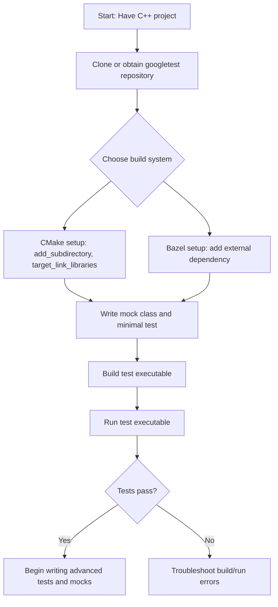

# Quickstart: Setting Up GoogleTest & GoogleMock

A hands-on walkthrough covering obtaining, configuring, and integrating GoogleTest and GoogleMock into a new or existing C++ project using CMake or Bazel. This guide will take you step-by-step through setting up test targets, compiling your test binaries, and verifying that everything is correctly installed and working, so you can confidently start writing and running tests.

---

## 1. Workflow Overview

**Task Description**: This guide helps you incorporate GoogleTest and GoogleMock into your C++ project, enabling you to write, build, and execute unit tests with mocking support.

**Prerequisites**:
- Basic C++ knowledge and familiarity with your project's build system (CMake or Bazel).
- A C++ development environment (compiler, standard library) compatible with GoogleTest requirements.

**Expected Outcome**: Successfully configured project with GoogleTest and GoogleMock libraries integrated, and a minimal test binary that compiles and runs tests using mocks.

**Time Estimate**: Approximately 15-30 minutes, depending on familiarity with C++ build tools.

**Difficulty Level**: Beginner to Intermediate.

---

## 2. Step-by-Step Instructions

### Step 1: Obtain GoogleTest and GoogleMock

GoogleMock is distributed alongside GoogleTest. You can clone the entire googletest repository:

```bash
git clone https://github.com/google/googletest.git
cd googletest
```

Alternatively, use package managers or download releases if preferred.

---

### Step 2: Prepare Your Project for Integration

Depending on your build system, follow the appropriate setup.

#### For CMake Users:

1. Add `googletest` as a subdirectory or use an installed version.
2. Your `CMakeLists.txt` should include:

```cmake
# Add GoogleTest and GoogleMock
add_subdirectory(path/to/googletest)  # if using as subdirectory

# Include directories
include_directories(${gtest_SOURCE_DIR}/include ${gmock_SOURCE_DIR}/include)

# Add your test source files
add_executable(MyTests test/my_test.cpp)

# Link gtest and gmock libraries
target_link_libraries(MyTests gtest gmock_main)
```

#### For Bazel Users:

1. Add googletest as an external dependency following Bazel workspace rules.
2. Define your test targets linking against `@com_google_googletest//:gmock_main` and `@com_google_googletest//:gmock`.

Refer to Bazel documentation for exact workspace setup.

---

### Step 3: Write a Minimal Mock Test

Create a new test file (e.g., `my_test.cpp`) with the following content:

```cpp
#include <gmock/gmock.h>
#include <gtest/gtest.h>

using ::testing::Return;

// An example interface to mock
class FooInterface {
 public:
  virtual ~FooInterface() = default;
  virtual int GetValue() const = 0;
};

// Mock class
class MockFoo : public FooInterface {
 public:
  MOCK_METHOD(int, GetValue, (), (const, override));
};

TEST(MockTest, ReturnsExpectedValue) {
  MockFoo mock_foo;

  // Set up expectation
  ON_CALL(mock_foo, GetValue()).WillByDefault(Return(42));
  EXPECT_CALL(mock_foo, GetValue()).Times(1);

  // Exercise the mock
  EXPECT_EQ(mock_foo.GetValue(), 42);
}
```

This test demonstrates defining a mock for a simple interface, setting a default return value, expecting exactly one call, and verifying the result.

---

### Step 4: Build Your Tests

Run your build system to compile the test executable.
- **CMake**: Run `cmake . && make` or your preferred build commands.
- **Bazel**: Run `bazel build //path/to:test_target`.

On success, the test binary will be produced.

---

### Step 5: Run and Verify Tests

Execute your test binary:

```bash
./MyTests
```

You should see output indicating the test passed, similar to:

```
[==========] Running 1 test from 1 test suite.
[----------] Global test environment set-up.
[----------] 1 test from MockTest
[ RUN      ] MockTest.ReturnsExpectedValue
[       OK ] MockTest.ReturnsExpectedValue (0 ms)
[----------] 1 test from MockTest (0 ms total)
[==========] 1 test from 1 test suite ran. (0 ms total)
[  PASSED  ] 1 test.
```

This confirms that GoogleTest and GoogleMock are properly set up and accessible.

---

## 3. Practical Tips & Best Practices

- **Include Only One Main**: Avoid defining your own main function if you link with `gmock_main` or `gtest_main`. They supply the standard main which calls `InitGoogleMock` or `InitGoogleTest` and runs all tests.

- **Initialize GoogleMock**: If you provide your own main, always call `testing::InitGoogleMock(&argc, argv);` before `RUN_ALL_TESTS()`.

- **Separate Mocks from Test Code**: For larger projects, maintain mock class definitions in dedicated headers and source files to keep tests clean and maintainable.

- **Verify Mock Expectations**: GoogleMock automatically verifies mock expectations when mock objects go out of scope — ensure mocks are destructed appropriately.

- **Use `NiceMock`, `NaggyMock`, or `StrictMock`** to control behavior on uninteresting calls:
  - `NiceMock`: Ignore unexpected calls.
  - `NaggyMock`: Warn on unexpected calls.
  - `StrictMock`: Fail on unexpected calls.

- **Catch Leaked Mocks**: Enable `--gmock_catch_leaked_mocks=1` flag during testing to catch mocks not properly deleted.

---

## 4. Troubleshooting Common Issues

<Tip>
If your tests do not run or linker errors occur:
- Confirm that your project links against both `gtest` and `gmock_main` (not just `gmock`).
- Verify include paths point to correct `gtest` and `gmock` header locations.
- Ensure `InitGoogleMock` is called before running tests if you write your own `main()`.
</Tip>

<Warning>
If your tests compile but no tests are detected or executed, it may be due to missing the call to `RUN_ALL_TESTS()` in main.
Make sure to return the result of `RUN_ALL_TESTS()`, as it drives test execution and result reporting.
</Warning>

<Note>
If you use CMake’s `FetchContent` or other package management methods, ensure versions of GoogleTest and GoogleMock are compatible with your compiler and standard library version.
</Note>

---

## 5. Next Steps & Related Resources

- After completing setup and your first test, proceed to:
  - [Writing and Running Your First Test](../writing-your-first-test) for expanded test authoring.
  - [Getting Started with Mocks](../mocking-basics) to deepen your knowledge of mocking techniques.
  - [Integration with Build Systems and CI](../../integration-advanced-optimization/build-systems-and-integration) for continuous testing automation.

- Explore detailed API docs:
  - [Defining Mock Methods and Classes](../../api-reference/core-mocking-api/mock-methods-and-classes)
  - [Configuring Mock Behavior with Actions](../../api-reference/core-mocking-api/mock-behavior-actions)

- For quick reference and cheat sheets, see:
  - [gMock Cheat Sheet](../gmock_cheat_sheet.md)
  - [GoogleMock for Dummies](https://google.github.io/googletest/gmock_for_dummies.html)

---

## Example: Minimal CMakeLists.txt for GoogleMock

```cmake
cmake_minimum_required(VERSION 3.10)
project(MyProject)

# Enable testing
enable_testing()

add_subdirectory(path/to/googletest)

include_directories(${gtest_SOURCE_DIR}/include ${gmock_SOURCE_DIR}/include)

add_executable(MyTests test/my_test.cpp)

target_link_libraries(MyTests gmock_main gtest pthread)

add_test(NAME MyTests COMMAND MyTests)
```

---

## Summary Flow



---

With this clear and practical guide, you can confidently set up GoogleTest and GoogleMock in your projects and start writing robust tests supported by rich mocking features.

---

<Check>
Remember, successful setup means your test executable runs with `RUN_ALL_TESTS()` output and your mock expectations are verified at runtime.
</Check>

---

For detailed usage patterns, assertions, and matcher references, continue exploring the GoogleTest and GoogleMock documentation.

---

<Source url="https://github.com/google/googletest" />