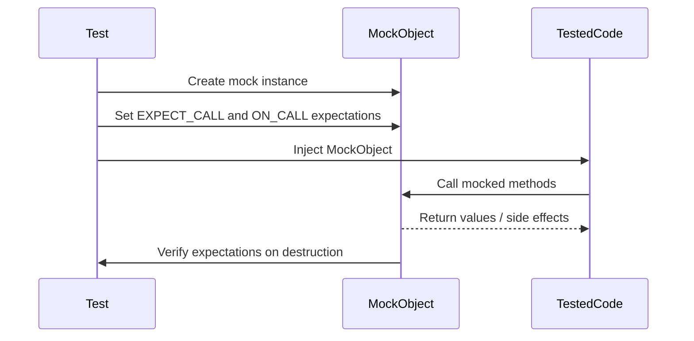

# Mocking Basics: Simulating Dependencies

## Overview
This guide introduces you to the fundamental concepts of mocking using GoogleMock (gMock). It helps you learn how to create simple mock objects, specify method expectations, and replace real dependencies in your code to enable isolated and reliable unit testing.

---

## What You Will Achieve
By following this guide, you will be able to:

- Define mock classes for your interfaces or abstract base classes.
- Create mock objects for use in your tests.
- Set expectations on mock methods specifying how they should be called.
- Control the behavior of mock methods by defining return values or side effects.
- Verify interactions with dependencies without relying on their real implementations.

---

## Prerequisites
Before you start, ensure you have:

- A C++ environment configured to use GoogleTest and GoogleMock.
- Basic familiarity with C++ classes, virtual methods, and unit testing.
- Installed GoogleTest with gMock support included (typically via `#include <gmock/gmock.h>`).


## Why Use Mocks?
In many cases, your code depends on external classes or systems that are either:

- Difficult or slow to set up for tests (e.g., databases, file systems).
- Non-deterministic or uncontrollable (e.g., network access).
- Complex or unavailable in the test environment.

Mocks let you simulate these dependencies by creating stand-in objects whose behavior you fully control during the test. This isolation leads to faster, more reliable, and easy-to-understand tests.

---

## Step 1: Define a Mock Class

Create a mock class that inherits the interface you want to mock. For each virtual method, use the `MOCK_METHOD` macro inside the public section of the mock to declare the mocked version.

### Example
Suppose you have an interface `Turtle`:

```cpp
class Turtle {
 public:
  virtual ~Turtle() {}
  virtual void PenUp() = 0;
  virtual void PenDown() = 0;
  virtual void Forward(int distance) = 0;
  virtual void Turn(int degrees) = 0;
  virtual void GoTo(int x, int y) = 0;
  virtual int GetX() const = 0;
  virtual int GetY() const = 0;
};
```

Define a mock `MockTurtle` like this:

```cpp
#include <gmock/gmock.h>

class MockTurtle : public Turtle {
 public:
  MOCK_METHOD(void, PenUp, (), (override));
  MOCK_METHOD(void, PenDown, (), (override));
  MOCK_METHOD(void, Forward, (int distance), (override));
  MOCK_METHOD(void, Turn, (int degrees), (override));
  MOCK_METHOD(void, GoTo, (int x, int y), (override));
  MOCK_METHOD(int, GetX, (), (const, override));
  MOCK_METHOD(int, GetY, (), (const, override));
};
```

**Important:**

- If the original method is `const`, specify `(const, override)`. 
- Always put mock methods in the **public** section of the mock class.

---

## Step 2: Create Mock Objects in Your Tests

With the mock class defined, you can instantiate it and use it as a substitute for the real dependency.

```cpp
MockTurtle turtle;
```

---

## Step 3: Set Expectations on Mock Methods

Use the `EXPECT_CALL` macro to specify which methods you expect to be called, how many times, with what arguments, and what they return or do.

### Basic Syntax

```cpp
EXPECT_CALL(mock_object, MethodName(matchers))
    .Times(cardinality)
    .WillOnce(action)
    .WillRepeatedly(action);
```

- The `mock_object` is your mock instance.
- `MethodName` is the mocked method.
- `matchers` specify expected arguments (or omit to accept any).
- `Times` specifies allowed call count (default is once).
- `WillOnce` and `WillRepeatedly` specify the method's behavior.

### Example
Expect the `PenDown()` call at least once:

```cpp
using ::testing::AtLeast;
EXPECT_CALL(turtle, PenDown()).Times(AtLeast(1));
```

Expect `GetX()` to return different values over calls:

```cpp
using ::testing::Return;
EXPECT_CALL(turtle, GetX())
    .WillOnce(Return(100))
    .WillOnce(Return(150))
    .WillRepeatedly(Return(200));
```

---

## Step 4: Use Your Mocks in the Code Under Test

Inject or pass the mock object to the code being tested. When tested code calls mock methods, gMock verifies that calls match expectations.

### Example
```cpp
TEST(PainterTest, CanDrawShape) {
  MockTurtle turtle;

  EXPECT_CALL(turtle, PenDown());
  EXPECT_CALL(turtle, Forward(10));

  Painter painter(&turtle);
  painter.DrawLine(10);
}
```

If `DrawLine(10)` does not call `PenDown()` or `Forward(10)`, the test will fail immediately.

---

## Step 5: Verify the Results

GoogleMock automatically verifies expectations when mock objects are destructed. If calls are missing, extra, or out of order (depending on expectations), the test fails with detailed error messages.

---

## Additional Tips and Best Practices

- **Set expectations before exercising the code under test.** gMock requires expectations to be declared *before* the method is called.
- **Use matchers wisely.** Use wildcard matcher `_` to ignore argument values when they are irrelevant.
- **Use sequences to control call order.** `InSequence` objects enforce call order when needed.
- **Suppress warnings on uninteresting calls** by wrapping mocks in `NiceMock<>` if you don't care about some methods.
- **Avoid over-specifying expectations.** Set expectations to test behavior contracts, not internal implementation details.

---

## Common Pitfalls

- **Not setting expectations before calls:** Test behavior is undefined; always set expectations first.
- **Mismatching arguments:** Ensure matchers or values in `EXPECT_CALL` match the calls.
- **Overly strict expectations:** Using `Times(Exactly(n))` and specifying many precise expectations can lead to brittle tests.
- **Missing virtual destructors:** Mock classes and interfaces must have virtual destructors to prevent undefined behavior.
- **Misplacing `MOCK_METHOD` in private/protected sections:** Always put `MOCK_METHOD` in the public section.

---

## Troubleshooting

| Symptom | Cause | Solution |
|---|---|---|
| Test fails with "Actual function call count doesn't match" | Method called fewer or more times than expected | Adjust `Times()` or verify code calls as expected |
| Warnings about "Uninteresting mock function call" | Mock method called without an `EXPECT_CALL` | Use `ON_CALL()` to define default behavior or use `NiceMock` |
| Compilation errors mocking methods with commas in types | Macro parsing issues with unprotected commas | Wrap the types with extra parentheses or use type aliases |
| Infinite recursion in mock methods delegating to base | Calling overridden method inside lambda without scope resolution | Use scope resolution explicitly to call base method, e.g., `foo.Base::Method()` |

---

## Visualizing the Mocking Flow



---

## Next Steps

- Explore **[gMock for Dummies](https://google.github.io/googletest/gmock_for_dummies.html)** to deepen your practical understanding.
- Learn about advanced mocking techniques in **[gMock Cookbook](https://google.github.io/googletest/gmock_cook_book.html)**.
- Understand **expectations ordering and sequences** in the **Expectations and Sequences** reference.
- Consult the **Mocking Reference** to explore detailed syntax and macros.


---

## References
- [Mocking Reference](reference/mocking.md)
- [gMock for Dummies](guides/getting-started/gmock_for_dummies.md)
- [gMock Cookbook](guides/writing-and-structuring-tests/gmock_cook_book.md)
- [gMock Cheat Sheet](reference/mocking-actions-matchers/gmock_cheat_sheet.md)

---

## Summary
GoogleMock simplifies writing mocks in C++ tests, enabling you to simulate dependencies easily and verify interactions with precise expectations. This page focused on setting up mock classes, creating mock objects, setting expectations using `EXPECT_CALL`, and harnessing mock verification to ensure robust testing.

<Tip>
Always define mock methods in the **public** section of your mock class to ensure gMock can access them.
</Tip>

<Note>
Use `ON_CALL` to define default behavior without forcing a call expectation, and use `EXPECT_CALL` only when you want to verify method invocations.
</Note>