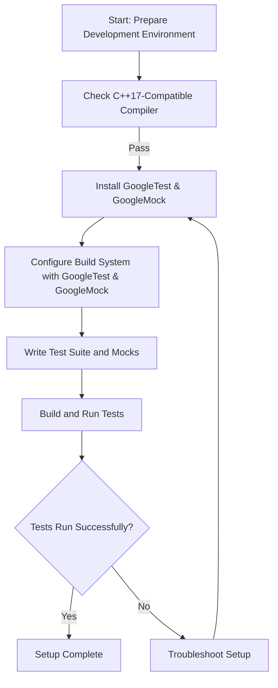

# Setting Up Your Test Environment

Learn how to install GoogleTest and GoogleMock, configure your build system (CMake and Bazel), and create the scaffolding for your first test suite.

---

## Overview

This guide walks you through setting up your environment for unit testing with GoogleTest and GoogleMock. You'll learn how to install the frameworks, configure popular build systems (CMake and Bazel), and create the initial structure of your first test suite. By the end, you’ll be ready to write and run tests that leverage mocks for effective C++ testing.

### Prerequisites

- A working C++17 compatible compiler (e.g., GCC 7.4+, Clang 5.0+, MSVC 2017+).
- Basic familiarity with your chosen build system (CMake or Bazel).
- Installed tools: CMake or Bazel installed on your machine.
- A clean project directory to add test code.

### Expected Outcome

- GoogleTest and GoogleMock installed in your development environment.
- Your build system configured to compile the test suite and link against GoogleTest and GoogleMock.
- A sample test scaffolding set up for writing your first unit tests.

### Time Estimate

Approximately 20–30 minutes, assuming build tools are installed.

### Difficulty Level

Intermediate: Basic understanding of C++ build systems and unit testing concepts is helpful.

---

## Step-by-Step Instructions

### 1. Install GoogleTest and GoogleMock

#### Option A: Using Package Managers

- On Linux, macOS, or Windows, install via your package manager if available (e.g., `apt`, `brew`, or `vcpkg`).
- Note: Package versions may lag; for latest features, consider manual installation.

#### Option B: Manual Installation

- Clone the repository:

  ```bash
  git clone https://github.com/google/googletest.git
  cd googletest
  ```

- Build and install:

  ```bash
  mkdir build && cd build
  cmake ..
  make
  make install
  ```

  Adjust commands according to your system and permissions (e.g., use `sudo make install` if appropriate).

### 2. Configure Your Build System

#### Configure CMake

- **Add GoogleTest as an external project or via `FetchContent`:**

  ```cmake
  include(FetchContent)
  FetchContent_Declare(
    googletest
    GIT_REPOSITORY https://github.com/google/googletest.git
    GIT_TAG        main
  )
  FetchContent_MakeAvailable(googletest)

  enable_testing()

  add_executable(my_tests test_main.cpp my_class_test.cpp)
  target_link_libraries(my_tests gtest_main gmock)

  include(GoogleTest)
  gtest_discover_tests(my_tests)
  ```

- **Key considerations:** Ensure your project uses C++17 or newer. GoogleTest and GoogleMock require it. Set `CMAKE_CXX_STANDARD 17` if needed.

#### Configure Bazel

- Include the [`@com_google_googletest`](https://github.com/bazelbuild/rules_google) repository in your `WORKSPACE` file:

  ```starlark
  http_archive(
      name = "com_google_googletest",
      urls = ["https://github.com/google/googletest/archive/release-1.11.0.tar.gz"],
      strip_prefix = "googletest-release-1.11.0",
  )
  ```

- **Reference GoogleTest and GoogleMock** in your `BUILD` files:

  ```starlark
  cc_test(
      name = "my_tests",
      srcs = ["test_main.cc", "my_class_test.cc"],
      deps = ["@com_google_googletest//:gtest_main", "@com_google_googletest//:gmock"],
  )
  ```

### 3. Initialize GoogleMock in Your Test Executable

- Before running tests, ensure you initialize GoogleMock and GoogleTest properly.
- In your `main()` function (or test harness), call:

  ```cpp
  #include <gmock/gmock.h>

  int main(int argc, char** argv) {
    ::testing::InitGoogleMock(&argc, argv);
    return RUN_ALL_TESTS();
  }
  ```

- **Tip:** If using the provided `gmock_main` library, you may not need to define `main()` yourself.

### 4. Create Your First Test Suite Scaffolding

- Write your first test file, e.g., `my_class_test.cpp`:

  ```cpp
  #include <gtest/gtest.h>
  #include <gmock/gmock.h>

  // Include headers of the classes to test

  TEST(MyClassTest, SampleTest) {
    // Arrange: Prepare objects and mocks

    // Act: Call the method you want to test

    // Assert: Verify the results
    EXPECT_TRUE(true);
  }
  ```

- Optional: Create mock classes if you depend on interfaces that need mocking (refer to [Creating and Using Mock Objects](https://google.github.io/googletest/gmock_for_dummies.html)).

- Compile the tests using your build system and run them to verify setup:

  ```bash
  ./my_tests
  ```

- You should see output indicating the tests ran (even if only trivial tests).

---

## Best Practices & Tips

- Always call `InitGoogleMock()` once at the start of your test executable to properly set up flags and integrate with GoogleTest.
- Place your mock class definitions in dedicated test headers or source files, keeping production code clean.
- Use `FetchContent` or `ExternalProject` in CMake for seamless integration and easy updates.
- When mocking methods, declare them in the `public` section regardless of the original access level.
- Use `NiceMock` or `StrictMock` wrappers depending on your preference to suppress or enforce warnings on uninteresting calls.

---

## Common Pitfalls & Troubleshooting

### Problem: Tests fail to compile or link against GoogleTest/GoogleMock

- Verify that the include paths and library paths in your build system point to the correct GoogleTest and GoogleMock locations.
- Ensure `gmock` and `gtest` libraries are linked (`gmock` typically depends on `gtest`).
- Check compiler C++ standard setting is at least C++17.

### Problem: Tests or mocks do not run or behave unexpectedly

- Confirm that `InitGoogleMock()` is called early in `main()`.
- If using multiple `EXPECT_CALL`s, ensure ordering is correct and expectations are set prior to execution.
- For build systems like CMake, confirm tests are registered and discovered correctly (e.g., with `gtest_discover_tests`).

### Problem: Mock expectations are not verified

- Make sure mocks go out of scope or are destructed at the end of the test to trigger verification.
- If mocks are allocated dynamically, consider calling `::testing::Mock::VerifyAndClearExpectations()` explicitly.

---

## Next Steps & Additional Resources

- After your environment is set up, proceed to [Writing and Running Your First Test](/guides/getting-started/writing-your-first-test) to gain hands-on with test code.
- Explore [Creating and Using Mock Objects](/guides/mocking-techniques/creating-mocks) to learn advanced mocking techniques.
- For optimizing and integrating tests into CI pipelines, see [Integrating with Build Systems and CI](/guides/integration-tips/build-system-integration).
- Consult the [Common Installation Problems](/getting-started/troubleshooting/common-problems) guide if you encounter issues.

---

## Summary Diagram: Test Environment Setup Flow



---

<CardGroup cols={3}>
<Card title="CMake Integration">
Use `FetchContent` module to integrate GoogleTest and GoogleMock conveniently.
</Card>
<Card title="Bazel Integration">
Add googletest repository in `WORKSPACE` and link with `gtest_main` and `gmock`.
</Card>
<Card title="Mock Initialization">
Ensure `testing::InitGoogleMock(&argc, argv);` is called in `main()` before tests.
</Card>
</CardGroup>

---

<Info>
For a smooth onboarding, verify your build environment meets prerequisites as described in the [Prerequisites & System Requirements](/getting-started/setup-introduction/prerequisites) guide.
</Info>

<Note>
Avoid mixing calls to `EXPECT_CALL()` and test execution; all expectations must be set before executing tested code.
</Note>