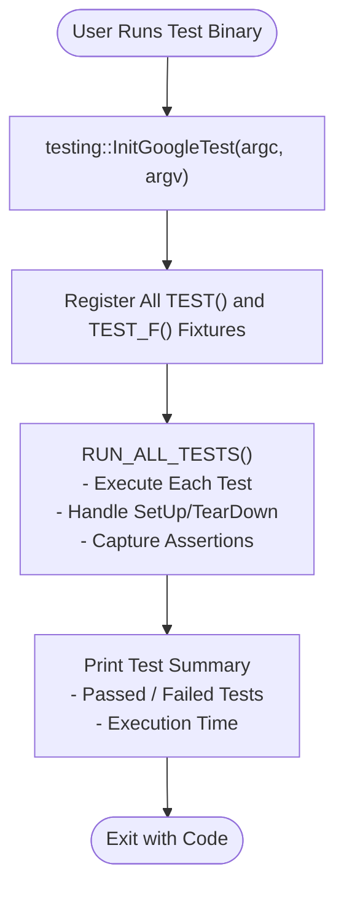

# Building and Running Tests with GoogleTest

Explore recommended approaches to compiling your tests and executing them across different platforms, focusing on streamlined workflows with CMake and Bazel. This guide emphasizes practical steps to build reliable test binaries, use integration conveniences, and understand test binary structure.

---

## 1. Understanding Test Binaries and Main Functions

### What is in a GoogleTest Test Binary?

A test binary built with GoogleTest contains automatically registered tests, test fixtures, mocks, and support code. When executed, it runs all tests and reports their outcomes.

### The Role of the Main Function

GoogleTest provides a standard implementation of `main()`, included in the `gtest_main` (or `gmock_main` for GoogleMock) library. This `main()` accepts arguments, initializes GoogleTest, and executes all tests via `RUN_ALL_TESTS()`.

> Tip: For most projects, linking against `gtest_main` instead of writing your own `main()` saves effort and avoids errors.

If your project requires custom behavior before or after tests run, you may write your own `main()`:

```cpp
#include <gtest/gtest.h>

int main(int argc, char **argv) {
  testing::InitGoogleTest(&argc, argv);  // Parses flags and initializes framework
  return RUN_ALL_TESTS();                  // Runs all registered tests
}
```

This ensures proper initialization and test execution with GoogleTest's infrastructure.

---

## 2. Building and Running Tests with CMake

### Prerequisites
- CMake 3.14 or later.
- A C++ compiler supporting at least C++17.
- A native build tool (Make, Ninja, Visual Studio, Xcode, etc.).

### Setting Up Your `CMakeLists.txt`

1. Declare the minimum required version and project:

```cmake
cmake_minimum_required(VERSION 3.14)
project(my_project)

set(CMAKE_CXX_STANDARD 17)
set(CMAKE_CXX_STANDARD_REQUIRED ON)
```

2. Integrate GoogleTest as a fetchable dependency:

```cmake
include(FetchContent)
FetchContent_Declare(
  googletest
  URL https://github.com/google/googletest/archive/03597a01ee50ed33e9dfd640b249b4be3799d395.zip
)
set(gtest_force_shared_crt ON CACHE BOOL "" FORCE)  # For Windows runtime consistency
FetchContent_MakeAvailable(googletest)
```

3. Define your test executable and link to `gtest_main`:

```cmake
add_executable(hello_test hello_test.cc)
target_link_libraries(hello_test GTest::gtest_main)
```

4. Enable CTest integration and test discovery:

```cmake
enable_testing()
include(GoogleTest)
gtest_discover_tests(hello_test)
```

### Build and Run

Run the following commands from your project root:

```bash
cmake -S . -B build       # Configure the project
cmake --build build       # Build all targets
cd build
ctest                    # Run all discovered tests
```

### Example Output

```plaintext
Test project /path/to/my_project/build
    Start 1: HelloTest.BasicAssertions
1/1 Test #1: HelloTest.BasicAssertions ........   Passed    0.00 sec

100% tests passed, 0 tests failed out of 1
```

---

## 3. Building and Running Tests with Bazel

If your project uses Bazel, GoogleTest supports native integration via Bazel build rules. Here’s a quick start:

### Bazel BUILD File Example

```python
cc_test(
    name = "my_test",
    srcs = ["my_test.cc"],
    deps = ["@com_google_googletest//:gtest_main"],
)
```

### Running Tests

Execute tests with Bazel's test command:

```bash
bazel test //path/to/my_test:my_test
```

Like CMake builds, Bazel builds a linked test binary that runs all included tests.

> Note: Bazel automatically includes `gtest_main`, so you typically do not write your own `main()`.

Refer to the [GoogleTest Bazel Instructions](https://github.com/google/googletest/blob/main/googletest/README.md) for detailed Bazel setup and customization.

---

## 4. Integrating with Main Programs and Custom Entry Points

### Linking GoogleTest into Existing Programs

If you need to embed GoogleTest tests into a larger application or executable with its own `main()`, you should:

1. Call `testing::InitGoogleTest()` early in your `main()` to initialize GoogleTest.
2. Call `RUN_ALL_TESTS()` when ready to execute tests.

Example:

```cpp
#include <gtest/gtest.h>

int main(int argc, char** argv) {
  // Initialize GoogleTest with command line arguments
  testing::InitGoogleTest(&argc, argv);

  // Run tests
  int result = RUN_ALL_TESTS();

  // Optionally continue with main program logic
  // ... your code here ...

  return result;
}
```

### Handling Command Line Arguments

GoogleTest parses command-line flags passed to `InitGoogleTest()`. It removes recognized GoogleTest flags, leaving non-flag arguments intact for your program.

This allows combined argument handling for testing and your application.

---

## 5. Practical Tips & Common Pitfalls

- **Always return the result of `RUN_ALL_TESTS()` from `main()`.** This ensures your test executable communicates test success or failure correctly.

- **For simple cases, link with `gtest_main` or `gmock_main`.** This eliminates the need to define your own `main()`.

- **If using advanced features (mocking, environment setup), ensure you initialize correctly with `testing::InitGoogleMock()`** if you're using GoogleMock.

- **Build system consistency matters:** When embedding GoogleTest sources directly or using external installations, ensure compiler flags, runtime libraries, and C++ standards match to avoid linking errors.

- **On Windows, consider the `gtest_force_shared_crt` CMake option** to unify runtime linkage and prevent LNK2038 errors.

- **Customizing test binary entry points is rare but supported:** just respect initialization and return value protocols.

---

## 6. Troubleshooting Test Builds

### Common Issues

- **Link errors related to missing `main()`:** Ensure you link against `gtest_main` or provide your own `main()` that calls `InitGoogleTest()` and `RUN_ALL_TESTS()`.

- **Mismatch of runtime library settings:** Especially on Windows, runtime library mismatches between GoogleTest and your tests cause linker errors. Use `gtest_force_shared_crt` or align your project settings.

- **Test discovery failures:** Confirm that test executables are properly built and symbol registration is not stripped or optimized out.

- **Flags not working as expected:** Make sure command-line arguments are passed correctly, and `InitGoogleTest()` is called with the correct `argc` and `argv`. 

See the [Troubleshooting Common Issues](https://github.com/google/googletest/blob/main/docs/getting-started/validation-troubleshooting/troubleshooting.md) guide for detailed help.

---

## 7. Summary Diagram: Test Execution Flow



---

## 8. Next Steps & Further Reading

- Read the [Your First Test](https://github.com/google/googletest/blob/main/docs/guides/getting-started/first-test.md) guide to learn test writing.
- Explore the [Configuring Test Execution](https://github.com/google/googletest/blob/main/docs/getting-started/project-setup/configuration-options.md) page to customize your test runs.
- Consult the [Integration & Dependencies](https://github.com/google/googletest/blob/main/docs/overview/architecture-concepts/integration-and-dependencies.md) guide for advanced build setups.
- For troubleshooting build and runtime issues, see the [Troubleshooting Common Issues](https://github.com/google/googletest/blob/main/docs/getting-started/validation-troubleshooting/troubleshooting.md).

---

### References

- [GoogleTest Primer](https://github.com/google/googletest/blob/main/docs/primer.md)
- [Quickstart: Building with CMake](https://github.com/google/googletest/blob/main/docs/quickstart-cmake.md)
- [GoogleMock Main Function Source](https://github.com/google/googletest/blob/main/googlemock/src/gmock_main.cc)
- [GoogleTest Main Function Source](https://github.com/google/googletest/blob/main/googletest/src/gtest_main.cc)

---

© Google - GoogleTest Project

