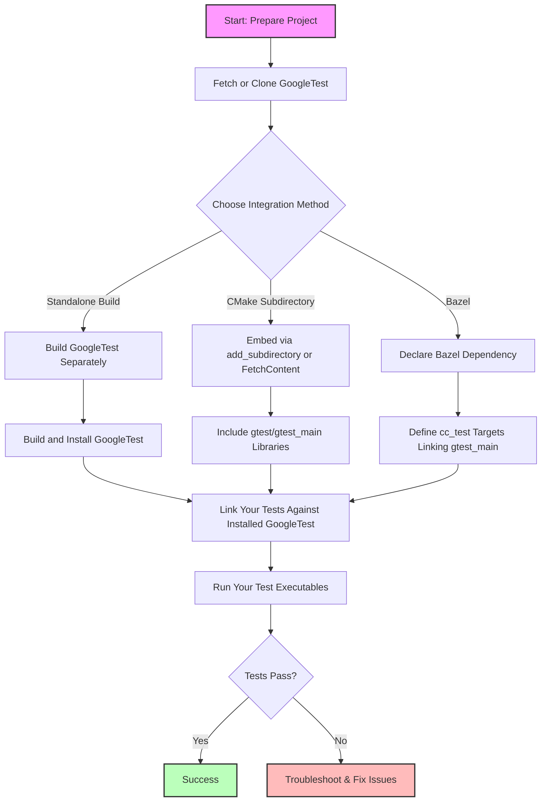

# Building and Integrating GoogleTest

A practical guide to integrating GoogleTest into your C++ build environment using supported methods such as CMake and Bazel. This guide walks through downloading, configuring, linking GoogleTest into your projects, and addresses platform considerations to help you confidently embed GoogleTest in your workflow.

---

## 1. Overview: What This Guide Helps You Accomplish

- **Goal:** Seamlessly build and integrate the GoogleTest framework into your C++ project, enabling you to write and run unit tests efficiently.
- **Scope:** Focuses exclusively on setting up GoogleTest with CMake or Bazel, configuration nuances, linking libraries, and platform-specific tips.
- **Ideal For:** Developers setting up automated testing infrastructure or adding robust unit testing capabilities to existing projects.

---

## 2. Prerequisites

Before starting, ensure the following are in place:

- A working C++17 development environment (compiler and toolchain).
- Installed CMake version 3.14 or newer (for FetchContent integration) or Bazel (if using Bazel).
- Basic familiarity with your build system (CMake or Bazel).
- Network access to clone or download the GoogleTest repository.

---

## 3. Expected Outcome

Following this guide, you will have:

- Cloned or included GoogleTest sources into your project or build setup.
- Configured your build system to compile and link against the GoogleTest libraries.
- Created test executables linked with GoogleTest’s main functions for streamlined test execution.
- Built and run sample or your own test cases successfully.

---

## 4. Time Estimate

Plan approximately 20-40 minutes, depending on familiarity with CMake or Bazel and your environment's setup.

---

## 5. Difficulty Level

Intermediate — assumes basic knowledge of C++ project builds and familiarity with CMake or Bazel.

---

## 6. Step-by-Step Integration with CMake

### Step 1: Download or Clone GoogleTest

You can either clone the GoogleTest repository or download a release archive.

```bash
# Clone specific release version
git clone https://github.com/google/googletest.git -b v1.17.0
cd googletest
```

---

### Step 2: Build GoogleTest Standalone (Optional)

To verify or install GoogleTest as a standalone:

```bash
mkdir build
cd build
cmake ..               # Builds both GoogleTest and GoogleMock by default
# Or to build only GoogleTest without GoogleMock:
cmake .. -DBUILD_GMOCK=OFF
make                   # Or build using your platform's build tool
sudo make install      # Install to default system locations (/usr/local/)
```

-----

### Step 3: Integrate GoogleTest into Your Existing CMake Project

Two main ways:

#### Option A: Use Installed GoogleTest with `find_package`

Add the following to your `CMakeLists.txt`:

```cmake
find_package(GTest CONFIG REQUIRED)

add_executable(your_test_exe test_main.cpp)
target_link_libraries(your_test_exe GTest::gtest_main)
add_test(NAME your_test COMMAND your_test_exe)
```

This assumes GoogleTest is installed on your system.

#### Option B: Add GoogleTest as a Subdirectory (Recommended for Consistency)

Include GoogleTest sources directly in your project:

```cmake
include(FetchContent)
FetchContent_Declare(
  googletest
  URL https://github.com/google/googletest/archive/5376968f6948923e2411081fd9372e71a59d8e77.zip
)
# Ensures FetchContent downloads and makes googletest available
FetchContent_MakeAvailable(googletest)

add_executable(your_test_exe test_main.cpp)
target_link_libraries(your_test_exe gtest_main)
add_test(NAME your_test COMMAND your_test_exe)
```

> This method keeps compiler and linker flags aligned between your project and GoogleTest.

---

### Step 4: Setting C++ Standard and Compiler Options

GoogleTest requires C++17. Set this in your `CMakeLists.txt`:

```cmake
set(CMAKE_CXX_STANDARD 17)
set(CMAKE_CXX_STANDARD_REQUIRED ON)
```

If you use Visual Studio and encounter runtime library mismatches, enable the shared CRT flag:

```cmake
set(gtest_force_shared_crt ON CACHE BOOL "" FORCE)
```

This makes GoogleTest link dynamically, matching typical Visual Studio project settings.

---

### Step 5: Build Your Project with Tests

```bash
mkdir build && cd build
cmake ..
cmake --build .
ctest               # Runs all tests discovered
```

You should see output indicating your tests running, leveraging GoogleTest’s main function.

---

## 7. Integrating GoogleTest Using Bazel

### Step 1: Declare GoogleTest Dependency

Add the following to your `MODULE.bazel` or `WORKSPACE` file:

```python
# Bazel module support example
bazel_dep(name = "rules_gtest", version = "v1.11.0")
```

GoogleTest is included in many Bazel configurations; ensure your workspace declares and loads it.

### Step 2: Create Your Test File and BUILD Rule

In your project:

```python
cc_test(
    name = "my_test",
    srcs = ["my_test.cc"],
    deps = ["@com_google_googletest//:gtest_main"],
)
```

### Step 3: Build and Run

```bash
bazel test //path/to:my_test
```

---

## 8. Practical Tips and Best Practices

- **Use `gtest_main` when possible:** It provides a default `main()` to run all tests, simplifying test executables.
- **Match Build Settings:** When including GoogleTest as a subdirectory, it inherits your compiler flags, preventing runtime mismatches.
- **Control Runtime Library Compatibility:** Use the `gtest_force_shared_crt` option on Visual Studio to avoid linker errors.
- **Use FetchContent for Continuous Integration:** Automate GoogleTest source retrieval during your CI builds for consistent environments.
- **Disable PThreads if unsupported:** On platforms like MinGW, specify `-Dgtest_disable_pthreads=ON` if thread-related link errors occur.

---

## 9. Common Pitfalls & Troubleshooting

<AccordionGroup title="Troubleshooting and Tips">
<Accordion title="Runtime Library Mismatch Errors">
These often occur on Windows Visual Studio when your project uses dynamic CRT but GoogleTest is static.

**How to fix:** Set the CMake option `gtest_force_shared_crt` ON before the first call to `add_subdirectory`.

```cmake
set(gtest_force_shared_crt ON CACHE BOOL "" FORCE)
```

This aligns the runtime libraries.
</Accordion>
<Accordion title="Link Errors for PThread on Windows">
GoogleTest can use pthreads on Unix-like systems but not on MinGW.

**Resolution:** Disable pthreads with:

```cmake
-Dgtest_disable_pthreads=ON
```

or in CMakeLists:

```cmake
set(gtest_disable_pthreads ON CACHE BOOL "" FORCE)
```

and ensure your build system does not try to link pthreads on Windows.
</Accordion>
<Accordion title="Failed to Find GoogleTest via find_package">
If `find_package(GTest CONFIG REQUIRED)` fails, it means GoogleTest is not installed system-wide.

**Solutions:**

- Install GoogleTest with your OS package manager if available.
- Use the FetchContent or add_subdirectory approach to embed GoogleTest in your project.
- Build and install GoogleTest manually before using `find_package`.
</Accordion>
<Accordion title="Missing C++17 Support">
GoogleTest requires C++17 standard. If compile errors arise due to unsupported features:

- Confirm your compiler version supports C++17.
- Explicitly set `CMAKE_CXX_STANDARD` to 17 in your CMake project.
</Accordion>
</AccordionGroup>

---

## 10. Summary Diagram of GoogleTest Integration Flow



---

## 11. Next Steps & Related Documentation

- After successfully building and integrating GoogleTest, proceed with [Writing and Running Your First Test](/getting-started/first-test-configuration/writing-first-test) to create your initial test cases.
- Use [Project Configuration and Setup](/getting-started/first-test-configuration/configuration-setup) to refine your build configuration.
- Reference [Troubleshooting and Installation Validation](/getting-started/first-test-configuration/troubleshooting-validation) for resolving common issues.
- Explore [Integration & Platform Support](/overview/architecture-and-concepts/integration-points) to understand compatibility with different environments.

---

## 12. Additional Resources

- Google's official GitHub for source and issues: [https://github.com/google/googletest](https://github.com/google/googletest)
- CMake official site for downloads and tutorials: [https://cmake.org/](https://cmake.org/)
- Bazel documentation: [https://bazel.build/](https://bazel.build/)

---

This guide ensures you can confidently integrate GoogleTest into your projects, leveraging reliable unit testing for faster, higher quality C++ development.