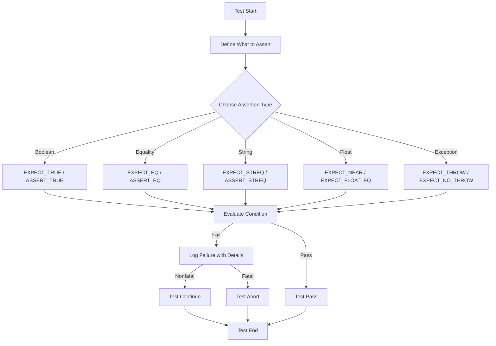

# Using Assertions for Powerful Testing

Explore how to use GoogleTest’s robust and expressive set of assertions, including equality, inequality, floating-point, and exception assertions. Practical scenarios illustrate when and how to choose the right assertion for your needs.

---

## 1. Introduction to Assertions

In GoogleTest, assertions are your primary tools for verifying that your code behaves as expected. An assertion evaluates conditions during test execution and signals success or failure.

- **Assertion Types**:
  - `EXPECT_` assertions log nonfatal failures, allowing your test to continue.
  - `ASSERT_` assertions log fatal failures, aborting the current test function immediately.

Use assertions to validate actual results against expected outcomes, catching bugs early and providing clear diagnostic information.


---

## 2. Types of Assertions and When to Use Them

GoogleTest provides a variety of assertion macros tailored to common programming needs. Select assertions based on the nature of the check and the desired control flow.

### 2.1 Boolean Conditions

- **`EXPECT_TRUE(condition)` / `ASSERT_TRUE(condition)`**
  - Use when you want to verify a condition evaluates to true.
- **`EXPECT_FALSE(condition)` / `ASSERT_FALSE(condition)`**
  - Use when you want to verify a condition evaluates to false.

### 2.2 Equality and Inequality

- **`EXPECT_EQ(val1, val2)` / `ASSERT_EQ(val1, val2)`**
  - Confirm that two values are equal.
- **`EXPECT_NE(val1, val2)` / `ASSERT_NE(val1, val2)`**
  - Confirm that two values are not equal.
- Use these for scalar values, pointers (checking addresses), and objects implementing `operator==`.

### 2.3 Relational Comparisons

For order-based checks on numeric data:

- `EXPECT_LT`, `EXPECT_LE`, `EXPECT_GT`, `EXPECT_GE`

Example:
```cpp
EXPECT_LT(computed_result, threshold);
```

### 2.4 String Comparisons

Specialized macros exist for comparing C-style strings:

- `EXPECT_STREQ(str1, str2)`: Compares C strings for equality.
- `EXPECT_STRNE(str1, str2)`: Compares C strings for inequality.
- Case-insensitive variants: `EXPECT_STRCASEEQ`, `EXPECT_STRCASENE`.

For C++ string objects, use the regular equality macros.

### 2.5 Floating-Point Comparisons

Due to precision limits, direct equality is usually inappropriate for floats/doubles.

- **`EXPECT_FLOAT_EQ(val1, val2)`**
- **`EXPECT_DOUBLE_EQ(val1, val2)`**
- **`EXPECT_NEAR(val1, val2, abs_error)`**: asserts values are within specified absolute error.

Prefer these over simple equality to avoid flaky tests caused by floating-point rounding.

### 2.6 Exception Assertions (If enabled)

For environments with exception support, assert whether code segments throw exceptions:

- `EXPECT_THROW(statement, ExceptionType)`
- `EXPECT_ANY_THROW(statement)`
- `EXPECT_NO_THROW(statement)`

Example:
```cpp
EXPECT_THROW(foo.DoWork(), std::runtime_error);
```


---

## 3. Using Assertions in Your Tests: Practical Tips

Follow these practical steps to effectively verify your code using assertions.

### Step 1: Identify What to Check

Think about the behavior or output your test should verify. Common examples:

- Validating return values from functions
- Confirming changes in object state
- Testing that exceptions are thrown for invalid inputs

### Step 2: Choose the Most Specific Assertion

Use equality assertions if your test requires exact matches.

Use predicate assertions if conditions are complex or require customized evaluation.

Use `EXPECT_*` if you want to continue testing after failure, `ASSERT_*` to stop immediately.

### Step 3: Add Clear Failure Messages

For better diagnostics, append explanatory messages to assertions:

```cpp
EXPECT_EQ(result, expected) << "Result did not match expected for input " << input_value;
```

This enhanced message helps quickly pinpoint issues.

### Step 4: Group Related Assertions in Test Cases

Group logically related checks inside a single `TEST` or `TEST_F`. Use multiple assertions to understand multiple aspects of the test without immediate aborts.


---

## 4. Examples of Common Assertions

### 4.1 Comparing Integers

```cpp
TEST(MathTest, Factorial) {
  int result = Factorial(5);
  EXPECT_EQ(result, 120) << "Factorial(5) should be 120";
}
```

### 4.2 Comparing Floating-Point Values

```cpp
TEST(MathTest, SquareRoot) {
  double sqrt_2 = std::sqrt(2.0);
  EXPECT_NEAR(sqrt_2 * sqrt_2, 2.0, 1e-6) << "Approximate equality expected";
}
```

### 4.3 String Equality

```cpp
TEST(StringTest, CompareCStrings) {
  const char* greeting = "Hello";
  EXPECT_STREQ(greeting, "Hello") << "Greeting string mismatch";
}
```

### 4.4 Throwing Exceptions

```cpp
TEST(ExceptionTest, ThrowsOnInvalidInput) {
  EXPECT_THROW(ParseInput("invalid"), std::invalid_argument);
  EXPECT_NO_THROW(ParseInput("valid"));
}
```

### 4.5 Complex Predicate Assertions

Use `EXPECT_THAT` and gMock matchers for fine-grained checks:

```cpp
#include <gmock/gmock.h>
using ::testing::HasSubstr;
...
EXPECT_THAT(response_message, HasSubstr("success"));
```


---

## 5. Best Practices and Common Pitfalls

- Use `EXPECT_` assertions for non-fatal checks that allow you to see multiple failures before test exits.
- Use `ASSERT_` assertions to stop tests early when continuing makes no sense or risks crashes.
- Avoid over-specifying match conditions; keep tests robust but meaningful.
- Prefer floating-point specific assertions over plain equality for numerical values.
- Provide helpful failure messages to ease troubleshooting.
- Use gMock matchers with `EXPECT_THAT` for expressive and readable assertions.
- Be cautious about side effects in expressions passed to assertions.


---

## 6. Troubleshooting Failed Assertions

- **Common Issue**: Assertion unexpectedly fails due to slight floating-point differences.
  - **Solution**: Switch to `EXPECT_NEAR` or `EXPECT_FLOAT_EQ` / `EXPECT_DOUBLE_EQ`.

- **Common Issue**: Assertion fails but test continues unexpectedly.
  - **Solution**: Replace `EXPECT_` with `ASSERT_` if subsequent test code depends on this check.

- **Common Issue**: Confusing output due to missing or unclear failure messages.
  - **Solution**: Append explanatory messages using `<<` operator.

- **Common Issue**: Comparing pointers using `EXPECT_EQ` but actual contents differ.
  - **Solution**: Use appropriate comparisons for contents, or string assertions for strings.

- **Common Issue**: Exceptions tests fail because exceptions are disabled in build.
  - **Solution**: Verify compiler and build settings enable exceptions.


---

## 7. Next Steps & Related Content

- Explore [Assertions Reference](https://google.github.io/googletest/reference/assertions.html) for the complete list of assertion macros.
- Learn about [Matchers](https://google.github.io/googletest/reference/matchers.html) to write expressive predicates for assertions.
- Step into [Writing First Tests](../getting-started/quickstart-validation/hello-test.md) to see assertions in action within complete test cases.
- Deepen skills with [Mocking Reference](../docs/reference/mocking.md) when working with mock objects and expectations.

---

## 8. Practical Example: Verifying a Simple Function

Let's write a test that verifies a function `Add(int a, int b)` correctly sums two integers.

```cpp
int Add(int a, int b) {
  return a + b;
}

TEST(MathTest, AddsPositiveNumbers) {
  EXPECT_EQ(Add(2, 3), 5) << "2 plus 3 should be 5";
  EXPECT_NE(Add(2, 2), 5) << "2 plus 2 should not be 5";
}
```

If this test fails, the output will clearly show which assertion failed, where, and why, helping you quickly identify and fix the issue.


---

## 9. Summary Diagram of Assertion Usage



This flow outlines how users determine which assertion to use, how GoogleTest evaluates it, and the resulting test flow.

---

# Additional Resources

- [GoogleTest Assertions Reference](https://google.github.io/googletest/reference/assertions.html)
- [Using Matchers with ASSERT/EXPECT](https://google.github.io/googletest/reference/matchers.html)
- [GoogleMock Cookbook](https://google.github.io/googletest/gmock_cook_book.html#UsingMatchers)
- [Your First GoogleTest Guide](https://google.github.io/googletest/quickstart.html)

---

For complete understanding, consult the [Getting Started](https://google.github.io/googletest/getting_started.html) and [Mocking Reference](https://google.github.io/googletest/reference/mocking.html) documentation. These will deepen your grasp of assertions integrated with tests and mocks.


---