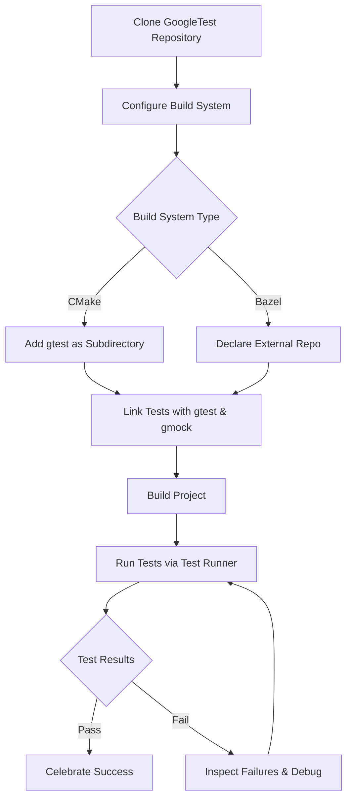

# Configuring Your Test Environment

GoogleTest offers flexible mechanisms to integrate and run your C++ tests in various environments, whether locally or in continuous integration systems. This guide walks you through configuring GoogleTest using popular build systems like CMake and Bazel, managing workspace and dependencies, and utilizing test runners on supported platforms and toolchains. We'll also cover common challenges and help you troubleshoot typical setup issues.

---

## 1. Overview of GoogleTest Environment Setup

Before running tests successfully, you must configure your project's build and test environments. This includes:

- Adding GoogleTest and GoogleMock dependencies
- Properly configuring your build system (CMake or Bazel)
- Setting up workspace directories and source organization
- Integrating test runners for effective execution

GoogleTest automatically discovers tests registered via macros or programmatic registration, but you must prepare the infrastructure for it to function correctly.

### Prerequisites

- A supported C++17-compliant compiler
- Platform support: Linux, macOS, Windows
- CMake (version 3.10 or later) or Bazel build system installed
- Ability to fetch or clone the GoogleTest repository

### Expected Outcome

After completing your environment configuration, you will:

- Compile and link your code with GoogleTest and GoogleMock
- Run tests either via command line or integrated test runners
- Receive organized and color-coded pass/fail reports
- Have access to filtering, repetition, and output options

### Time Estimate

Setting up the environment typically should take 10–30 minutes, depending on your familiarity with build tools and your project's complexity.

### Difficulty Level

Intermediate

---

## 2. Setting Up GoogleTest with CMake

CMake is the most widely used build system for C++ projects; GoogleTest provides native support and documentation for CMake integration.

### Step-by-Step Instructions

1. **Clone the GoogleTest repository** (if you haven’t already):

   ```bash
   git clone https://github.com/google/googletest.git
   ```

2. **Add GoogleTest as a subdirectory in your CMake project:**

   In your root `CMakeLists.txt`, include:

   ```cmake
   add_subdirectory(path/to/googletest)

   enable_testing()
   ```

3. **Link GoogleTest into your test executable:**

   Define your test executable and link against GoogleTest and GoogleMock:

   ```cmake
   add_executable(my_tests test_main.cpp my_tests.cpp)
   target_link_libraries(my_tests gtest gmock gtest_main)
   ```

4. **Include GoogleTest headers:**

   Make sure your test source files include `<gtest/gtest.h>`.

5. **Enable test discovery:**

   Add the following after defining your test executable:

   ```cmake
   include(GoogleTest)
   gtest_discover_tests(my_tests)
   ```

   This will automatically register your tests for CTest, enabling integration with IDEs and CI.

6. **Build using CMake:**

   ```bash
   mkdir build && cd build
   cmake ..
   make
   ```

7. **Run your tests:**

   ```bash
   ctest
   ```

### Tips & Best Practices

- Use **`gtest_main`** to provide a default `main()` function unless you want custom startup code.
- Keep GoogleTest and GoogleMock as part of your project tree or use your package manager.
- Use `target_include_directories` if you keep googletest in a separate location.
- For cross-platform portability, avoid platform-specific CMake commands when possible.

### Common Pitfalls

- Forgetting to call `enable_testing()` makes `ctest` ignore your tests.
- Linking only `gtest` and not `gmock` if you use mocks.
- Mixing GoogleTest versions or stale builds causing linkage errors.

---

## 3. Setting Up GoogleTest with Bazel

Bazel provides powerful support for building and testing large projects including GoogleTest.

### Step-by-Step Instructions

1. **Configure your `WORKSPACE` file:**

   Add GoogleTest as an external repository:

   ```python
   http_archive(
       name = "com_github_google_googletest",
       urls = ["https://github.com/google/googletest/archive/release-1.12.1.tar.gz"],
       strip_prefix = "googletest-release-1.12.1",
   )
   ```

2. **Load GoogleTest dependencies in your BUILD file:**

   ```python
   load("@com_github_google_googletest//:bazel/mock_defs.bzl", "gmock")
   load("@com_github_google_googletest//:bazel/gtest_defs.bzl", "gtest")

   # Define your test target linking against gtest and gmock
   cc_test(
       name = "my_tests",
       srcs = ["my_tests.cc"],
       deps = [
           "@com_github_google_googletest//:gtest",
           "@com_github_google_googletest//:gmock",
       ],
   )
   ```

3. **Build and test with Bazel:**

   ```bash
   bazel test //:my_tests
   ```

### Tips & Best Practices

- Use tagged releases of GoogleTest to ensure compatibility (e.g., `release-1.12.1`).
- Leverage Bazel's sandboxing for reproducible builds.
- Use Bazel test flags to filter, repeat, or shuffle tests.

---

## 4. Organizing Your Workspace and Source Layout

Proper folder organization ensures smooth integration with build tools and CI systems.

### Suggested Structure

```
/project-root/
  /third_party/
    /googletest/
  /src/
    foo.cpp
    foo.h
  /tests/
    foo_test.cpp
  CMakeLists.txt (or BUILD)
```

### Integration Best Practices

- Keep GoogleTest sources separate from your application code.
- Use consistent naming conventions for your test files and suites.
- Match your test suite organization to your module or namespace structure for clarity.

---

## 5. Running Tests with GoogleTest Test Runner

The GoogleTest framework offers a default test runner that automatically discovers and runs tests.

### Running Tests

- Use your build system test runner integrations (`ctest` for CMake, `bazel test` for Bazel).
- Alternatively, run test binaries directly:

```bash
./my_tests --gtest_filter=* --gtest_repeat=1
```

### Common Flags

- `--gtest_filter=Pattern` — Run a subset of tests matching the pattern.
- `--gtest_repeat=N` — Repeat tests N times.
- `--gtest_shuffle` — Shuffle test order.
- `--gtest_output=xml:filename.xml` — Generate XML report.

More details on flags are available in the [Advanced GoogleTest Topics](../advanced.md).

---

## 6. Troubleshooting Common Setup Issues

### Problem: Tests not discovered or running

- Ensure you call `enable_testing()` in CMake.
- Check test executable links against `gtest_main` or include a `main()` calling `RUN_ALL_TESTS()`.
- Confirm test names are valid C++ identifiers without underscores.

### Problem: Linking errors

- Check that your build links to `gtest`, `gmock`, and `gtest_main` where necessary.
- Clean previous builds to avoid stale artifacts.

### Problem: Tests not showing up in CI

- Validate the test filter patterns used.
- Verify environment variables like `TEST_TMPDIR` and `TEST_SRCDIR` if tests rely on these.

### Tips

- Enable verbose output in your build system to diagnose linking.
- Review GoogleTest Primer for correct test writing and main function setup.

---

## 7. Next Steps and Additional Resources

- Consult the [GoogleTest Primer](primer.md) for fundamentals of writing tests.
- Review [Advanced GoogleTest Topics](advanced.md) to leverage complex assertions, parameterized tests, and death tests.
- Explore real-world integration examples in the [Real-World Examples & Integration](/#) guides.
- Visit the [API Reference](reference/testing.md) for detailed API usage.

---

## Appendix

### Useful Links

- [GoogleTest Primer](primer.md)
- [Advanced GoogleTest Topics](advanced.md)
- [Testing Reference](reference/testing.md)
- [Configuring Your Project Guide](getting-started/setup-and-installation/configuring-your-project)

---

## Summary Diagram: Workflow for Configuring and Running Tests



---

<Tip>
Properly configuring your test environment ensures that your GoogleTest tests compile, run, and report results reliably both locally and in CI.
</Tip>

<Note>
Always call `testing::InitGoogleTest()` in your `main()` function before `RUN_ALL_TESTS()`, and link with `gtest_main` if you rely on the default main.
</Note>

<Warning>
Mixing different versions of GoogleTest or incomplete linking will cause runtime errors or no tests to be found.
</Warning>
