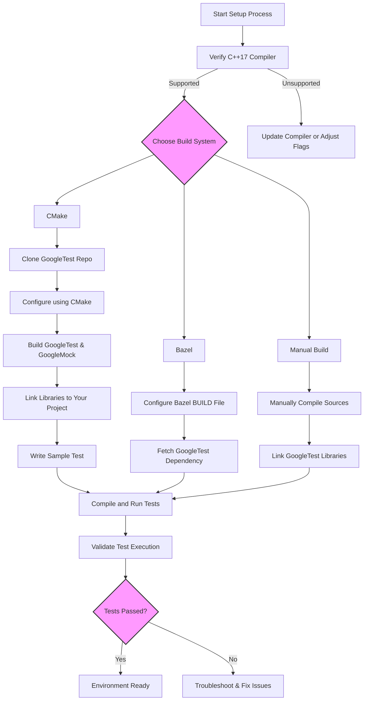

# Setting Up Your Test Environment

## Overview

This guide walks you through configuring your C++ project to use GoogleTest and GoogleMock. It covers installation options, integration with popular build systems like CMake and Bazel, and compiling your first test binary to validate your setup.

By the end of this guide, your development environment will be correctly prepared for writing and running reliable C++ tests.

---

## 1. Prerequisites

Before setting up GoogleTest, ensure you have the following:

- A C++17-compatible compiler installed (e.g., GCC 7+, Clang 5+, MSVC 2017+).
- CMake version 3.14 or higher (for CMake-based builds).
- (Optional) Bazel installed if you prefer Bazel for build automation.
- Basic knowledge of C++ project structure and build systems.


<Tip>
GoogleTest requires C++17 features. If you encounter build errors related to language features, please verify your compiler version and compilation flags.
</Tip>

---

## 2. Installing GoogleTest and GoogleMock

GoogleTest includes GoogleMock by default. You can choose to build both or only the GoogleTest framework.

### Option A: Standalone Build Using CMake

1. **Clone the repository**:

```bash
  git clone https://github.com/google/googletest.git -b v1.17.0
  cd googletest
```

2. **Create a build directory and navigate into it:**

```bash
  mkdir build
  cd build
```

3. **Generate build files:**

- To build both GoogleTest and GoogleMock (default):

```bash
  cmake ..
```

- To build only GoogleTest (without GoogleMock):

```bash
  cmake .. -DBUILD_GMOCK=OFF
```

4. **Build the code:**

```bash
  make
```

5. **(Optional) Install libraries system-wide (Linux/macOS):**

```bash
  sudo make install
```

### Option B: Integrating GoogleTest Into an Existing CMake Project

You can integrate GoogleTest either by using installed libraries or building it as part of your project.

- **Using installed libraries**: After installing GoogleTest, import it via `find_package`:

  ```cmake
  find_package(GTest CONFIG REQUIRED)
  target_link_libraries(your_target GTest::gtest GTest::gmock)
  ```

- **Adding GoogleTest source as a subdirectory**:

  1. Add GoogleTest source to your project tree (e.g., as a git submodule).
  2. Include it in your root `CMakeLists.txt`:

  ```cmake
  add_subdirectory(path/to/googletest)
  target_link_libraries(your_target gtest gmock)
  ```

- **Automatic download during configuration**:

  Use CMake's `FetchContent` to fetch GoogleTest at configure time:

  ```cmake
  include(FetchContent)
  FetchContent_Declare(
    googletest
    URL https://github.com/google/googletest/archive/5376968f6948923e2411081fd9372e71a59d8e77.zip
  )
  set(gtest_force_shared_crt ON CACHE BOOL "" FORCE)  # For Visual Studio compatibility
  FetchContent_MakeAvailable(googletest)
  
  add_executable(my_tests test_main.cpp)
  target_link_libraries(my_tests gtest_main)
  add_test(NAME my_tests COMMAND my_tests)
  ```

### Option C: Using Bazel

If your project uses Bazel, GoogleTest is available as an external dependency. Refer to Bazel-specific integration instructions in the documentation for setting up the `WORKSPACE` file and dependencies.

---

## 3. Configuring Your Project

### Key configuration considerations:

- Ensure your build system includes the GoogleTest headers and links the GoogleTest and GoogleMock libraries.
- For static libraries:
  - Build with `-DGTEST_HAS_PTHREAD=1` if pthread support is detected.
  - On Windows, consider using `-Dgtest_force_shared_crt=ON` if you want to match your runtime library settings (dynamic vs static CRT).
- For shared libraries:
  - Use `-DGTEST_CREATE_SHARED_LIBRARY=1` to build GoogleTest as a shared library.
  - Link your tests with `-DGTEST_LINKED_AS_SHARED_LIBRARY=1`.

### Common CMake snippet example:

```cmake
cmake_minimum_required(VERSION 3.14)
project(MyTestProject LANGUAGES CXX)
set(CMAKE_CXX_STANDARD 17)
set(CMAKE_CXX_STANDARD_REQUIRED ON)

# Fetch GoogleTest
include(FetchContent)
FetchContent_Declare(
  googletest
  URL https://github.com/google/googletest/archive/5376968f6948923e2411081fd9372e71a59d8e77.zip
)
set(gtest_force_shared_crt ON CACHE BOOL "" FORCE)
FetchContent_MakeAvailable(googletest)

# Add your test executable
add_executable(my_test test_my_code.cpp)
# Link with GoogleTest and GoogleMock
target_link_libraries(my_test gtest gmock_main)

# Enable testing and register tests
enable_testing()
add_test(NAME MyTest COMMAND my_test)
```

<Tip>
This approach ensures your tests use the same compiler and runtime settings as the main project, which prevents linking mismatches.
</Tip>

---

## 4. Writing and Compiling Your First Test

### Sample First Test File: `test_sample.cpp`

```cpp
#include <gtest/gtest.h>

// Basic test verifying 1 + 1 = 2
TEST(SampleTest, BasicMath) {
  EXPECT_EQ(1 + 1, 2);
}

int main(int argc, char **argv) {
  testing::InitGoogleTest(&argc, argv);
  return RUN_ALL_TESTS();
}
```

### Build Instructions (CMake example)

1. Create a `CMakeLists.txt` containing the configuration from section 3.
2. Place `test_sample.cpp` in your source directory.
3. Generate build files and build:

```bash
mkdir build && cd build
cmake ..
make
```

4. Run the test executable:

```bash
./my_test
```

### Expected Outcome

- The test should pass without failures.
- The console will show an output similar to:

```none
[==========] Running 1 test from 1 test suite.
[----------] Global test environment set-up.
[----------] 1 test from SampleTest
[ RUN      ] SampleTest.BasicMath
[       OK ] SampleTest.BasicMath (0 ms)
[----------] 1 test from SampleTest ran. (0 ms total)

[----------] Global test environment tear-down
[==========] 1 test from 1 test suite ran. (0 ms total)
[  PASSED  ] 1 test.
```

---

## 5. Best Practices and Common Pitfalls

- **Matching Runtime Libraries:** On Windows, ensure consistent usage of static vs dynamic runtime libraries when building GoogleTest and your test projects (use `gtest_force_shared_crt` option).
- **Single Call to RUN_ALL_TESTS():** Call `RUN_ALL_TESTS()` only once per program. Multiple calls can cause undefined behavior.
- **Use `InitGoogleTest`:** Always call `testing::InitGoogleTest` before running tests for proper flag parsing and initialization.
- **Avoid Deprecated Macros:** Prefer modern APIs and macros instead of older or deprecated ones like `ParseGUnitFlags`.
- **Keep GoogleTest Updated:** Periodically update to the latest release to benefit from bug fixes and new features.

### Troubleshooting Tips

- If tests are not discovered, ensure your test files include `#include <gtest/gtest.h>` and are compiled/linked correctly.
- If linking errors occur, verify that GoogleTest libraries are linked and library search paths are correctly set.
- For permission or file system related issues, check environment variables like `TEST_TMPDIR` and ensure directories exist and are writable.

---

## 6. Additional Configuration Options

### Defining Macros to Customize GoogleTest

You can define macros to tweak GoogleTest behavior during compilation, such as:

- `GTEST_HAS_PTHREAD=1` or `0` to force pthread support.
- `GTEST_CREATE_SHARED_LIBRARY=1` to build as a shared library.

Refer to [Customization Points in gtest-port.h](https://github.com/google/googletest/blob/main/googletest/include/gtest/internal/gtest-port.h) for a comprehensive list.

---

## 7. Summary Diagram of Environment Setup Flow



---

## 8. Next Steps

Now that your environment is ready:

- Explore [Writing and Running Your First Test](../getting-started/first-steps-validation/writing-first-test) to learn how to author tests using GoogleTest and GoogleMock.
- Consult [Common Use Cases and Recipes](../guides/real-world-examples/recipes-and-use-cases) for practical testing examples.
- Review [Integration with Build Systems](../overview/integrations/integration-with-build-systems) for advanced build configurations.


---

## References

- [GoogleTest Primer](../docs/primer.md)
- [Installation Guide](../getting-started/setup-overview/installation-guide)
- [Integration with Build Systems](../overview/integrations/integration-with-build-systems)
- [GoogleTest GitHub Repository](https://github.com/google/googletest)

---

*This guide focuses specifically on setting up your test environment and integrating GoogleTest and GoogleMock into your project — for writing tests and assertion usage, visit the corresponding guides.*


---