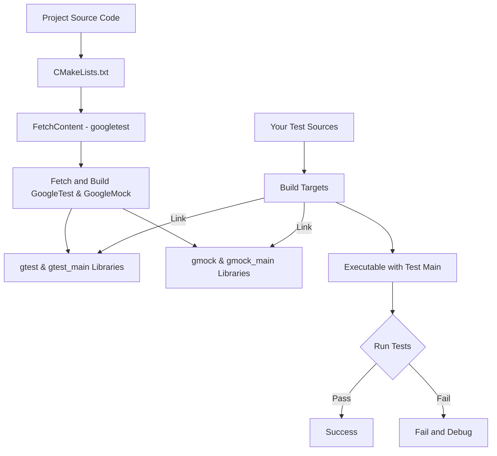

# Setting Up Your Testing Environment

## Workflow Overview

This guide walks you through integrating GoogleTest and GoogleMock into your C++ projects using popular build systems, specifically CMake and Bazel. You'll learn how to configure these testing frameworks correctly, manage dependencies, and verify your setup so you're ready to write and run tests immediately.

### Prerequisites
- Basic familiarity with C++ development and your chosen build system (CMake or Bazel).
- Access to your project source code and build configuration files.
- C++17-compatible compiler and environment.
- Installed Git client to clone repositories.

### Expected Outcome
- A properly configured project environment with GoogleTest and GoogleMock integrated.
- Ability to build and run tests via your chosen build system.
- Verified setup demonstrated by executing sample tests successfully.

### Estimated Time
Around 15-30 minutes depending on familiarity with build systems.

### Difficulty Level
Beginner to Intermediate.

---

## Step-by-Step Instructions

### 1. Prepare Your Environment

- Ensure your compiler supports C++17 or later.
- Install Git and clone the googletest repository:

```bash
 git clone https://github.com/google/googletest.git -b main
```

- Confirm CMake is installed (if using CMake) or Bazel (if using Bazel).

---

### 2. Setting Up with CMake

#### a. Standalone GoogleTest Build

If you want to build GoogleTest and GoogleMock as a standalone project, perform the following inside the cloned repository:

```bash
mkdir build
cd build
cmake ..
make
sudo make install  # Optional to install globally
```

- To build only GoogleTest without GoogleMock, run:

```bash
cmake .. -DBUILD_GMOCK=OFF
```

- On Windows, open the generated `gtest.sln` in Visual Studio and build from there.

#### b. Integrating GoogleTest in Your CMake Project

Rather than building GoogleTest separately, it’s recommended to incorporate it into your project’s build process via `add_subdirectory()`.

Add the following to your project's `CMakeLists.txt`:

```cmake
include(FetchContent)
FetchContent_Declare(
  googletest
  URL https://github.com/google/googletest/archive/main.zip
)
FetchContent_MakeAvailable(googletest)

add_executable(your_test_executable your_test_file.cpp)
target_link_libraries(your_test_executable gtest_main gmock_main)
add_test(NAME your_test COMMAND your_test_executable)
```

This ensures GoogleTest and GoogleMock follow your project's compiler and linker settings, avoiding version mismatches.

#### c. Visual Studio Runtime Compatibility Tip

If you encounter runtime library conflicts (e.g., static vs dynamic CRT), enable dynamic runtimes:

```cmake
set(gtest_force_shared_crt ON CACHE BOOL "" FORCE)
```

Add this before calling `FetchContent_MakeAvailable(googletest)`.


---

### 3. Setting Up with Bazel

GoogleTest and GoogleMock provide built-in Bazel support.

- Add `@com_google_googletest` dependency in your `WORKSPACE` file.
- Declare test targets in your Bazel `BUILD` files linking with `@com_google_googletest//:gtest` and `@com_google_googletest//:gmock`.

Detailed Bazel setup is typically project-specific; refer to the googletest Bazel documentation or sample projects for precise configuration.

---

### 4. Link Your Tests Correctly

Make sure your test executables link with either:

- `gtest_main` or `gmock_main` (recommended): Provides a main() function that initializes GoogleTest and GoogleMock.
- `gtest` or `gmock` libraries: If you want to define your own `main()`.

Example main function if needed:

```c++
#include <gtest/gtest.h>
int main(int argc, char **argv) {
  testing::InitGoogleTest(&argc, argv);
  return RUN_ALL_TESTS();
}
```

Usually, linking against `gtest_main` or `gmock_main` eliminates the need to write this yourself.

---

### 5. Verify Your Setup

Create a simple test file, e.g., `sample_test.cpp`:

```c++
#include <gtest/gtest.h>

TEST(SampleTest, BasicAssertions) {
  EXPECT_EQ(1, 1);
  ASSERT_TRUE(true);
}
```

Build and run your tests via:

```bash
cmake --build build --target your_test_executable
./your_test_executable
```

Or with Bazel:

```bash
bazel test //path/to:your_test_target
```

You should see test execution output indicating passing tests.

---

## Practical Tips and Best Practices

- Prefer linking to `gtest_main` or `gmock_main` to avoid boilerplate.
- Keep GoogleTest and GoogleMock source code inside your project as a submodule or use FetchContent for consistent versioning.
- Use `target_link_libraries(your_test gmock_main)` to get GoogleMock with test main.
- Avoid mixing different compiler runtimes between your project and GoogleTest to prevent linker errors.
- For multi-threaded tests, ensure pthread support is enabled or explicitly define `GTEST_HAS_PTHREAD`.
- Use CMake 3.14+ to simplify adopting FetchContent methods.

---

## Troubleshooting Common Issues

<AccordionGroup title="Common Setup Issues and Solutions">
<Accordion title="Linker Errors Related to Runtime Library Mismatches">
Ensure your project and GoogleTest/GoogleMock use the same runtime library (static or dynamic). For CMake, set `gtest_force_shared_crt` ON to align runtimes.
</Accordion>
<Accordion title="Tests Not Discovered or Run">
Verify you link your test executable against `gtest_main` or call `testing::InitGoogleTest()` in your `main()`.

Also check your test names use `TEST()` or `TEST_F()` macros correctly.
</Accordion>
<Accordion title="Compiler Support Issues (Missing C++17)">
GoogleTest requires C++17. In CMake, add:
```cmake
set(CMAKE_CXX_STANDARD 17)
set(CMAKE_CXX_STANDARD_REQUIRED ON)
```

If you use custom build scripts, check your compiler flags.
</Accordion>
<Accordion title="Pthread-Related Link Errors on Linux">
Add `-pthread` flag to your compiler and linker settings or set `-DGTEST_HAS_PTHREAD=1` in compile definitions.
</Accordion>
</AccordionGroup>

---

## Next Steps & Related Content

- After completing setup, proceed to [Writing and Running Your First Test](../../guides/getting-started/first-test) to learn basic test authoring.
- Explore [Introducing Mocking with GoogleMock](../../guides/getting-started/mocking-intro) to add mock-based tests.
- Review [Supported Platforms and Dependencies](../../overview/integration-adoption/supported-platforms) to understand environment compatibility.
- Consult [Troubleshooting Setup & Installation](../../getting-started/environment-setup/troubleshooting-setup) for deeper problem-solving guidance.

---

## Summary Diagram: GoogleTest and GoogleMock Build Integration with CMake



This flow shows how your project incorporates GoogleTest and GoogleMock into the build and links tests with Google's testing libraries for execution.

---