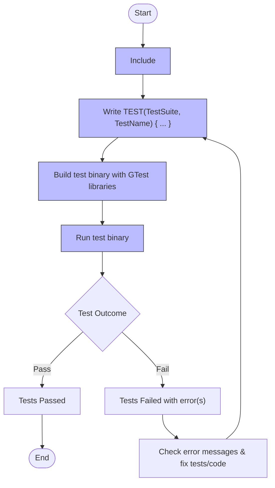

# Writing Your First Test

## Overview
This guide provides a clear, step-by-step walkthrough to help you write, build, and run your very first unit test using the GoogleTest framework. It focuses on understanding the basic structure of a test, using common assertions, and running tests using the standard GoogleTest test runner.

Whether you are new to unit testing or transitioning from other testing frameworks, this guide will give you the foundational knowledge to get started quickly.

---

## 1. Preparation

### Prerequisites
- You have GoogleTest and its dependencies installed and properly integrated into your development environment.
- Your project build system (e.g., CMake, Bazel, or manual build) is configured to compile and link against GoogleTest libraries.
- Basic knowledge of C++ programming.

### Expected Outcome
- You will write a simple test case function inside which assertions validate expected behavior.
- You will compile and run the test binary using the GoogleTest framework.
- You will observe test results in the console output to confirm success or failure.

### Time Estimate
Approximately 15–30 minutes.

### Difficulty Level
Beginner.

---

## 2. Structure of a Basic GoogleTest

GoogleTest tests follow a simple, uniform structure that is easy to learn:

- **Test Case**: A test file or a test suite grouping related tests.
- **Test Function**: Each test is written inside a function created using the `TEST` macro.
- **Assertions**: Statements inside the test function that check specific conditions.

### Step-by-Step Guide to Writing a Basic Test

<Steps>
  <Step title="Include GoogleTest Header">
    Begin by including the primary GoogleTest header in your test source file.

    ```cpp
    #include <gtest/gtest.h>
    ```

    This will provide all necessary classes and macros.
  </Step>

  <Step title="Write a Test Function">
    Define your test function using the `TEST` macro, which takes two parameters:

    1. Test suite name (grouping related tests)
    2. Test name (describing the particular check)

    Example:

    ```cpp
    TEST(SampleTest, SimpleEquality) {
      EXPECT_EQ(1, 1);
    }
    ```

    This defines a test called `SimpleEquality` in the test suite `SampleTest` that asserts `1 == 1`.
  </Step>

  <Step title="Use Assertions">
    Inside the test, use assertions like `EXPECT_EQ` and `ASSERT_TRUE` to verify conditions.

    - `EXPECT_` assertions continue executing even if they fail, allowing multiple checks.
    - `ASSERT_` assertions abort the test on failure.

    Example:

    ```cpp
    TEST(SampleTest, MultipleChecks) {
      EXPECT_TRUE(true);
      EXPECT_EQ(2 + 2, 4);
      ASSERT_NE(5, 6);
    }
    ```

    Refer to [GoogleTest Assertions](https://google.github.io/googletest/reference/assertions.html) for a complete list.
  </Step>

  <Step title="Build Your Test Binary">
    Use your build system (CMake, Bazel, or manual compilation) to build the test executable.

    For CMake, your `CMakeLists.txt` might look like:

    ```cmake
    add_executable(sample_test sample_test.cpp)
    target_link_libraries(sample_test GTest::gtest GTest::gtest_main)
    ```
  </Step>

  <Step title="Run the Test">
    Execute the compiled test binary from the command line:

    ```bash
    ./sample_test
    ```

    You should see console output indicating the tests passed or failed.
  </Step>

  <Step title="Interpret Test Results">
    GoogleTest outputs information about each test:

    - `PASSED` indicates success
    - `FAILED` indicates failure, along with file and line number

    Example output when tests pass:

    ```text
    [==========] Running 2 tests from 1 test suite.
    [----------] Global test environment set-up.
    [----------] 2 tests from SampleTest
    [ RUN      ] SampleTest.SimpleEquality
    [       OK ] SampleTest.SimpleEquality (0 ms)
    [ RUN      ] SampleTest.MultipleChecks
    [       OK ] SampleTest.MultipleChecks (0 ms)
    [----------] 2 tests from SampleTest (0 ms total)

    [----------] Global test environment tear-down
    [==========] 2 tests from 1 test suite ran. (0 ms total)
    [  PASSED  ] 2 tests.
    ```
  </Step>
</Steps>

---

## 3. Practical Example: A Simple Calculator Test

Here's a full example of a basic test file testing a minimal calculator function.

```cpp
#include <gtest/gtest.h>

// Sample function to test.
int Add(int a, int b) {
  return a + b;
}

TEST(CalculatorTest, AdditionWorks) {
  EXPECT_EQ(Add(1, 2), 3);
  EXPECT_EQ(Add(-1, -1), -2);
  ASSERT_NE(Add(0, 0), 1);
}
```

### Expected Behavior
- Running this test binary will execute the `CalculatorTest.AdditionWorks` test.
- Any assertion failure will be reported with the exact line number.

### Building
- Use your build tool to compile this file and link against GoogleTest, then run.

---

## 4. Running Tests Using the GoogleTest Runner

### Basic Run
Execute your compiled test binary:

```bash
./your_test_binary
```

### Managing Output
- Use command-line flags for filtering tests, e.g. `--gtest_filter` to run specific tests.
- Run `./your_test_binary --help` to discover more options.

### Integrating into CI
GoogleTest outputs results in formats like XML for integration.
- Use `--gtest_output=xml:<path>` to generate XML reports.

---

## 5. Tips and Best Practices

- **Name Tests Clearly:** Give meaningful test suite and test names to clearly communicate intent.
- **Limit Scope:** Each test should exercise one logical behavior.
- **Use `EXPECT_` vs `ASSERT_` Wisely:** Use `ASSERT_` when continuing makes no sense after failure.
- **Run Tests Often:** Catch regressions early.
- **Leverage GoogleTest Features:** Explore parameterized tests, fixtures, and rich assertions.

<Tip>
For better readability, format test names with CamelCase or underscores, e.g., `TEST(StringUtils, HandlesEmptyString)`.
</Tip>

<Tip>
Use `EXPECT_EQ` for equality comparisons and `EXPECT_TRUE`/`EXPECT_FALSE` for boolean conditions.
</Tip>

---

## 6. Common Issues & Troubleshooting

### Test Binary Won't Run or Link
- Confirm GoogleTest is properly linked.
- Verify your build system configuration matches GoogleTest installation.

### Tests Not Being Discovered
- Ensure your test functions have the correct `TEST` macro syntax.
- Verify no mismatches in test naming.

### Assertions Seem Not to Trigger Failures
- Confirm you use `EXPECT_` or `ASSERT_` macros inside test functions.
- Make sure your test binary is executed correctly.

### Tests Run but Output Is Empty
- Confirm you are running the test binary directly.
- Check for runtime filter settings that may skip tests.

---

## 7. Next Steps & Related Content

- Explore the [GoogleTest Assertions Reference](https://google.github.io/googletest/reference/assertions.html) for advanced assertions.
- Learn about [Organizing and Running Tests](../test-organization-running) to scale your test suites.
- When ready, dive into mocking with GoogleMock via the [gMock Cookbook](../gmock_cook_book) and [Mocking Reference](../reference/mocking).
- Check prerequisites and installation details in the [System Requirements & Supported Platforms](../../getting-started/prerequisites-installation/requirements-platforms).
- For troubleshooting, visit the [Getting Started Troubleshooting Guide](../../getting-started/troubleshooting/common-errors).

---

## References

- [GoogleTest Primer](https://google.github.io/googletest/primer.html)
- [Writing and Running Your First Test - GoogleTest Official Docs](https://google.github.io/googletest/primer.html#writing-the-first-test)
- [GoogleMock Cookbook](https://google.github.io/googletest/gmock_cook_book.html)
- [Mocking Reference](https://google.github.io/googletest/reference/mocking.html)
- [GoogleTest Assertions Reference](https://google.github.io/googletest/reference/assertions.html)

---

## Summary Diagram of Test Writing Workflow


