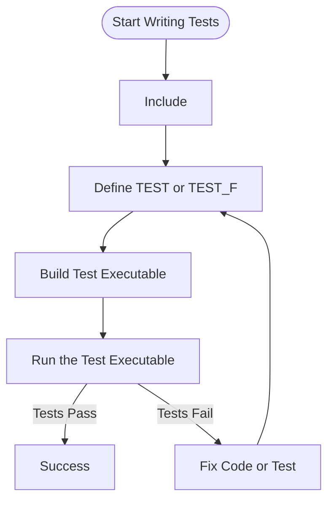

# Writing Your First Tests

Create, run, and interpret your first unit tests using GoogleTest. This guide introduces the basic structure of tests, assertion macros, and test execution, with sample code for common scenarios.

---

## 1. Workflow Overview

### What This Guide Helps You Accomplish
This guide shows you how to write your first simple unit tests using GoogleTest (gtest), enabling you to verify your C++ code's correctness through automated tests.

### Prerequisites
- You have GoogleTest properly installed and configured in your project.
- Ability to compile and run C++ code.
- Basic familiarity with C++ syntax.

### What You'll Achieve
- Understand the structure of a GoogleTest test case.
- Write tests that use assertion macros.
- Build and run tests and interpret their results.

### Approximate Time Commitment
15-30 minutes

### Difficulty Level
Beginner

---

## 2. Step-by-Step Instructions

### Step 1: Include the GoogleTest Header

Start by including the main GoogleTest header in your test source file.

```cpp
#include <gtest/gtest.h>
```

### Step 2: Define a Simple Test Using the `TEST` Macro

Use the `TEST(TestSuiteName, TestName)` macro to define a test. The test name and suite name can be any valid C++ identifiers.

Example testing a simple function:

```cpp
int Factorial(int n) {
  return n <= 1 ? 1 : n * Factorial(n - 1);
}

TEST(FactorialTest, HandlesZeroInput) {
  EXPECT_EQ(Factorial(0), 1);
}

TEST(FactorialTest, HandlesPositiveInput) {
  EXPECT_EQ(Factorial(1), 1);
  EXPECT_EQ(Factorial(2), 2);
  EXPECT_EQ(Factorial(3), 6);
  EXPECT_EQ(Factorial(8), 40320);
}
```

#### Notes:
- `TEST` defines a test function that GoogleTest will discover and run automatically.
- Tests are grouped in suites (`FactorialTest` above).
- Use assertion macros like `EXPECT_EQ` to verify conditions.
- Assertion failures in a test mark it as failed but do not abort the test (unless using `ASSERT_*` macros).

### Step 3: Build Your Test Executable

Compile your test code linking against the GoogleTest framework. For example, using `g++`:

```bash
g++ -std=c++17 -isystem /path/to/googletest/include -pthread \
    my_test.cc /path/to/libgtest.a /path/to/libgtest_main.a \
    -o my_test
```

or with CMake integration, configure accordingly based on your build system.

### Step 4: Run Your Tests

Execute the compiled test binary:

```bash
./my_test
```

Expected output will show which tests pass or fail. For example:

```
[ RUN      ] FactorialTest.HandlesZeroInput
[       OK ] FactorialTest.HandlesZeroInput
[ RUN      ] FactorialTest.HandlesPositiveInput
[       OK ] FactorialTest.HandlesPositiveInput
[----------] 2 tests from FactorialTest
[==========] 2 tests ran.
[  PASSED  ] 2 tests.
```

### Step 5: Interpret Test Results

- **OK** status means the test passed.
- Failed tests will show assertion failures with file and line number.
- Use this information to troubleshoot and fix bugs in your implementation.

---

## 3. Detailed Explanation of Basic Test Components

### TEST Macro

- Defines a named test.
- Test suite name groups related tests.
- Test names should be descriptive & unique within a suite.

### Assertion Macros

GoogleTest provides macros like `EXPECT_*` and `ASSERT_*`:

| Macro         | Behavior                      | Use Case                                      |
|---------------|-------------------------------|-----------------------------------------------|
| `EXPECT_EQ`   | Checks equality, nonfatal failure | Test continues even if assertion fails       |
| `ASSERT_EQ`   | Checks equality, fatal failure    | Use when failure should prevent further test |
| `EXPECT_TRUE` | Checks boolean true condition     | General condition checks                      |
| `ASSERT_FALSE`| Checks boolean false condition    | Critical boolean checks                        |

### Difference between `EXPECT_*` and `ASSERT_*`
- `EXPECT_*` lets the test continue after failure, useful for multiple checks in one test.
- `ASSERT_*` aborts the current test function on failure, for necessary preconditions.

### Test Fixture (Optional for Reuse)

For multiple tests sharing setup, use test fixtures with `TEST_F`:

```cpp
class MyTestFixture : public ::testing::Test {
 protected:
  void SetUp() override {
    // Initialization before each test
  }

  void TearDown() override {
    // Cleanup after each test
  }

  int shared_data_;
};

TEST_F(MyTestFixture, Test1) {
  shared_data_ = 42;
  EXPECT_EQ(shared_data_, 42);
}
```

---

## 4. Practical Examples

### Example 1: Testing a Simple Function

```cpp
#include <gtest/gtest.h>

int Add(int a, int b) {
  return a + b;
}

TEST(AdditionTest, PositiveNumbers) {
  EXPECT_EQ(Add(1, 2), 3);
  EXPECT_EQ(Add(10, 20), 30);
}

TEST(AdditionTest, NegativeNumbers) {
  EXPECT_EQ(Add(-1, -2), -3);
}
```

### Example 2: Using Assertions

```cpp
TEST(StringTest, Compare) {
  std::string s = "hello";
  EXPECT_EQ(s.size(), 5);
  EXPECT_NE(s, "world");
  EXPECT_TRUE(s == "hello");
  ASSERT_FALSE(s.empty());
}
```

---

## 5. Troubleshooting & Tips

### Common Issues

- **Tests not running:** Ensure you call `RUN_ALL_TESTS()` in your `main()` and compile the test executable correctly.
- **Linking errors:** Confirm your build links against the GoogleTest libraries.
- **Assertion macro misuse:** Use correct macros (`EXPECT_*` vs `ASSERT_*`), and provide the correct number of parameters.

### Best Practices

- Keep tests **small and focused**: Each test should check one behavior.
- Use **descriptive names**: Name your test suite and test clearly.
- Use **ASSERT_** only when failure should stop the test.
- Use **EXPECT_** to continue after failure to gather multiple failures.
- Write tests **before bugs are encountered**: Test-driven development works well with GoogleTest.

### Performance Considerations

- GoogleTest is lightweight and fast for unit tests.
- Organize tests with fixtures to share setup and speed up.

### Next Steps

- Learn to write **parameterized tests** for testing multiple inputs.
- Explore GoogleMock to **mock dependencies** and test interactions.
- Read [GoogleTest Primer](../docs/primer.md) for a deeper understanding.
- Review [Writing Your First Test](../getting-started/first-test-run-validation/writing-your-first-test.md) for practical hands-on examples.

---

## 6. Summary

You have learned the essentials of writing your first unit tests using GoogleTest. By following the steps in this guide, you can build reliable tests that help catch regressions and document expected behavior.

For more advanced testing features and mocking strategies, proceed to the guides on GoogleMock and test fixtures.

---

### Additional Resources
- [GoogleTest Primer](../docs/primer.md)
- [Writing Your First Test](../getting-started/first-test-run-validation/writing-your-first-test.md)
- [gMock for Dummies](../docs/gmock_for_dummies.md)
- [GoogleMock Cookbook](../docs/gmock_cook_book.md)
- [Mocking Reference](../docs/reference/mocking.md)

---

### Example Test Execution Flow (Mermaid Diagram)



---

<Tip>
Remember to always call `RUN_ALL_TESTS()` in your `main()` function to execute all the defined tests.
</Tip>
<Note>
Use `EXPECT_*` assertions instead of `ASSERT_*` when you want the test to continue after a failure, enabling multiple verification points in one test.
</Note>
<Warning>
Expectations in tests must be set before exercising the code under test. Setting expectations afterward leads to undefined behavior.
</Warning>

