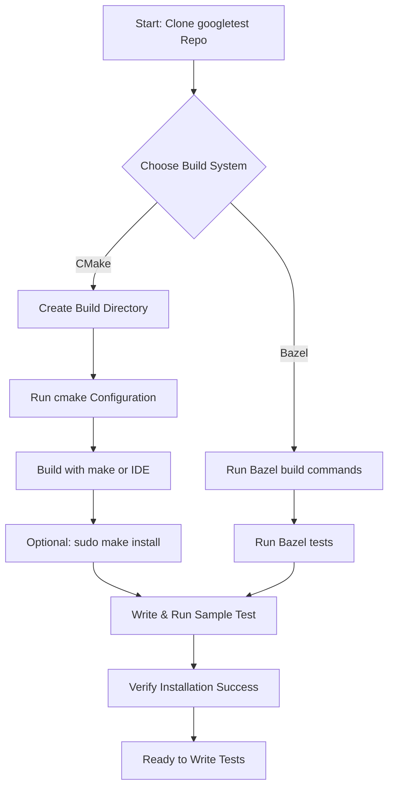

# Installation and Setup

## Overview
This guide provides a clear, step-by-step walkthrough on how to successfully install GoogleTest and GoogleMock on your development platform. It covers configuring your build environment using CMake or Bazel, building from source, and verifying that your setup works correctly. Whether you are on Windows, Linux, or macOS, this guide ensures you can start writing and running tests with GoogleTest as quickly as possible.

---

## Prerequisites
Before beginning installation, ensure you have the following:

- A development environment with a C++ compiler supporting C++17 or later (e.g., GCC, Clang, MSVC).
- CMake version 3.14 or higher installed for CMake-based builds.
- (Optional) Bazel build system installed if you prefer Bazel for builds.
- Git installed for cloning the repository.
- Basic familiarity with your chosen build system and command line.

> For more details on system compatibility and build tool requirements, see the [Prerequisites & System Requirements](https://github.com/google/googletest/tree/main/docs/getting-started/essential-setup/prerequisites-requirements) page.

---

## Installation Workflow

### Step 1: Clone the GoogleTest Repository
Clone the official repository to get the latest source code including GoogleTest and GoogleMock.

```bash
git clone https://github.com/google/googletest.git
cd googletest
```

This directory contains all source components needed for GoogleTest and GoogleMock.

### Step 2: Choose Your Build System

GoogleTest supports building with both **CMake** and **Bazel**. Choose the option that best suits your workflow.

---

### A. Building and Installing with CMake

1. **Create a separate build directory:** This keeps build files isolated.

   ```bash
   mkdir build
   cd build
   ```

2. **Configure the build:**

   By default, GoogleMock is included. If you want only GoogleTest, add `-DBUILD_GMOCK=OFF`.

   ```bash
   cmake ..            # builds with GoogleMock included
   # or
   cmake .. -DBUILD_GMOCK=OFF  # builds only GoogleTest
   ```

3. **Build the project:**

   On Linux/macOS:

   ```bash
   make
   ```

   On Windows with Visual Studio, open the generated solution file (`gtest.sln`) and build from the IDE.

4. **Optional: Install the libraries:**

   If you have administrator rights and want GoogleTest installed system-wide:

   ```bash
   sudo make install
   ```

5. **Verify the build:**

   Run the provided tests to ensure the build succeeded:

   ```bash
   make test
   ```

---

### B. Building and Installing with Bazel

If you prefer Bazel:

1. Confirm Bazel is installed on your system.
2. Use the Bazel build commands in the repository root:

   ```bash
   bazel build //googletest:all
   bazel build //googlemock:all
   ```

3. You can run tests with:

   ```bash
   bazel test //...
   ```

4. Include the built targets (`//googletest` and `//googlemock`) in your Bazel projects for test integration.

---

### Step 3: Configure Your Project to Link Against GoogleTest

After building/installing GoogleTest and GoogleMock, ensure that your projects include the correct headers and link to the appropriate libraries.

#### Using CMake

Add the following to your project’s `CMakeLists.txt`:

```cmake
find_package(GTest REQUIRED)

add_executable(your_test_executable your_test_file.cpp)
target_link_libraries(your_test_executable GTest::gtest_main GTest::gmock_main)

include(GoogleTest)
gtest_discover_tests(your_test_executable)
```

This enables automatic discovery and running of tests.

#### Common Link Libraries

- `gtest` / `gtest_main` for GoogleTest
- `gmock` / `gmock_main` for GoogleMock (includes GoogleTest)

Note: Use `gmock_main` if you want to use the provided `main()` function for tests.

---

### Step 4: Verify Your Installation

To confirm your installation is complete and working:

1. Create a simple test file, e.g., `sample_test.cpp`:

```cpp
#include <gtest/gtest.h>

TEST(SampleTest, Addition) {
    EXPECT_EQ(2 + 2, 4);
}

int main(int argc, char **argv) {
    ::testing::InitGoogleTest(&argc, argv);
    return RUN_ALL_TESTS();
}
```

2. Build and run this test with your configured build setup.

3. You should see output indicating that one test passed.

---

## Platform-Specific Notes

### Windows

- Visual Studio users will get a solution file generated by CMake.
- To avoid runtime library conflicts, consider enabling the `gtest_force_shared_crt` option in CMake to match dynamic/static runtime linkage.

### Linux/macOS

- Ensure pthread support is enabled (usually automatic with CMake).
- If you encounter link errors related to pthread, verify your linker flags include `-pthread`.

### Special Environments

Arduino, ESP32, and other embedded platforms use different entry point conventions. GoogleTest adapts using `setup()` and `loop()` functions. See the [main.cc](https://github.com/google/googletest/blob/main/googlemock/src/gmock_main.cc) for examples.

---

## Best Practices and Tips

- Keep GoogleTest source updated to benefit from bug fixes and improvements.
- For continuous integration (CI), configure your build environment as in this guide and run `make test` or equivalent test commands.
- Use `gmock_main` when you want GoogleMock’s `main()` function without writing your own.
- Avoid macro name clashes by using `-DGTEST_DONT_DEFINE_TEST=1` if integrating with other libraries that define common macros.

---

## Troubleshooting

<Accordion title="Common Build Issues">

**Build fails due to incorrect compiler flag or missing C++17 support:**
- Verify your compiler version supports C++17.
- Ensure your project and GoogleTest build both specify `-std=c++17` or equivalent.

**Link errors related to pthread:**
- Confirm that the pthread library is linked.
- If using CMake, confirm `-pthread` is included in compiler and linker flags.

**Runtime errors due to mismatched runtime libraries on Windows:**
- Use CMake option `gtest_force_shared_crt=ON` to align runtime linkage.

**GoogleMock not found or missing headers:**
- Make sure you clone and build the complete `googletest` repository which includes GoogleMock.
- Include the correct include paths and link against `gmock` and `gmock_main`.

</Accordion>

<Accordion title="Verifying Test Execution">

If no tests run after building:

- Confirm your test source files register tests by using `TEST` or `TEST_F` macros.
- Ensure the test executable calls `::testing::InitGoogleTest(&argc, argv);` and `RUN_ALL_TESTS();`.
- For GoogleMock users, call `::testing::InitGoogleMock(&argc, argv);` instead.

</Accordion>

---

## Resources and Next Steps

- Detailed environment and build requirements: [Prerequisites & System Requirements](https://github.com/google/googletest/tree/main/docs/getting-started/essential-setup/prerequisites-requirements)
- Sample test projects: [Your First Test: Quickstart Sample](https://github.com/google/googletest/tree/main/docs/getting-started/quickstart-and-troubleshooting/quickstart-example)
- Integration information: [Integration & Extensibility](https://github.com/google/googletest/tree/main/docs/overview/architecture-concepts/integration-points)
- Troubleshooting guide: [Troubleshooting & Common Issues](https://github.com/google/googletest/tree/main/docs/getting-started/quickstart-and-troubleshooting/troubleshooting-validation)

By completing this setup guide, you now have a fully functional GoogleTest environment ready for writing and running C++ tests. Proceed to writing your first tests or explore advanced configurations.

---

## Summary Diagram of the Installation Flow



---

## Example: Minimal CMakeLists.txt to Use GoogleTest

```cmake
cmake_minimum_required(VERSION 3.14)
project(SampleTestProject CXX)

set(CMAKE_CXX_STANDARD 17)

# Locate GTest
find_package(GTest REQUIRED)

add_executable(sample_test sample_test.cpp)

target_link_libraries(sample_test GTest::gtest_main GTest::gmock_main)

include(GoogleTest)
gtest_discover_tests(sample_test)
```

This minimal configuration will allow you to build and run your tests using GoogleTest and GoogleMock seamlessly.

---

## Important 
Always ensure your build environment respects the C++ standard and runtime library compatibility between your project and the GoogleTest libraries.

For further customization or if integrating into larger projects, see the [Feature Overview](https://github.com/google/googletest/tree/main/docs/overview/quick-tour-features-usecases/feature-overview) and [Integration & Extensibility](https://github.com/google/googletest/tree/main/docs/overview/architecture-concepts/integration-points) documents.

<Check>
Following this guide guarantees a reliable foundation to start using GoogleTest and GoogleMock with confidence across supported platforms.
</Check>
