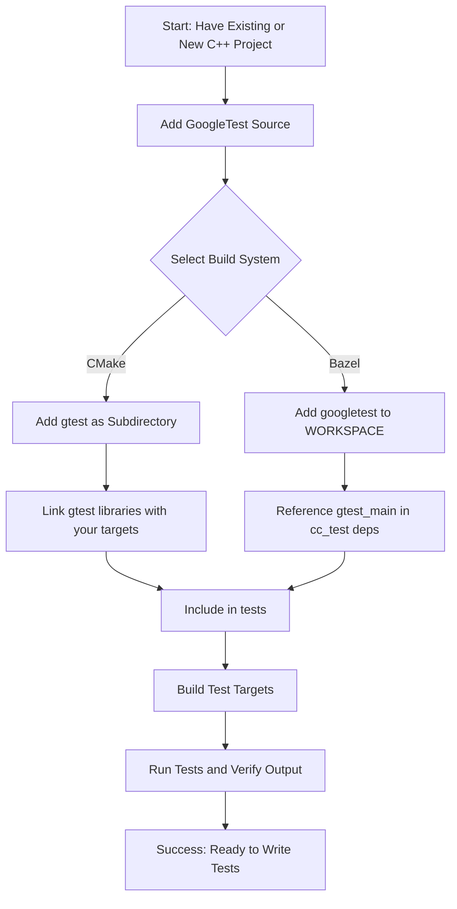

# Installation and Project Setup

## Overview

This guide shows you how to add GoogleTest to a new or existing C++ project. We focus on integrating GoogleTest using common build systems like CMake and Bazel to ensure your environment is correctly prepared for writing and running tests. By following this guide, you'll configure your project to successfully compile, link, and execute tests with GoogleTest.

---

## Prerequisites

Before you begin:

- You should have a C++ project set up and a working build environment.
- Basic familiarity with your project's build system (CMake or Bazel) is required.
- Ensure you have compatible compiler support for at least the C++17 standard.
- You have administrative or development permissions to add third-party libraries.

---

## Expected Outcome

By following this guide, you will:

- Successfully add GoogleTest libraries to your project.
- Link GoogleTest in your build system.
- Include necessary headers for test development.
- Confirm your compiler and linker settings support GoogleTest.
- Prepare your project to build and run simple test cases (covered in a subsequent guide).

## Estimated Time

This setup typically takes between 10 to 30 minutes, depending on your familiarity with your build system.

---

## Step-by-Step Instructions

### 1. Obtain GoogleTest Source

GoogleTest is often included as a submodule or downloaded source. You can:

- Clone from the official GitHub repository `https://github.com/google/googletest`.
- Use your package manager if available (for Linux/macOS).
- Consider including GoogleTest as part of your third-party dependencies.

### 2. Add GoogleTest to Your Build System

#### Using CMake

1. **Add GoogleTest as a subdirectory:**

   In your root `CMakeLists.txt`:

   ```cmake
   add_subdirectory(path/to/googletest)
   ```

2. **Link the GoogleTest libraries:**

   In your test executable target:

   ```cmake
   target_link_libraries(your_test_target
       gtest
       gtest_main
       # Use gmock and gmock_main if mocking is needed
       gmock
       gmock_main
   )
   ```

3. **Include GoogleTest headers:**

   Usually, `target_link_libraries` handles include paths, but if needed:

   ```cmake
   target_include_directories(your_test_target PRIVATE path/to/googletest/include)
   ```

4. **Set C++17 standard:**

   ```cmake
   set_target_properties(your_test_target PROPERTIES CXX_STANDARD 17 CXX_STANDARD_REQUIRED YES)
   ```

5. **Configure and build:**

   Run your standard CMake configuration and build commands.

#### Using Bazel

1. **Add GoogleTest dependency:**

   In your `WORKSPACE` file, add the `googletest` repository and its version.

2. **Reference GoogleTest targets:**

   In your `BUILD` file for tests:

   ```bazel
   cc_test(
       name = "your_test",
       srcs = ["your_test.cc"],
       deps = ["@com_google_googletest//:gtest_main"],
   )
   ```

3. **Build and run:**

   Use Bazel commands `bazel build //...` and `bazel test //...` as needed.

---

### 3. Include GoogleTest Headers in Your Test Code

Add the main header to your test source files:

```cpp
#include <gtest/gtest.h>
```

For mocking capabilities, include:

```cpp
#include <gmock/gmock.h>
```

---

### 4. Compile and Link Your Tests

Ensure your compiler:

- Supports C++17 or later.
- Has proper include paths for GoogleTest headers.
- Links against the GoogleTest libraries (`gtest`, `gtest_main`, optionally `gmock`, `gmock_main`).

---

### 5. Verify Installation

Build your test executable and observe the output.

If the build is successful, you can run your test executable, which should run all discovered tests (if any are present). This step is further detailed in the "Writing and Running Your First Test" guide.

---

## Best Practices and Tips

- Always link with `gtest_main` or `gmock_main` if you don't write your own `main()` function.
- Use `gmock` libraries only when you need mocking; otherwise, linking with `gtest` is sufficient.
- Specify the C++ standard explicitly to avoid compatibility issues.
- When using CMake, keep GoogleTest outside your main source tree to avoid mixing production and test code.
- Consider vendorizing GoogleTest dependencies as a submodule to control versions.

---

## Common Pitfalls

- Not calling `testing::InitGoogleTest(&argc, argv);` in your own `main()` function if not using `gtest_main`.
- Omitting `gtest_main` or `gmock_main` libraries during linking, causing unresolved references to `main`.
- Using a compiler version that lacks full C++17 support.
- Mixing header paths or library versions from different GoogleTest releases.
- Forgetting to specify the correct include or link directories.

---

## Troubleshooting

<AccordionGroup title="Common Setup Issues">
<Accordion title="Linker Errors: Undefined References to GoogleTest Symbols">
Verify that you linked your test target with the required GoogleTest or GoogleMock libraries (e.g., `gtest`, `gtest_main`). Also, confirm the library paths are correctly specified.
</Accordion>
<Accordion title="Compiler Errors Related to C++17">
Ensure your compiler supports C++17 and that your project is configured to use it (e.g., `-std=c++17` or equivalent in your build system).
</Accordion>
<Accordion title="Headers Not Found">
Confirm the include paths to GoogleTest headers are correct and accessible by your compiler.
</Accordion>
</AccordionGroup>

---

## Next Steps

Now that you have GoogleTest integrated into your project:

- Proceed to the guide on [Writing and Running Your First Test](writing-and-running-your-first-test.html).
- Explore [Mocking Workflows](mocking-workflows.html) if you plan to use GoogleMock features.
- Review [Installation and Setup Troubleshooting](troubleshooting-installation.html) for more help.

---

## Additional Resources

- GoogleTest [Core Features and Value Proposition](/overview/intro-product-core/core-features-value)
- GoogleTest [Key Concepts and Terminology](/overview/intro-product-core/core-concepts-terminology)
- [GoogleMock for Dummies](https://google.github.io/googletest/gmock_for_dummies.html)
- Official GoogleTest GitHub Repository: https://github.com/google/googletest

---

## Diagram: Typical Build Integration Flow


