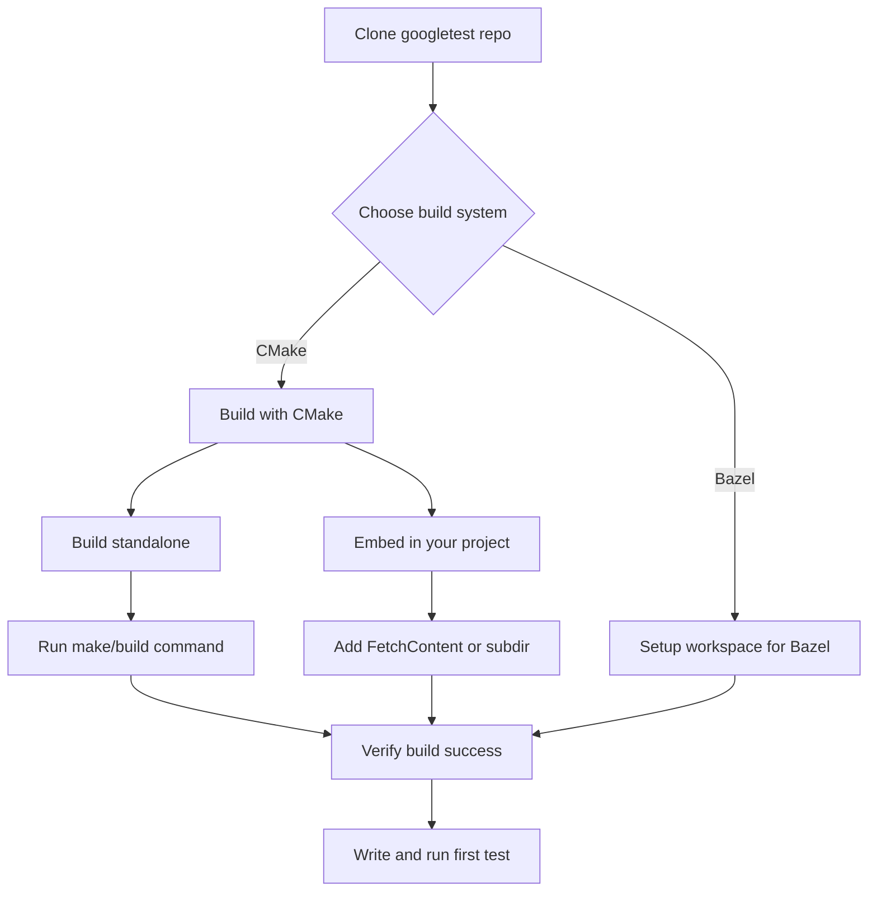

# Installation and Setup Guide

This guide walks you through installing GoogleTest and GoogleMock, configuring your project with either CMake or Bazel, and verifying that your development environment is ready for writing and running tests. Whether you use these frameworks standalone or merged, following these steps will ensure a smooth setup.

---

## 1. Overview

### What You Will Accomplish
After completing this guide, you will have:

- Cloned and built GoogleTest and GoogleMock using either CMake or Bazel.
- Configured your project's build system to include GoogleTest/GoogleMock headers and libraries.
- Verified your environment is set up correctly to write, build, and run tests.

### Prerequisites

- C++17 compatible compiler installed.
- CMake (3.14 or higher) installed if using CMake.
- Git installed for source code cloning.
- Basic knowledge of CMake or Bazel usage.
- On Windows, Visual Studio (or equivalent) installed if building with CMake.

### Estimated Time
~20-30 minutes for initial setup depending on familiarity.

### Difficulty Level
Intermediate (familiarity with C++ build systems recommended).

---

## 2. Installation and Build Steps

### 2.1 Cloning the Repositories

GoogleTest and GoogleMock are maintained together in a single repository but also provide separate build options.

```bash
# Clone the GoogleTest repository at a stable tag
$ git clone https://github.com/google/googletest.git -b v1.17.0
db googletest
```

### 2.2 Building with CMake

You can build GoogleTest and GoogleMock as standalone projects or integrate them into your existing CMake project.

#### 2.2.1 Building Standalone with CMake

1. Navigate into the cloned directory:

    ```bash
    cd googletest
    mkdir build
    cd build
    ```

2. Generate build scripts (includes GoogleMock by default):

    ```bash
    cmake ..
    ```

    - To build only GoogleTest (excluding GoogleMock):

    ```bash
    cmake .. -DBUILD_GMOCK=OFF
    ```

3. Build the libraries:

    - On Unix-like systems:

      ```bash
      make
      ```

    - On Windows with Visual Studio:
      Open the generated `gtest.sln` and build the solution.

    - On MacOS with Xcode:
      Open the `.xcodeproj` file and build.

4. (Optional) Install the libraries globally (usually requires admin privileges):

    ```bash
    sudo make install
    ```

#### 2.2.2 Incorporating GoogleTest into Your CMake Project

There are two main techniques:

1. Find Installed Package

    Use `find_package(GTest CONFIG REQUIRED)` if GoogleTest is installed.

    Then link with libraries like `GTest::gtest` and `GTest::gmock`.

2. Build GoogleTest Directly as Part of Your Project

    Add the GoogleTest source as a subdirectory, ensuring consistent compiler and linker settings.

    Example snippet for your `CMakeLists.txt`:

    ```cmake
    include(FetchContent)
    FetchContent_Declare(
      googletest
      URL https://github.com/google/googletest/archive/5376968f6948923e2411081fd9372e71a59d8e77.zip
    )
    set(gtest_force_shared_crt ON CACHE BOOL "" FORCE)  # On Windows, for runtime consistency
    FetchContent_MakeAvailable(googletest)

    add_executable(my_tests tests.cpp)
    target_link_libraries(my_tests gtest_main)
    add_test(NAME my_tests COMMAND my_tests)
    ```

> **Tip:** Using `FetchContent` ensures GoogleTest sources are always in sync and eliminates manual updates.

---

### 2.3 Building with Bazel

If your project uses Bazel, GoogleTest and GoogleMock are available as external dependencies.

- Update your `MODULE.bazel` or `WORKSPACE` to include GoogleTest.
- Import the necessary targets and write test binaries.

Refer to the [Installing with Bazel guide](/getting-started/setup-and-installation/installing-with-bazel) for detailed steps.

---

## 3. Configuring Your Project

### Linking and Headers

- Ensure your project includes GoogleTest and GoogleMock header directories.
- Link against the appropriate libraries, choosing one of these depending on your needs:

  - `gtest` – Basic GoogleTest library.
  - `gtest_main` – GoogleTest library including `main()` function.
  - `gmock` – GoogleMock library without a `main()`.
  - `gmock_main` – GoogleMock with a `main()` function.

### Visual Studio Users

- When integrating with Visual Studio, use `gtest_force_shared_crt` to avoid runtime conflicts between your project and GoogleTest.
- Without this, you may encounter linker errors about mismatched runtime libraries.

### C++ Standard Version

GoogleTest requires C++17 or newer. In your CMake project:

```cmake
set(CMAKE_CXX_STANDARD 17)
set(CMAKE_CXX_STANDARD_REQUIRED ON)
```

This ensures your compiler uses the correct standard.

---

## 4. Verifying Your Setup

Create a minimal test file to verify the build and linkage:

```c++
#include <gtest/gtest.h>

TEST(SanityTest, BasicAssertions) {
  EXPECT_EQ(1, 1);
}

int main(int argc, char **argv) {
  ::testing::InitGoogleTest(&argc, argv);
  return RUN_ALL_TESTS();
}
```

Build and run this test:

```bash
# For CMake:
mkdir build && cd build
cmake ..
cmake --build .
./YourTestExecutable
```

Expected output should show that the tests ran and succeeded.

---

## 5. Advanced Configuration and Tweaks

### Multi-threaded Tests

GoogleTest supports thread safety if `pthread` is available. You can manually control pthread use by defining `-DGTEST_HAS_PTHREAD=1` or `0` in your build flags.

### Using GoogleTest as a Shared Library

To build GoogleTest or GoogleMock as a shared library (DLL on Windows):

Add `-DGTEST_CREATE_SHARED_LIBRARY=1` to compiler flags when building the libraries.

Add `-DGTEST_LINKED_AS_SHARED_LIBRARY=1` when compiling your tests.

> **Note:** Using shared libraries may improve load times but is optional.

### Avoiding Macro Name Clashes

GoogleTest defines many macros (e.g., `TEST()`, `ASSERT_EQ`). To avoid clashes:

Define `-DGTEST_DONT_DEFINE_TEST=1` (or other macro variations) in your compiler flags. Then use the `GTEST_` prefix, e.g., `GTEST_TEST()` instead of `TEST()`.

---

## 6. Troubleshooting

<AccordionGroup title="Common Issues During Installation and Setup">
<Accordion title="Linker Errors About Runtime Library Mismatch">
If you see linker errors mentioning runtime library mismatches (e.g., `MTd_StaticDebug` vs `MDd_DynamicDebug`):

- Enable `gtest_force_shared_crt` in CMake for consistent runtime linkage.
- Check your project and GoogleTest compile flags to ensure they match.
</Accordion>
<Accordion title="Build Fails Due to Missing pthread Library">
- If on a Unix-like system, build errors related to pthread linkage indicate missing pthread flags.
- Using CMake should handle these automatically.
- If using your own build system, add `-lpthread` and relevant compiler flags.
- Use `-DGTEST_HAS_PTHREAD=1` to force enable pthread support if needed.
</Accordion>
<Accordion title="Tests Fail Due to C++ Standard Version">

- Verify your compiler supports C++17.
- Ensure your build system sets `-std=c++17` or equivalent.
- In CMake, use `set(CMAKE_CXX_STANDARD 17)`.

</Accordion>
</AccordionGroup>

---

## 7. Summary Workflow Diagram



---

## 8. Next Steps

- Proceed to [Writing and Running Your First Test](/guides/getting-started/your-first-test) for creating tests.
- Explore [Project Configuration](/getting-started/configuration-and-first-use/project-configuration) for integration into larger projects.
- If you use Bazel, check the [Installing with Bazel guide](/getting-started/setup-and-installation/installing-with-bazel).

---

## References

- [GoogleTest GitHub Repository](https://github.com/google/googletest)
- [CMake Official Site](https://cmake.org/)
- GoogleTest Primer: Core concepts for writing tests
- gMock documentation for mocking with GoogleMock

---