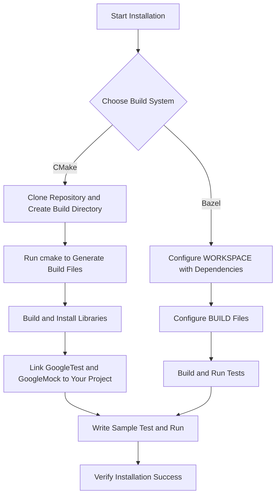

# Installation and Setup Guide for GoogleTest and GoogleMock

## Overview
This guide walks you through installing and configuring GoogleTest (the C++ testing framework) and GoogleMock (the C++ mocking framework) using commonly supported build systems such as CMake and Bazel. By following these instructions, you will be able to add the necessary dependencies, link both frameworks properly, and verify your installation with sample tests.

---

## Prerequisites
Before beginning installation, ensure the following:

- Your development environment supports **C++17** or later. GoogleTest and GoogleMock require C++17 features.
- You have a compatible compiler (e.g., GCC 7+, Clang 5+, MSVC 2017+).
- Your operating system is supported (Linux, Windows, macOS).
- You have the necessary permissions to add libraries and build in your project.
- For parallel builds or threads, ensure your platform supports pthreads or equivalent.

For detailed platform and compiler compatibility, please review the [System Requirements & Supported Platforms](../getting-started/prerequisites-installation/system-requirements) documentation.

---

## Installation Using CMake

### Step 1: Download GoogleTest Source
Clone the official repository or download a release:

```bash
git clone https://github.com/google/googletest.git -b main
cd googletest
```

### Step 2: Create a Build Directory

```bash
mkdir build
cd build
```

### Step 3: Generate Build Files

To include both GoogleTest and GoogleMock (default):

```bash
cmake ..
```

To build only GoogleTest (exclude GoogleMock):

```bash
cmake .. -DBUILD_GMOCK=OFF
```


### Step 4: Build the Libraries

Use your native build tool (e.g., make, ninja, msbuild) to compile:

```bash
make  # or cmake --build .
```

### Step 5: Install Libraries (Optional but Recommended)

Install the built libraries and headers to a system or user location:

```bash
sudo make install
```

Installing allows other projects to find and link to GoogleTest and GoogleMock more easily.

### Step 6: Link GoogleTest and GoogleMock in Your Project

In your project’s `CMakeLists.txt`, find the package and link with the targets:

```cmake
find_package(GTest CONFIG REQUIRED)
# For using both GoogleTest and GoogleMock
target_link_libraries(your_test_target PRIVATE GTest::gtest GTest::gmock GTest::gmock_main)
```

Use `GTest::gtest_main` to link the main function provided by GoogleMock.

---

## Installation Using Bazel

### Step 1: Declare Dependencies in WORKSPACE

Add the following rules to import GoogleTest and GoogleMock repositories:

```python
http_archive(
    name = "com_google_googletest",
    urls = ["https://github.com/google/googletest/archive/main.zip"],
    strip_prefix = "googletest-main",
)
```

### Step 2: Load GoogleTest in BUILD Files

In your test BUILD file:

```python
cc_test(
    name = "your_test",
    srcs = ["your_test.cc"],
    deps = ["@com_google_googletest//:gmock_main"],
)
```

Use the `gmock_main` target to link GoogleMock with the provided main function.

---

## Verifying the Installation

1. **Write a Sample Test**

Create a simple test file, e.g. `sample_test.cc`:

```cpp
#include <gtest/gtest.h>
#include <gmock/gmock.h>

TEST(SampleTest, Success) {
  EXPECT_EQ(1 + 1, 2);
}
```

2. **Compile the Test**

- With CMake:

Make sure your target links to `GTest::gtest` and `GTest::gtest_main`.

- With Bazel:

Use Bazel to build and run your test.

3. **Run the Test Executable**

Execute your test binary. A successful run will show all tests passing:

```bash
[==========] Running 1 test from 1 test suite.
[----------] Global test environment set-up.
[----------] 1 test from SampleTest
[ RUN      ] SampleTest.Success
[       OK ] SampleTest.Success (0 ms)
[----------] 1 test from SampleTest (0 ms total)

[==========] 1 test from 1 test suite ran. (0 ms total)
[  PASSED  ] 1 test.
```

You now have GoogleTest and GoogleMock installed and configured correctly.

---

## Practical Tips and Best Practices

- **Use `gmock_main` when possible:** It provides a pre-implemented `main()` that initializes both GoogleTest and GoogleMock.

- **Set up your build system carefully:** Linking only GoogleTest won’t suffice if you use mocks; include GoogleMock libraries.

- **Keep dependencies updated:** Regularly update GoogleTest to use the latest features and fixes.

- **Consult system requirements early:** Ensure your build environment meets C++17 standards to avoid cryptic errors.

- **Suppress warnings on mocks you don’t care about:** Use `NiceMock<>` or explicit `EXPECT_CALL(...).Times(AnyNumber())` to manage noisy mock call warnings.

- **Separate mock definitions:** To speed up build times, implement mock class constructors and destructors out-of-class.

- **Check common setup issues:** If your build or linking fails, consult [Common Setup Issues](../getting-started/troubleshooting-support/common-setup-issues) for guidance.

---

## Troubleshooting Common Installation Issues

### Linking Errors
- Ensure you link against `gmock`, `gtest`, and if applicable, `gmock_main`.
- Verify your compiler flags include `-pthread` or equivalent for threading support.

### Compiler Compatibility
- Use compilers supporting C++17 or newer; older compilers cause template errors.

### Uninteresting Mock Call Warnings
- These warnings indicate mock calls without `EXPECT_CALL`. Use `NiceMock` or add expectations for calls to suppress.

### Slow Builds
- Move mock class constructors/destructors to separate `.cc` files.

### Missing `main()` Function
- Use `gtest_main` or `gmock_main` libraries to provide a default `main()` to run tests.

### Cross-Compilation Challenges
- Use pkg-config or adjust include and library paths correctly.

For more, see [Common Setup Issues](../getting-started/troubleshooting-support/common-setup-issues).

---

## Additional Resources and References

- [System Requirements & Supported Platforms](/getting-started/prerequisites-installation/system-requirements)
- [Installing with CMake](/getting-started/prerequisites-installation/installation-cmake)
- [Installing with Bazel](/getting-started/prerequisites-installation/installation-bazel)
- [Common Setup Issues](/getting-started/troubleshooting-support/common-setup-issues)
- [GoogleTest Primer](../gtest_overview/intro_value/what_is_googletest)
- [gMock Cookbook](../docs/gmock_cook_book.md)
- [Mocking Reference](../docs/reference/mocking.md)

---

## Summary
By integrating GoogleTest and GoogleMock through supported build tools such as CMake and Bazel, you unlock powerful capabilities for writing and running reliable C++ tests and mocks. This guide ensures you have clear, actionable instructions to set up the frameworks, link them correctly, and verify a working environment.

---

### Mermaid Diagram: Installation Workflow

