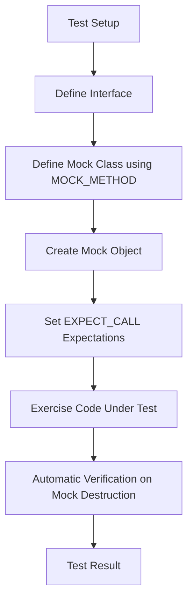

# Introducing Mocking with GoogleMock

Discover how to create mock objects and use them to verify interactions and behaviors. This guide introduces the core mocking syntax and concepts, helping you simulate dependencies and assert correct program logic.

---

## 1. What is GoogleMock?

GoogleMock (gMock) is a C++ mocking framework integrated with GoogleTest that helps you create mock classes to simulate dependencies in your code. Mock objects can track function calls, enforce call expectations, and control return values, enabling more robust and isolated unit tests.

Imagine you have a module that interacts with external dependencies (e.g., databases, network services). Testing such a module directly is slow or fragile because of these dependencies. Using gMock, you substitute the real dependencies with mocks, so you can test your module's logic independently, quickly, and reliably.

---

## 2. Workflow Overview

- **Purpose**: Learn to define mock classes, create mock objects, set expectations (behavior and call counts), and verify interactions.
- **Prerequisites**: 
  - Basic understanding of C++ and virtual functions.
  - GoogleTest and GoogleMock installed and configured in your development environment.
- **Outcome**: Ability to write mock classes and write tests that verify how your code interacts with those mock objects.
- **Estimated Time**: 15-30 minutes
- **Difficulty**: Beginner to Intermediate

---

## 3. Creating a Mock Class

### 3.1 Define an Interface

Start with an interface or abstract class representing the dependency you want to mock. For example:

```cpp
class Turtle {
 public:
  virtual ~Turtle() {}
  virtual void PenUp() = 0;
  virtual void PenDown() = 0;
  virtual void Forward(int distance) = 0;
  virtual void Turn(int degrees) = 0;
  virtual void GoTo(int x, int y) = 0;
  virtual int GetX() const = 0;
  virtual int GetY() const = 0;
};
```

The destructor must be virtual to ensure proper cleanup.

### 3.2 Define the Mock Class

Derive a mock class from the interface and use the `MOCK_METHOD` macro to declare mock methods. Each macro takes:
- Return type
- Method name
- Argument list (enclosed in parentheses)
- Optional qualifiers like `const` and `override`

Example:

```cpp
#include <gmock/gmock.h>  // Brings in GoogleMock

class MockTurtle : public Turtle {
 public:
  MOCK_METHOD(void, PenUp, (), (override));
  MOCK_METHOD(void, PenDown, (), (override));
  MOCK_METHOD(void, Forward, (int distance), (override));
  MOCK_METHOD(void, Turn, (int degrees), (override));
  MOCK_METHOD(void, GoTo, (int x, int y), (override));
  MOCK_METHOD(int, GetX, (), (const, override));
  MOCK_METHOD(int, GetY, (), (const, override));
};
```

You do NOT need to implement these mock methods; the macro generates them.

### 3.3 Tips for Defining Mock Classes

- Always put mock method declarations in the `public:` section for accessibility by `EXPECT_CALL`.
- When mocking overloaded functions, declare all overloads you want to mock.
- You can wrap complex return or argument types in parentheses to avoid parsing issues.
- For testing code that uses non-virtual methods or free functions, consider adapter interfaces or templates.

---

## 4. Using Mock Objects in Tests

### 4.1 Import Namespaces

Add the following using declarations to simplify code:

```cpp
using ::testing::_;          // Wildcard matcher
using ::testing::AtLeast;    // Example cardinality matcher
using ::testing::Return;     // Action
```

### 4.2 Create Mock Object

Instantiate your mock class:

```cpp
MockTurtle turtle;
```

### 4.3 Set Expectations Using `EXPECT_CALL`

Define what calls you expect the mock object to receive:

```cpp
EXPECT_CALL(turtle, PenDown())
    .Times(AtLeast(1));  // Expect at least one call
```

Key aspects:
- Call the macro before exercising code.
- Specify method and argument matchers.
- Chain clauses to control call count (`Times()`), return values or actions (`WillOnce()`, `WillRepeatedly()`), and ordering (`InSequence()`).

If you don't care about argument values, use `_` as a wildcard.

Example:

```cpp
EXPECT_CALL(turtle, GoTo(50, _));  // x should be 50, y can be anything.
```

### 4.4 Exercise Your Code

Pass the mock object into the system under test, trigger behavior:

```cpp
Painter painter(&turtle);
EXPECT_TRUE(painter.DrawCircle(0, 0, 10));
```

### 4.5 Automatic Verification

When a mock object is destroyed, gMock automatically verifies that all expectations were met, reporting failures if calls were missing, called too many times, or with wrong arguments.

---

## 5. Key Concepts

### 5.1 Expectations Must Be Set Before Calls

Set expectations using `EXPECT_CALL` before executing code that calls the mock. Setting expectations post-hoc is undefined behavior.

### 5.2 Matchers Control Argument Matching

Matchers such as `_` (anything), `Eq(value)`, `Ge(value)`, and user-defined matchers let you specify how arguments are matched in calls.

### 5.3 Controlling Call Counts (Cardinalities)

- `Times(n)`: expect exactly n calls.
- `AtLeast(n)`, `AtMost(n)`, `AnyNumber()` provide flexible constraints.

If you omit `Times()`, gMock infers call count from usage of `WillOnce()` and `WillRepeatedly()`.

### 5.4 Specifying Actions

Control what the mock method does when called:
- `WillOnce(Return(value))`: return specified value once.
- `WillRepeatedly(Return(value))`: return specified value on all subsequent calls.
- Combine with `DoAll()`, `Invoke()`, and other constructs for side effects and complex behaviors.

### 5.5 Ordering Expectations

Use `InSequence` to require calls to occur in a specific order:

```cpp
{
  InSequence s;
  EXPECT_CALL(mock, FirstCall());
  EXPECT_CALL(mock, SecondCall());
}
```

Calls must occur in this order.

### 5.6 Uninteresting Calls and Mock Strictness

- **Uninteresting calls**: Calls with no expectations set.
- By default, gMock warns on such calls (naggy behavior).

You can change strictness:

| Mock Class                  | Behavior on Uninteresting Calls                  |
|----------------------------|-------------------------------------------------|
| `NaggyMock<MockClass>`     | Warns (default for raw mocks)                    |
| `NiceMock<MockClass>`      | Silences warnings                                |
| `StrictMock<MockClass>`    | Treats as test failures                          |

Example:

```cpp
using ::testing::NiceMock;
NiceMock<MockFoo> nice_mock;
```

Remember: strictness affects only uninteresting calls, not unexpected calls (calls that violate expectations).

---

## 6. Practical Example

```cpp
#include <gmock/gmock.h>
#include <gtest/gtest.h>

class Turtle {
 public:
  virtual ~Turtle() {}
  virtual void PenDown() = 0;
  virtual void Forward(int distance) = 0;
  virtual int GetX() const = 0;
};

class MockTurtle : public Turtle {
 public:
  MOCK_METHOD(void, PenDown, (), (override));
  MOCK_METHOD(void, Forward, (int), (override));
  MOCK_METHOD(int, GetX, (), (const, override));
};

class Painter {
 public:
  explicit Painter(Turtle* turtle) : turtle_(turtle) {}

  bool DrawCircle(int x, int y, int radius) {
    turtle_->PenDown();
    turtle_->Forward(radius);
    return turtle_->GetX() == x + radius;
  }

 private:
  Turtle* turtle_;
};

TEST(PainterTest, UsesTurtleCorrectly) {
  MockTurtle mock_turtle;

  EXPECT_CALL(mock_turtle, PenDown())
      .Times(1);
  EXPECT_CALL(mock_turtle, Forward(10))
      .Times(1);
  EXPECT_CALL(mock_turtle, GetX())
      .Times(1)
      .WillOnce(testing::Return(10));

  Painter painter(&mock_turtle);
  EXPECT_TRUE(painter.DrawCircle(0, 0, 10));
}
```

- This test verifies that `PenDown()` and `Forward(10)` are called exactly once.
- The mock's `GetX()` returns 10, satisfying the painter's method expectation.
- If the calls are missing or altered, the test fails immediately.

---

## 7. Tips and Best Practices

- **Define mocks for interfaces you own** to avoid maintenance issues.
- Use `NiceMock` for common cases to reduce noise; switch to `StrictMock` when you want failures on unexpected calls.
- Use `_` matcher for arguments you don't care about to make tests less brittle.
- Consider `RetiresOnSaturation()` if you expect calls in sequence and want expectations to become inactive after fulfillment.
- Avoid over-specifying arguments and call counts to keep tests maintainable.
- Use `InSequence` or `After` clauses to assert call orders when necessary.
- Leverage `ON_CALL` to set default behaviors without requiring call verification.

---

## 8. Common Issues & Troubleshooting

### Uninteresting Calls Warning

If you see warnings about uninteresting calls:
- Confirm whether your test should verify the call.
- If not, either ignore the warning, use `NiceMock`, or add a catch-all expectation using `EXPECT_CALL(obj, Method(_)).Times(AnyNumber());`.

### Missing Virtual Destructors

Mocks of interfaces without virtual destructors may cause undefined behavior and heap errors.
- Always declare destructors virtual in your interfaces.

### Actions Exhaustion

If you specify fewer actions than calls (e.g., `WillOnce()` fewer times than calls), gMock uses the default action and warns.
- Use `WillRepeatedly()` to specify fallback behavior.

### Overly Strict Expectations

If your tests frequently fail due to changes in the order or number of calls:
- Loosen expectations using `AtLeast()`, `AnyNumber()`, or wildcards.
- Rethink whether your test is verifying implementation details rather than behavior.

### Ambiguous Overloads

For overloaded methods, specify the exact overload or use casting helpers to disambiguate.

---

## 9. Next Steps & Additional Resources

- Explore the [gMock for Dummies guide](https://google.github.io/googletest/gmock_for_dummies.html) for an in-depth tutorial.
- Consult the [gMock Cookbook](https://google.github.io/googletest/gmock_cook_book.html) for advanced mocking techniques.
- Learn about [actions and matchers](https://google.github.io/googletest/reference/mocking.html) to write complex mock behaviors.
- Review the [Nice, Strict, and Naggy Mock Classes](https://google.github.io/googletest/reference/mocking.html#NiceStrictNaggy) for managing warnings and errors.
- Read the [First Test Guide](https://github.com/google/googletest/blob/main/docs/guides/getting-started/first-run-validation/your-first-test.mdx) to integrate mocking into your test workflow.

---

_For the complete API reference, see the Mocking Framework API section of the documentation._

---

## Summary Diagram of Mocking Flow



---

## Related Pages

- [Defining and Using Mocks](https://github.com/google/googletest/blob/main/docs/api-reference/mocking-framework-api/defining-mocks.mdx)
- [Expectations, Actions, and Sequences](https://github.com/google/googletest/blob/main/docs/api-reference/mocking-framework-api/expectations-actions-sequences.mdx)
- [Nice, Strict, and Naggy Mock Classes](https://github.com/google/googletest/blob/main/docs/api-reference/mocking-framework-api/mock-class-behavior-modes.mdx)
- [Getting Started with Your First Test](https://github.com/google/googletest/blob/main/docs/guides/getting-started/first-run-validation/your-first-test.mdx)
- [gMock Cookbook](https://google.github.io/googletest/gmock_cook_book.html)

---

<Check>
Ensure you have included `#include <gmock/gmock.h>` in your test files to access mocking features.
</Check>

<Note>
Mocking needs virtual functions to override. Mocking non-virtual functions requires additional design considerations.
</Note>

<Tip>
Use sequences and cardinalities to precisely control call order and count, improving both test reliability and diagnostic output.
</Tip>