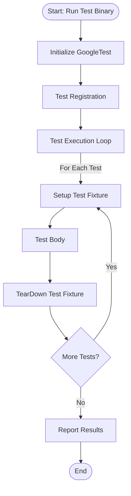

# GoogleTest Primer

## Introduction: Why GoogleTest?

Writing reliable and maintainable tests in C++ demands a robust framework that helps manage test complexity and improves test quality. GoogleTest is designed to meet these challenges by enabling isolated, organized, portable, and expressive tests that provide detailed diagnostics when failures occur.

It supports any kind of test, not just unit tests, across platforms like Linux, Windows, and macOS.

**Key principles of GoogleTest:**

1. **Independent and Repeatable Tests:** Each test runs isolated from others, avoiding hidden dependencies and simplifying debugging.
2. **Organized and Reflective Structure:** Group tests by related functionality, mirroring application structure for clarity and maintenance.
3. **Portability and Reusability:** Write tests once and run them on multiple platforms and configurations.
4. **Detailed Failure Reporting:** Receive rich diagnostics, including source location and failure reason.
5. **Automation of Housekeeping:** Automatically manages test registration and execution, reducing manual effort.
6. **Fast Execution:** Reuse resources and reduce overhead for efficient test runs.

Built on the familiar xUnit architecture, GoogleTest eases adoption for developers experienced with JUnit or similar frameworks.

---

## Beware of the Nomenclature

Before diving in, clarify these terms to avoid confusion:

| Meaning                                                         | GoogleTest Term         | ISTQB Equivalent Term    |
| ----------------------------------------------------------------| ----------------------- | ------------------------ |
| Exercise program with specific inputs and verify results        | `TEST()` / Test         | Test Case                |
| Grouping of related tests                                       | Test Suite (formerly Test Case) | Test Suite              |

GoogleTest uses `TestSuite` as the preferred term for grouping tests.

---

## Basic Concepts

- **Assertions:** Statements that validate conditions during tests. Failures are either *fatal* (stop the test) or *nonfatal* (log and continue).
- **Tests:** Functions that contain assertions to verify code behavior.
- **Test Suites:** Collections of related tests sharing common setup.
- **Test Fixtures:** Classes providing shared configuration for multiple tests in a suite.
- **Test Programs:** Executable containing multiple test suites.

GoogleTest creates isolated environments by constructing and tearing down test fixtures for each test.

---

## Assertions

Assertions check expected conditions and log informative messages on failure:

- `ASSERT_*`: Fatal failures, abort the current function immediately.
- `EXPECT_*`: Nonfatal failures, test continues to collect multiple failures.

Assertions can be enriched with custom messages using streaming syntax:

```cpp
ASSERT_EQ(x.size(), y.size()) << "Vectors have different lengths";
EXPECT_EQ(x[0], y[0]) << "Mismatch at index 0";
```

GoogleTest supports extensive assertion macros for condition checking, comparisons, strings, floating-point values, and custom predicates.

---

## Simple Tests

To write your first test:

1. Define a test using the `TEST(TestSuiteName, TestName)` macro.
2. Write test logic including assertions inside the test function.

Example:

```cpp
// Tests factorial of 0.
TEST(FactorialTest, HandlesZeroInput) {
  EXPECT_EQ(Factorial(0), 1);
}

// Tests factorial of positive numbers.
TEST(FactorialTest, HandlesPositiveInput) {
  EXPECT_EQ(Factorial(1), 1);
  EXPECT_EQ(Factorial(2), 2);
  EXPECT_EQ(Factorial(3), 6);
}
```

Naming conventions:
- Test suite name groups related tests.
- Test name is descriptive of the specific case.
- Avoid underscores in names; use PascalCase or camelCase.

---

## Test Fixtures: Using the Same Data Configuration for Multiple Tests

When multiple tests share setup, use a test fixture class derived from `testing::Test`:

### Creating a Fixture

1. Derive a class from `testing::Test`.
2. Declare shared objects as members.
3. Optionally provide a constructor, `SetUp()`, and `TearDown()` methods.

### Using a Fixture

Replace `TEST()` with `TEST_F()` to access fixture members:

```cpp
class QueueTest : public testing::Test {
 protected:
  QueueTest() {
    q1_.Enqueue(1);
    q2_.Enqueue(2);
    q2_.Enqueue(3);
  }

  Queue<int> q0_;  // empty queue
  Queue<int> q1_;  // one element
  Queue<int> q2_;  // two elements
};

TEST_F(QueueTest, IsEmptyInitially) {
  EXPECT_EQ(q0_.size(), 0);
}

TEST_F(QueueTest, DequeueWorks) {
  int* n = q0_.Dequeue();
  EXPECT_EQ(n, nullptr);

  n = q1_.Dequeue();
  ASSERT_NE(n, nullptr);
  EXPECT_EQ(*n, 1);
  delete n;

  n = q2_.Dequeue();
  ASSERT_NE(n, nullptr);
  EXPECT_EQ(*n, 2);
  delete n;
}
```

Each test gets a fresh fixture instance, ensuring isolation.

---

## Invoking the Tests

- Tests registered automatically when using `TEST()` or `TEST_F()`.
- Run all tests with `RUN_ALL_TESTS()` which returns `0` on success and `1` on failure.

### Example of main() for custom initialization:

```cpp
int main(int argc, char **argv) {
  testing::InitGoogleTest(&argc, argv);  // Parses flags
  return RUN_ALL_TESTS();                // Runs tests
}
```

### Key notes:
- Always call `InitGoogleTest()` before running tests.
- Only call `RUN_ALL_TESTS()` once to avoid conflicts.
- Use `gtest_main` library to avoid writing your own main function if default suits your needs.

---

## Known Limitations

- Thread safety requires pthreads support on some systems.
- Unsafe to make assertions concurrently in other threading models.
- Does not support C++ versions earlier than C++17.

---

## Additional Resources

- For mocking features and interaction-based testing, see the [gMock for Dummies](gmock_for_dummies.md) guide.
- To learn about writing assertions in detail, visit the [Writing Effective Assertions](writing-assertions.md) page.
- For integrating with build systems, consult the Installation and Integration guides in this documentation.

---

## Summary Diagram: Test Execution Flow



---

This primer enables you to start writing, running, and organizing your C++ tests with GoogleTest effectively. Begin experimenting with `TEST` and `TEST_F` macros and assertions, then explore advanced features as needed.
