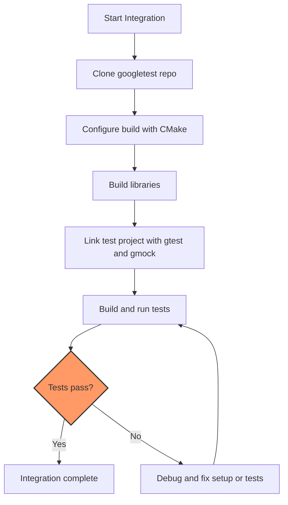

# Project Setup & Integration Guide

A clear, step-by-step walkthrough to integrate **GoogleTest** and **GoogleMock** into your C++ project. This guide covers choosing a build system, installation, linking libraries, and basic configuration so new users can get up and running quickly.

---

## 1. Workflow Overview

### Purpose
This guide helps you incorporate GoogleTest and GoogleMock testing frameworks into your existing C++ project, enabling automated and effective unit testing.

### Prerequisites
- C++ project with C++17 support
- CMake (version 3.14 or later recommended)
- Basic familiarity with CMake build process
- Internet access to clone repositories or ability to download source

### Outcome
By following this guide, you will have GoogleTest and GoogleMock built and linked properly with your project, ready to write and run tests.

### Time Estimate
15–30 minutes, depending on environment and familiarity with CMake

### Difficulty Level
Beginner to Intermediate

---

## 2. Step-by-Step Instructions

### Step 1: Choose Your Integration Method

You have two primary options to integrate GoogleTest and GoogleMock:

- **Standalone Build:** Build GoogleTest and GoogleMock separately and link to your project.
- **Embedded Build:** Add GoogleTest and GoogleMock as a subdirectory in your project’s CMake, building them alongside your code with the same compiler and linker settings.

*Tip:* Embedded builds are recommended to ensure compatibility and ease debugging.

---

### Step 2: Clone the GoogleTest Repository

Use Git to clone the official GoogleTest repository, which includes GoogleMock.

```bash
# Clone a specific stable version (recommended)
git clone https://github.com/google/googletest.git -b v1.17.0
cd googletest
```

---

### Step 3: Configure and Build with CMake

#### Standalone Build:

1. Create a build directory and enter it:

   ```bash
   mkdir build && cd build
   ```

2. Generate build files with CMake. GoogleMock is included by default.

   ```bash
   cmake ..
   ```

   *To build only GoogleTest (without GoogleMock), add `-DBUILD_GMOCK=OFF` to the command.*

3. Build the project:

   ```bash
   make
   ```

4. (Optional) Install to system directories (requires admin privileges):

   ```bash
   sudo make install
   ```

#### Embedded Build (from your project’s `CMakeLists.txt`):

Add the following to your CMake configuration:

```cmake
include(FetchContent)

FetchContent_Declare(
  googletest
  URL https://github.com/google/googletest/archive/5376968f6948923e2411081fd9372e71a59d8e77.zip
)
FetchContent_MakeAvailable(googletest)

# Now you can link your test executable with gtest and gmock
add_executable(your_test executable.cpp)
target_link_libraries(your_test gtest_main gmock_main)
add_test(NAME your_test COMMAND your_test)
```

Make sure your project uses a minimum CMake version of 3.14 or later.

---

### Step 4: Link Against GoogleTest and GoogleMock

- Link your test targets against either `gtest` or `gtest_main`:
  - `gtest` library requires you to provide your own `main()`.
  - `gtest_main` provides a default `main()` function.
- Similarly, link against `gmock` or `gmock_main` when using GoogleMock:
  - `gmock_main` includes a default main function.

Example linking in CMake:

```cmake
add_executable(my_tests test_main.cpp my_tests.cpp)
target_link_libraries(my_tests gtest_main gmock_main)
```

---

### Step 5: Verify the Setup

- Build your test executable.
- Run your tests with:
  ```bash
  ./my_tests
  ```
- You should see test execution output and results.

---

## 3. Practical Tips and Best Practices

- **Use `gmock_main` if you want the built-in main() to avoid writing your own.**
- **Ensure your compiler supports C++17**, either by specifying `set(CMAKE_CXX_STANDARD 17)` in your CMake or via command line flags.
- **For Windows Visual Studio users,** the option `gtest_force_shared_crt` helps align runtime libraries, preventing linker errors.
- **Control optional pthread support** through CMake flags; GoogleTest detects pthreads automatically on compatible platforms.
- **If using shared libraries/DLLs,** use `-DGTEST_CREATE_SHARED_LIBRARY=1` when compiling GoogleTest and `-DGTEST_LINKED_AS_SHARED_LIBRARY=1` when compiling your tests.

---

## 4. Common Pitfalls and Troubleshooting

<AccordionGroup title="Troubleshooting Common Issues">
<Accordion title="Build Failures Related to Pthreads or Threads">
  On some platforms or configurations, pthread libraries might not be detected correctly.

  **Solution:** Force pthread usage with `-DGTEST_HAS_PTHREAD=1` or disable it with `-DGTEST_HAS_PTHREAD=0`. If you manage your own build system, link with the pthread library.
</Accordion>

<Accordion title="Linker Errors About Undefined References to GoogleTest Symbols">
  This usually happens when you fail to link test executables against the `gtest` or `gmock` libraries.

  **Solution:** Ensure your CMake targets link to `gtest_main` or `gmock_main` if you want the complete test framework including the main function.
</Accordion>

<Accordion title="Runtime Errors When Running Tests">
  If your tests crash or report errors on startup:
  - Verify you are initializing GoogleTest correctly in your `main()` using `testing::InitGoogleTest(&argc, argv);`
  - If using GoogleMock, call `testing::InitGoogleMock(&argc, argv);` instead.
</Accordion>
</AccordionGroup>

---

## 5. Example Minimal `main()` for Custom Test Executable

If you link only to `gtest` or `gmock` (without `gtest_main` or `gmock_main`), you must provide your own entry point. Below is a minimal example:

```c++
#include <gtest/gtest.h>
#include <gmock/gmock.h>  // If using GoogleMock features

int main(int argc, char **argv) {
  ::testing::InitGoogleMock(&argc, argv); // Or InitGoogleTest if not using mocks
  return RUN_ALL_TESTS();
}
```

This initializes the framework and runs all tests, returning an appropriate status code.

---

## 6. Summary Diagram of Integration Workflow



---

## 7. Next Steps and Related Documentation

- **Writing Your First Unit Test:** Learn how to write a simple test using GoogleTest.
- **Creating Your First Mock Object:** Explore GoogleMock features to create mock objects.
- **Configuring Your First Test Project:** Detailed setup for test project integration.
- **Troubleshooting Guide:** For common build or runtime issues during setup.

For a deeper understanding of the GoogleTest and GoogleMock internals, explore the following pages:

- [GoogleTest Primer](https://github.com/google/googletest/blob/main/docs/primer.md)
- [Integration and Platform Support](https://github.com/google/googletest/blob/main/docs/integration-and-platform-support.md)
- [Advanced Usage & Customization](https://github.com/google/googletest/blob/main/docs/advanced-usage.md)

---

# Summary
This Project Setup & Integration guide walks C++ developers through getting GoogleTest and GoogleMock working in their projects using recommended build practices with CMake. It covers repository cloning, building, linking, verifying setup, and troubleshooting. Users gain a practical path to quickly enable test-driven development workflows with these flexible frameworks.

---

**End of Guide**
