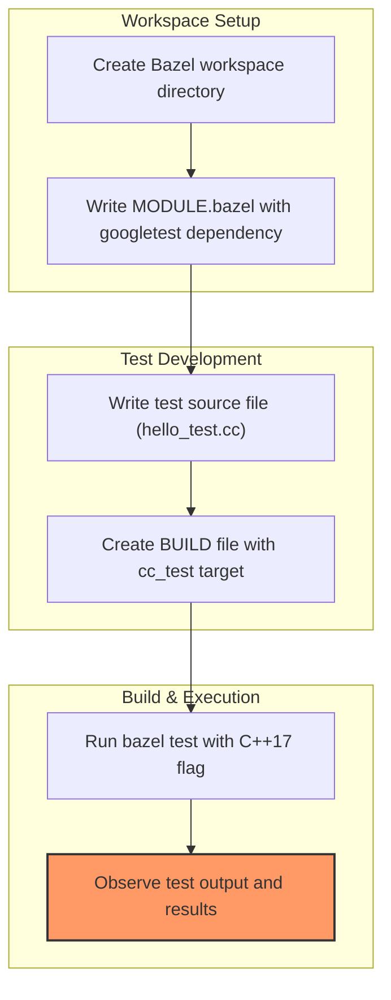

# Quickstart with Bazel

This guide helps you add GoogleTest and GoogleMock to your Bazel-based C++ project, write and execute your first test, and adopt best practices for efficient testing in the Bazel ecosystem.

---

## Workflow Overview

### What This Guide Will Help You Do
- Set up a Bazel workspace configured to consume GoogleTest and GoogleMock
- Write your first test using GoogleTest
- Build and run tests using Bazel commands
- Understand essential configurations and key Bazel BUILD file syntax
- Troubleshoot common integration problems

### Prerequisites
- Operating system compatible with Bazel and GoogleTest (Linux, macOS, Windows)
- Bazel version 7.0 or later installed ([Bazel installation guide](https://bazel.build/install))
- C++ compiler supporting C++17 language features
- Basic familiarity with Bazel workspaces and BUILD files

### Expected Outcome
After following this guide, you will have a working Bazel project with GoogleTest and GoogleMock integrated. You’ll also have a simple functional test executable that you can build and run using Bazel, verifying your environment and test configuration are correct.

### Time Estimate
Approximately 15–30 minutes depending on your familiarity with Bazel and C++ tooling.

### Difficulty Level
Beginner to Intermediate

---

## Step-by-Step Instructions

### Step 1: Create and initialize your Bazel workspace

1. Open a terminal and create a new directory for your Bazel workspace:

```bash
mkdir my_workspace && cd my_workspace
```

2. Create a `MODULE.bazel` file at the root of this workspace. This file declares your dependencies and enables Bazel's module system.

3. Add the following content to `MODULE.bazel` to specify the GoogleTest dependency version:

```python
# MODULE.bazel

# Use the latest GoogleTest version from Bazel Central Registry
bazel_dep(name = "googletest", version = "1.17.0")
```

> **Note:** Replace `1.17.0` with the latest stable GoogleTest version available at https://registry.bazel.build/modules/googletest.

### Step 2: Write your first test source code

1. In your workspace, create a C++ source file named `hello_test.cc`:

```cpp
#include <gtest/gtest.h>

// This test checks basic string inequality and integer equality
TEST(HelloTest, BasicAssertions) {
  // Expect that two strings are not equal
  EXPECT_STRNE("hello", "world");
  // Expect that multiplication produces the expected result
  EXPECT_EQ(7 * 6, 42);
}
```

This simple test uses GoogleTest assertions to verify expected behavior.

### Step 3: Create your Bazel `BUILD` file

1. In the same directory as `hello_test.cc`, create a file named `BUILD`.

2. Add the following content to define your test target:

```python
cc_test(
    name = "hello_test",
    size = "small",
    srcs = ["hello_test.cc"],
    deps = [
        "@googletest//:gtest",
        "@googletest//:gtest_main",
    ],
)
```

- `cc_test` declares a test executable.
- `deps` includes GoogleTest libraries `gtest` and `gtest_main` (which contains a ready-made `main` function).

### Step 4: Build and run your tests

Use the following Bazel command to compile and run your tests:

```bash
bazel test --cxxopt=-std=c++17 --test_output=all //:hello_test
```

- `--cxxopt=-std=c++17` ensures your test is compiled with C++17 support.
- `--test_output=all` shows all output, including test logs.

Upon successful execution, you should see output like:

```
Running main() from gmock_main.cc
[==========] Running 1 test from 1 test suite.
[----------] Global test environment set-up.
[----------] 1 test from HelloTest
[ RUN      ] HelloTest.BasicAssertions
[       OK ] HelloTest.BasicAssertions (0 ms)
[----------] 1 test from HelloTest (0 ms total)
[----------] Global test environment tear-down
[==========] 1 test from 1 test suite ran. (0 ms total)
[  PASSED  ] 1 test.

//:hello_test                                                     PASSED in 0.1s
```

Congratulation: Your Bazel project is now correctly integrated with GoogleTest!

---

## Best Practices and Tips

- **Pin GoogleTest Version:** Always specify a concrete version in `MODULE.bazel` to maintain reproducible builds.
- **Use `gtest_main`:** Link against `gtest_main` to avoid writing your own `main` function.
- **Leverage Bazel's Caching:** Efficient rebuilds occur when you follow Bazel workspaces and keep BUILD files accurate.
- **Use Bazel Test Filters and Flags:** Control which tests run, repeats, and output verbosity by passing flags as documented in [Running Tests](https://github.com/google/googletest/blob/main/docs/primer.md#running-tests).

---

## Common Pitfalls & Troubleshooting

<AccordionGroup title="Frequent Issues Running GoogleTest with Bazel">
<Accordion title="Test Failures or No Tests Run">
- Check that your test source file matches the `srcs` attribute in the BUILD file.
- Confirm dependencies `@googletest//:gtest` and `@googletest//:gtest_main` are correctly declared.
- Ensure you run `bazel test` command, not just `bazel build`, to execute tests.
</Accordion>

<Accordion title="Compiler Errors Related to C++17">
- Make sure to pass `--cxxopt=-std=c++17` when running Bazel test or add `cxxopts` in `BUILD` if needed.
- Confirm your compiler supports C++17.
</Accordion>

<Accordion title="Bazel Version Issues or Dependency Not Found">
- Verify Bazel version is 7.0 or later.
- Run `bazel clean --expunge` to clear corrupted cache.
- Check your `MODULE.bazel` file syntax and dependencies.
</Accordion>
</AccordionGroup>

<Tip>
If you encounter unexpected test failures or build errors, running Bazel with verbose output (`-s`) can help debug linker and compilation issues.
</Tip>

---

## Next Steps

- Explore the [GoogleTest Primer](primer.md) to learn how to write richer test cases using various assertion macros and test fixtures.
- Dive deeper into [Mocking Basics with GoogleMock](real-world-workflows/mocking-basics) to test code that depends on interfaces or external systems.
- Review the [Running Tests](getting-started/first-test-and-validation/running-tests) guide for advanced test execution techniques.
- For CI/CD integration and scaling Bazel test workflows, see [Integrating with Your Build & CI](overview/architecture-features-integration/integration-scenarios).

---

## Summary Diagram



---

You have successfully completed the Quickstart tutorial for Bazel with GoogleTest and GoogleMock. This solid foundation enables you to grow your test suite efficiently using Bazel's powerful build features.

---

# Additional Resources

- [Bazel Official Documentation](https://bazel.build)
- [GoogleTest Primer](primer.md)
- [GoogleTest Running Tests Guide](getting-started/first-test-and-validation/running-tests)
- [GoogleMock Mocking Basics](real-world-workflows/mocking-basics)
- [Supported Platforms and Prerequisites](getting-started/setup-and-installation/prerequisites-and-supported-platforms)

---

# Frequently Asked Questions

<Accordion title="Why use `cc_test` instead of `cc_binary` for tests?">

`cc_test` is Bazel's native test rule optimized for running test binaries. It integrates with Bazel's test runner, supports test-specific flags, outputs, and parallelism.

</Accordion>

<Accordion title="How do I specify additional compiler options globally?">

Use Bazel configuration options or pass `--cxxopt` flags to Bazel commands, e.g., `--cxxopt=-std=c++17` for enabling C++17.

</Accordion>