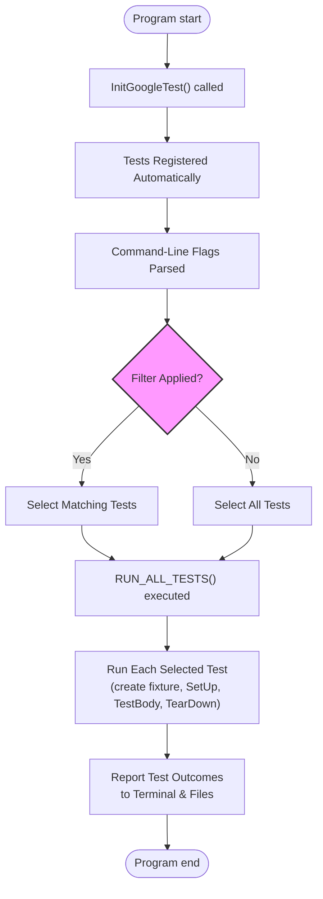

# Running, Organizing, and Interpreting Tests

## Overview

This guide walks you through running tests effectively using GoogleTest, organizing test suites and cases for scalable projects, and interpreting test results with clarity. It covers the full lifecycle from test discovery, command-line options, output formats, to directory structure best practices.

By completing this guide, you will understand how to run your tests confidently, manage large test sets in organized hierarchies, and leverage GoogleTest features to improve your testing workflow.

---

## 1. Running Tests

### 1.1. Test Execution Basics

GoogleTest automatically discovers and registers defined tests when your program runs. To execute all tests, use:

```cpp
int main(int argc, char** argv) {
  testing::InitGoogleTest(&argc, argv);
  return RUN_ALL_TESTS();
}
```

This will run all available tests and return `0` if all pass, or `1` if any fail.

### 1.2. Command-Line Controls

You can control test execution using command-line flags:

| Flag                       | Description                                         |
| -------------------------- | ------------------------------------------------- |
| `--gtest_filter=FILTER`    | Runs only tests matching the filter pattern.      |
| `--gtest_repeat=N`         | Repeats test run N times (use `-1` for infinite). |
| `--gtest_break_on_failure` | Stop at first failure to aid debugging.            |
| `--gtest_list_tests`       | Lists all registered tests without running them.  |
| `--gtest_shuffle`          | Runs tests in random order to detect dependencies.|
| `--gtest_color=yes|no|auto` | Enables/disables colored terminal output.        |

**Example:** Run only tests in `MySuite`:

```
./my_test --gtest_filter=MySuite.*
```

### 1.3. Environment Variables

Most command-line flags have equivalent environment variables prefixed with `GTEST_`.

Example:

```
export GTEST_FILTER=MySuite.*
./my_test
```

### 1.4. Running Disabled Tests

Tests prefixed with `DISABLED_` are skipped by default. To run them explicitly:

```
./my_test --gtest_also_run_disabled_tests
```

### 1.5. Parallelism and Sharding

GoogleTest supports distributing tests across machines or processes. Set:

- `GTEST_TOTAL_SHARDS` — total number of shards.
- `GTEST_SHARD_INDEX` — index of the current shard.

Tests will be divided ensuring each runs exactly once.

### 1.6. Summary of Running Tests

- Initialize with `InitGoogleTest`.
- Use `RUN_ALL_TESTS()` to execute.
- Apply command-line flags to filter, repeat, or shuffle.
- Run disabled tests with `--gtest_also_run_disabled_tests`.
- Support test sharding for parallel execution.

---

## 2. Organizing Tests

Proper organization of tests simplifies maintenance, scaling, and results interpretation.

### 2.1. Test Suites and Test Cases

- Group related tests in *test suites* (previously called test cases).
- Keep tests in suites based on the component, feature, or class under test.
- Use naming conventions consistent with your codebase.

### 2.2. Test Fixtures

- Use test fixtures (`TEST_F`) to share setup and teardown across tests in the same suite.
- Each test gets a fresh fixture instance to keep tests independent.

### 2.3. Parameterized Tests

- Use parameterized tests (`TEST_P`, `INSTANTIATE_TEST_SUITE_P`) to run the same test logic over different input values.
- Use typed and type-parameterized tests to run tests over varying types.

### 2.4. Directory and File Structure Best Practices

Design your project directories to reflect tested components and test types:

```
project_root/
  src/
  tests/
    component1/
      component1_test.cc
    component2/
      component2_test.cc
    integration/
      integration_tests.cc
```

Follow these tips:

- Place test code close to related source code.
- Separate unit tests and integration tests clearly.
- Organize parameterized, typed, and mock-based tests logically.

### 2.5. Naming Conventions

- Test suite and test names should be concise, meaningful, and use CamelCase.
- Avoid underscores in test and suite names to prevent filter parsing issues.

---

## 3. Interpreting Test Output

### 3.1. Terminal Output

GoogleTest outputs test progress in a readable format with color-coded statuses:

```
[ RUN      ] MySuite.MyTest
[       OK ] MySuite.MyTest (0 ms)
[  FAILED  ] MySuite.OtherTest (1 ms)
...
[==========] 2 tests from 1 test suite ran. (1 ms total)
[  PASSED  ] 1 test.
[  FAILED  ] 1 test, listed below:
[  FAILED  ] MySuite.OtherTest
```

- `[ RUN      ]` indicates a test start.
- `[       OK ]` means the test passed.
- `[  FAILED  ]` means the test failed.

### 3.2. XML and JSON Output

Generate machine-readable reports for CI with:

```
./my_test --gtest_output=xml:report.xml
./my_test --gtest_output=json:report.json
```

This aids integration with dashboards and coverage tools.

### 3.3. Failure Details

When a test fails, GoogleTest prints:

- The assertion that failed with file and line number.
- The expression values and expected results.
- Additional user-provided failure messages.

Use this detail to identify code failures quickly.

### 3.4. Skipped Tests and Output

Tests using `GTEST_SKIP()` or disabled tests indicate this with `SKIPPED`, helping track test coverage.

### 3.5. Using Event Listeners

You can enhance output by implementing custom test event listeners to modify or extend reporting.

Example uses include displaying a minimalist summary or a GUI output.

---

## 4. Practical Tips and Best Practices

- Use filtering and sharding to optimize test execution locally and in CI.
- Isolate tests using fixtures to avoid inter-test dependencies.
- Organize your test directories and files to mirror the source structure.
- Use parameterized and typed tests to reduce boilerplate and increase coverage.
- Generate XML/JSON reports for automated pipelines.
- Disable flaky or broken tests temporarily with `DISABLED_` prefix and track them for fixes.

---

## 5. Troubleshooting Common Issues

### 5.1. Tests Not Running

- Verify tests are registered (check for `DISABLED_` prefix).
- Ensure you do not filter them out accidentally with `--gtest_filter`.

### 5.2. Unexpected Test Failures

- Review output for assertion failure lines and messages.
- Use `--gtest_break_on_failure` to debug failing tests interactively.

### 5.3. Test Sharding Problems

- Confirm `GTEST_TOTAL_SHARDS` and `GTEST_SHARD_INDEX` are set correctly.
- Ensure unique shard indexes within the range.

### 5.4. Missing Test Output or Reports

- Confirm output file paths are writable.
- Check command-line flag syntax.

### 5.5. Colored Output Not Showing

- Use `--gtest_color=yes` and ensure terminal supports color.

---

## 6. Next Steps & Related Documentation

- Explore the [GoogleTest Primer](primer.md) for basic test writing.
- Dive into [Advanced GoogleTest Topics](advanced.md) for deep features.
- Learn about [Parameterized and Typed Tests](guides/advanced-and-real-world/parameterized-tests) for flexible testing.
- Use the [Testing Reference](reference/testing.md) for comprehensive API details.
- For mocking in tests, consult the [Mocking Reference](reference/mocking.md).


<Check>
Pin this guide for running tests effectively, and explore setup and writing your first tests next to build a solid foundation.
</Check>

---

#### Code Snippet Example: Running and Filtering Tests

```bash
# Run all tests
./my_test

# Run tests matching a pattern
./my_test --gtest_filter=MathTest.*

# List all tests without running
./my_test --gtest_list_tests

# Run disabled tests too
./my_test --gtest_also_run_disabled_tests

# Repeat tests 5 times
./my_test --gtest_repeat=5
```

---

#### Example Directory Layout

```
/my_project
  /src
    calculator.cc
    calculator.h
  /tests
    /calculator
      calculator_test.cc
    /integration
      system_integration_tests.cc
```

---

## Diagram: Test Execution Flow



---

## References

* [GoogleTest Primer](primer.md) - Learn how to write simple tests
* [Testing Reference](reference/testing.md) - API details and macros
* [Mocking Reference](reference/mocking.md) - Create mock objects
* [GoogleTest Samples](samples.md) - Example tests for practice

## Additional Resources

* [Official GoogleTest GitHub Repository](https://github.com/google/googletest)
* [GoogleTest Documentation Home](docs/index.md)

---

This page fits into the core user guides, providing essential skills for running and managing tests effectively within the GoogleTest ecosystem.
