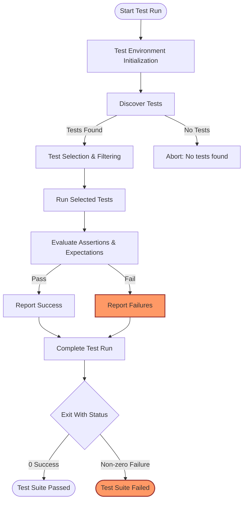

# Running Tests and Interpreting Results

A practical workflow guide to building, executing, and interpreting test outputs with GoogleTest. This page focuses on how to run your test code, filter tests for targeted execution, and understand the signals GoogleTest provides to confidently verify your software correctness.

---

## Workflow Overview

### Task Description
Learn how to build and execute your tests written using GoogleTest, apply filters to run specific tests or suites, and accurately interpret the outcome messages to effectively verify your code.

### Prerequisites
- Have a test project set up using GoogleTest/GoogleMock (see [Your First Test Case](https://github.com/google/googletest/tree/main/docs/getting_started/first_steps_usage/your_first_test.md))
- Test source files compiled and linked with GoogleTest (typically linking against `gtest` or `gmock_main`)
- Basic familiarity with defining tests using `TEST()` or `TEST_F()` macros

### Expected Outcome
- Run all or subsets of tests efficiently
- Understand the pass/fail output, including common failure types and warnings
- Use command-line options to control test execution behavior
- Troubleshoot common test run issues and interpret diagnostic messages

### Time Estimate
10–20 minutes for running tests and reading results; more for complex filtering and debugging.

### Difficulty Level
Beginner to Intermediate

---

## Step-by-Step Instructions

### 1. Running All Tests

GoogleTest automatically discovers all tests compiled into your test binary.

- **Action:** Execute your test binary (e.g., `./my_tests`) without additional parameters.
- **Expected Result:** GoogleTest runs every test case and prints a detailed report.
- **Success Criteria:** Tests pass indicated by `PASSED` messages; application returns exit code `0`.

> By default, `RUN_ALL_TESTS()` runs all tests and returns `0` on success, `1` on any test failure. Always **check** the exit code programmatically to verify success.

### 2. Running Specific Tests Using Filters

To target specific tests without running the full suite, use the `--gtest_filter` flag.

- **Action:** `./my_tests --gtest_filter=TestSuiteName.TestName`

  - Use wildcards for partial matches: `./my_tests --gtest_filter=MySuite.*`
  - Exclude tests by prefixing with `-`: `--gtest_filter=* -MySuite.UnstableTest`

- **Expected Result:** Only matching tests execute.

> Filtering helps isolate flaky or broken tests quickly and facilitates parallelized or selective runs.

### 3. Interpreting Test Output

GoogleTest outputs detailed status messages:

- **Success:** Each test that passes prints:
  ```
  [  PASSED  ] TestSuiteName.TestName (0 ms)
  ```

- **Failure:** Failed tests print messages indicating assertion failures including file, line number, and reason. Example:
  ```
  /path/to/my_test.cc:42: Failure
  Expected equality of these values:
    val1
    val2
  ```

- **Test Summary:** At the end, a summary shows total tests run, passed, or failed:
  ```
  [==========] Running 5 tests from 2 test suites.
  [  PASSED  ] 4 tests.
  [  FAILED  ] 1 test, listed below:
  ```

### 4. Using Additional Command-Line Options

GoogleTest supports many flags to modify test execution:

- `--gtest_repeat=N` — run all tests N times (useful for catching flaky behavior)
- `--gtest_shuffle` — randomize test order
- `--gtest_break_on_failure` — break into debugger on failure

To get a full list, run:

```bash
./my_tests --help
```

### 5. Building the Test Binary with gmock_main (Optional but Recommended)

GoogleMock provides `gmock_main` which includes a suitable `main()` function:

- Link your tests with `gmock_main` to avoid writing your own `main()`.
- This automatically initializes GoogleMock and GoogleTest before running tests, streamlining execution.

> See the `gmock_main.cc` file for the standard main entry point.

### 6. Verifying Test Results Programmatically

Because `RUN_ALL_TESTS()` returns a status code, use it in your `main()`:

```cpp
int main(int argc, char** argv) {
  testing::InitGoogleTest(&argc, argv);
  return RUN_ALL_TESTS();
}
```

Check that your test harness or build system uses that exit code to mark success or failure.

---

## Examples & Scenarios

### Example 1: Running all tests

```bash
./my_tests
```

Expected output snippet:

```
[==========] Running 3 tests from 1 test suite.
[ RUN      ] MathTest.Factorial
[       OK ] MathTest.Factorial (0 ms)
[ RUN      ] MathTest.IsPrime
[       OK ] MathTest.IsPrime (0 ms)
[ RUN      ] MathTest.IsEven
[       OK ] MathTest.IsEven (0 ms)
[==========] 3 tests from 1 test suite ran. (1 ms total)
[  PASSED  ] 3 tests.
```

### Example 2: Filtering to run only tests with `Factorial` in name

```bash
./my_tests --gtest_filter=*Factorial*
```

Output will show only tests matching that pattern.

### Example 3: Running a test multiple times to catch flaky failures

```bash
./my_tests --gtest_repeat=100 --gtest_shuffle
```

This repeats all tests 100 times in random order, helping catch race conditions or flaky tests.

---

## Troubleshooting & Tips

### Common Issues

- **No tests run:** Verify your tests are linked and compiled properly. Ensure they use `TEST` or `TEST_F` and are not excluded by filters.
- **Exit code always zero despite failures:** Confirm `main()` returns `RUN_ALL_TESTS()` result.
- **Unexpected test failures:** Check assertions carefully. Use `--gtest_break_on_failure` to debug interactively.
- **Test order affecting results:** Use `--gtest_shuffle` to detect ordering dependencies.

### Best Practices

- Set meaningful test and suite names for easy filtering and reporting.
- Use test fixtures (`TEST_F`) to share common setup and teardown.
- Always check the test binary’s exit code in continuous integration.
- Use filtering to develop and debug tests quickly.
- Use `gmock_main` to simplify your test runner.

### Performance Considerations

- Avoid running the full test suite unnecessarily during development.
- Use filters and repeats selectively to diagnose flakes.

---

## Next Steps & Related Content

- **Write Your First Test:** [Writing Your First Test](https://github.com/google/googletest/tree/main/guides/getting-started/writing-your-first-test.md) to start creating test cases.
- **Using GoogleMock:** Extend testing with mocks using [Mocking with GoogleMock](https://github.com/google/googletest/tree/main/guides/advanced-testing/mocking-with-googlemock.md).
- **Test Configuration:** Customize test runs with [Configuration Basics](https://github.com/google/googletest/tree/main/getting_started/essentials_setup/configuration_basics.md).
- **Troubleshooting:** Find fixes for common issues in [Troubleshooting Common Issues](https://github.com/google/googletest/tree/main/getting_started/first_steps_usage/common_issues.md).

---

## Visualizing the Test Execution Flow



This flow captures the core steps from initializing tests to final pass/fail exit codes.

---

## Summary

Running tests with GoogleTest is streamlined by automatic test discovery, flexible filtering, clear output formats, and meaningful exit codes. Using filters, command-line options, and the recommended test main runner accelerates workflows.

Mastering how to interpret outputs, verify exit statuses, and control test execution is essential for maintaining healthy test suites and accelerating development cycles.

---

For more information, see the [GoogleTest Primer](https://github.com/google/googletest/tree/main/docs/primer.md) and [Mocking with GoogleMock](https://github.com/google/googletest/tree/main/guides/advanced-testing/mocking-with-googlemock.md).
